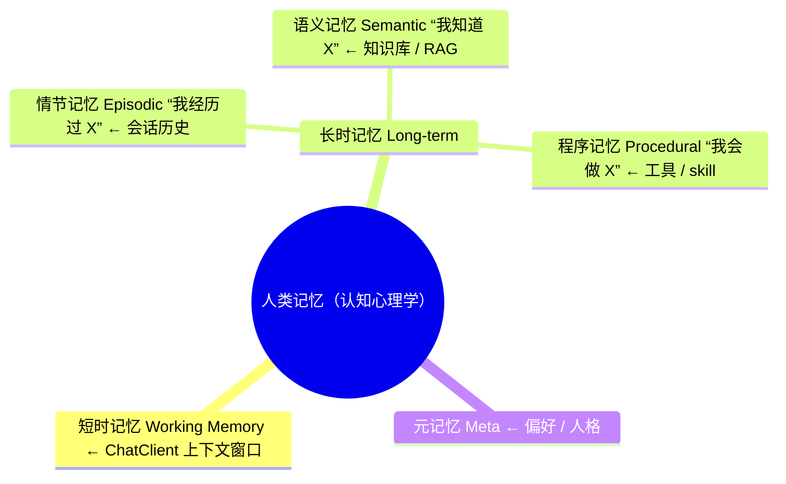
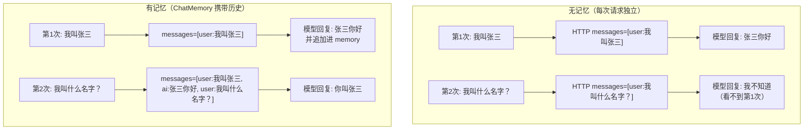
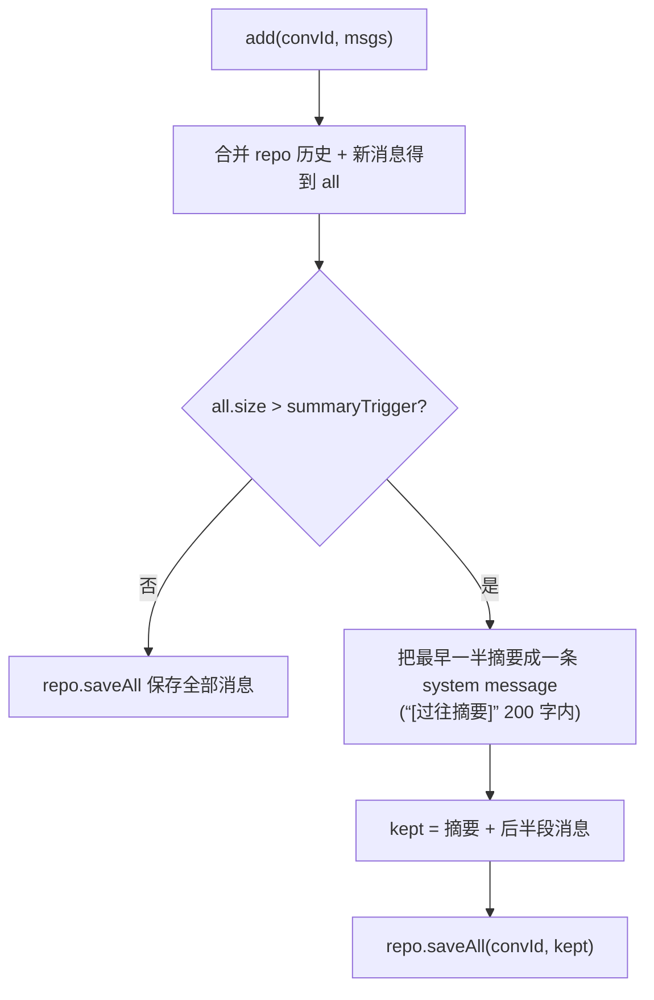
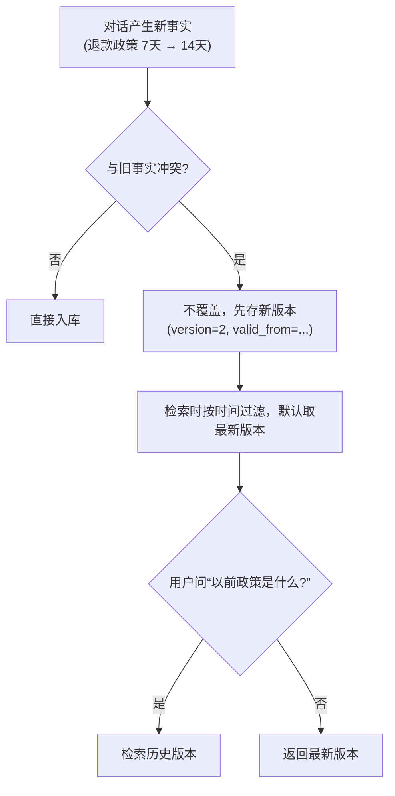
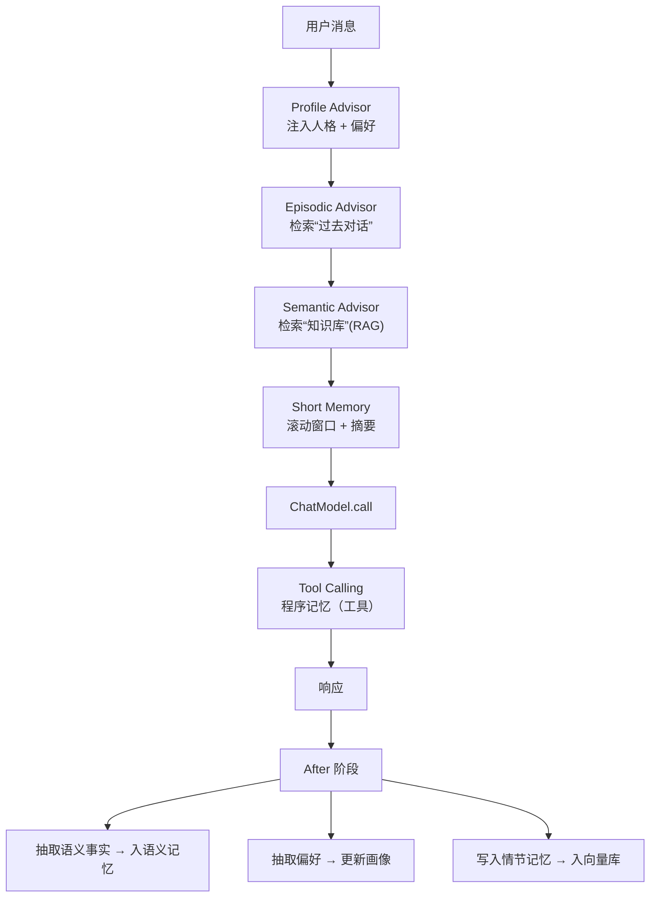

# 24 Agent 记忆架构（短 / 长 / 情节 / 语义 / 程序）

> Spring AI 的 `MessageWindowChatMemory` 只是"会话窗口"，撑不起真正的 Agent 记忆。本文把人类记忆的五种类型映射到 AI 系统，给出工程化落地方案。
>
> 前提：你了解 Advisor 链如何注入横切能力（记忆就是其中一种横切关注点），并已跑通基础 RAG（向量检索可作为语义记忆的存储底座）。
> 预计：1.5 天

---

## 0. 认知地图



Spring AI 2.0 提供的：

| 类型 | Spring AI 设施 | 局限 |
|------|--------------|------|
| 短时 | `MessageWindowChatMemory` | 仅近 N 条 |
| 情节 | `ChatMemoryRepository`（JDBC/Cassandra/Mongo） | **不支持 tool call 消息**（除非用 Session 项目） |
| 语义 | `VectorStore` + RAG | 无偏好层 |
| 程序 | `@Tool` / `ToolCallback` | 不能动态学习新 skill |
| 元 | （无原生设施，本文实现） | 需自研 |

---

## 1. 入门铺垫：为什么多轮对话需要记忆

> 本小节吸收自 LangChain4j 入门教程 **02-ChatMemory（多轮对话）**，作为理解记忆体系的心智模型打底。
> 核心一句话：**LLM 本身完全无状态，多轮对话的"记忆"全靠客户端把历史消息塞回请求**——两个框架的会话记忆都是同一个模型。

### 1.1 一个让你困惑的现象

先跑这段代码，第二个回答大概率会说"我不知道你的名字"：

```java
// 本代码仅作学习材料参考
String r1 = model.chat("我叫张三");
System.out.println(r1);
String r2 = model.chat("我叫什么名字？");
System.out.println(r2);
```

### 1.2 原因：LLM 是完全无状态的

**LLM 本身完全没有状态**。每次 `chat()` 都是一个独立的 HTTP 请求，模型不记得上一次说了什么。
这和 HTTP 无状态是一个道理——你需要 Cookie/Session 来"携带状态"。

### 1.3 解决方案：每次请求把历史一起带上

```java
// 伪代码
List<Message> history = ...;
history.add(UserMessage("我叫张三"));
history.add(AiMessage("好的，张三你好"));   // 第一次的回复
history.add(UserMessage("我叫什么名字？"));  // 第二次的问题
model.chat(history);  // 把全部历史一起发给模型
```

`ChatMemory` 就是帮你自动管理这个 `history` 列表的对象。

**无记忆 vs 有记忆**：



### 1.4 ChatMemory 的本质：有界消息列表

> `ChatMemory` 是一个**有界消息列表**，自动拼接在每次请求里发给 LLM。

| AI 概念 | Java 类比 |
|---------|----------|
| `ChatMemory` | `Deque<Message>`（带容量上限的队列） |
| `add(Message)` | 队列入队 |
| `messages()` | 转成 List 发给 LLM |
| `clear()` | 清空会话 |

**为什么必须"有界"**：LLM 的输入 token 有上限（context window，通常 4K-32K token）。
全部历史塞进去 → token 超限 → 报错。所以需要淘汰策略（窗口、摘要等）——这正是下一节"短时记忆"要展开的。

### 1.5 LangChain4j 的两种窗口（对话记忆的基础实现，作对照）

Spring AI 与 LangChain4j 的会话记忆是同一个模型。下面保留 LangChain4j 的两种窗口实现作为对照（LC4j 代码）：

```java
// ===== LangChain4j：按消息条数 =====
import dev.langchain4j.memory.chat.MessageWindowChatMemory;

ChatMemory memory = MessageWindowChatMemory.builder()
        .maxMessages(20)       // 保留最近 20 条消息
        .id("user-001")        // 会话 ID（多用户隔离）
        .build();

// ===== LangChain4j：按 token 数 =====
import dev.langchain4j.memory.chat.TokenWindowChatMemory;

ChatMemory memory2 = TokenWindowChatMemory.builder()
        .maxTokens(1000, tokenizer)   // 保留最近 1000 token
        .id("user-001")
        .build();
```

- `MessageWindowChatMemory`：按消息条数淘汰最早的消息，简单、最常用；坑是每条消息长度不均，20 条可能就超 token。
- `TokenWindowChatMemory`：按 token 数精确裁剪，需传 `Tokenizer`（不同模型不同），**生产推荐**。
- 这正是 Spring AI `MessageWindowChatMemory` 的同款概念，其边界与扩展见下一节。

### 1.6 实际发出的请求：ChatMemory 的全部秘密

打开 `logRequests(true)`，你会看到每次请求就是把历史拼进 `messages` 数组：

```json
{
  "model": "deepseek-chat",
  "messages": [
    {"role": "user", "content": "我叫张三"},
    {"role": "assistant", "content": "好的，张三你好"},
    {"role": "user", "content": "我叫什么名字？"}
  ]
}
```

### 1.7 多用户必须隔离：ChatMemoryStore

100 个用户同时聊时，每个 `ChatMemory` 只能存一个会话，重启还会丢。
解法是 `ChatMemoryProvider + ChatMemoryStore`（生产用 Redis 持久化），按 `memoryId`（如用户 ID）取各自的 memory。
**多用户隔离 + 持久化**正是第 3 节"情节记忆"的雏形。

### 1.8 常见错误速览

| 错误 | 症状 | 修复 |
|------|------|------|
| 无界历史 | 聊 20 轮后越来越慢 / 越来越贵 | 设 `maxMessages`(10-20) 或 `maxTokens`(2000-4000) |
| 窗口太小 | 聊到一半"失忆" | 加大窗口；关键信息放 `SystemMessage`；或摘要式记忆 |
| 全局共享 memory | A 用户的内容串到 B 用户 | 每请求按 `memoryId` 隔离 |

### 1.9 SystemMessage：永远在第一位

`SystemMessage` 用于定义角色 / 风格 / 约束，永远排在 messages 数组第一位，且**不会被窗口淘汰**（特殊保留）。
这对应下一节 Spring AI `MessageWindowChatMemory`"永远保留 system message"的行为。

---

## 2. 短时记忆：会话窗口

### 2.1 MessageWindowChatMemory 的边界

```java
// 本代码仅作学习材料参考
MessageWindowChatMemory.builder()
        .maxMessages(20)
        .build();
```

- **永远保留 system message**（不计入窗口）
- 超出窗口的消息**直接丢弃**——不归档、不摘要
- 2.0.0 新增 `sequence_id` 列，按 turn 边界裁剪

### 2.2 短时记忆的两个扩展

#### A. 滚动摘要（rolling summary）

```java
// 本代码仅作学习材料参考
public class SummarizingMemory implements ChatMemory {
    private final ChatMemoryRepository repo;
    private final ChatClient summarizer;
    private final int window;
    private final int summaryTrigger;

    @Override
    public void add(String convId, List<Message> msgs) {
        List<Message> all = new ArrayList<>(repo.findByConversationId(convId));
        all.addAll(msgs);

        if (all.size() > summaryTrigger) {
            // 把最早一半的消息摘要成一条 system message
            List<Message> toSummarize = all.subList(0, all.size() / 2);
            String summary = summarizer.prompt()
                    .system("把以下对话摘要成 200 字内的关键信息")
                    .user(toSummarize.toString())
                    .call().content();
            Message summaryMsg = new SystemMessage("[过往摘要] " + summary);

            List<Message> kept = new ArrayList<>();
            kept.add(summaryMsg);
            kept.addAll(all.subList(all.size() / 2, all.size()));
            repo.saveAll(convId, kept);
        } else {
            repo.saveAll(convId, all);
        }
    }
}
```

**滚动摘要流程**：



#### B. token-aware 窗口

按消息数窗口的问题是 token 不均匀（一段代码 token = 一句客套话 10 倍）。改进：按 token 数裁剪。

```java
// 本代码仅作学习材料参考
private List<Message> trimByTokens(List<Message> all, int maxTokens) {
    int total = 0;
    List<Message> kept = new ArrayList<>();
    for (int i = all.size() - 1; i >= 0; i--) {
        int t = tokenizer.count(all.get(i).getText());
        if (total + t > maxTokens) break;
        kept.add(0, all.get(i));
        total += t;
    }
    if (all.get(0).getType() == MessageType.SYSTEM) {
        kept.add(0, all.get(0));  // system 永远保留
    }
    return kept;
}
```

---

## 3. 情节记忆：跨会话历史

### 3.1 JDBC / Cassandra / Mongo 的局限

Spring AI 2.0 内置的 `ChatMemoryRepository` 实现（JDBC / Cassandra / Mongo）**会静默丢弃 ToolCall / ToolResponse 消息**——它们只持久化文本消息。

如果你的 Agent 跨会话恢复后还要继续推进工具调用（如"上次帮我订的机票，现在改签"），必须用 **Spring AI Session 项目**（`spring-ai-session`）：

- 事件溯源（每个 message 是一个 event）
- 可重放（replay from event log）
- 完整保留 tool call 上下文

### 3.2 情节记忆的检索：把会话历史当 RAG

把所有过往对话作为文档存进向量库，新 query 时检索最相关的 K 条历史：

```java
// 本代码仅作学习材料参考
public class EpisodicMemoryAdvisor implements BaseAdvisor {
    private final VectorStore vs;
    private final ChatClient client;

    @Override
    public ChatClientRequest before(ChatClientRequest req, AdvisorChain chain) {
        String userId = (String) req.context().get("userId");
        String query = req.prompt().getUserMessage().getText();

        List<Document> hits = vs.similaritySearch(SearchRequest.builder()
                .query(query)
                .topK(5)
                .filterExpression("userId == '" + userId + "' AND type == 'episode'")
                .build());

        String episodeContext = hits.stream()
                .map(d -> "[过去对话] " + d.getText())
                .collect(Collectors.joining("\n"));

        return req.mutate()
                .prompt(req.prompt().mutate()
                        .messages(new UserMessage(
                                "相关历史：\n" + episodeContext + "\n\n当前问题：" + query))
                        .build())
                .build();
    }

    @Override
    public ChatClientResponse after(ChatClientResponse resp, AdvisorChain chain) {
        // 把这次对话存为 episode
        // 注意：ChatClientResponse 没有chatClientRequest() 方法，
        // 输入侧的信息必须在 before 阶段用 ThreadLocal 或 context 缓存，after 才能拿到。
        String userId = (String) resp.context().get("userId");
        String userQuery = (String) resp.context().getOrDefault("__last_user_query", "");
        String text = userQuery
                + "\n=> " + resp.chatResponse().getResult().getOutput().getText();
        vs.add(List.of(Document.builder()
                .text(text)
                .metadata(Map.of("userId", userId, "type", "episode",
                        "ts", Instant.now().toString()))
                .build()));
        return resp;
    }

    @Override public String getName() { return "EpisodicMemoryAdvisor"; }
    @Override public int getOrder() { return HIGHEST_PRECEDENCE + 250; }
}
```

### 3.3 隐私：情节记忆的合规边界

- **PII 必须脱敏**后再入库（用户身份证号、电话）。
- **TTL**：90 天默认，用户可主动删除（GDPR / 个人信息保护法）。
- **多租户隔离**：metadata 里 `userId` 是必填，filter 强制带。

---

## 4. 语义记忆：知识库

`VectorStore` + RAG 已经是 07 篇的内容，这里只补三点关键：

### 4.1 语义记忆 vs 情节记忆

| 维度 | 语义 | 情节 |
|------|------|------|
| 内容 | 客观事实（"公司退款政策是 7 天"） | 主观经历（"用户上次问过退款"） |
| 来源 | 文档导入 | 对话抽取 |
| 时效 | 缓慢变化 | 快速变化 |
| 共享 | 多用户共享 | 用户私有 |

### 4.2 从对话里抽取语义记忆

每次对话结束后，让 LLM 判断"这次对话产生了哪些可沉淀的事实"：

```java
// 本代码仅作学习材料参考
record ExtractedFact(String content, String category, double confidence) {}

public Flux<ExtractedFact> extractFacts(String conversation) {
    return Flux.fromArray(client.prompt()
            .system("""
                    从对话中抽取可长期保存的事实（用户偏好、产品规则、约定）。
                    忽略一次性细节。返回 JSON 数组。
                    """)
            .user(conversation)
            .call()
            .entity(ExtractedFact[].class));
}
```

抽取后入库：

```java
facts.filter(f -> f.confidence() > 0.7)
     .subscribe(f -> semanticVs.add(List.of(Document.builder()
             .text(f.content())
             .metadata(Map.of("category", f.category(),
                     "userId", userId, "ts", Instant.now().toString()))
             .build())));
```

### 4.3 语义冲突处理

新事实与旧事实冲突时（"以前政策是 7 天，现在 14 天"）：

- 不要直接覆盖，先存版本（`version=2`, `valid_from=...`）
- 检索时按时间过滤（默认最新版本）
- 用户问"以前政策是什么"时， retrieves 历史版本

**冲突处理流程**：



---

## 5. 程序记忆：工具 / Skill

### 5.1 静态 vs 动态

- **静态程序记忆**：`@Tool` 注解，编译期固定。
- **动态程序记忆**：ToolCallback 接口，运行时构造（见 02 篇 §6）。

### 5.2 "Agent 学会新技能"

更激进的设想：Agent 在对话中发现"我需要某个工具"，自动生成 tool definition 并注册。

```java
// 本代码仅作学习材料参考（实验性）
// Spring AI 2.0 没有 DynamicToolCallback；动态工具用 FunctionToolCallback.builder() 构造
public ToolCallback synthesizeTool(String userIntent) {
    ToolDefinition def = client.prompt()
            .system("""
                    根据用户意图生成一个 tool definition。
                    输出 JSON Schema 格式。
                    """)
            .user(userIntent)
            .call()
            .entity(ToolDefinition.class);

    return FunctionToolCallback.builder(def.name(), (String args) -> {
        // 这个工具"实际行为"可以是调 LLM 实现（self-implementing）
        return client.prompt()
                .system("You are tool: " + def.name())
                .user("Args: " + args)
                .call().content();
    })
    .description(def.description())
    .inputType(String.class)
    .build();
}
```

⚠️ **生产慎用**：自动生成工具 = 把 prompt injection 风险面放大无数倍。必须配套安全红队测试（用对抗性输入主动探测模型的注入漏洞）来兜底。

### 5.3 程序记忆的"工具市场"

工具市场可以按 MCP Hub 的思路设计：由中心化注册表统一管理工具的发现、鉴权与调用，Agent 按需从 Hub 获取工具。

---

## 6. 元记忆：人格 / 偏好

模型默认人格是"通用助手"，但业务里往往需要"懂你的助手"。

### 6.1 用户画像

```java
// 本代码仅作学习材料参考
public record UserProfile(
        String userId,
        String persona,           // "技术决策者"
        List<String> preferences, // ["简洁", "带数字", "中英术语"]
        Map<String, String> facts // ["team" -> "后端", "stack" -> "Spring"]
) {}
```

### 6.2 Profile Advisor：注入人格

```java
// 本代码仅作学习材料参考
public class ProfileAdvisor implements BaseAdvisor {
    private final ProfileStore store;

    @Override
    public ChatClientRequest before(ChatClientRequest req, AdvisorChain chain) {
        String userId = (String) req.context().get("userId");
        UserProfile p = store.get(userId);

        return req.mutate()
                .prompt(req.prompt().mutate()
                        .system(p.persona() + " 偏好：" + p.preferences())
                        .build())
                .build();
    }

    @Override
    public ChatClientResponse after(ChatClientResponse resp, AdvisorChain chain) {
        // 异步从对话更新画像（用 LLM 抽取偏好）
        String userId = (String) resp.context().get("userId");
        CompletableFuture.runAsync(() ->
                store.updateFrom(userId,
                        resp.chatResponse().getResult().getOutput().getText()));
        return resp;
    }

    @Override public String getName() { return "ProfileAdvisor"; }
    @Override public int getOrder() { return HIGHEST_PRECEDENCE + 100; }
}
```

### 6.3 不要让 LLM 自己"决定"人格

反模式：

```
You are a helpful assistant. Adapt to the user.
```

模型会过度拟合最近的反馈（recency bias），不稳定。**显式 persona + 偏好列表**才稳。

---

## 7. 五种记忆协同：完整架构



每个 advisor 各管一种记忆类型，正交组合。

---

## 8. 数据基础设施

### 8.1 三套存储

| 存储 | 用途 | 技术 |
|------|------|------|
| OLTP（PostgreSQL） | 用户画像、配置、元记忆 | 关系表 |
| 时序 / Event Store | 情节记忆、会话日志 | Kafka + Postgres event table |
| 向量库（pgvector / Milvus） | 语义记忆 + 情节向量索引 | pgvector / Milvus / Qdrant |

### 8.2 一致性

- **强一致**：用户主动操作（"删除我所有对话"）→ 必须跨三库事务。
- **最终一致**：异步抽取 → 用 outbox + Kafka 解耦。

这对应 AI 原生系统设计里的 Event Sourcing + CQRS 模式：写侧把状态变更存成不可变事件流，读侧用独立的投影（如向量库 / 关系库）支撑查询。

---

## 9. 遗忘机制

人类有遗忘，AI 也需要——否则画像/情节会无意义膨胀。

| 遗忘类型 | 触发 | 实现 |
|---------|------|------|
| **衰减** | 7-30 天未被命中 | cron 扫描 + 删除低权重 |
| **冲突覆盖** | 新事实与旧事实冲突 | 版本号 + 默认取最新 |
| **主动遗忘** | 用户删除请求 | GDPR "right to be forgotten" |
| **混淆** | 偏好漂移 | 最近 30 条对话 relearn |

---

## 10. 反模式速查

| 反模式 | 后果 | 修复 |
|--------|------|------|
| 把所有历史塞进 context | token 爆炸 + 模型混淆 | 用 Episodic Advisor 检索 K 条 |
| 用 JDBC ChatMemory 存 tool call | tool call 静默丢失 | 用 Spring AI Session |
| 没有遗忘机制 | 数据无限增长 + 召回降级 | TTL + 衰减 + 版本 |
| 元记忆每次都让 LLM 现场判断 | 不稳定 | 显式 persona 注入 |
| 把语义记忆当情节用 | 用户私有信息被共享 | metadata 隔离 userId |
| 把敏感信息存进向量库明文 | 合规风险 | 入库前 PII 脱敏 |
| 工具自动生成不审计 | prompt injection 风险 | 人工 review 才能注册 |

---

## 11. 实战任务

1. 实现 `SummarizingMemory`（滚动摘要），对比与 `MessageWindowChatMemory` 在 50 轮对话下的效果。
2. 实现 `EpisodicMemoryAdvisor`，在客服场景验证"用户上次问过 X" 能被准确召回。
3. 实现 `ProfileAdvisor`，让 Agent 学会用户偏好（喜欢简洁 / 喜欢详细）。
4. 设计遗忘机制：30 天未被命中的 episode 自动归档。
5. （进阶）把 5 种记忆整合成一个 `MemoryOrchestrator`，对外只暴露 `recall(userId, query)` / `consolidate(session)`。
6. （选做）调研 MemGPT / Letta 的虚拟内存管理思路，对比本文设计。

---

## 12. 理解检查

1. 短 / 长 / 情节 / 语义 / 程序五种记忆的差异？分别对应 Spring AI 的什么设施？
2. 为什么 JDBC ChatMemoryRepository 不能存 tool call？替代方案是？
3. 情节记忆和语义记忆在数据模型上有什么区别？
4. 元记忆为什么不能让 LLM 自己现场判断？
5. 遗忘机制有哪四种？分别解决什么问题？
6. 五种记忆的协同顺序是什么？为什么 Profile 在最外层？

---

## 13. 相关资源

- [MemGPT Paper](https://arxiv.org/abs/2310.08560)
- [Letta (MemGPT) GitHub](https://github.com/letta-ai/letta)
- [Generative Agents (Park et al., 2023)](https://arxiv.org/abs/2304.03442) —— Memory stream 设计原型

---

回到目录索引，继续下一个主题。

---

> 💡 **卡壳了？** 概念不懂查 `../理论/` 字典（01-16）；响应式 / Redis / Kafka / SSE / 事务等底层背景去 `../附录/` 对应专题补基础。
