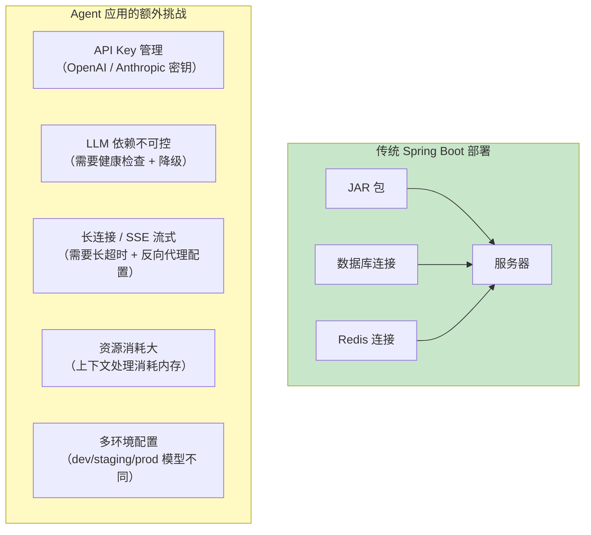
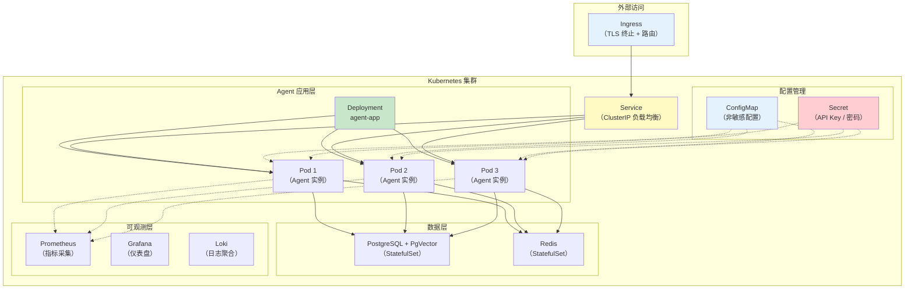
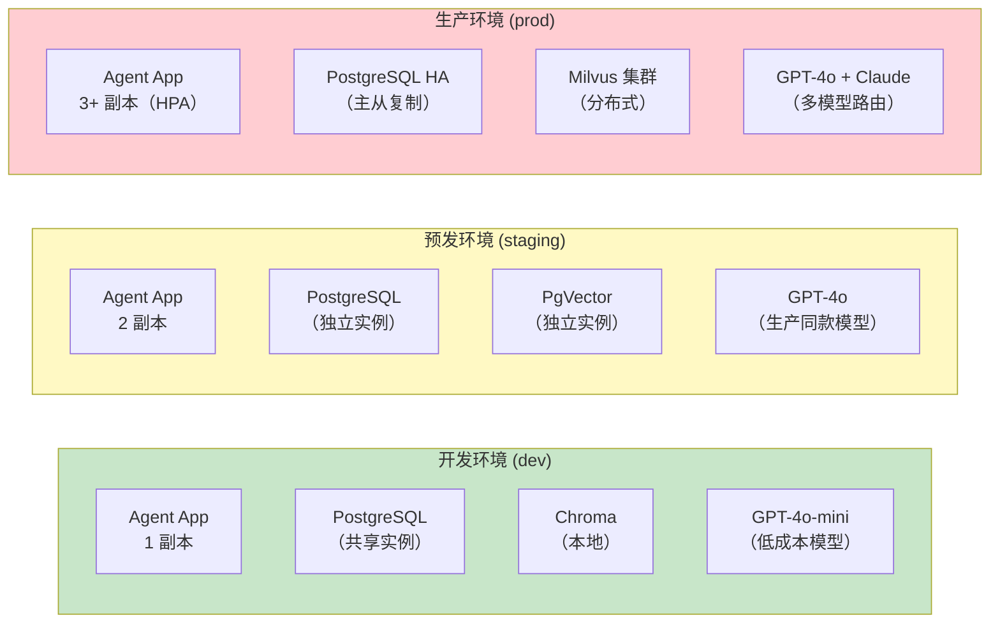
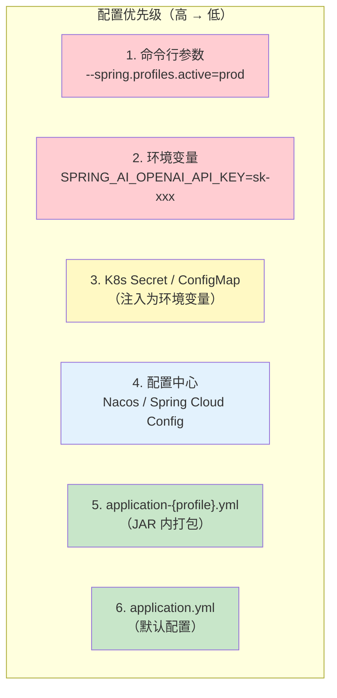
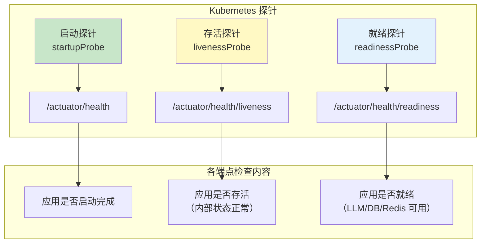
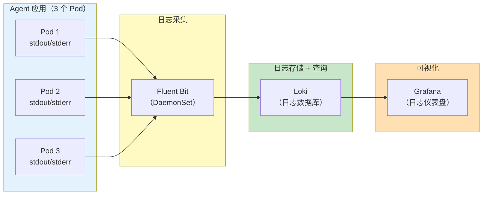
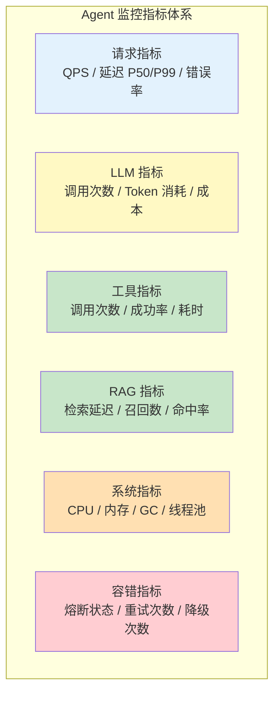

# 28-部署与运维

> **定位**：讲透 Agent 应用的部署与运维实践——Docker 化、Kubernetes 部署（Deployment/Service/ConfigMap/Secret）、环境隔离（dev/staging/prod）、配置管理、健康检查端点、日志收集与聚合。读完这篇，你的 Agent 能稳定地跑在生产环境。
>
> **读者画像**：已经掌握 Agent 开发的全部核心能力，需要将 Agent 应用部署到生产环境并持续运维。
>
> **前置阅读**：[24-容错与弹性设计](24-容错与弹性设计.md)、[27-模型路由与降级](27-模型路由与降级.md)。

---

## 1. Agent 应用的部署挑战

传统 Spring Boot 应用的部署已经很成熟了——打包 JAR、扔到服务器、启动。Agent 应用在部署时有几个特殊挑战：



---

## 2. Docker 化

### 2.1 Dockerfile

```dockerfile
# 多阶段构建——阶段 1：构建
FROM eclipse-temurin:21-jdk-jammy AS builder

WORKDIR /build

# 先复制 Maven 配置（利用 Docker 缓存）
COPY pom.xml .
COPY src ./src

# 构建应用（跳过测试加速）
RUN ./mvnw clean package -DskipTests

# ============ 阶段 2：运行时 ============
FROM eclipse-temurin:21-jre-jammy

WORKDIR /app

# 安装 curl 用于健康检查
RUN apt-get update && apt-get install -y curl && rm -rf /var/lib/apt/lists/*

# 复制构建产物
COPY --from=builder /build/target/*.jar app.jar

# 创建非 root 用户
RUN groupadd -r appuser && useradd -r -g appuser appuser
USER appuser

# 暴露端口
EXPOSE 8080

# JVM 参数：容器感知的内存设置
ENV JAVA_OPTS="-XX:+UseContainerSupport -XX:MaxRAMPercentage=75.0 -XX:+UseZGC"

# 健康检查
HEALTHCHECK --interval=30s --timeout=10s --start-period=60s --retries=3 \
    CMD curl -f http://localhost:8080/actuator/health || exit 1

ENTRYPOINT ["sh", "-c", "java $JAVA_OPTS -jar app.jar"]
```

### 2.2 .dockerignore

```
# .dockerignore
target/
.git/
.idea/
.vscode/
*.md
docs/
.claude/
**/*.log
```

### 2.3 docker-compose.yml（本地开发）

```yaml
# docker-compose.yml
version: '3.8'

services:
  # Agent 应用
  agent-app:
    build:
      context: .
      dockerfile: Dockerfile
    ports:
      - "8080:8080"
    environment:
      - SPRING_PROFILES_ACTIVE=dev
      - OPENAI_API_KEY=${OPENAI_API_KEY}
      - SPRING_AI_VECTORSTORE_PGVECTOR_CONNECTION-DATA-SOURCE-URL=jdbc:postgresql://postgres:5432/agent
      - SPRING_AI_VECTORSTORE_PGVECTOR_CONNECTION-DATA-SOURCE-USERNAME=agent
      - SPRING_AI_VECTORSTORE_PGVECTOR_CONNECTION-DATA-SOURCE-PASSWORD=agent123
    depends_on:
      postgres:
        condition: service_healthy
      chroma:
        condition: service_started
    networks:
      - agent-network

  # PostgreSQL + PgVector
  postgres:
    image: pgvector/pgvector:pg16
    environment:
      POSTGRES_DB: agent
      POSTGRES_USER: agent
      POSTGRES_PASSWORD: agent123
    ports:
      - "5432:5432"
    volumes:
      - postgres-data:/var/lib/postgresql/data
    healthcheck:
      test: ["CMD-SHELL", "pg_isready -U agent"]
      interval: 10s
      timeout: 5s
      retries: 5
    networks:
      - agent-network

  # Chroma 向量数据库（开发环境备用）
  chroma:
    image: chromadb/chroma:latest
    ports:
      - "8000:8000"
    volumes:
      - chroma-data:/chroma/chroma
    networks:
      - agent-network

volumes:
  postgres-data:
  chroma-data:

networks:
  agent-network:
    driver: bridge
```

### 2.4 构建与运行

```bash
# 构建镜像
docker build -t agent-app:latest .

# 通过 docker-compose 启动全套
docker-compose up -d

# 查看日志
docker-compose logs -f agent-app

# 停止
docker-compose down
```

---

## 3. Kubernetes 部署

### 3.1 K8s 部署拓扑



### 3.2 Namespace

```yaml
# k8s/namespace.yaml
apiVersion: v1
kind: Namespace
metadata:
  name: agent-prod
  labels:
    app.kubernetes.io/name: agent
    environment: production
```

### 3.3 ConfigMap（非敏感配置）

```yaml
# k8s/configmap.yaml
apiVersion: v1
kind: ConfigMap
metadata:
  name: agent-config
  namespace: agent-prod
data:
  SPRING_PROFILES_ACTIVE: "prod"
  SPRING_AI_OPENAI_CHAT_OPTIONS_MODEL: "gpt-4o"
  SPRING_AI_OPENAI_CHAT_OPTIONS_TEMPERATURE: "0.7"

  # 数据库连接（非密码部分）
  SPRING_DATASOURCE_URL: "jdbc:postgresql://postgres:5432/agent"
  SPRING_DATASOURCE_USERNAME: "agent"

  # 向量数据库
  SPRING_AI_VECTORSTORE_PGVECTOR_INDEX-TYPE: "HNSW"
  SPRING_AI_VECTORSTORE_PGVECTOR_DISTANCE-TYPE: "COSINE_DISTANCE"
  SPRING_AI_VECTORSTORE_PGVECTOR_DIMENSIONS: "1536"

  # JVM 参数
  JAVA_OPTS: "-XX:+UseContainerSupport -XX:MaxRAMPercentage=75.0 -XX:+UseZGC"

  application.yml: |
    spring:
      ai:
        retry:
          max-attempts: 3
          backoff:
            initial-interval: 1000
            multiplier: 2.0
            max-interval: 10000
        chat:
          client:
            tool-calling:
              enabled: true
    management:
      endpoints:
        web:
          exposure:
            include: health,info,metrics,prometheus
```

### 3.4 Secret（敏感配置）

```yaml
# k8s/secret.yaml
apiVersion: v1
kind: Secret
metadata:
  name: agent-secrets
  namespace: agent-prod
type: Opaque
stringData:
  OPENAI_API_KEY: "sk-prod-xxxxxxxxxxxxxxxxxx"
  ANTHROPIC_API_KEY: "sk-ant-xxxxxxxxxxxxxxxxxx"
  SPRING_DATASOURCE_PASSWORD: "super-secret-password"
  JWT_SECRET: "your-jwt-signing-key"

# 更安全的做法：使用 Sealed Secrets 或 External Secrets Operator
# 从 Vault / AWS Secrets Manager / Azure Key Vault 拉取
```

### 3.5 Deployment

```yaml
# k8s/deployment.yaml
apiVersion: apps/v1
kind: Deployment
metadata:
  name: agent-app
  namespace: agent-prod
  labels:
    app: agent
spec:
  replicas: 3                    # 3 个副本
  selector:
    matchLabels:
      app: agent
  strategy:
    type: RollingUpdate
    rollingUpdate:
      maxSurge: 1               # 滚动更新时最多多出 1 个 Pod
      maxUnavailable: 0          # 滚动更新时不允许减少 Pod
  template:
    metadata:
      labels:
        app: agent
    spec:
      containers:
        - name: agent
          image: registry.example.com/agent-app:v1.2.0
          ports:
            - containerPort: 8080
              name: http
          envFrom:
            - configMapRef:
                name: agent-config
            - secretRef:
                name: agent-secrets
          resources:
            requests:
              cpu: "500m"
              memory: "1Gi"
            limits:
              cpu: "2000m"
              memory: "4Gi"
          # 就绪探针：Pod 是否准备好接收流量
          readinessProbe:
            httpGet:
              path: /actuator/health/readiness
              port: 8080
            initialDelaySeconds: 30
            periodSeconds: 10
            failureThreshold: 3
          # 存活探针：Pod 是否存活（失败会重启）
          livenessProbe:
            httpGet:
              path: /actuator/health/liveness
              port: 8080
            initialDelaySeconds: 60
            periodSeconds: 20
            failureThreshold: 3
          # 启动探针：应用启动慢时给足够时间
          startupProbe:
            httpGet:
              path: /actuator/health
              port: 8080
            initialDelaySeconds: 10
            periodSeconds: 5
            failureThreshold: 30   # 最多等 150 秒启动
      # 优雅关闭
      terminationGracePeriodSeconds: 60
```

### 3.6 Service

```yaml
# k8s/service.yaml
apiVersion: v1
kind: Service
metadata:
  name: agent-service
  namespace: agent-prod
spec:
  type: ClusterIP
  selector:
    app: agent
  ports:
    - port: 80
      targetPort: 8080
      name: http
  # Session Affinity：同一用户的请求路由到同一 Pod（保持会话上下文）
  sessionAffinity: ClientIP
  sessionAffinityConfig:
    clientIP:
      timeoutSeconds: 3600
```

### 3.7 Ingress

```yaml
# k8s/ingress.yaml
apiVersion: networking.k8s.io/v1
kind: Ingress
metadata:
  name: agent-ingress
  namespace: agent-prod
  annotations:
    # SSE 长连接支持
    nginx.ingress.kubernetes.io/proxy-buffering: "off"
    nginx.ingress.kubernetes.io/proxy-read-timeout: "300"
    nginx.ingress.kubernetes.io/proxy-send-timeout: "300"
    # 限流
    nginx.ingress.kubernetes.io/limit-rps: "10"
    nginx.ingress.kubernetes.io/limit-connections: "20"
    # TLS 重定向
    nginx.ingress.kubernetes.io/ssl-redirect: "true"
spec:
  tls:
    - hosts:
        - agent.example.com
      secretName: agent-tls
  rules:
    - host: agent.example.com
      http:
        paths:
          - path: /
            pathType: Prefix
            backend:
              service:
                name: agent-service
                port:
                  number: 80
```

### 3.8 HPA（水平自动扩缩容）

```yaml
# k8s/hpa.yaml
apiVersion: autoscaling/v2
kind: HorizontalPodAutoscaler
metadata:
  name: agent-hpa
  namespace: agent-prod
spec:
  scaleTargetRef:
    apiVersion: apps/v1
    kind: Deployment
    name: agent-app
  minReplicas: 3
  maxReplicas: 20
  metrics:
    - type: Resource
      resource:
        name: cpu
        target:
          type: Utilization
          averageUtilization: 70
    - type: Resource
      resource:
        name: memory
        target:
          type: Utilization
          averageUtilization: 80
  behavior:
    scaleUp:
      stabilizationWindowSeconds: 30
      policies:
        - type: Percent
          value: 100              # 一次最多扩容 100%
          periodSeconds: 30
    scaleDown:
      stabilizationWindowSeconds: 300  # 缩容需要稳定 5 分钟
      policies:
        - type: Percent
          value: 25               # 一次最多缩容 25%
          periodSeconds: 60
```

---

## 4. 环境隔离

### 4.1 三环境架构



### 4.2 环境配置对照

| 配置项 | dev | staging | prod |
|--------|-----|---------|------|
| **模型** | GPT-4o-mini | GPT-4o | GPT-4o + Claude（路由） |
| **向量库** | Chroma（本地） | PgVector | Milvus 集群 |
| **数据库** | 共享 PostgreSQL | 独立 PostgreSQL | PostgreSQL HA |
| **副本数** | 1 | 2 | 3+（HPA 自动扩缩） |
| **日志级别** | DEBUG | INFO | WARN |
| **限流** | 无 | 宽松 | 严格（10 req/s） |
| **熔断** | 关闭 | 开启 | 开启 + 降级链 |
| **API Key** | 测试 Key | 测试 Key（有额度） | 生产 Key（预算限制） |

### 4.3 Profile 配置文件

```yaml
# application.yml（公共配置）
spring:
  application:
    name: agent-app
  threads:
    virtual:
      enabled: true              # Java 21 虚拟线程
server:
  port: 8080
management:
  endpoints:
    web:
      exposure:
        include: health,info,metrics,prometheus
```

```yaml
# application-dev.yml
spring:
  config:
    activate:
      on-profile: dev
  ai:
    openai:
      chat:
        options:
          model: gpt-4o-mini
logging:
  level:
    com.example.agent: DEBUG
    org.springframework.ai: DEBUG
```

```yaml
# application-prod.yml
spring:
  config:
    activate:
      on-profile: prod
  ai:
    openai:
      chat:
        options:
          model: gpt-4o
logging:
  level:
    com.example.agent: WARN
    org.springframework.ai: INFO
resilience4j:
  circuitbreaker:
    instances:
      llm-circuit:
        sliding-window-size: 10
        failure-rate-threshold: 50
        wait-duration-in-open-state: 30s
```

---

## 5. 配置管理策略

### 5.1 配置分层



### 5.2 敏感配置管理原则

```java
// ❌ 错误：密钥硬编码在代码中
@Configuration
public class BadConfig {
    private static final String API_KEY = "sk-prod-xxxxxxxxxxxxx";
}

// ❌ 错误：密钥写在 application.yml 中并提交到 Git
// application.yml:
//   openai:
//     api-key: sk-prod-xxxxxxxxxxxxx  // 会被 Git 跟踪！

// ✅ 正确：通过环境变量注入
@Configuration
public class GoodConfig {

    @Value("${OPENAI_API_KEY}")
    private String apiKey;  // 从环境变量读取

    // 或者通过 @ConfigurationProperties 批量绑定
}

// ✅ 正确：在 K8s 中通过 Secret 注入
```

### 5.3 配置热更新（可选）

对于需要动态调整的配置（如模型切换、限流阈值），可以使用 Spring Cloud Config 或 Nacos：

```yaml
# application.yml
spring:
  cloud:
    config:
      uri: ${CONFIG_SERVER:http://config-server:8888}
      fail-fast: true
      retry:
        max-attempts: 6
        initial-interval: 1000
```

```java
// 通过 @RefreshScope 实现配置热更新
@RestController
@RefreshScope
public class ConfigController {

    @Value("${agent.model.primary:gpt-4o}")
    private String primaryModel;

    @GetMapping("/config/model")
    public String getCurrentModel() {
        return primaryModel;
    }

    // 调用 POST /actuator/refresh 后，primaryModel 会自动更新
}
```

---

## 6. 健康检查端点

### 6.1 Spring Boot Actuator 配置

```yaml
# application.yml
management:
  endpoints:
    web:
      exposure:
        include: health,info,metrics,prometheus,circuitbreakers
      base-path: /actuator
  endpoint:
    health:
      show-details: when-authorized    # 需要认证才能看详情
      probes:
        enabled: true                   # 启用 K8s 探针端点
      group:
        readiness:
          include: readinessState,llm,vectorStore,db
        liveness:
          include: livenessState
  health:
    livenessstate:
      enabled: true
    readinessstate:
      enabled: true
```

### 6.2 健康检查端点对应关系



### 6.3 自定义健康指标

```java
import org.springframework.boot.actuate.health.Health;
import org.springframework.boot.actuate.health.HealthIndicator;
import org.springframework.stereotype.Component;

@Component
public class LlmHealthIndicator implements HealthIndicator {

    private final ChatModel chatModel;
    private final CircuitBreakerRegistry cbRegistry;

    @Override
    public Health health() {
        Health.Builder builder = Health.up();

        // 1. 检查熔断器状态
        CircuitBreaker llmCircuit = cbRegistry.circuitBreaker("llm-circuit");
        if (llmCircuit.getState() == CircuitBreaker.State.OPEN) {
            return Health.down()
                    .withDetail("error", "LLM 熔断器处于 OPEN 状态")
                    .build();
        }

        // 2. 检查 LLM 可用性（可选——避免频繁 ping 消耗 Token）
        builder.withDetail("circuitState", llmCircuit.getState().toString());
        builder.withDetail("failureRate", llmCircuit.getMetrics().getFailureRate());

        return builder.build();
    }
}

@Component
public class VectorStoreHealthIndicator implements HealthIndicator {

    private final VectorStore vectorStore;

    @Override
    public Health health() {
        try {
            // 执行一个极简查询检查向量库可用性
            vectorStore.similaritySearch(
                SearchRequest.builder().query("health-check").topK(1).build());
            return Health.up().withDetail("provider", "pgvector").build();
        } catch (Exception e) {
            return Health.down()
                    .withDetail("error", e.getMessage())
                    .build();
        }
    }
}
```

---

## 7. 日志收集与聚合

### 7.1 日志架构



### 7.2 结构化日志配置

```xml
<!-- src/main/resources/logback-spring.xml -->
<configuration>
    <appender name="JSON" class="ch.qos.logback.core.ConsoleAppender">
        <encoder class="net.logstash.logback.encoder.LogstashEncoder">
            <customFields>
                {
                    "service": "agent-app",
                    "version": "${PROJECT_VERSION:-unknown}"
                }
            </customFields>
            <fieldNames>
                <timestamp>@timestamp</timestamp>
                <message>message</message>
                <thread>thread</thread>
                <levelValue>[ignore]</levelValue>
            </fieldNames>
        </encoder>
    </appender>

    <springProfile name="dev">
        <appender name="CONSOLE" class="ch.qos.logback.core.ConsoleAppender">
            <encoder>
                <pattern>%d{HH:mm:ss.SSS} %-5level [%thread] %logger{36} - %msg%n</pattern>
            </encoder>
        </appender>
        <root level="DEBUG">
            <appender-ref ref="CONSOLE"/>
        </root>
    </springProfile>

    <springProfile name="prod">
        <root level="WARN">
            <appender-ref ref="JSON"/>
        </root>
        <logger name="com.example.agent" level="INFO"/>
    </springProfile>
</configuration>
```

### 7.3 MDC 上下文日志

```java
@Component
public class RequestLoggingFilter implements WebFilter {

    @Override
    public Mono<Void> filter(ServerWebExchange exchange, WebFilterChain chain) {
        String requestId = UUID.randomUUID().toString();
        String userId = extractUserId(exchange);  // 从 JWT Token 提取

        return chain.filter(exchange)
                .contextWrite(reactor.util.context.Context.of(
                        "requestId", requestId,
                        "userId", userId
                ))
                .doOnEach(signal -> {
                    // 在日志中自动附加 requestId 和 userId
                    MDC.put("requestId", requestId);
                    MDC.put("userId", userId);
                })
                .doFinally(signalType -> MDC.clear());
    }
}
```

```java
// 日志输出示例（JSON 格式）
// {
//   "@timestamp": "2026-08-13T10:30:00.123Z",
//   "level": "INFO",
//   "service": "agent-app",
//   "requestId": "abc-123",
//   "userId": "user-456",
//   "message": "LLM 调用成功",
//   "model": "gpt-4o",
//   "latency_ms": 1500,
//   "tokens": {"input": 500, "output": 200}
// }

log.info("LLM 调用成功");
// 通过 MDC 自动注入 requestId 和 userId
```

### 7.4 Agent 操作审计日志

```java
@Component
public class AgentAuditLogger {

    private static final Logger auditLog = LoggerFactory.getLogger("AGENT_AUDIT");

    /**
     * 记录 Agent 的每次关键操作
     */
    public void logToolCall(String requestId, String userId, String toolName,
                             Object[] args, String result, long durationMs) {
        auditLog.info("""
            {
              "event": "tool_call",
              "requestId": "{}",
              "userId": "{}",
              "tool": "{}",
              "args": {},
              "resultLength": {},
              "durationMs": {}
            }""",
            requestId, userId, toolName,
            Arrays.toString(args),
            result != null ? result.length() : 0,
            durationMs);
    }

    public void logLlmCall(String requestId, String model, int inputTokens,
                            int outputTokens, long latencyMs) {
        auditLog.info("""
            {
              "event": "llm_call",
              "requestId": "{}",
              "model": "{}",
              "inputTokens": {},
              "outputTokens": {},
              "latencyMs": {}
            }""",
            requestId, model, inputTokens, outputTokens, latencyMs);
    }
}
```

---

## 8. 监控与告警

### 8.1 Prometheus 指标暴露

```yaml
# application.yml
management:
  prometheus:
    metrics:
      export:
        enabled: true
        step: 30s
```

### 8.2 关键监控指标



### 8.3 告警规则

```yaml
# prometheus-alerts.yaml
groups:
  - name: agent-alerts
    rules:
      # LLM 调用错误率 > 10%
      - alert: HighLlmErrorRate
        expr: |
          rate(agent_llm_call_errors_total[5m]) /
          rate(agent_llm_call_total[5m]) > 0.1
        for: 5m
        labels:
          severity: critical
        annotations:
          summary: "LLM 调用错误率超过 10%"

      # 熔断器打开
      - alert: CircuitBreakerOpen
        expr: resilience4j_circuitbreaker_state{state="open"} == 1
        for: 1m
        labels:
          severity: warning
        annotations:
          summary: "熔断器 {{ $labels.name }} 处于 OPEN 状态"

      # 日成本超预算
      - alert: DailyCostExceeded
        expr: agent_cost_daily_total > 50
        labels:
          severity: warning
        annotations:
          summary: "日 LLM 成本超过预算 $50"

      # Pod 重启
      - alert: PodRestart
        expr: increase(kube_pod_container_status_restarts_total[1h]) > 3
        labels:
          severity: critical
        annotations:
          summary: "Pod {{ $labels.pod }} 频繁重启"
```

---

## 9. CI/CD 流水线

```mermaid
graph LR
    CODE["代码提交<br/>Git Push"] --> BUILD["构建<br/>Maven Package"]
    BUILD --> TEST["测试<br/>单元测试 + 集成测试"]
    TEST --> SCAN["安全扫描<br/>Trivy / SonarQube"]
    SCAN --> DOCKER["Docker 镜像"]
    DOCKER --> PUSH["推送到镜像仓库"]
    PUSH --> DEPLOY_DEV["部署 dev"]
    DEPLOY_DEV --> TEST_DEV["dev 验证"]
    TEST_DEV --> DEPLOY_STAGING["部署 staging"]
    DEPLOY_STAGING --> TEST_STAGING["staging 验证"]
    TEST_STAGING --> DEPLOY_PROD["部署 prod<br/>（蓝绿 / 滚动）"]

    style BUILD fill:#e3f2fd
    style TEST fill:#c8e6c9
    style SCAN fill:#ffcdd2
    style DEPLOY_PROD fill:#fff9c4
```



### 9.1 GitHub Actions 示例

```yaml
# .github/workflows/deploy.yml
name: Build and Deploy

on:
  push:
    branches: [main]

jobs:
  build-and-deploy:
    runs-on: ubuntu-latest
    steps:
      - uses: actions/checkout@v4

      - name: Set up JDK 21
        uses: actions/setup-java@v4
        with:
          java-version: '21'
          distribution: 'temurin'

      - name: Build with Maven
        run: ./mvnw clean package -DskipTests

      - name: Run tests
        run: ./mvnw test

      - name: Build Docker image
        run: docker build -t agent-app:${{ github.sha }} .

      - name: Push to registry
        run: |
          docker login -u ${{ secrets.REGISTRY_USER }} -p ${{ secrets.REGISTRY_PASS }}
          docker tag agent-app:${{ github.sha }} registry.example.com/agent-app:${{ github.sha }}
          docker push registry.example.com/agent-app:${{ github.sha }}

      - name: Deploy to K8s
        run: |
          kubectl set image deployment/agent-app agent=registry.example.com/agent-app:${{ github.sha }} \
            -n agent-prod
          kubectl rollout status deployment/agent-app -n agent-prod
```

---

## 10. 适用场景与不适用场景

### 适用场景

- 企业级生产 Agent 部署（需要高可用、可伸缩）
- 多环境管理的团队（dev/staging/prod 隔离）
- 有运维团队的中大型组织（K8s + 监控 + 日志）
- 对 SLA 有严格要求的商业服务
- 需要灰度发布和回滚能力的系统

### 不适用场景

- 个人项目 / 技术验证（用 docker-compose 足够）
- 小团队没有运维资源（直接用云平台 PaaS）
- 离线/嵌入式 Agent（不需要 K8s）
- 对延迟没有要求的批处理任务（部署简化即可）

---

## 11. 本章总结

| 概念 | 一句话 |
|------|--------|
| **Docker 多阶段构建** | 构建 JDK 环境与运行时 JRE 环境分离，减小镜像体积 |
| **K8s Deployment** | 声明式管理 Pod 副本，支持滚动更新和回滚 |
| **ConfigMap** | K8s 中存储非敏感配置，注入为环境变量 |
| **Secret** | K8s 中存储敏感信息（API Key/密码），Base64 编码 |
| **探针** | startup/liveness/readiness 三种探针，管理 Pod 生命周期 |
| **HPA** | 水平自动扩缩容，根据 CPU/内存自动调整副本数 |
| **环境隔离** | dev/staging/prod 三环境，通过 Profile + Namespace 隔离 |
| **配置分层** | 命令行 > 环境变量 > Secret/ConfigMap > 配置中心 > yml |
| **健康检查** | Actuator + 自定义 HealthIndicator，监控 LLM/DB/向量库 |
| **结构化日志** | JSON 格式输出，Fluent Bit 采集 → Loki 存储 → Grafana 查询 |
| **Prometheus 监控** | 指标暴露 + 告警规则，覆盖请求/LLM/工具/成本/系统 |
| **Session Affinity** | Service 的 ClientIP 粘性，保持多轮对话上下文一致 |

**系列完结**：本教程系列从 [00-Agent 核心概念](00-Agent核心概念.md) 到本章，覆盖了 Agent 从入门到生产部署的完整知识体系。

---

> **回顾起点？→ [00-Agent 核心概念](00-Agent核心概念.md)**：从什么是 Agent 开始，重温整个学习旅程。
> **遇到阻塞？→ [教程 24-容错与弹性设计](24-容错与弹性设计.md)**：部署后的稳定性靠容错策略保障。
> **遇到阻塞？→ [教程 27-模型路由与降级](27-模型路由与降级.md)**：多模型部署的配置管理参考本章环境隔离部分。
