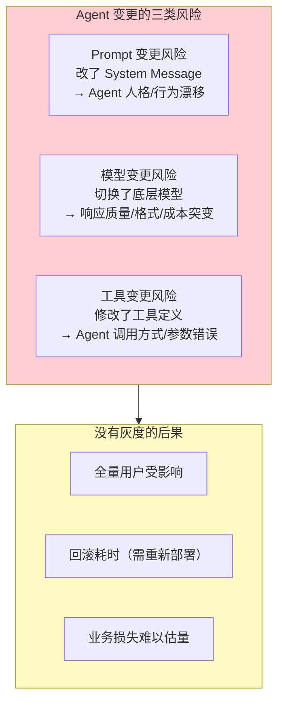
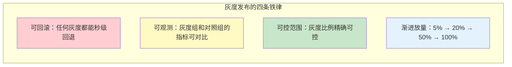
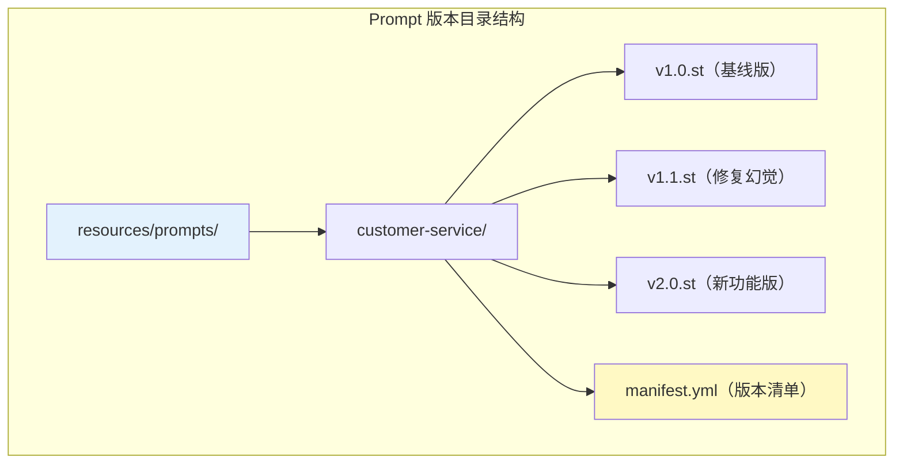
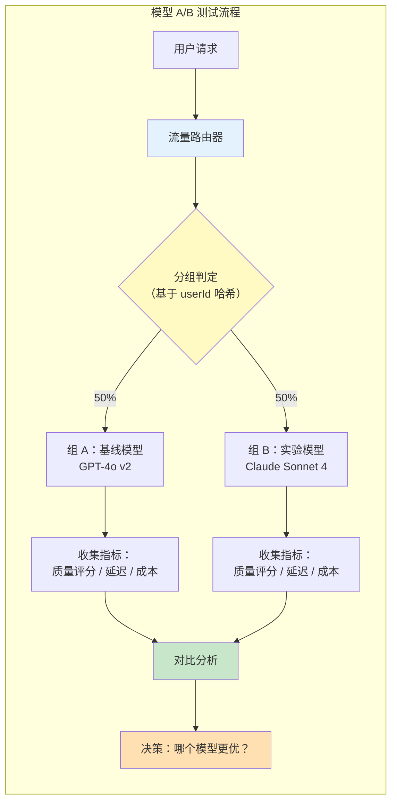
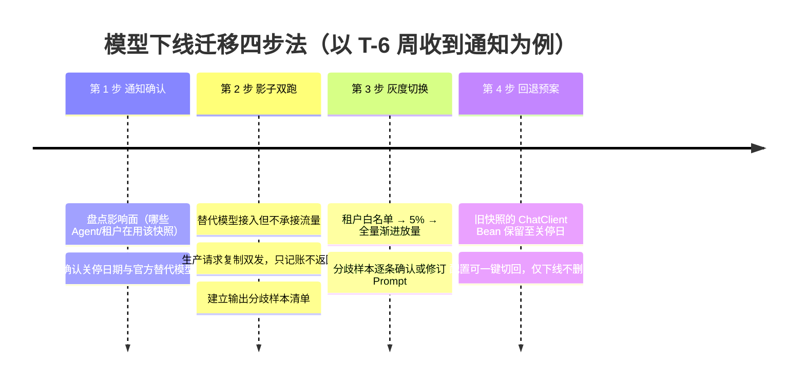
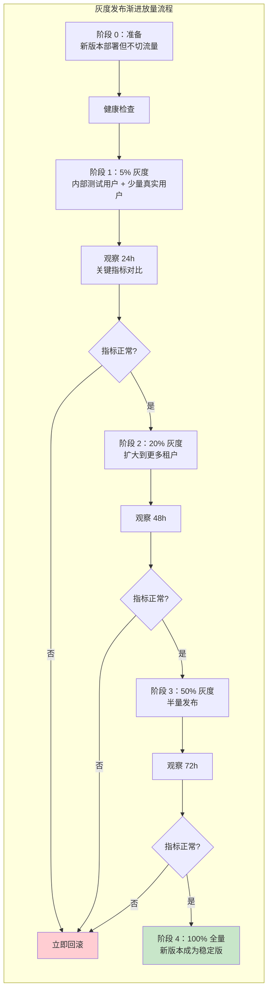
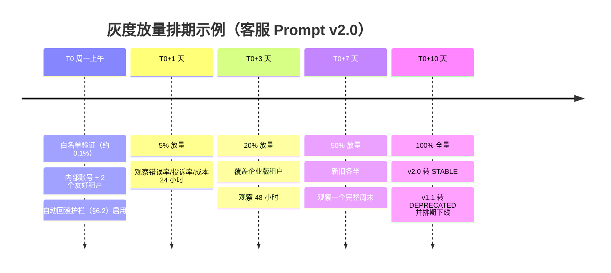
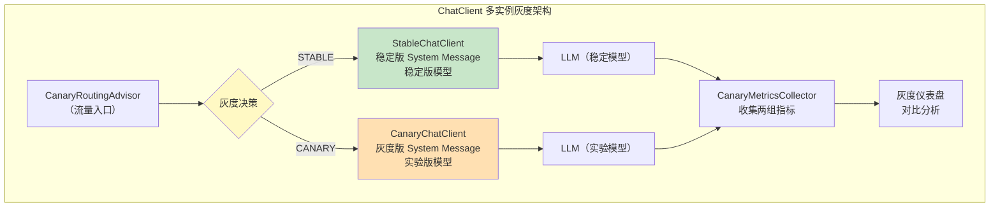
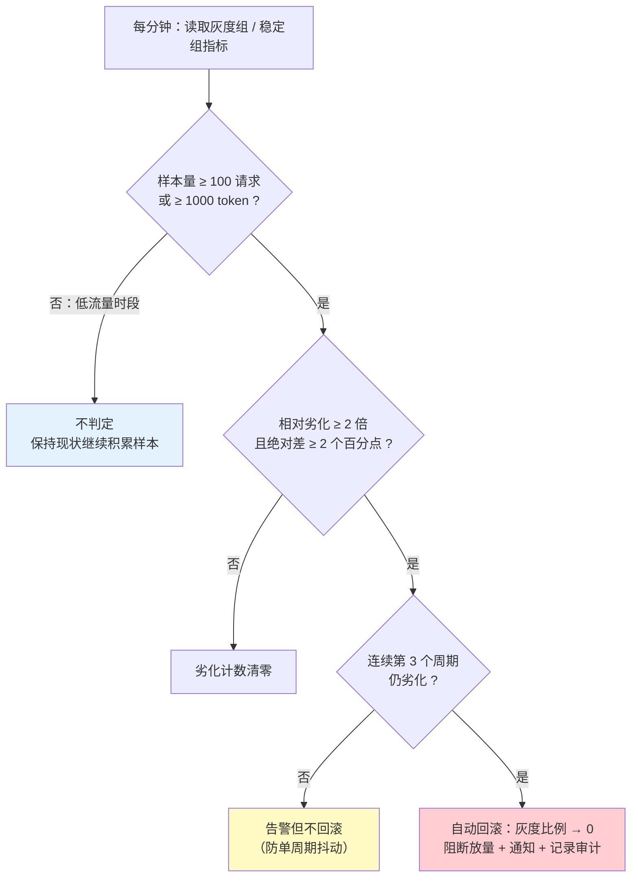
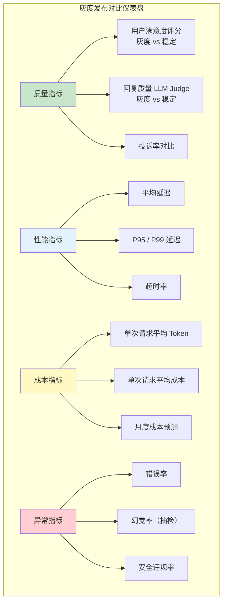

# 29-灰度发布与版本管理

> **定位**：讲透 Agent 系统中的版本控制与灰度发布——Prompt 版本化管理、模型 A/B 测试、流量切分策略（按百分比/按用户特征），以及 Spring AI 中通过 ChatClient 多实例 + 条件路由实现灰度发布的完整代码方案。读完这篇，你能安全地发布 Agent 变更，不再"改一行 Prompt、全站提心吊胆"。
>
> **读者画像**：正在生产环境运行 Agent，需要在不影响全部用户的前提下逐步验证 Prompt 和模型变更的效果。
>
> **前置阅读**：[02-ChatClient与对话模型](02-ChatClient与对话模型.md)、[26-多租户隔离与资源治理](26-多租户隔离与资源治理.md)、[22-全链路可观测性](22-全链路可观测性.md)（灰度对比的指标从哪来）。

---

## 1. 为什么 Agent 的变更发布比传统软件更危险

传统软件的变更通过编译器检查、单元测试、集成测试来保障质量。但 Agent 的核心——Prompt 和模型选择——是**自然语言和概率模型**的组合，没有编译器能帮你检查"改了 System Message 的一行话会不会让 Agent 行为崩溃"。



### 1.1 典型事故

> 团队把 System Message 中"你是客服助手"改成了"你是友好热情的客服助手"，看似无伤大雅。但"热情"一词导致 LLM 在回复中大量使用感叹号和 emoji，在金融合规场景中被视为不专业，客户投诉率上升 40%。

Prompt 中的**一个词**就能改变 Agent 的整体行为——这种敏感性要求任何变更都必须经过**灰度验证**。

### 1.2 灰度发布的核心原则



---

## 2. Prompt 版本控制

### 2.1 版本化 System Message

将 Prompt 从代码中外部化到独立文件，每个版本独立管理：



**版本清单 manifest.yml**：

```yaml
# resources/prompts/customer-service/manifest.yml
current_version: "v1.1"
versions:
  v1.0:
    file: v1.0.st
    status: DEPRECATED
    description: "初始版本，基线 System Message"
    created_at: "2026-06-01"
    sunset_at: "2026-09-01"

  v1.1:
    file: v1.1.st
    status: STABLE           # 当前稳定版
    description: "增加幻觉防护规则，限制不确定回答"
    created_at: "2026-07-15"

  v2.0:
    file: v2.0.st
    status: CANARY           # 灰度版
    description: "新增产品推荐功能，语气更专业"
    created_at: "2026-08-10"
    canary_percentage: 10    # 灰度比例 10%

# 灰度切分规则
canary_rules:
  - rule: "tenant_tier"
    value: "ENTERPRISE"
    percentage: 30           # 企业版租户 30% 走灰度版
  - rule: "tenant_tier"
    value: "FREE"
    percentage: 5            # 免费版租户 5% 走灰度版
```

### 2.2 Prompt 版本加载

```java
import org.springframework.core.io.ClassPathResource;
import org.springframework.stereotype.Service;
import java.io.IOException;
import java.nio.charset.StandardCharsets;
import java.util.Map;
import java.util.concurrent.ConcurrentHashMap;

@Service
public class PromptVersionManager {

    private final Map<String, String> promptCache = new ConcurrentHashMap<>();
    private final PromptManifestLoader manifestLoader;

    /**
     * 加载指定版本的 Prompt 内容。
     */
    public String loadPrompt(String promptName, String version) {
        String cacheKey = promptName + ":" + version;
        return promptCache.computeIfAbsent(cacheKey, k -> {
            String path = "prompts/" + promptName + "/" + version + ".st";
            // 必须用 getInputStream()，不能用 getFile()——见代码块下方说明
            try (var in = new ClassPathResource(path).getInputStream()) {
                return new String(in.readAllBytes(), StandardCharsets.UTF_8);
            } catch (IOException e) {
                throw new PromptNotFoundException(
                        "Prompt not found: " + path, e);
            }
        });
    }

    /**
     * 获取当前稳定版本。
     */
    public String getStableVersion(String promptName) {
        return manifestLoader.getManifest(promptName).currentVersion();
    }

    /**
     * 获取灰度版本（如果有）。
     */
    public String getCanaryVersion(String promptName) {
        return manifestLoader.getManifest(promptName)
                .versions().values().stream()
                .filter(v -> v.status() == PromptStatus.CANARY)
                .map(PromptVersion::version)
                .findFirst()
                .orElse(null);
    }

    /**
     * 根据灰度规则判断请求应该使用哪个版本。
     */
    public String resolveVersion(String promptName, RequestContext context) {
        PromptManifest manifest = manifestLoader.getManifest(promptName);
        String canaryVersion = getCanaryVersion(promptName);

        if (canaryVersion == null) {
            return manifest.currentVersion();  // 没有灰度版，用稳定版
        }

        // 检查灰度规则
        for (CanaryRule rule : manifest.canaryRules()) {
            String contextValue = context.getAttribute(rule.rule());
            if (contextValue != null && contextValue.equals(rule.value())) {
                if (shouldRouteToCanary(rule.percentage(),
                        context.getUserId())) {
                    return canaryVersion;
                }
            }
        }

        return manifest.currentVersion();
    }

    /**
     * 基于用户 ID 的确定性灰度——同一用户始终被分到同一组。
     */
    private boolean shouldRouteToCanary(int percentage, String userId) {
        int hash = Math.floorMod(userId.hashCode(), 100);
        return hash < percentage;
    }
}
```

**为什么必须用 `getInputStream()` 而不是 `getFile()`**：`ClassPathResource.getFile()` 要求资源真实存在于文件系统上。但生产环境的 Spring Boot 应用几乎都以 FatJar（嵌套 jar）方式部署——`prompts/` 位于应用 jar 内部，JDK 无法把嵌套 jar 里的条目映射为 `java.io.File`，运行时会直接抛 `FileNotFoundException`（打印出的路径形如 `jar:file:/app.jar!/BOOT-INF/classes!/prompts/...`，这不是文件系统路径）。`getInputStream()` 走类加载器的字节流读取，对 FatJar、解压目录、容器镜像 overlayfs 都成立。这是读取 classpath 资源的通用铁律：**读内容一律用流；只有资源确定在真实文件系统上（如外挂配置目录）才允许 `getFile()`**。

#### 哈希分组的四个深坑

`shouldRouteToCanary` 只有几行，却是生产事故的高发区。四个深坑逐个拆解：

**深坑一：`Math.abs(hashCode()) % 100` 的负数陷阱**。`Math.abs(Integer.MIN_VALUE)` 的返回值仍然是 `Integer.MIN_VALUE`——负数，因为 int 的正数区间比负数区间恰好少一个值，`+2147483648` 无法用 int 表示。一旦某个 `userId.hashCode()` 等于 `Integer.MIN_VALUE`，`Math.abs(...) % 100` 会得到**负数**桶号，而 `hash < percentage` 对负数恒为 true——这个用户被永久钉死在灰度组，且无论怎么调比例都移不出去，同时 `%` 的截断取余语义让负桶号还会污染其他边界判断。正确写法是 `Math.floorMod(hash, 100)`：它对任意 int（包括 `Integer.MIN_VALUE`）都返回 `[0, 100)` 的非负余数，语义等于数学取模而非 Java 的截断取余。上文代码已按此修正。

**深坑二：`String.hashCode()` 的分布偏斜**。Java 的 `String.hashCode()` 是 `s[0]*31^(n-1) + ...` 的多项式哈希，对短字符串（用户 ID 常见 4-10 位数字或短前缀）分布并不均匀——某些桶可能聚集数倍于期望的用户量，结果是"配了 10% 实际切了 18%"，灰度比例名不副实。对均匀性有要求的平台，应先用 SHA-256 截断或 murmur3/xxhash 一类非加密哈希打散，再取模；同时把桶数从 100 提到 10000（万分位），让放量粒度从"整数百分点"细化到"万分之一"。

**深坑三：ramp-up 单调性——为什么判定必须是 `hash < percentage`**。灰度比例从 5% 升到 10% 时，原本 hash ∈ [0, 5) 的用户仍然满足 hash < 10——**组员只增不减，已进组的用户绝不换组**。举例：hash = 3 的用户，5% 时在实验组，升到 10% 依然在；hash = 7 的用户，5% 时不在，升到 10% 才新进组。这种**单调包含关系**对实验与体验都至关重要：从用户视角，同一个人不会因为放量在"稳定版 → 灰度版 → 回滚"之间来回震荡；从统计视角，实验组与对照组的成员构成在放量全程保持稳定，累计数据不会因为重新洗牌而作废。收缩同理：从 10% 降到 5%，只有 hash ∈ [5, 10) 的用户退出，hash ∈ [0, 5) 的用户完全不受影响。反过来，若用"区间映射"式分组（比如每次放量重新均分区间），每次调比例都是一次全员重新分组——单调性破坏，实验数据断裂。

**深坑四：多实验并行必须加盐**。两个实验如果都对同一个裸 `userId` 哈希分组，"低 hash 用户"会同时进入所有实验的实验组——实验间完全重叠，实验效果互相污染，无法归因。解法是把**实验名作为 salt 拼进哈希键**，让每个实验拥有独立的哈希空间，实现实验间流量正交：

```java
import java.nio.charset.StandardCharsets;
import java.security.MessageDigest;
import java.security.NoSuchAlgorithmException;

/**
 * 均匀加盐分桶器：SHA-256 打散 + 实验级 salt。
 * 同时解决深坑二（分布偏斜）与深坑四（实验重叠）。
 */
public class SaltedBucketAssigner {

    private static final int BUCKETS = 10_000;   // 万分位桶，放量粒度 0.01%

    /**
     * 返回 [0, BUCKETS) 的桶号：同一 key 在同一实验名下结果恒定，
     * 同一 key 在不同实验名下近似独立（正交）。
     */
    public int bucket(String key, String experimentName) {
        try {
            MessageDigest digest = MessageDigest.getInstance("SHA-256");
            byte[] bytes = digest.digest(
                    (experimentName + ":" + key)
                            .getBytes(StandardCharsets.UTF_8));
            int hash = ((bytes[0] & 0xFF) << 24) | ((bytes[1] & 0xFF) << 16)
                    | ((bytes[2] & 0xFF) << 8) | (bytes[3] & 0xFF);
            return Math.floorMod(hash, BUCKETS);
        } catch (NoSuchAlgorithmException e) {
            // SHA-256 是 JDK 内置算法，此分支实际不可达
            throw new IllegalStateException("SHA-256 unavailable", e);
        }
    }

    /**
     * 判定是否进入实验：percentage 为百分数（如 10 表示 10%）。
     */
    public boolean inTreatment(String key, String experimentName,
                               double percentage) {
        return bucket(key, experimentName) < percentage * BUCKETS / 100;
    }
}
```

注意 `inTreatment` 保持了深坑三的 `bucket < 阈值` 形态——加盐与打散改变的是 hash 的来源，单调放量的判定结构不变。

「想深入？→ [附录 12-评估与可观测生态/03-在线实验与AB统计 §2]」——实验单元选"用户"还是"会话"、salt 正交的统计意义、曝光口径的幸存者偏差，在那里展开成完整的统计工程。

### 2.3 Prompt 内容示例

`resources/prompts/customer-service/v1.1.st`（稳定版）：

```
你是 {company} 的客服助手。
职责：回答用户关于 {product} 的问题。

规则：
- 语气友好专业
- 不确定的信息明确告知"我需要确认一下"
- 涉及订单查询时引导用户提供订单号
- 绝不编造不存在的政策或数据
```

`resources/prompts/customer-service/v2.0.st`（灰度版）：

```
你是 {company} 的专业客服顾问。
职责：回答用户关于 {product} 的问题，并提供个性化推荐。

规则：
- 语气专业，避免过多感叹号和表情符号
- 不确定的信息明确告知"我需要确认一下"
- 涉及订单查询时引导用户提供订单号
- 绝不编造不存在的政策或数据
- 可在回答末尾附加一个相关产品推荐（如用户在咨询手机，可推荐配件）
- 推荐时注明"您可能还需要"而非硬推销
```

### 2.4 版本热更新与缓存失效

`promptCache` 是一把双刃剑：它让 Prompt 加载零开销，但也意味着**改了 manifest 或 .st 文件之后，正在运行的实例感知不到**。三种失效策略的取舍：

| 策略 | 生效时效 | 复杂度 | 失效方式 | 适用 |
|------|---------|--------|---------|------|
| **本地缓存不失效** | 随下次部署生效 | 最低 | 重新部署 / 重启实例 | 变更频率低、可接受发布窗口 |
| **TTL 轮询** | TTL 到期后，最多延迟一个周期 | 低 | 缓存条目过期后重读源 | 中小规模、没有配置中心 |
| **配置中心推送**（Nacos / Apollo config listener） | 秒级推送 | 中 | 监听变更事件，主动清除缓存 | 多实例统一变更、需要审计与快速回滚 |

注意一个反直觉结论：**TTL 轮询的最终一致窗口 = TTL + 实例间刷新时钟差**。五台实例可能在新旧 Prompt 上并行服务数分钟，各实例实际的灰度比例会围绕配置值漂移——这是灰度比例失真的隐形来源之一，也是 §2.6 会话粘性必须存在的理由。配置中心推送把窗口压到秒级，且自带变更历史（audit trail）与"一键回滚"（回滚 = 推回旧版本号），与 §6 的回滚机制天然衔接。

若在 WebFlux 链路中加载 Prompt、且加载源是慢速 IO（数据库、配置中心 HTTP 拉取），必须遵守响应式铁律——阻塞调用让出事件循环：

```java
import org.springframework.core.io.ClassPathResource;
import reactor.core.publisher.Mono;
import reactor.core.scheduler.Schedulers;
import java.io.IOException;
import java.io.InputStream;
import java.nio.charset.StandardCharsets;

public class ReactivePromptLoader {

    /**
     * 在 boundedElastic 上执行阻塞 IO，避免占用 Netty EventLoop。
     */
    public Mono<String> loadPromptReactive(String promptName, String version) {
        String path = "prompts/" + promptName + "/" + version + ".st";
        return Mono.fromCallable(() -> {
                    try (InputStream in =
                                 new ClassPathResource(path).getInputStream()) {
                        return new String(in.readAllBytes(), StandardCharsets.UTF_8);
                    }
                })
                .subscribeOn(Schedulers.boundedElastic());  // 阻塞调用必须切线程
    }
}
```

「想深入？→ [附录 10-语义缓存与性能/00-语义缓存实现]」——Prompt 版本号是语义缓存 key 的组成部分：版本切换后旧缓存条目必须随之失效，否则会出现"新 Prompt 命中旧回答"的脏缓存。版本管理与缓存治理是同一个问题的两面。

### 2.5 变更评审：把 Prompt 当代码对待

Prompt 是"用自然语言写的代码"，理应享受代码级的评审待遇。但直接 diff 原文有两个工程问题：

1. **模板变量噪声**。两个版本的 diff 可能满屏都是 `{company}`、`{product}` 这类未变参数的位置漂移。工程做法是 diff 前先做**模板参数提取**——把 `{param}` 抽成占位符编号，"模板骨架"与"参数表"分开 diff，评审者一眼看清是结构变了，还是只是措辞调整。
2. **语义变更不可见**。"语气友好"改成"语气专业"在文本 diff 上只是一行，行为上却可能是 §1.1 那种投诉率上升 40% 的事故。所以 Prompt 的 PR 必须附**评估集前后对比**——变更前各跑一遍回归评估集，分数与抽样回答贴进 PR 描述，评审者评的是行为差异，不是文字差异。

**Prompt 变更评审清单**（固化进 PR 模板）：

- [ ] 变更意图一句话（修什么问题 / 加什么能力），可对应到工单
- [ ] 评估集前后分数对比 + 至少 3 组前后回答抽样
- [ ] 是否影响工具调用行为（工具描述、参数 Schema 是否被动过）
- [ ] 是否影响输出格式约定（下游结构化解析是否兼容）
- [ ] 灰度计划（初始比例、观察指标、回滚条件）
- [ ] 版本状态流转证据（CANARY → STABLE 需附灰度达标数据）

**配置中心 vs 代码库管理 Prompt**：

| 维度 | 代码库（.st 文件 + manifest） | 配置中心（Nacos / Apollo） |
|------|------------------------------|---------------------------|
| 变更审计 | Git 历史天然完整、可 blame | 依赖配置中心的变更日志 |
| 评审流 | PR review 现成，评估门禁可挂 CI | 需配置中心权限 + 审批插件 |
| 生效速度 | 随部署，分钟级 | 推送，秒级 |
| 环境隔离 | 分支 / profile 控制 | namespace / environment 隔离 |
| 回滚 | git revert + 重新部署 | 推回旧版本，秒级 |
| 适用 | 结构性大版本变更 | 文案微调、紧急止血 |

实践中常见的组合拳：**Prompt 主版本走代码库**（享受评审与评估门禁），**运行时开关走配置中心**（灰度比例、白名单、current_version 指针——享受秒级生效与回滚）。职责切分恰好对应 §5 的架构：ChatClient 的 System Message 来自代码库版本文件，CanaryConfig 来自配置中心。

### 2.6 会话粘性：会话内锁定 Prompt 版本

灰度放量意味着"同一用户新开的会话可能切到新版本"，但**进行中的会话绝不能中途换 Prompt**。原因有二：

1. **上下文语境断裂**。会话前半段 Agent 是"客服助手"人格（v1.1），后半段变成"专业客服顾问"（v2.0）——模型对历史消息的理解基准变了，用户复述之前的问题可能得到口径不一致、风格突兀的回答，体验上像"换了个客服"。
2. **工具语义漂移**。v2.0 新增了推荐行为的规则，而会话早期的工具调用决策是在 v1.1 语境下做出的；中途换版会让同一会话内相同问题走向不同的工具路径，事后排查时无法复现当时的决策链。

实现思路：会话创建时把命中的 Prompt 版本写入**会话元数据**，该会话后续所有请求直接读元数据里的版本，不再重新走灰度判定：

```java
/**
 * 概念代码，真实 API 见附录 05-SpringAI2-API基准
 * 会话粘性：版本在会话创建时锁定，会话内不再参与灰度判定。
 */
public class SessionPromptResolver {

    private final PromptVersionManager promptManager;
    private final ChatSessionRepository sessionRepository;  // 会话元数据存储

    public String resolvePromptForRequest(String conversationId,
                                          RequestContext ctx) {
        // 1. 已有会话 → 读元数据里锁定的版本（粘性）
        String locked = sessionRepository.findPromptVersion(conversationId);
        if (locked != null) {
            return promptManager.loadPrompt("customer-service", locked);
        }
        // 2. 新会话 → 走灰度判定，并把结果写回会话元数据
        String version = promptManager.resolveVersion("customer-service", ctx);
        sessionRepository.savePromptVersion(conversationId, version);
        return promptManager.loadPrompt("customer-service", version);
    }
}
```

两个边界要明确：其一，**灰度生效的粒度是"会话"而非"请求"**——新会话立即按新判定执行，这正是 A/B 实验里实验单元的选择问题（单元选用户还是选会话，见 [附录 12-评估与可观测生态/03-在线实验与AB统计 §2]）；其二，**回滚时进行中的会话继续用旧版直至自然结束**——强行切换等于把所有进行中会话的中途换版风险一次性引爆，回滚只影响新会话。若存在超长会话（跨天工单），可以给版本锁定加"最长 TTL"，到期后下一回合重新判定，但要在产品层面接受一次风格切换。

---

## 3. 模型 A/B 测试

### 3.1 A/B 测试设计



### 3.2 A/B 测试路由实现

```java
import org.springframework.ai.chat.model.ChatModel;
import org.springframework.beans.factory.annotation.Value;
import org.springframework.stereotype.Service;
import java.util.Map;

@Service
public class ModelABTestRouter {

    private final Map<String, ChatModel> modelRegistry;
    private final ABTestConfigRepository configRepo;
    private final ABTestMetricsService metricsService;
    private final String baselineModel;   // 默认基线模型 ID，经配置注入（如 gpt-4o）

    public ModelABTestRouter(Map<String, ChatModel> modelRegistry,
                             ABTestConfigRepository configRepo,
                             ABTestMetricsService metricsService,
                             @Value("${app.ai.baseline-model:gpt-4o}") String baselineModel) {
        this.modelRegistry = modelRegistry;
        this.configRepo = configRepo;
        this.metricsService = metricsService;
        this.baselineModel = baselineModel;
    }

    /**
     * A/B 测试路由：根据配置和用户 ID 分配模型。
     */
    public ChatModel route(String testName, String userId) {
        ABTestConfig config = configRepo.findActiveTest(testName);
        if (config == null) {
            // 没有活跃的 A/B 测试，使用基线模型
            return modelRegistry.get(baselineModel);
        }

        // 确定性分组：同一用户始终在同一组
        int hash = Math.floorMod(userId.hashCode(), 100);
        String group = hash < config.variantPercentage() ? "VARIANT" : "BASELINE";

        String modelId = group.equals("VARIANT")
                ? config.variantModel()
                : config.baselineModel();

        // 记录分组信息，后续用于指标对比
        metricsService.recordGroupAssignment(testName, userId, group);

        return modelRegistry.get(modelId);
    }
}
```

### 3.3 A/B 测试配置

```java
public record ABTestConfig(
    String testName,
    String baselineModel,     // 基线模型 ID
    String variantModel,      // 实验模型 ID
    int variantPercentage,    // 实验组流量百分比
    String status,            // RUNNING / PAUSED / COMPLETED
    LocalDateTime startTime,
    LocalDateTime endTime,
    Map<String, Object> successCriteria   // 成功标准
) {}
```

```yaml
# A/B 测试配置示例
test_name: "gpt4o-vs-claude-v2"
baseline_model: "gpt-4o"
variant_model: "claude-sonnet-4"
variant_percentage: 30
status: "RUNNING"
start_time: "2026-08-12T00:00:00"
end_time: "2026-08-26T00:00:00"
success_criteria:
  min_quality_score: 4.0     # 用户评分不低于 4.0
  max_latency_ms: 3000       # 延迟不超过 3 秒
  max_cost_per_request: 0.05 # 单次请求成本不超过 5 美分
```

### 3.4 模型版本漂移：供应商的静默更新

Prompt 版本在你手里，**模型版本不在**。主流供应商都会对同一模型名做静默更新——安全对齐调整、推理基础设施升级、蒸馏替换——你配置里的模型名今天和下个月的行为可能不同。这类漂移的隐蔽性在于：没有任何部署、任何配置变更发生，指标却悄悄恶化：延迟 P95 上涨、工具调用成功率下降、输出风格变化引发的投诉。

**发现手段有三层**：

1. **回归评估集定时跑**。用一个冻结的评估数据集（固定输入 + 期望行为锚点）每天定时调用线上模型，对比输出与历史基线的发散度——发散度可用 LLM-as-Judge 打分差、编辑距离或工具调用序列的匹配率衡量。「评估集如何冻结与版本化 → [附录 12-评估与可观测生态/02-评估数据集管理与版本化]」
2. **监控响应中的模型版本标识**。多数供应商在响应元数据里返回实际服务的模型版本 / 快照（Spring AI 2.0 中可通过 `ChatResponse.getMetadata().getModel()` 读取）。把它作为指标维度上报，供应商一旦切换快照，指标曲线自动按版本分组——这是成本最低的漂移探测器。
3. **把"裁判模型"版本记录进评估结果**。[附录 12-评估与可观测生态/01-LLM-as-Judge工程化] 指出：裁判模型自身也会被静默更新，评估分数的漂移可能来自被评模型，也可能来自裁判——不记录裁判版本就无法归因。

### 3.5 Snapshot Pinning：锁版本还是追最新

部分供应商允许在模型名后缀加快照日期（如 OpenAI `gpt-4o-2024-08-06` 的命名思路）把行为锁定到特定快照；不带后缀则始终指向最新版。两种策略的取舍：

| 维度 | Pin 快照（带日期后缀） | 追 latest（不带后缀） |
|------|----------------------|---------------------|
| 行为稳定性 | 锁定，回归评估长期可比 | 随供应商更新漂移 |
| 缺陷修复 | 需手动升级快照才获得 | 自动获得 |
| 下线风险 | 快照有退役时间表，需按期迁移 | 无退役问题，但变更不可控 |
| 与灰度的关系 | 快照升级是主动变更，走 §4 灰度流程 | 变更时机由供应商决定 |

**架构师建议**：生产 Agent 默认 pin 快照。Agent 的行为经过评估集、灰度、用户反馈层层校准，任何输入分布的变化都该由你选择时机主动引入；追 latest 等于把"何时变更生产系统"的决策权交给供应商。代价是必须维护一张**快照退役看板**：记录每个在用快照收到的 deprecation 通知与关停日期，提前一个迭代周期启动迁移（§3.6）。

参考来源：OpenAI 模型弃用与快照策略见 [OpenAI Deprecations](https://platform.openai.com/docs/deprecations)（访问时间 2026-08）；Anthropic 模型版本与弃用政策见 [Anthropic Docs](https://docs.anthropic.com/)（访问时间 2026-08）。

### 3.6 模型下线迁移四步法

快照退役通知到达后的标准迁移流程：



第 2 步的**影子流量**是关键防线：把生产请求复制一份发给替代模型（结果丢弃、只记账），用真实流量分布而非评估集暴露行为差异——评估集覆盖不了长尾问题，而长尾恰恰是客服场景投诉的来源。第 4 步强调**回退预案是流程而非文档**：旧模型的 Bean、配置、Prompt 适配版本在关停日之前保持"可一键切回"状态，灰度期间发现替代模型不可接受时，回退动作只是改一行配置（§6.1 的机制原样复用）。

---

## 4. 流量切分策略

### 4.1 灰度发布流程



把这套流程落到一张具体的发布排期表上（以客服 Prompt v2.0 为例，T0 = 灰度启动日）：



每个阶段的观察窗至少覆盖一个完整业务周期（客服场景 = 一个工作日 + 一个周末）——工作日与周末的请求分布差异巨大，只在周四下午观察 6 小时就放量，等于用 1/28 的分布样本代表整个周期。放量各阶段之间**只升不降、组员只增不减**（§2.2 深坑三的单调性），保证实验数据可累计。

### 4.2 切分策略对比

| 策略 | 原理 | 优势 | 劣势 | 适用场景 |
|------|------|------|------|---------|
| **百分比切分** | 全局流量随机分配 N% | 简单直接 | 可能切到高敏感用户 | 快速验证 |
| **用户特征切分** | 按租户级别/用户标签选择 | 精准控制范围 | 需要用户画像 | 企业版优先验证 |
| **租户白名单** | 只切到指定租户 | 最安全 | 样本量小 | 内测阶段 |
| **时间窗口** | 非工作时间先切 | 降低业务影响 | 验证周期长 | 高风险变更 |
| **金丝雀发布** | 单实例先切 | 极小范围验证 | 不够随机 | 基础设施变更 |

### 4.3 综合切分路由器

```java
@Service
public class CanaryTrafficRouter {

    private final CanaryConfigRepository configRepo;
    private final PromptVersionManager promptManager;

    public CanaryTrafficRouter(CanaryConfigRepository configRepo,
                               PromptVersionManager promptManager) {
        this.configRepo = configRepo;
        this.promptManager = promptManager;
    }

    /**
     * 综合流量切分：按优先级依次检查白名单、特征规则、百分比规则。
     */
    public CanaryDecision evaluate(String releaseName, RequestContext ctx) {
        CanaryConfig config = configRepo.findByName(releaseName);

        if (!config.isActive()) {
            return CanaryDecision.stable();  // 灰度未激活
        }

        // 1. 白名单优先——白名单内的用户强制走灰度版
        if (config.whitelistUserIds().contains(ctx.getUserId())) {
            return CanaryDecision.canary("WHITELIST");
        }

        // 2. 黑名单——黑名单内的用户强制走稳定版
        if (config.blacklistUserIds().contains(ctx.getUserId())) {
            return CanaryDecision.stable();
        }

        // 3. 特征规则——按用户特征决定灰度比例
        for (CanaryRule rule : config.rules()) {
            String attrValue = ctx.getAttribute(rule.attribute());
            if (attrValue != null && attrValue.equals(rule.value())) {
                if (shouldRouteToCanary(rule.percentage(), ctx.getUserId())) {
                    return CanaryDecision.canary("RULE:" + rule.attribute());
                }
            }
        }

        // 4. 全局百分比——兜底灰度
        if (shouldRouteToCanary(config.globalPercentage(), ctx.getUserId())) {
            return CanaryDecision.canary("GLOBAL");
        }

        return CanaryDecision.stable();
    }

    /**
     * 确定性哈希：同一用户每次请求被分到同一组。
     * 避免用户在稳定版和灰度版之间来回跳。
     */
    private boolean shouldRouteToCanary(int percentage, String userId) {
        int hash = Math.floorMod(userId.hashCode(), 100);
        return hash < percentage;
    }

    public record CanaryDecision(boolean isCanary, String reason) {
        static CanaryDecision stable() {
            return new CanaryDecision(false, "STABLE");
        }
        static CanaryDecision canary(String reason) {
            return new CanaryDecision(true, reason);
        }
    }
}
```

---

## 5. Spring AI 中的灰度路由实现

### 5.1 多 ChatClient 实例架构



### 5.2 多 ChatClient Bean 配置

```java
import org.springframework.ai.chat.client.ChatClient;
import org.springframework.ai.chat.model.ChatModel;
import org.springframework.context.annotation.Bean;
import org.springframework.context.annotation.Configuration;

@Configuration
public class CanaryChatClientConfig {

    // 概念代码：生产环境 ChatModel Bean 由 spring-ai-starter-model-openai 自动装配
    //（spring.ai.openai.chat.* 属性），无需手写。此处两个命名 Bean 仅示意
    // "稳定/灰度各一个模型"的组装形态，方法体为占位；真实 API 见附录 05-SpringAI2-API基准。
    @Bean
    ChatModel stableModel() {
        return null;  // 占位：真实 Bean 由 autoconfigure 提供
    }

    @Bean
    ChatModel canaryModel() {
        return null;  // 占位：真实 Bean 由 autoconfigure 提供
    }

    /**
     * 稳定版 ChatClient：使用 v1.1 Prompt + GPT-4o。
     */
    @Bean("stableChatClient")
    ChatClient stableChatClient(ChatModel stableModel,
                                 PromptVersionManager promptManager) {
        String systemPrompt = promptManager.loadPrompt(
                "customer-service", "v1.1");
        return ChatClient.builder(stableModel)
                .defaultSystem(systemPrompt)
                .build();
    }

    /**
     * 灰度版 ChatClient：使用 v2.0 Prompt + Claude Sonnet 4。
     */
    @Bean("canaryChatClient")
    ChatClient canaryChatClient(ChatModel canaryModel,
                                 PromptVersionManager promptManager) {
        String systemPrompt = promptManager.loadPrompt(
                "customer-service", "v2.0");
        return ChatClient.builder(canaryModel)
                .defaultSystem(systemPrompt)
                .build();
    }
}
```

### 5.3 灰度路由 Advisor

```java
import org.springframework.ai.chat.client.ChatClient;
import org.springframework.ai.chat.client.ChatClientRequest;
import org.springframework.ai.chat.client.ChatClientResponse;
import org.springframework.ai.chat.client.advisor.api.*;
import org.springframework.ai.chat.memory.ChatMemory;
import org.springframework.beans.factory.annotation.Qualifier;
import org.springframework.core.Ordered;
import reactor.core.publisher.Flux;

/**
 * 灰度路由 Advisor：根据灰度决策选择稳定版或灰度版 ChatClient。
 *
 * 工作机制：
 * - 在 Advisor 链最前面拦截请求
 * - 评估灰度策略，决定使用哪个 ChatClient
 * - 将请求委托给选中的 ChatClient 实例
 * - 收集两组的执行指标用于对比分析
 */
public class CanaryRoutingAdvisor implements CallAdvisor, StreamAdvisor {

    private final ChatClient stableClient;
    private final ChatClient canaryClient;
    private final CanaryTrafficRouter trafficRouter;
    private final CanaryMetricsCollector metricsCollector;

    public CanaryRoutingAdvisor(
            @Qualifier("stableChatClient") ChatClient stableClient,
            @Qualifier("canaryChatClient") ChatClient canaryClient,
            CanaryTrafficRouter trafficRouter,
            CanaryMetricsCollector metricsCollector) {
        this.stableClient = stableClient;
        this.canaryClient = canaryClient;
        this.trafficRouter = trafficRouter;
        this.metricsCollector = metricsCollector;
    }

    @Override
    public String getName() {
        return "CanaryRoutingAdvisor";
    }

    @Override
    public int getOrder() {
        // 最高优先级——在任何其他 Advisor 之前决定路由
        return Ordered.HIGHEST_PRECEDENCE;
    }

    @Override
    public ChatClientResponse adviseCall(ChatClientRequest request,
                                       CallAdvisorChain chain) {
        RequestContext ctx = buildContext(request);
        CanaryDecision decision = trafficRouter.evaluate("customer-service", ctx);

        ChatClient selectedClient = decision.isCanary()
                ? canaryClient
                : stableClient;

        long startTime = System.nanoTime();
        ChatClientResponse response;
        try {
            // 将请求转发给选中的 ChatClient
            // 说明: A/B 路由 Advisor 不调 chain.nextCall——它的职责就是"替换执行目标"
            // (短路转发是合法的 Advisor 用法, 见附录 05-00 §短路)
            response = forwardRequest(selectedClient, request);
        } catch (Exception e) {
            metricsCollector.recordError(decision, e);
            if (decision.isCanary()) {
                // 灰度版失败——降级到稳定版
                response = forwardRequest(stableClient, request);
                metricsCollector.recordFallback(ctx);
            } else {
                throw e;
            }
        }

        long duration = System.nanoTime() - startTime;
        metricsCollector.recordSuccess(decision, response, duration);
        return response;
    }

    @Override
    public Flux<ChatClientResponse> adviseStream(ChatClientRequest request,
                                               StreamAdvisorChain chain) {
        RequestContext ctx = buildContext(request);
        CanaryDecision decision = trafficRouter.evaluate("customer-service", ctx);

        ChatClient selectedClient = decision.isCanary()
                ? canaryClient
                : stableClient;

        long startTime = System.nanoTime();
        return forwardStream(selectedClient, request)
                .doOnComplete(() -> {
                    long duration = System.nanoTime() - startTime;
                    metricsCollector.recordSuccess(decision, null, duration);
                })
                .onErrorResume(e -> {
                    metricsCollector.recordError(decision, e);
                    if (decision.isCanary()) {
                        return forwardStream(stableClient, request);
                    }
                    return Flux.error(e);
                });
    }

    private ChatClientResponse forwardRequest(ChatClient client,
                                            ChatClientRequest original) {
        // 将原请求的参数转发给选中的 ChatClient
        // Spring AI 2.0.0：ChatClientRequest 只有 prompt()/context()，系统提示词需自己从 Prompt 提取
        return client.prompt()
                .system(extractSystemText(original))
                .user(extractUserMessage(original))
                .advisors(a -> {
                    original.context().forEach(a::param);
                })
                .call()          // .call() 返回 CallResponseSpec（非 ChatClientResponse）
                .chatClientResponse();   // 2.0 真实 API：取 ChatClientResponse
    }

    private Flux<ChatClientResponse> forwardStream(ChatClient client,
                                                 ChatClientRequest original) {
        return client.prompt()
                .system(extractSystemText(original))   // Spring AI 2.0.0：同上
                .user(extractUserMessage(original))
                .advisors(a -> {
                    original.context().forEach(a::param);
                })
                .stream()                  // .stream() 返回 StreamResponseSpec
                .chatClientResponse();     // → Flux<ChatClientResponse>（2.0 真实 API）
    }

    private RequestContext buildContext(ChatClientRequest request) {
        return new RequestContext(
                (String) request.context().get("userId"),
                (String) request.context().get("tenantId"),
                (String) request.context().get(ChatMemory.CONVERSATION_ID)   // Spring AI 2.0.0：context() 是 Map，取值后强转
        );
    }

    private String extractSystemText(ChatClientRequest request) {
        return request.prompt().getInstructions().stream()   // Spring AI 2.0.0：消息从 Prompt 取
                .filter(m -> m instanceof org.springframework.ai.chat.messages.SystemMessage)
                .map(m -> m.getText())
                .reduce("", (a, b) -> a + b);
    }

    private String extractUserMessage(ChatClientRequest request) {
        return request.prompt().getInstructions().stream()   // Spring AI 2.0.0
                .filter(m -> m instanceof org.springframework.ai.chat.messages.UserMessage)
                .map(m -> m.getText())
                .reduce("", (a, b) -> a + b);
    }
}
```

### 5.4 灰度指标收集

```java
import io.micrometer.core.instrument.MeterRegistry;
import org.springframework.ai.chat.client.ChatClientResponse;
import org.springframework.stereotype.Service;

import java.time.Duration;

@Service
public class CanaryMetricsCollector {

    private final MeterRegistry meterRegistry;

    /**
     * 记录灰度和稳定版的执行指标。
     */
    public void recordSuccess(CanaryDecision decision, ChatClientResponse response,
                               long durationNanos) {
        String group = decision.isCanary() ? "canary" : "stable";

        // 请求计数
        meterRegistry.counter("agent.canary.requests",
                "group", group,
                "reason", decision.reason()
        ).increment();

        // 延迟
        meterRegistry.timer("agent.canary.latency",
                "group", group
        ).record(Duration.ofNanos(durationNanos));

        // Token 消耗（如果有响应）
        if (response != null) {
            var usage = response.chatResponse().getMetadata().getUsage();
            meterRegistry.counter("agent.canary.tokens",
                    "group", group,
                    "type", "total"
            ).increment(usage.getTotalTokens());
        }
    }

    /**
     * 记录错误和降级。
     */
    public void recordError(CanaryDecision decision, Exception e) {
        meterRegistry.counter("agent.canary.errors",
                "group", decision.isCanary() ? "canary" : "stable",
                "exception", e.getClass().getSimpleName()
        ).increment();
    }

    public void recordFallback(RequestContext ctx) {
        meterRegistry.counter("agent.canary.fallback").increment();
    }
}
```

---

## 6. 回滚机制

### 6.1 秒级回滚

灰度发布最关键的能力是**快速回滚**。通过修改配置而非重新部署实现秒级回退：

```java
import org.springframework.http.ResponseEntity;
import org.springframework.web.bind.annotation.PathVariable;
import org.springframework.web.bind.annotation.PostMapping;
import org.springframework.web.bind.annotation.RequestMapping;
import org.springframework.web.bind.annotation.RequestParam;
import org.springframework.web.bind.annotation.RestController;

@RestController
@RequestMapping("/api/releases")
public class ReleaseController {

    private final CanaryConfigRepository configRepo;
    private final AuditLogService auditLogService;

    public ReleaseController(CanaryConfigRepository configRepo,
                             AuditLogService auditLogService) {
        this.configRepo = configRepo;
        this.auditLogService = auditLogService;
    }

    /**
     * 紧急回滚：将灰度比例设为 0%，所有流量立即切回稳定版。
     */
    @PostMapping("/{releaseName}/rollback")
    public ResponseEntity<Void> rollback(@PathVariable String releaseName) {
        CanaryConfig config = configRepo.findByName(releaseName);
        config.setGlobalPercentage(0);
        config.setActive(false);
        configRepo.save(config);

        // 记录回滚事件
        auditLogService.logRollback(releaseName, "Manual rollback");

        return ResponseEntity.ok().build();
    }

    /**
     * 调整灰度比例。
     */
    @PostMapping("/{releaseName}/adjust")
    public ResponseEntity<Void> adjustPercentage(
            @PathVariable String releaseName,
            @RequestParam int percentage) {
        if (percentage < 0 || percentage > 100) {
            return ResponseEntity.badRequest().build();
        }
        CanaryConfig config = configRepo.findByName(releaseName);
        config.setGlobalPercentage(percentage);
        configRepo.save(config);
        return ResponseEntity.ok().build();
    }
}
```

### 6.2 自动回滚

最朴素的自动回滚规则是"灰度组错误率超过稳定组 2 倍就回滚"，但这条规则在低流量时段是**误回滚制造机**：灰度 5% 的流量在凌晨可能每分钟只有两三个请求，其中 1 个失败就把错误率推到 30% 以上——统计噪声被当成了劣化信号，一次健康的灰度被误杀。生产级护栏需要三层：

```java
import org.springframework.scheduling.annotation.Scheduled;
import org.springframework.stereotype.Service;

@Service
public class CanaryAutoRollbackService {

    private static final long MIN_SAMPLE_REQUESTS = 100;  // 护栏 1：最小请求数
    private static final long MIN_SAMPLE_TOKENS = 1_000;  // 护栏 1：或最小 token 数
    private static final double RELATIVE_FACTOR = 2.0;    // 护栏 2：相对劣化倍数
    private static final double ABSOLUTE_DELTA = 0.02;    // 护栏 2：绝对差至少 2 个百分点
    private static final int DEGRADE_STREAK_TO_ROLLBACK = 3;  // 护栏 3：连续判定周期数

    private final CanaryConfigRepository configRepo;
    private final CanaryMetricsCollector metrics;
    private final AlertService alertService;

    public CanaryAutoRollbackService(CanaryConfigRepository configRepo,
                                     CanaryMetricsCollector metrics,
                                     AlertService alertService) {
        this.configRepo = configRepo;
        this.metrics = metrics;
        this.alertService = alertService;
    }

    /**
     * 每分钟检查灰度组指标，连续显著劣化时自动回滚。
     */
    @Scheduled(fixedRate = 60_000)
    public void checkCanaryHealth() {
        CanaryConfig config = configRepo.findActiveCanary();
        if (config == null) return;

        // 护栏 1：最小样本量——低流量时段不判定
        long canaryRequests = metrics.getRequestCount("canary", config.name());
        long canaryTokens = metrics.getTokenCount("canary", config.name());
        if (canaryRequests < MIN_SAMPLE_REQUESTS
                && canaryTokens < MIN_SAMPLE_TOKENS) {
            return;  // 样本不足：既不回滚，也不确认健康，保持现状继续积累
        }

        // 护栏 2：相对劣化 + 绝对差 双条件
        double canaryErrorRate = metrics.getErrorRate("canary", config.name());
        double stableErrorRate = metrics.getErrorRate("stable", config.name());
        boolean degraded = canaryErrorRate > stableErrorRate * RELATIVE_FACTOR
                && (canaryErrorRate - stableErrorRate) > ABSOLUTE_DELTA;

        // 护栏 3：连续 N 个周期劣化才回滚——单周期抖动只告警
        config.setDegradeStreak(degraded ? config.getDegradeStreak() + 1 : 0);
        configRepo.save(config);

        if (degraded && config.getDegradeStreak() >= DEGRADE_STREAK_TO_ROLLBACK) {
            config.setGlobalPercentage(0);
            config.setActive(false);
            configRepo.save(config);

            alertService.sendCritical(
                    "灰度自动回滚：" + config.name() +
                    "，灰度组错误率 " + canaryErrorRate +
                    "，稳定组错误率 " + stableErrorRate +
                    "，连续劣化 " + config.getDegradeStreak() + " 个周期");
        } else if (degraded) {
            alertService.sendWarning("灰度组指标劣化（第 "
                    + config.getDegradeStreak() + "/" + DEGRADE_STREAK_TO_ROLLBACK
                    + " 个周期），持续观察中，暂不回滚");
        }
    }
}
```



**三个护栏的设计依据**：

1. **最小样本量（护栏 1）**：错误率是比例估计量，小样本下置信区间极宽。3 个请求里 1 个失败 = 33%，与 5% 的真实错误率在统计上无法区分。经验下限是"≥ 100 请求或 ≥ 1000 token 再判定"——低于下限时进入**不判定**状态。注意"不判定"不等于"确认安全"：它的语义是"证据不足，无法下结论"，既不触发回滚，也**不允许进入下一个放量阶段**。反过来，"不回滚"是证据充分时的明确决策。把两者混为一谈，就会在低流量时段错误地把噪声当健康、提前放量。
2. **相对 + 绝对双阈值（护栏 2）**：只用相对阈值（2 倍）在基线极低时会误报（0.2% → 0.5% 是 2.5 倍但无关痛痒）；只用绝对阈值在高基线时又会漏报（8% → 15% 只差 7 个百分点但已是事故）。双条件同时满足才判劣化，能同时压住两类错误。时窗选择同理：时窗太短（1 分钟）噪声大，太长（1 小时）响应慢——以"观察窗 = 判定周期的 3-5 倍"起步，配合护栏 3 的连续判定兜底。
3. **连续判定（护栏 3）**：LLM 服务的错误率天然抖动（供应商限流、超时毛刺），单周期超标大概率是噪声。要求连续 3 个判定周期（本例即约 3 分钟）都劣化才执行回滚，把单点抖动过滤掉；同时每个未达标的周期都发 warning，让人工有介入窗口。

样本量要跑多久才够、显著性检验怎么算、护栏指标怎么选，「想深入？→ [附录 12-评估与可观测生态/03-在线实验与AB统计 §3 与 §6]」；错误率 / token / 延迟这些指标的口径治理与告警规范，「想深入？→ [附录 18-Observation/00-Observation全景与核心概念]」（指标维度设计与 Exemplars 取样见其中 06-指标治理与Exemplars）。

---

## 7. 灰度发布效果对比仪表盘

### 7.1 关键对比指标



### 7.2 决策矩阵

| 指标 | 灰度组表现 | 决策 |
|------|-----------|------|
| 所有指标优于或持平稳定组 | 质量 +，成本 - | 全量发布 |
| 质量提升但成本增加 | 质量 +，成本 + | 按业务决策（ROI 评估） |
| 质量持平且成本降低 | 质量 =，成本 - | 全量发布 |
| 质量下降 | 质量 - | 回滚 |
| 错误率连续 3 周期劣化（相对 2 倍 + 绝对 2 个百分点，且样本量达标） | 异常 | 自动回滚（§6.2 三层护栏） |
| 安全违规率 > 0 | 安全风险 | 立即回滚 + 安全审查 |

---

## 8. 适用场景

### 适用场景

- **Prompt 修改发布**：改了 System Message 或 Few-shot 示例，需要灰度验证
- **模型切换评估**：从 GPT-4o 切到 Claude，需要 A/B 测试对比效果
- **新工具上线**：Agent 新增了工具，需要验证 Agent 调用新工具的行为是否正常
- **多租户平台差异化**：企业版先灰度新功能，免费版延后发布
- **大促 / 高峰期前的验证**：在大流量前先小范围验证变更的稳定性

### 不适用场景

- **紧急修复**：生产事故修复不需要灰度，直接热修
- **低流量产品**：日请求量 < 1000 时，灰度的统计显著性不足
- **开发 / 测试环境**：非生产环境不需要灰度，直接部署验证
- **后向兼容的纯 Bug 修复**：不改变 Agent 行为的修复

---

## 9. 本章总结

| 概念 | 一句话 |
|------|--------|
| **Prompt 版本控制** | System Message 外部化到版本文件，manifest.yml 管理版本清单 |
| **版本状态** | DEPRECATED（废弃）→ STABLE（稳定）→ CANARY（灰度）|
| **模型 A/B 测试** | 同一请求按用户哈希路由到不同模型，对比质量/成本/延迟 |
| **流量切分** | 白名单优先 → 特征规则 → 全局百分比的优先级链 |
| **确定性分组** | 基于用户 ID 哈希，同一用户始终在同一组；`Math.floorMod` 防负桶，`hash < percentage` 保证 ramp-up 单调，实验名加盐保证多实验正交 |
| **classpath 资源读取** | 一律 `getInputStream()`；`getFile()` 在 FatJar 嵌套 jar 中抛异常 |
| **版本热更新** | 本地缓存 / TTL 轮询 / 配置中心推送三种失效策略，时效与复杂度递增 |
| **会话粘性** | Prompt 版本锁定进会话元数据，会话内不换版；回滚只影响新会话 |
| **模型漂移防护** | pin 快照锁定行为 + 回归评估集定时跑 + 响应版本标识监控 + 下线迁移四步法 |
| **CanaryRoutingAdvisor** | 在 Advisor 链最前面拦截，根据灰度决策选择 ChatClient 实例 |
| **多 ChatClient 实例** | StableChatClient + CanaryChatClient 双实例并行运行 |
| **自动回滚** | 最小样本量（不判定 ≠ 不回滚）+ 相对/绝对双阈值 + 连续 3 周期防抖，三层护栏 |
| **渐进放量** | 5% → 20% → 50% → 100%，每阶段观察 24-72 小时 |

---

## 10. 交叉引用

**上一篇**：[28-Human-in-the-Loop与审批流](28-Human-in-the-Loop与审批流.md) — 灰度发布的高风险变更也可以结合 HITL 审批机制，让灰度变更经过人工确认。

**下一篇**：[30-容错与弹性设计](30-容错与弹性设计.md) — 灰度失败降级到稳定版、自动回滚的熔断与重试，都建立在弹性设计的基础设施上。

**系列回顾**：
- [25-历史记录持久化与合规](25-历史记录持久化与合规.md) — 灰度发布的效果对比依赖审计日志中的 Token 和质量数据。
- [26-多租户隔离与资源治理](26-多租户隔离与资源治理.md) — 按租户灰度是流量切分的重要策略。
- [27-成本治理与Token计量](27-成本治理与Token计量.md) — 灰度对比的核心维度之一是成本效率。

**相关阅读**：
- [02-ChatClient与对话模型](02-ChatClient与对话模型.md) — 理解 ChatClient 的基本配置是灰度路由实现的基础。
- [04-记忆与会话管理](04-记忆与会话管理.md) — 灰度切换时同一用户的对话历史需要在两组间保持一致；会话粘性的版本锁定就存在会话元数据里。
- [37-自我反思与Agent评估](37-自我反思与Agent评估.md) — 灰度决策的"指标对比"依赖在线评估体系，离线评估集则是变更评审的门禁。

**下钻附录**：
- [附录 12-评估与可观测生态/03-在线实验与AB统计] — 样本量计算、显著性检验、护栏指标与 peeking 陷阱的统计工程细节。
- [附录 18-Observation/00-Observation全景与核心概念] — 灰度对比指标体系的观测基础；口径治理见其 06-指标治理与Exemplars。
- [附录 10-语义缓存与性能/00-语义缓存实现] — Prompt 版本与缓存 key 的联动、版本切换后的缓存失效。
