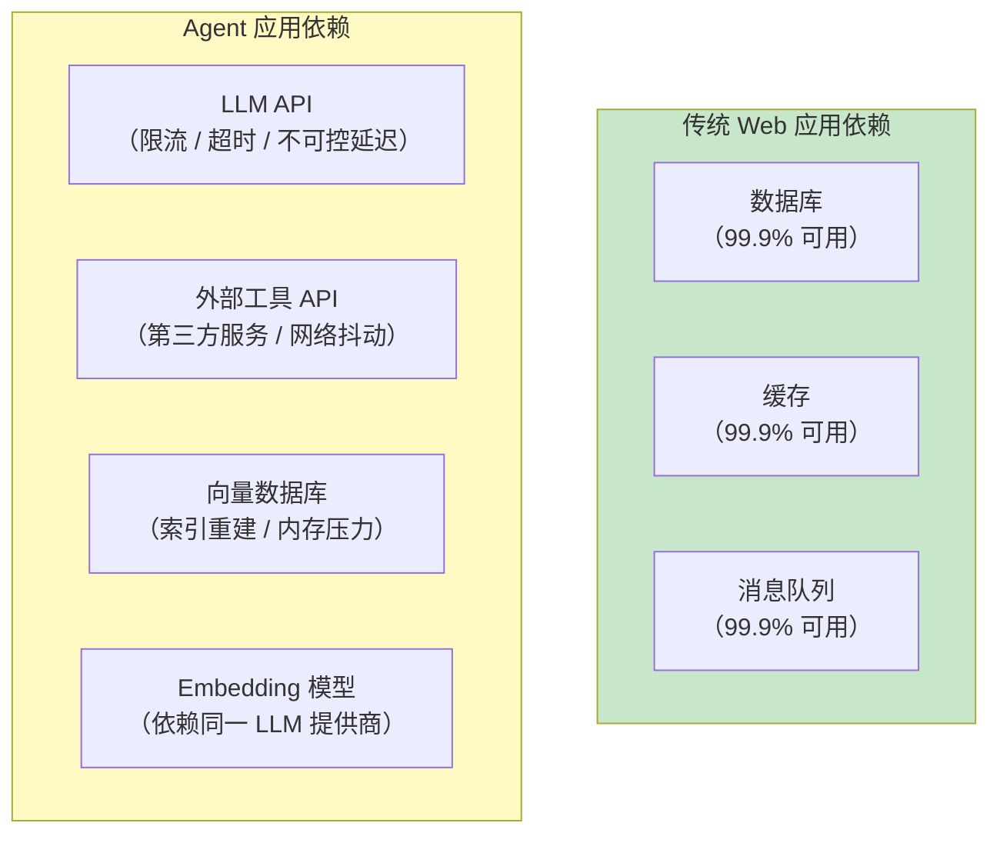
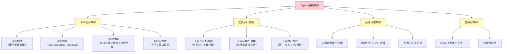
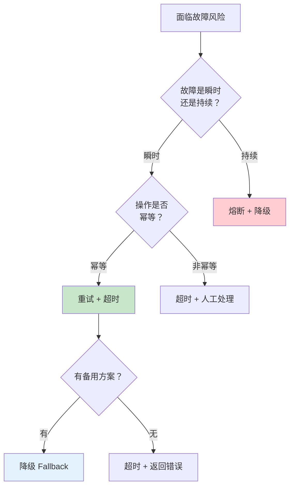
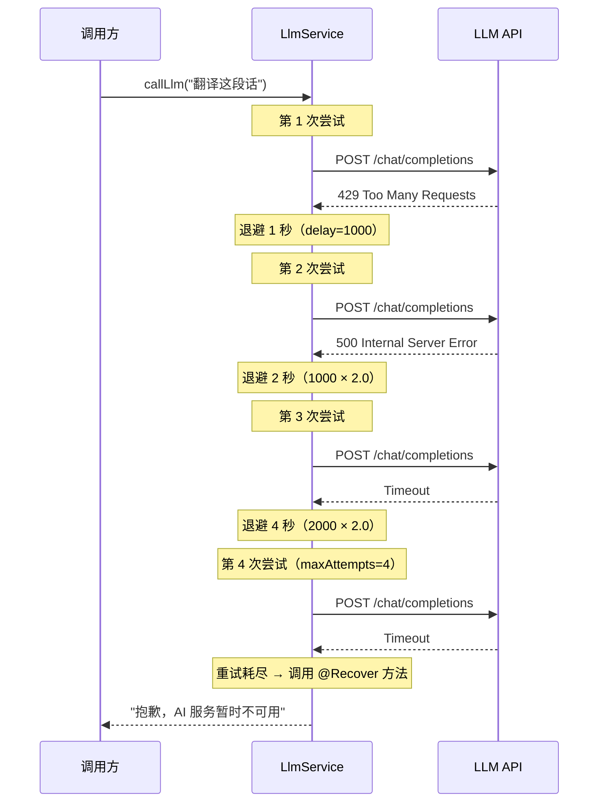
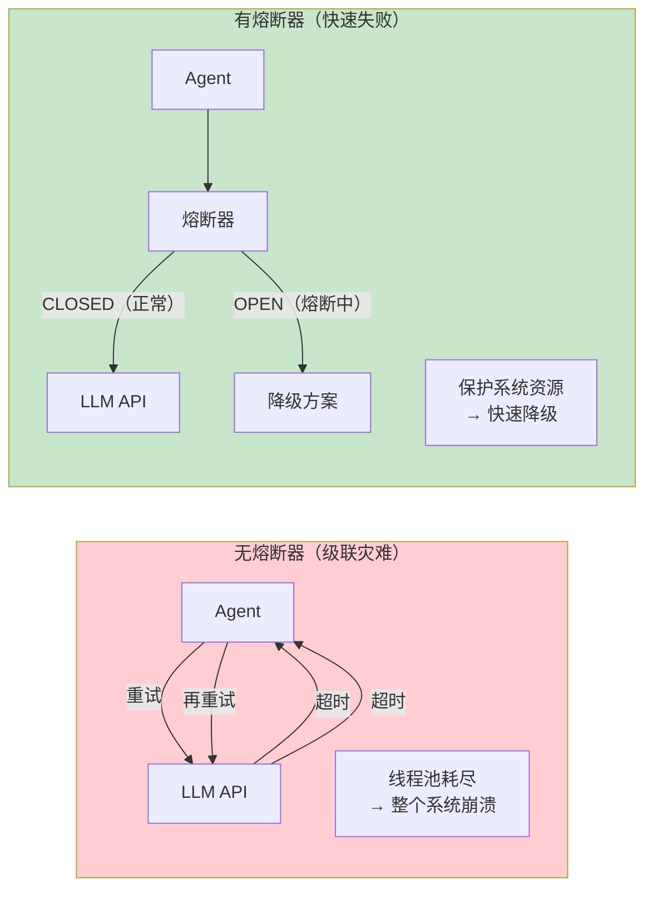
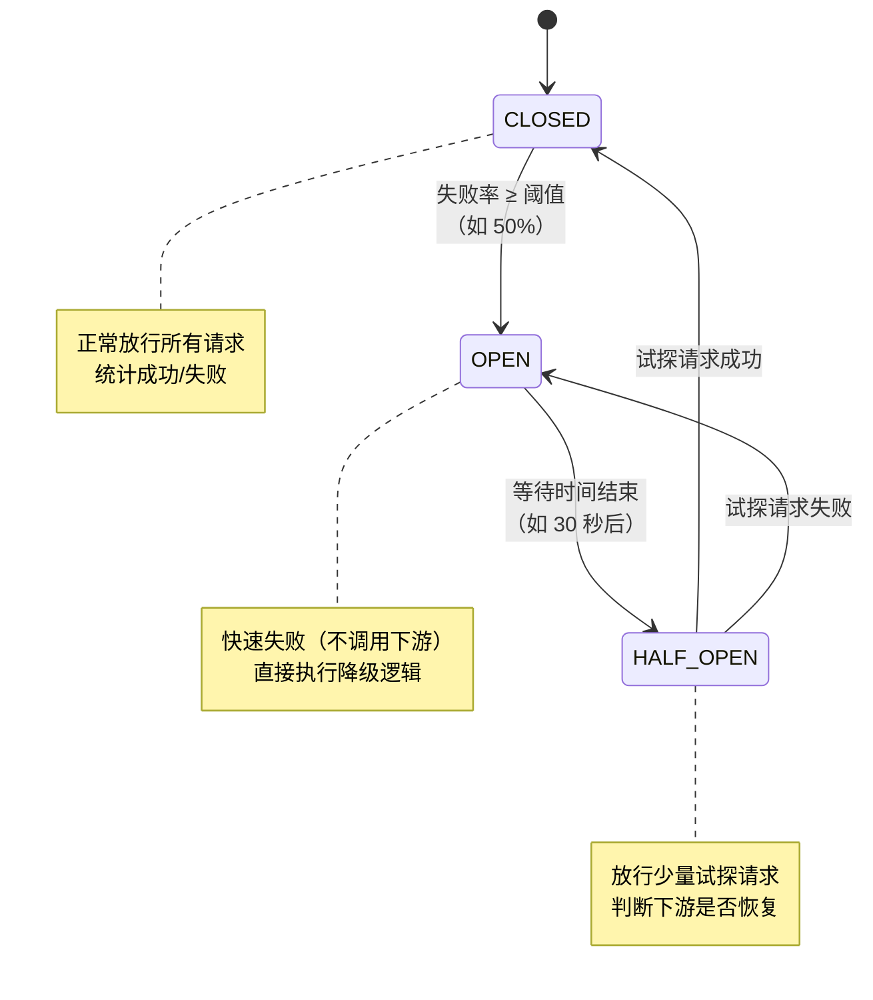
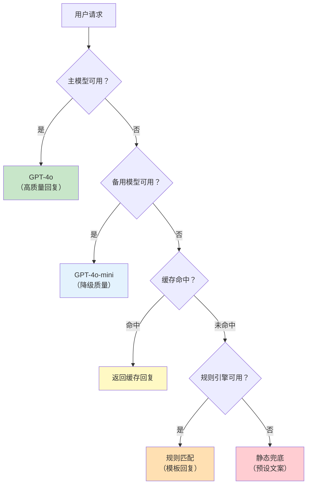
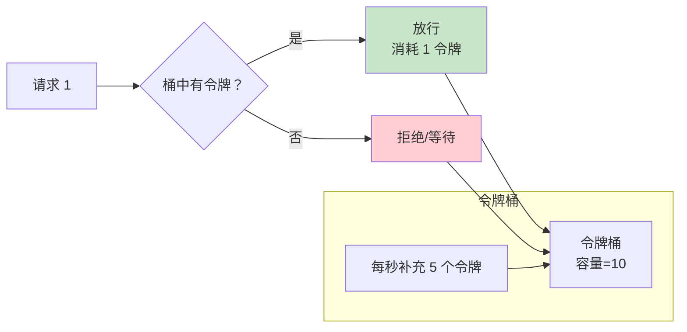
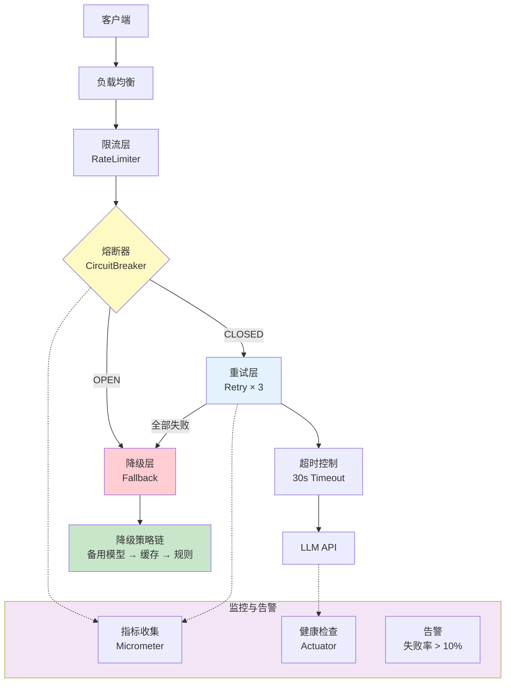

# 30-容错与弹性设计

> **定位**：讲透 Agent 系统的容错与弹性设计——从故障分类到容错策略选择，再到 Spring Retry + Resilience4j 集成和 WebFlux 响应式错误处理。读完这篇，你的 Agent 在 LLM 超时、工具失败、向量数据库不可用时仍能优雅运行。
>
> **读者画像**：已经掌握 ChatClient、工具调用、RAG，需要让 Agent 在生产环境中稳定可靠。
>
> **前置阅读**：[03-工具调用](03-工具调用.md)、[05-RAG 检索增强生成](05-RAG检索增强生成.md)。

---

## 1. Agent 系统为什么需要容错

传统 Web 应用的依赖链通常比较可控——数据库、缓存、消息队列都有成熟的容错方案。Agent 系统完全不同，它的依赖链中增加了多个**高度不可控**的组件：



Agent 调用链中的任何一环都可能失败，而用户期望的是一个**始终可用**的助手。容错设计的核心目标：**在部分组件失败时，系统仍能提供可用服务（可能降级），而不是完全崩溃。**

---

## 2. Agent 系统的故障分类



### 2.1 LLM 相关故障详解

| 故障类型 | 现象 | 根因 |
|---------|------|------|
| **请求超时** | 客户端等待 30 秒后断开 | 模型推理慢、网络延迟、服务端排队 |
| **速率限制** | HTTP 429 + Retry-After 头 | 并发请求超过 API 配额 |
| **服务端错误** | HTTP 500 / 502 / 503 | 模型提供商内部故障 |
| **返回异常** | 返回空内容、格式错误 JSON | 模型幻觉、请求格式不规范 |
| **Token 超限** | HTTP 400 + token 数超限 | 对话历史过长、工具结果过大 |

### 2.2 工具执行故障

工具是 Agent 的"手脚"——手断了不能让 Agent 整个瘫痪：

```java
// 错误做法：工具抛异常，整个调用链中断
@Tool(description = "查询订单")
public Order getOrder(String orderId) {
    return orderRepository.findById(orderId); // 数据库挂了 → 异常 → Agent 崩溃
}

// 正确做法：工具返回错误描述，LLM 可以据此调整策略
@Tool(description = "查询订单")
public Order getOrder(String orderId) {
    try {
        return orderRepository.findById(orderId);
    } catch (Exception e) {
        // 返回描述性错误，LLM 会告知用户或尝试其他方式
        return Order.error("订单服务暂时不可用，请稍后重试");
    }
}
```

---

## 3. 容错策略全景

### 3.1 五大容错策略对比

| 策略 | 核心思想 | 解决什么问题 | 适用场景 | 实现复杂度 |
|------|---------|-------------|---------|-----------|
| **超时 Timeout** | 设定最大等待时间 | 防止无限等待、快速失败 | 所有外部调用 | 低 |
| **重试 Retry** | 失败后自动再次尝试 | 瞬时故障（网络抖动） | 幂等操作 | 低 |
| **降级 Fallback** | 主路径失败用备用方案 | 保证基本可用 | 有备选方案的场景 | 中 |
| **熔断 Circuit Breaker** | 连续失败后停止尝试 | 防止级联故障、保护下游 | 依赖第三方服务 | 高 |
| **限流 Rate Limit** | 控制请求频率 | 防止超过配额、保护系统 | 高并发、有配额限制 | 中 |

### 3.2 策略选择决策



---

## 4. 超时控制：第一道防线

### 4.1 LLM 调用超时

```yaml
# application.yml（配置键为 Spring AI 2.0.0 实证：OpenAiChatProperties / SpringAiRetryProperties）
spring:
  ai:
    openai:
      api-key: ${OPENAI_API_KEY}
      base-url: https://api.openai.com
      timeout: 60s                 # OpenAI SDK 的 HTTP 超时（2.0 客户端基于 OpenAI SDK，非 RestClient）
      chat:
        model: gpt-4o
    retry:
      max-attempts: 3              # 最大重试次数
      backoff:
        initial-interval: 1s       # 初始退避 1 秒
        multiplier: 2              # 退避倍数（javap 实证为 int，不写小数）
        max-interval: 10s          # 最大退避 10 秒
      on-client-errors: false      # 4xx 错误不重试
```

### 4.2 自定义 HTTP 客户端超时

> **注意（Spring AI 2.0）**：2.0 的 OpenAI 客户端基于 OpenAI 官方 Java SDK（非 Spring `RestClient`），其超时由 `spring.ai.openai.timeout` 配置（见 §4.1）。下面的 `RestClient.Builder` 自定义只影响**你自己用 RestClient 编写的工具/服务**（如调用第三方 HTTP API），不会作用于 OpenAI 客户端。属「概念代码，真实 API 见 [附录 05-SpringAI2-API基准]」。

```java
import org.springframework.context.annotation.Bean;
import org.springframework.context.annotation.Configuration;
import org.springframework.http.client.ClientHttpRequestFactory;
import org.springframework.http.client.SimpleClientHttpRequestFactory;
import org.springframework.web.client.RestClient;

@Configuration
public class RestClientConfig {

    @Bean
    public RestClient.Builder restClientBuilder() {
        return RestClient.builder()
                .requestFactory(clientHttpRequestFactory());
    }

    private ClientHttpRequestFactory clientHttpRequestFactory() {
        SimpleClientHttpRequestFactory factory = new SimpleClientHttpRequestFactory();
        factory.setConnectTimeout(5000);   // 连接超时 5 秒
        factory.setReadTimeout(60000);     // 读取超时 60 秒（LLM 推理可能较慢）
        return factory;
    }
}
```

### 4.3 工具执行超时

```java
import java.util.concurrent.TimeUnit;
import java.util.concurrent.TimeoutException;

@Tool(description = "查询外部系统数据")
public String fetchExternalData(@ToolParam(description = "查询关键词") String keyword) {
    try {
        return CompletableFuture.supplyAsync(() -> externalApi.search(keyword))
                .get(10, TimeUnit.SECONDS);  // 最多等 10 秒
    } catch (TimeoutException e) {
        return "查询超时，请稍后重试";
    } catch (Exception e) {
        return "查询失败：" + e.getMessage();
    }
}
```

---

## 5. 重试机制：Spring Retry 集成

### 5.1 添加依赖

> **需在 pom.xml 中添加依赖**。`@Retryable`/`@Recover` 来自 Spring Retry；`TransientAiException`/`NonTransientAiException`/`RetryUtils` 由 `spring-ai-retry` 提供（javap 实证），版本走 `spring-ai-bom`，不写 `<version>`：

```xml
<!-- pom.xml -->
<dependency>
    <groupId>org.springframework.retry</groupId>
    <artifactId>spring-retry</artifactId>
</dependency>
<dependency>
    <groupId>org.springframework</groupId>
    <artifactId>spring-aspects</artifactId>
</dependency>
<dependency>
    <groupId>org.springframework.ai</groupId>
    <artifactId>spring-ai-retry</artifactId>
</dependency>
```

### 5.2 启用 Spring Retry

```java
import org.springframework.retry.annotation.EnableRetry;
import org.springframework.context.annotation.Configuration;

@Configuration
@EnableRetry
public class RetryConfig {
}
```

### 5.3 声明式重试

```java
import java.util.concurrent.TimeoutException;

import org.springframework.ai.chat.client.ChatClient;
import org.springframework.ai.retry.TransientAiException;   // spring-ai-retry 提供（javap 实证）
import org.springframework.retry.annotation.Backoff;
import org.springframework.retry.annotation.Recover;
import org.springframework.retry.annotation.Retryable;

@Service
public class LlmService {

    private final ChatClient chatClient;

    public LlmService(ChatClient chatClient) {
        this.chatClient = chatClient;
    }

    /**
     * 重试策略：
     * - 最多重试 3 次
     * - 初始退避 1 秒，倍数 2，最大退避 10 秒
     * - 只在指定异常时重试（TransientAiException 为 spring-ai-retry 的瞬时异常基类；
     *   若还要兜住 TimeoutException，需另配 @Recover 或在其到达前统一转为 TransientAiException）
     */
    @Retryable(
        retryFor = {TransientAiException.class, TimeoutException.class},
        maxAttempts = 4,               // 初始调用 + 3 次重试
        backoff = @Backoff(
            delay = 1000,
            multiplier = 2.0,
            maxDelay = 10000
        )
    )
    public String callLlm(String prompt) {
        // 调用 LLM，可能抛出超时或限流异常
        return chatClient.prompt()
                .user(prompt)
                .call()
                .content();
    }

    /**
     * 所有重试耗尽后的兜底处理
     * 方法签名必须与 @Retryable 方法一致（参数 + 返回类型）
     */
    @Recover
    public String recoverCallLlm(TransientAiException e, String prompt) {
        return "抱歉，AI 服务暂时不可用，请稍后再试。";
    }
}
```

### 5.4 重试策略深度解析



> **最佳实践**：重试只对**瞬时故障**（网络抖动、临时限流）有效。对于持续性故障（认证失败、参数错误），重试只是浪费时间。用 `noRetryFor` 排除不可重试的异常。

---

## 6. 熔断器：Resilience4j 集成

### 6.1 为什么需要熔断

重试解决瞬时故障，但当下游服务持续不可用时，不断重试只会让情况更糟：



### 6.2 添加 Resilience4j 依赖

```xml
<!-- pom.xml -->
<dependency>
    <groupId>io.github.resilience4j</groupId>
    <artifactId>resilience4j-spring-boot3</artifactId>
    <version>2.2.0</version>
</dependency>
<dependency>
    <groupId>io.github.resilience4j</groupId>
    <artifactId>resilience4j-reactor</artifactId>
    <version>2.2.0</version>
</dependency>
```

### 6.3 熔断器配置

```yaml
# application.yml
resilience4j:
  circuitbreaker:
    instances:
      llm-circuit:
        register-health-indicator: true
        sliding-window-size: 10               # 滑动窗口大小（最近 10 次请求）
        minimum-number-of-calls: 5             # 至少 5 次请求后才开始计算
        failure-rate-threshold: 50             # 失败率阈值 50%
        wait-duration-in-open-state: 30s       # 熔断后等待 30 秒再尝试
        permitted-number-of-calls-in-half-open-state: 3  # 半开状态允许 3 次试探
        automatic-transition-from-open-to-half-open-enabled: true
        record-exceptions:
          - java.net.SocketTimeoutException
          - org.springframework.web.client.HttpServerErrorException
      tool-circuit:
        sliding-window-size: 20
        failure-rate-threshold: 60
        wait-duration-in-open-state: 10s
  ratelimiter:
    instances:
      llm-rate-limiter:
        limit-for-period: 10                   # 每个周期最多 10 次请求
        limit-refresh-period: 1s              # 每秒刷新
        timeout-duration: 5s                   # 超过限额时最多等 5 秒
```

### 6.4 熔断器的三种状态



### 6.5 声明式熔断 + 降级

```java
import io.github.resilience4j.circuitbreaker.annotation.CircuitBreaker;
import io.github.resilience4j.ratelimiter.annotation.RateLimiter;

@Service
public class ResilientLlmService {

    /**
     * 熔断 + 降级：当 LLM 持续失败时，自动切换到降级方案
     */
    @CircuitBreaker(name = "llm-circuit", fallbackMethod = "fallbackGenerate")
    @RateLimiter(name = "llm-rate-limiter")
    public String generate(String prompt) {
        return chatClient.prompt()
                .user(prompt)
                .call()
                .content();
    }

    /**
     * 降级方法：签名必须与原方法一致，额外加一个 Throwable 参数
     */
    private String fallbackGenerate(String prompt, Exception e) {
        // 降级策略 1：返回预设模板
        // 降级策略 2：使用本地小型模型
        // 降级策略 3：返回友好提示
        return "AI 服务暂时不可用。您可以：\n" +
               "1. 稍后重试\n" +
               "2. 查看常见问题：https://help.example.com\n" +
               "3. 联系客服：400-xxx-xxxx";
    }
}
```

### 6.6 熔断器监控端点

```yaml
# application.yml
management:
  endpoints:
    web:
      exposure:
        include: health,info,circuitbreakers,circuitbreakerevents,ratelimiters
  endpoint:
    health:
      show-details: always
  health:
    circuitbreakers:
      enabled: true
```

访问 `http://localhost:8080/actuator/circuitbreakers` 可以看到各熔断器的实时状态。

---

## 7. WebFlux 响应式错误处理

### 7.1 响应式错误处理算子

Agent 在 WebFlux 响应式模式下，用 Reactor 的错误处理算子实现容错：

```java
import java.time.Duration;
import java.util.concurrent.TimeoutException;

import org.slf4j.Logger;
import org.slf4j.LoggerFactory;
import org.springframework.ai.chat.client.ChatClient;
import org.springframework.web.bind.annotation.GetMapping;
import org.springframework.web.bind.annotation.RequestMapping;
import org.springframework.web.bind.annotation.RequestParam;
import org.springframework.web.bind.annotation.RestController;

import reactor.core.publisher.Mono;
import reactor.core.scheduler.Schedulers;

@RestController
@RequestMapping("/api/chat")
public class ReactiveChatController {

    private static final Logger log = LoggerFactory.getLogger(ReactiveChatController.class);

    private final ChatClient chatClient;
    private final FallbackService fallbackService;

    public ReactiveChatController(ChatClient chatClient, FallbackService fallbackService) {
        this.chatClient = chatClient;
        this.fallbackService = fallbackService;
    }

    /**
     * onErrorResume：发生错误时切换到备用流
     */
    @GetMapping("/safe")
    public Mono<String> chatSafe(@RequestParam String message) {
        return Mono.fromCallable(() -> chatClient.prompt()
                        .user(message)
                        .call()
                        .content())
                // WebFlux 铁律：阻塞式调用不能跑在 EventLoop 上，必须切换调度器
                .subscribeOn(Schedulers.boundedElastic())
                // 当上游发生任何错误，切换到降级服务
                .onErrorResume(e -> {
                    log.warn("LLM 调用失败，切换降级", e);
                    return Mono.just(fallbackService.getTemplateResponse(message));
                });
    }

    /**
     * retryWhen：条件重试（指数退避）
     */
    @GetMapping("/retry")
    public Mono<String> chatWithRetry(@RequestParam String message) {
        return Mono.fromCallable(() -> chatClient.prompt()
                        .user(message)
                        .call()
                        .content())
                .subscribeOn(Schedulers.boundedElastic())
                .retryWhen(reactor.util.retry.Retry
                        .backoff(3, Duration.ofSeconds(1))    // 最多 3 次，初始 1 秒
                        .maxBackoff(Duration.ofSeconds(10))    // 最大退避 10 秒
                        .jitter(0.5)                           // 添加抖动，避免惊群
                        .filter(throwable -> isRetryable(throwable)))  // 只重试可恢复错误
                .onErrorResume(e -> Mono.just("服务暂时不可用，请稍后重试"));
    }

    /**
     * timeout：响应式超时控制
     */
    @GetMapping("/timeout")
    public Mono<String> chatWithTimeout(@RequestParam String message) {
        return Mono.fromCallable(() -> chatClient.prompt()
                        .user(message)
                        .call()
                        .content())
                .subscribeOn(Schedulers.boundedElastic())
                .timeout(Duration.ofSeconds(30))               // 30 秒超时
                .onErrorResume(TimeoutException.class,
                        e -> Mono.just("AI 响应超时，请稍后重试"));
    }

    private boolean isRetryable(Throwable t) {
        return t instanceof TimeoutException
                || t instanceof org.springframework.web.client.HttpServerErrorException;
    }
}
```

### 7.2 全局错误处理

```java
import java.util.concurrent.TimeoutException;

import org.slf4j.Logger;
import org.slf4j.LoggerFactory;
import org.springframework.http.ResponseEntity;
import org.springframework.web.bind.annotation.ControllerAdvice;
import org.springframework.web.bind.annotation.ExceptionHandler;

// 以下两个异常来自 resilience4j（§6.2 依赖），javap/官方 API 实证：
// 限流触发抛 RequestNotPermitted（不是自定义的 RateLimitExceededException）
// 熔断打开抛 CircuitBreakerOpenException
import io.github.resilience4j.circuitbreaker.CircuitBreakerOpenException;
import io.github.resilience4j.ratelimiter.RequestNotPermitted;

@ControllerAdvice
public class GlobalErrorHandler {

    private static final Logger log = LoggerFactory.getLogger(GlobalErrorHandler.class);

    /**
     * LLM 超时
     */
    @ExceptionHandler(TimeoutException.class)
    public ResponseEntity<ErrorResponse> handleTimeout(TimeoutException e) {
        return ResponseEntity.status(504)
                .body(new ErrorResponse("AI_TIMEOUT", "AI 响应超时，请稍后重试"));
    }

    /**
     * 速率限制（Resilience4j RateLimiter 抛 RequestNotPermitted）
     */
    @ExceptionHandler(RequestNotPermitted.class)
    public ResponseEntity<ErrorResponse> handleRateLimit(RequestNotPermitted e) {
        return ResponseEntity.status(429)
                .header("Retry-After", "5")
                .body(new ErrorResponse("RATE_LIMITED", "请求过于频繁，请 5 秒后重试"));
    }

    /**
     * 熔断器打开
     */
    @ExceptionHandler(CircuitBreakerOpenException.class)
    public ResponseEntity<ErrorResponse> handleCircuitOpen(CircuitBreakerOpenException e) {
        return ResponseEntity.status(503)
                .body(new ErrorResponse("SERVICE_DEGRADED", "AI 服务降级中，请稍后重试"));
    }

    /**
     * 兜底：所有未处理的异常
     */
    @ExceptionHandler(Exception.class)
    public ResponseEntity<ErrorResponse> handleGeneric(Exception e) {
        log.error("未处理异常", e);
        return ResponseEntity.status(500)
                .body(new ErrorResponse("INTERNAL_ERROR", "系统内部错误"));
    }

    public record ErrorResponse(String code, String message) {}
}
```

### 7.3 SSE 流式输出的错误处理

流式输出中，错误可能在流的中间发生——此时 HTTP 头已经发送（200 OK），不能改状态码了：

```java
import org.springframework.http.MediaType;
import org.springframework.web.bind.annotation.GetMapping;
import org.springframework.web.bind.annotation.RequestParam;

import reactor.core.publisher.Flux;
import reactor.core.publisher.Mono;

@GetMapping(value = "/stream", produces = MediaType.TEXT_EVENT_STREAM_VALUE)
public Flux<String> streamChat(@RequestParam String message) {
    return chatClient.prompt()
            .user(message)
            .stream()
            .content()
            // 流中间出错：发送一个错误事件，然后优雅关闭
            .onErrorResume(e -> Flux.just(
                    "\n[ERROR] AI 服务出现异常，请重新发送消息。"
            ))
            // 流结束后发送结束标记
            .concatWith(Mono.just("[DONE]"));
}
```

---

## 8. 降级策略体系设计

### 8.1 多级降级链



### 8.2 降级链实现

```java
import org.springframework.ai.chat.client.ChatClient;
import org.springframework.stereotype.Service;

@Service
public class GracefulDegradationService {

    private final ChatClient primaryClient;    // GPT-4o
    private final ChatClient secondaryClient;  // GPT-4o-mini
    private final CacheService cacheService;
    private final RuleEngine ruleEngine;

    public GracefulDegradationService(ChatClient primaryClient, ChatClient secondaryClient,
                                      CacheService cacheService, RuleEngine ruleEngine) {
        this.primaryClient = primaryClient;
        this.secondaryClient = secondaryClient;
        this.cacheService = cacheService;
        this.ruleEngine = ruleEngine;
    }

    public String generate(String prompt) {
        // 第一级：主模型
        try {
            return primaryClient.prompt()
                    .user(prompt)
                    .call()
                    .content();
        } catch (Exception e) {
            log.warn("主模型失败，尝试降级", e);
        }

        // 第二级：备用模型
        try {
            return secondaryClient.prompt()
                    .user(prompt)
                    .call()
                    .content();
        } catch (Exception e) {
            log.warn("备用模型失败，尝试缓存", e);
        }

        // 第三级：缓存
        String cached = cacheService.get(prompt);
        if (cached != null) {
            return cached;
        }

        // 第四级：规则引擎
        String ruleResult = ruleEngine.match(prompt);
        if (ruleResult != null) {
            return ruleResult;
        }

        // 第五级：静态兜底
        return "抱歉，AI 服务暂时不可用。请稍后重试或联系客服。";
    }
}
```

---

## 9. 工具容错模式

### 9.1 工具容错装饰器

```java
import java.time.Duration;
import java.util.concurrent.CompletableFuture;
import java.util.function.Supplier;

import org.slf4j.Logger;
import org.slf4j.LoggerFactory;
import org.springframework.stereotype.Component;

import io.github.resilience4j.circuitbreaker.CircuitBreaker;
import io.github.resilience4j.circuitbreaker.CircuitBreakerRegistry;
import io.github.resilience4j.decorators.Decorators;
import io.github.resilience4j.retry.Retry;
import io.github.resilience4j.retry.RetryConfig;
import io.github.resilience4j.timelimiter.TimeLimiter;

/**
 * 为任意工具包装容错能力（Resilience4j 装饰器，依赖见 §6.2）
 */
@Component
public class ToolExecutor {

    private static final Logger log = LoggerFactory.getLogger(ToolExecutor.class);

    private final CircuitBreaker circuitBreaker;
    private final TimeLimiter timeLimiter;

    public ToolExecutor(CircuitBreakerRegistry registry) {
        this.circuitBreaker = registry.circuitBreaker("tool-circuit");
        this.timeLimiter = TimeLimiter.of(Duration.ofSeconds(15));
    }

    public String executeWithResilience(String toolName, Supplier<String> action) {
        Supplier<String> decorated = Decorators.ofSupplier(action)
                .withCircuitBreaker(circuitBreaker)
                .withRetry(Retry.of(toolName, RetryConfig.custom()
                        .maxAttempts(2)
                        .build()))
                .decorate();

        try {
            return timeLimiter.executeFutureSupplier(
                    () -> CompletableFuture.supplyAsync(decorated));
        } catch (Exception e) {
            log.error("工具 {} 执行失败", toolName, e);
            return "工具 " + toolName + " 执行失败：" + e.getMessage();
        }
    }
}

// 使用
@Tool(description = "查询库存")
public String checkInventory(String productId) {
    return toolExecutor.executeWithResilience("checkInventory",
            () -> inventoryService.check(productId));
}
```

### 9.2 工具降级策略

| 工具类型 | 降级策略 | 示例 |
|---------|---------|------|
| **只读查询** | 返回缓存数据 | 订单查询：返回最近一次缓存结果 |
| **只读查询** | 返回空结果 + 提示 | 搜索工具：返回"搜索功能暂时不可用" |
| **写操作** | 排队稍后执行 | 发邮件：存入消息队列，稍后重试 |
| **写操作** | 拒绝执行 | 转账：返回"系统繁忙，请稍后操作" |

---

## 10. 向量数据库容错

### 10.1 RAG 降级：检索失败时回退到无 RAG 模式

```java
import org.springframework.ai.chat.client.ChatClient;
import org.springframework.ai.chat.client.advisor.vectorstore.QuestionAnswerAdvisor;
import org.springframework.ai.vectorstore.VectorStore;
import org.springframework.stereotype.Service;

@Service
public class ResilientRagService {

    private final ChatClient clientWithRag;
    private final ChatClient clientWithoutRag;
    private final VectorStore vectorStore;

    public ResilientRagService(ChatClient.Builder builder, VectorStore vectorStore) {
        this.vectorStore = vectorStore;
        this.clientWithRag = builder
                .defaultAdvisors(QuestionAnswerAdvisor.builder(vectorStore).build())
                .build();
        this.clientWithoutRag = builder.build();
    }

    public String answer(String question) {
        try {
            // 先尝试 RAG 增强回复
            return clientWithRag.prompt()
                    .user(question)
                    .call()
                    .content();
        } catch (Exception e) {
            log.warn("向量检索失败，降级为无 RAG 模式", e);
            // 降级：不做检索，直接用 LLM 回复
            return clientWithoutRag.prompt()
                    .user(question)
                    .call()
                    .content();
        }
    }
}
```
> **需在 pom.xml 中添加依赖**（`QuestionAnswerAdvisor` 所在模块）：2.0.0 起模块名从 `spring-ai-advisors-vector-store` 改为 `spring-ai-vector-store-advisor`（老坐标已不存在）——版本走 `spring-ai-bom`，不写 `<version>`：
>
> ```xml
> <dependency>
>     <groupId>org.springframework.ai</groupId>
>     <artifactId>spring-ai-vector-store-advisor</artifactId>
> </dependency>
> ```

---

## 11. 限流策略

### 11.1 令牌桶限流



### 11.2 Resilience4j 限流

```java
import org.springframework.ai.chat.client.ChatClient;
import org.springframework.web.bind.annotation.PostMapping;
import org.springframework.web.bind.annotation.RequestBody;
import org.springframework.web.bind.annotation.RestController;

import io.github.resilience4j.ratelimiter.RequestNotPermitted;
import io.github.resilience4j.ratelimiter.annotation.RateLimiter;

@RestController
public class ChatController {

    private final ChatClient chatClient;

    public ChatController(ChatClient chatClient) {
        this.chatClient = chatClient;
    }

    @PostMapping("/chat")
    @RateLimiter(name = "llm-rate-limiter", fallbackMethod = "rateLimitFallback")
    public String chat(@RequestBody ChatRequest request) {
        return chatClient.prompt()
                .user(request.message())
                .call()
                .content();
    }

    public String rateLimitFallback(ChatRequest request, RequestNotPermitted e) {
        return "当前请求过多，请稍后重试。";
    }
}
```

---

## 12. 健康检查与可观测

### 12.1 自定义健康指标

```java
import org.springframework.ai.chat.model.ChatModel;
import org.springframework.boot.actuate.health.Health;
import org.springframework.boot.actuate.health.HealthIndicator;
import org.springframework.stereotype.Component;

@Component
public class LlmHealthIndicator implements HealthIndicator {

    private final ChatModel chatModel;

    public LlmHealthIndicator(ChatModel chatModel) {
        this.chatModel = chatModel;
    }

    @Override
    public Health health() {
        try {
            // 发送一个极简请求检查 LLM 可用性
            String response = chatModel.call("ping");
            return Health.up()
                    .withDetail("provider", "openai")
                    .withDetail("status", "responsive")
                    .build();
        } catch (Exception e) {
            return Health.down()
                    .withDetail("error", e.getMessage())
                    .withDetail("provider", "openai")
                    .build();
        }
    }
}
```

### 12.2 指标埋点

```java
import org.springframework.ai.chat.client.ChatClient;
import org.springframework.stereotype.Component;

import io.micrometer.core.instrument.Counter;
import io.micrometer.core.instrument.MeterRegistry;
import io.micrometer.core.instrument.Timer;

@Component
public class InstrumentedLlmService {

    private final ChatClient chatClient;
    private final Timer llmCallTimer;
    private final Counter llmErrorCounter;

    public InstrumentedLlmService(ChatClient chatClient, MeterRegistry registry) {
        this.chatClient = chatClient;
        this.llmCallTimer = Timer.builder("agent.llm.call.duration")
                .description("LLM 调用耗时")
                .register(registry);
        this.llmErrorCounter = Counter.builder("agent.llm.call.errors")
                .description("LLM 调用错误数")
                .register(registry);
    }

    public String call(String prompt) {
        return llmCallTimer.record(() -> {
            try {
                return chatClient.prompt().user(prompt).call().content();
            } catch (Exception e) {
                llmErrorCounter.increment();
                throw e;
            }
        });
    }
}
```

---

## 13. 完整容错架构



---

## 14. 适用场景与不适用场景

### 适用场景

- 生产环境部署的 Agent 应用（必须有容错能力）
- 依赖第三方 LLM API 的系统（API 可能不可用）
- 高并发场景（需要限流防止超配额）
- 对可用性有 SLA 要求的企业应用
- 涉及金融、医疗等高风险领域的 Agent（需要快速失败 + 人工兜底）

### 不适用场景

- 内部演示 / POC 项目（容错增加了代码复杂度，演示阶段不值得）
- 单机离线工具（无网络依赖，故障概率低）
- 批处理任务（失败可以重来，不需要实时降级）
- 对延迟没有要求的异步任务（等一等就行，不需要复杂的降级链）

---

## 15. 本章总结

| 概念 | 一句话 |
|------|--------|
| **超时 Timeout** | 第一道防线——设定最大等待时间，快速失败不拖垮系统 |
| **重试 Retry** | 对瞬时故障自动重试，配合指数退避避免惊群 |
| **降级 Fallback** | 主路径失败时切换到备用方案，保证基本可用 |
| **熔断 Circuit Breaker** | 下游持续故障时停止调用，保护系统不被级联拖垮 |
| **限流 Rate Limit** | 控制请求频率，防止超过 LLM API 配额 |
| **Spring Retry** | 声明式重试框架，`@Retryable` + `@Recover` |
| **Resilience4j** | 熔断 + 限流 + 重试 + 超时的综合容错库 |
| **onErrorResume** | WebFlux 响应式错误恢复算子，切换到备用流 |
| **retryWhen** | WebFlux 响应式条件重试，支持指数退避 |
| **降级链** | 主模型 → 备用模型 → 缓存 → 规则引擎 → 静态文案 |
| **健康检查** | Actuator + 自定义 HealthIndicator，实时监控依赖状态 |

**下一篇**：[31-安全与权限控制](31-安全与权限控制.md) — Agent 安全三道防线、Prompt 注入防御、工具权限分级。

---

> **想深入？→ [教程 32-模型路由与降级]**：多模型管理和自动降级链的设计。
> **遇到阻塞？→ [教程 33-部署与运维]**：健康检查端点、日志收集在生产环境的实践。
