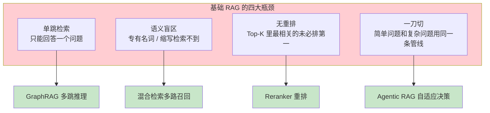
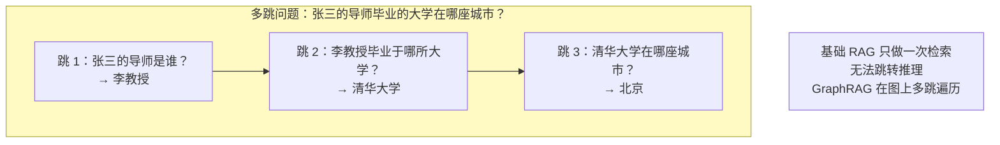
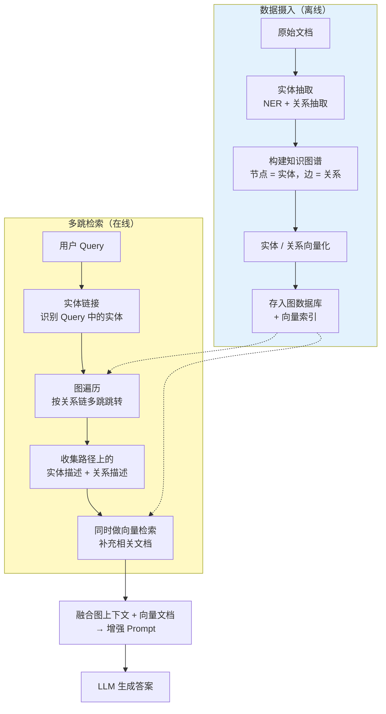
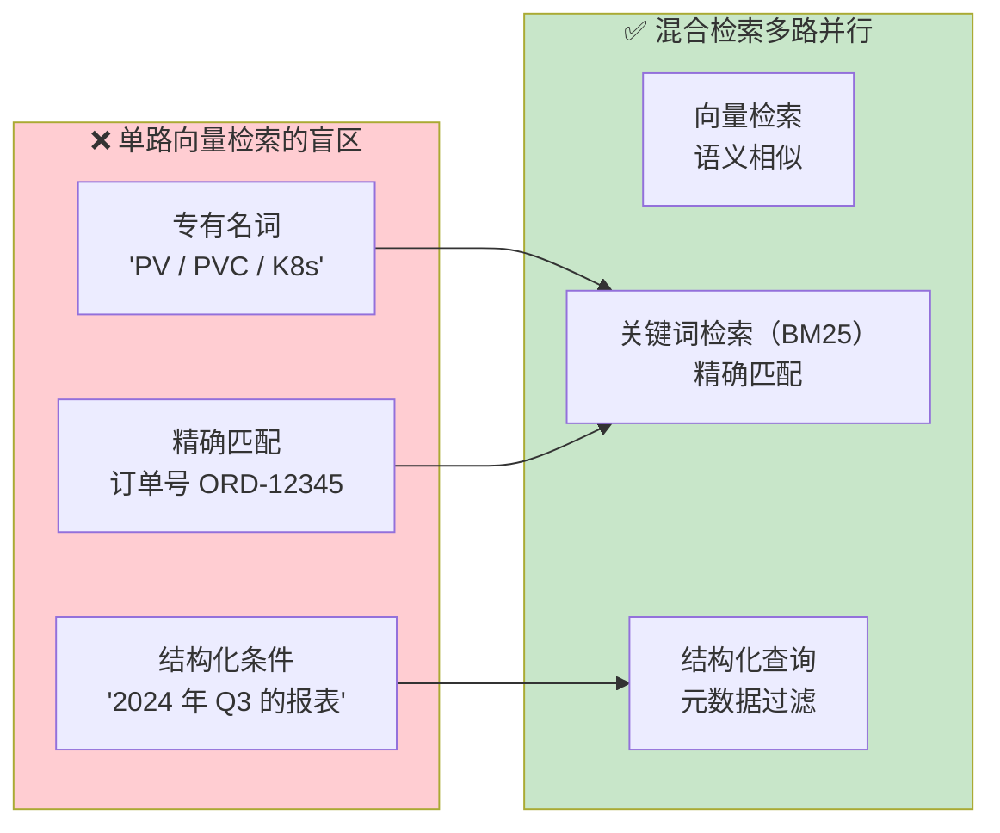
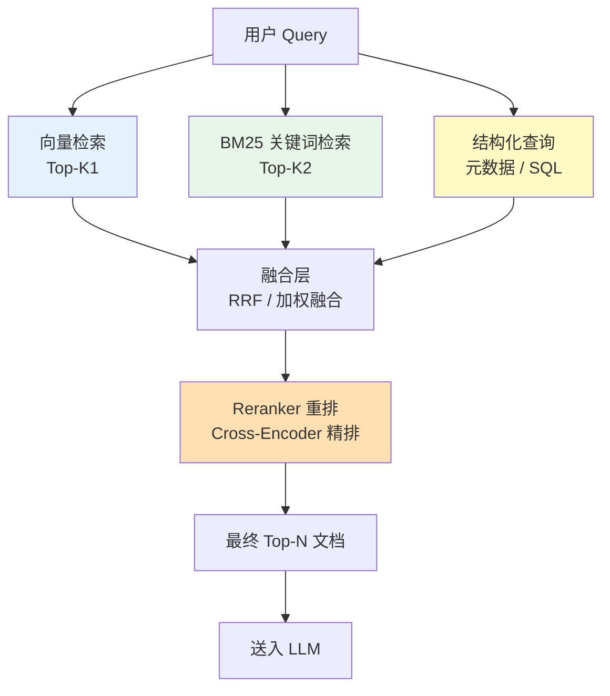
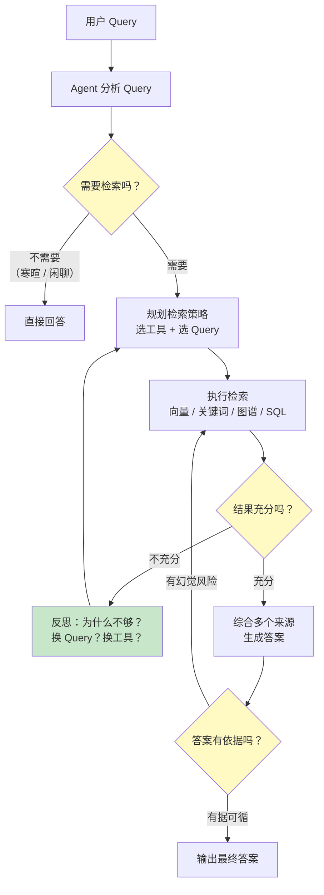
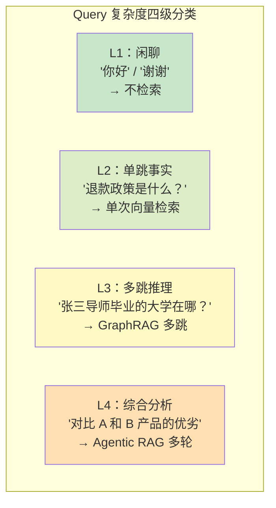
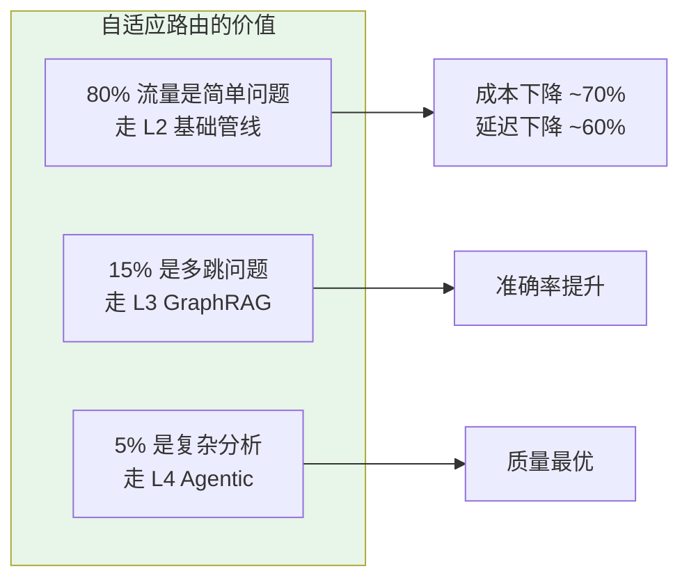
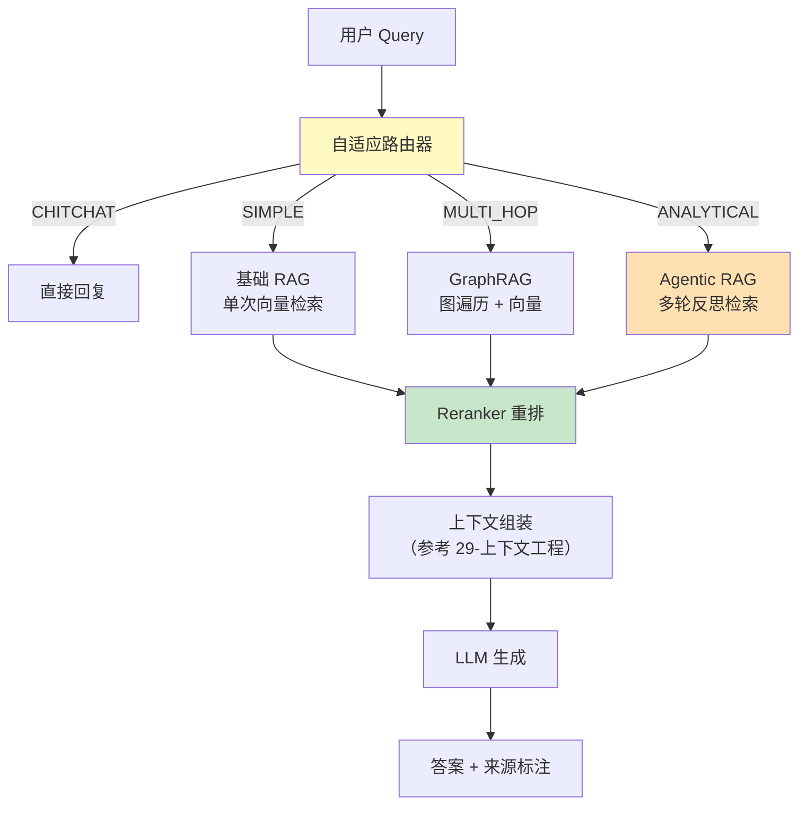
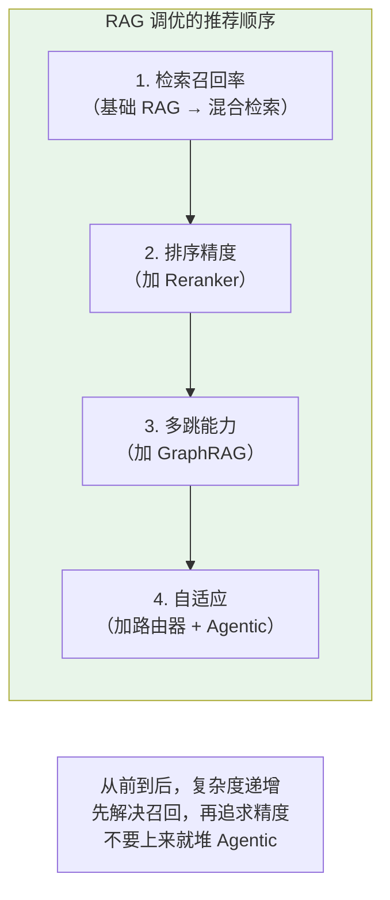

# 30-高级 RAG 与 Agentic RAG

> **定位**：讲透基础 RAG 的天花板在哪里，以及如何突破——GraphRAG 用知识图谱做多跳推理、Agentic RAG 让 Agent 自主决策检索策略、混合检索多路召回 + 重排、自适应检索按 Query 复杂度动态选深度。读完这篇，你能把 RAG 从"塞文档"升级到"像专家一样查资料"。
>
> **读者画像**：已经掌握 [05-基础 RAG](05-RAG检索增强生成.md) 的 ETL + 向量检索 + QuestionAnswerAdvisor，需要解决"检索不准""多跳问题答不出""简单问题太重"等进阶问题的资深开发者。
>
> **前置阅读**：[05-RAG 检索增强生成](05-RAG检索增强生成.md)、[29-上下文工程](29-上下文工程.md)。

---

## 1. 基础 RAG 的天花板

[05 章](05-RAG检索增强生成.md)讲的 RAG 是一条直线：**Embedding → 向量搜索 → 拼 Prompt → LLM 回答**。这在简单 FAQ 场景下够用，但在真实企业场景中会遇到四类硬伤。



### 1.1 四类硬伤的具体表现

| 硬伤 | 示例问题 | 为什么基础 RAG 答不出 |
|------|---------|---------------------|
| **多跳推理** | "张三的导师毕业的大学在哪座城市？" | 需要查"张三的导师是谁"→"此人毕业于哪所大学"→"大学所在城市"，三次检索 |
| **专有名词** | "K8s 的 PV 怎么配？" | 文档里写的是"PersistentVolume"，Embedding 可能检索不到 |
| **排序不准** | 文档 A 比 B 更相关，但 B 的向量距离更近 | Embedding 模型本身的能力上限 |
| **过度工程** | "你好"也走完整 RAG 管线 | 简单寒暄应该直接回复，浪费 Token 和延迟 |

---

## 2. GraphRAG：知识图谱驱动的多跳推理

### 2.1 为什么需要 GraphRAG



向量检索是"平面"的——它找语义相近的文档，但**不知道实体之间的关系**。GraphRAG 在向量库之上加一层**知识图谱**，显式建模"人—毕业院校—所在城市"这种关系链。

### 2.2 GraphRAG 架构



### 2.3 知识图谱的构建

```java
@Service
public class KnowledgeGraphBuilder {

    private final ChatClient extractor;
    private final GraphRepository graph;

    /**
     * 从文档抽取实体和关系，构建知识图谱
     */
    public void buildFromDocument(Document doc) {
        String text = doc.getText();

        // 用 LLM 抽取三元组（头实体, 关系, 尾实体）
        String schema = """
            抽取以下内容中的实体和关系，输出 JSON 数组：
            [{"head": "张三", "relation": "导师是", "tail": "李教授"},
             {"head": "李教授", "relation": "毕业于", "tail": "清华大学"}]
            """;

        String json = extractor.prompt()
            .system(schema)
            .user(text)
            .call()
            .content();

        List<Triple> triples = parseTriples(json);

        // 写入图数据库（如 Neo4j）
        for (Triple t : triples) {
            graph.mergeNode(t.head());
            graph.mergeNode(t.tail());
            graph.mergeRelationship(t.head(), t.relation(), t.tail());
        }
    }
}
```

### 2.4 多跳检索实现

```java
@Service
public class GraphRagRetriever {

    private final GraphRepository graph;
    private final VectorStore vectorStore;
    private final ChatClient planner;

    public RetrievalResult retrieve(String query) {
        // 1. 实体链接：识别 Query 中的实体
        List<String> entities = planner.prompt()
            .system("从用户问题中提取关键实体，输出逗号分隔列表。")
            .user(query)
            .call()
            .content()
            .lines();

        // 2. 图遍历：从实体出发多跳查找关联节点
        List<GraphNode> graphContext = new ArrayList<>();
        for (String entity : entities) {
            graphContext.addAll(graph.findRelated(entity, maxHops=3));
        }

        // 3. 向量检索：补充语义相关文档
        List<Document> vectorContext = vectorStore.similaritySearch(
            SearchRequest.builder().query(query).topK(5).build()
        );

        // 4. 融合两类上下文
        return new RetrievalResult(graphContext, vectorContext);
    }
}
```

### 2.5 GraphRAG 适用边界

| 场景 | 是否推荐 GraphRAG | 原因 |
|------|-----------------|------|
| 多跳关系推理（组织架构、知识图谱问答） | ✅ 强烈推荐 | 图遍历天然适合 |
| 单跳 FAQ | ❌ 不推荐 | 基础 RAG 更简单高效 |
| 强结构化查询（如 SQL 类） | ⚠️ 可考虑 | 图谱 vs SQL 需权衡 |
| 实体关系稀疏的领域 | ❌ 不推荐 | 图谱构建成本高但收益低 |

> **成本提示**：构建知识图谱需要大量 LLM 调用做实体抽取，建议**离线批量处理**，并对抽取结果做人工抽检。

---

## 3. 混合检索：多路召回 + 重排

### 3.1 为什么单一向量检索不够



### 3.2 混合检索架构



### 3.3 RRF 融合算法

**Reciprocal Rank Fusion（RRF）** 是最常用的多路融合算法——简单且无需调参：

```
score(d) = Σ 1 / (k + rank_i(d))
```

其中 `rank_i(d)` 是文档 `d` 在第 `i` 路检索中的排名，`k` 通常取 60。

```java
public class RRFEnsemble {

    private static final int K = 60;

    /**
     * @param rankedLists 多路检索结果，每路已按相关性排序
     * @return 融合后的全局排序
     */
    public List<Document> fuse(List<List<Document>> rankedLists, int topN) {
        Map<String, Double> scores = new HashMap<>();

        for (List<Document> ranked : rankedLists) {
            for (int rank = 0; rank < ranked.size(); rank++) {
                String id = ranked.get(rank).getId();
                scores.merge(id, 1.0 / (K + rank + 1), Double::sum);
            }
        }

        // 按融合分数取 Top-N
        return scores.entrySet().stream()
            .sorted(Map.Entry.<String, Double>comparingByValue().reversed())
            .limit(topN)
            .map(e -> findById(rankedLists, e.getKey()))
            .toList();
    }
}
```

### 3.4 Reranker 重排

向量检索用的是 **Bi-Encoder**（Query 和 Doc 独立编码），速度快但精度有限。Reranker 用 **Cross-Encoder**（Query 和 Doc 拼接后联合编码），精度高但慢。

策略是：**先粗筛，后精排**。

```java
public class HybridRetriever {

    private final VectorStore vectorStore;
    private final KeywordIndex keywordIndex;
    private final RerankerModel reranker;  // Cross-Encoder
    private final RRFEnsemble ensemble;

    public List<Document> retrieve(String query, int finalTopK) {
        // 1. 多路召回（每路多召回一些，给 Reranker 留余量）
        int candidateK = finalTopK * 4;
        List<Document> vecHits = vectorStore.similaritySearch(
            SearchRequest.builder().query(query).topK(candidateK).build());
        List<Document> kwHits = keywordIndex.search(query, candidateK);

        // 2. RRF 融合
        List<Document> fused = ensemble.fuse(List.of(vecHits, kwHits), candidateK);

        // 3. Reranker 精排
        return reranker.rerank(query, fused, finalTopK);
    }
}
```

| 模型类型 | 速度 | 精度 | 适用阶段 |
|---------|------|------|---------|
| Bi-Encoder（向量） | 极快 | 中 | 召回（粗筛） |
| BM25（关键词） | 极快 | 中（精确匹配强） | 召回（粗筛） |
| Cross-Encoder（Reranker） | 慢 | 高 | 重排（精排） |

> **性能权衡**：Reranker 调用有延迟成本。建议在向量召回阶段拉大 topK（如 20），Reranker 精排后取 3-5 条送入 LLM。

---

## 4. Agentic RAG：Agent 自主决策检索

### 4.1 从"被动检索"到"主动检索"

基础 RAG 是**被动**的——不管问什么，都走同一条检索管线。Agentic RAG 让 Agent **主动决策**：

- 要不要检索？（寒暄就别检索了）
- 检索几次？（一次不够就再来）
- 用什么工具检索？（向量库 / SQL / Web 搜索）
- 检索结果够不够？（不够就换个 Query 重试）

### 4.2 Agentic RAG 决策流程



### 4.3 用 Spring AI 实现 Agentic RAG

把检索能力封装为工具，让 Agent 自主决定何时调用、调用几次。

```java
@Configuration
public class AgenticRagTools {

    @Bean
    @Tool(description = "在企业知识库中搜索相关信息。当需要查找公司文档、产品手册、政策文件时使用。")
    public KnowledgeSearchTool knowledgeSearchTool(VectorStore vectorStore) {
        return new KnowledgeSearchTool(vectorStore);
    }

    @Bean
    @Tool(description = "在知识图谱中查找实体关系。当问题涉及人物关系、组织架构、多跳推理时使用。")
    public GraphSearchTool graphSearchTool(GraphRepository graph) {
        return new GraphSearchTool(graph);
    }

    @Bean
    @Tool(description = "查询结构化业务数据。当需要精确数据（订单、库存、统计）时使用。")
    public SqlQueryTool sqlQueryTool(JdbcTemplate jdbc) {
        return new SqlQueryTool(jdbc);
    }
}

// Agent 通过 ReAct 循环自主选择工具
ChatClient agent = ChatClient.builder(chatModel)
    .defaultSystem("""
        你是一个研究型 Agent。面对用户问题：
        1. 先分析需要哪些信息
        2. 选择合适的检索工具（可多次调用）
        3. 评估检索结果是否充分，不充分则调整策略重试
        4. 综合所有来源给出有依据的答案
        """)
    .defaultTools(knowledgeSearchTool, graphSearchTool, sqlQueryTool)
    .build();
```

### 4.4 Agentic RAG 的反思机制

```java
@Service
public class AgenticRagService {

    private static final int MAX_ITERATIONS = 4;

    public String answer(String question) {
        List<String> gatheredContext = new ArrayList();
        String currentQuery = question;

        for (int i = 0; i < MAX_ITERATIONS; i++) {
            // 1. 检索
            List<Document> hits = hybridRetriever.retrieve(currentQuery, 5);
            gatheredContext.addAll(hits.stream().map(Document::getText).toList());

            // 2. Agent 自评：信息够不够？
            String evaluation = planner.prompt()
                .system("""
                    评估当前已收集的信息能否回答用户问题。
                    输出 JSON：{"sufficient": true/false, "gap": "缺少的信息描述"}
                    """)
                .user("问题：" + question + "\n已有信息：" + String.join("\n", gatheredContext))
                .call()
                .content();

            if (parseSufficient(evaluation)) {
                break;  // 信息够了，退出循环
            }

            // 3. 反思：生成新的检索 Query
            String gap = parseGap(evaluation);
            currentQuery = planner.prompt()
                .system("基于信息缺口，生成一个新的检索 Query 来补充缺失信息。")
                .user("缺口：" + gap)
                .call()
                .content();
        }

        // 4. 综合生成最终答案
        return synthesizer.prompt()
            .system("基于以下信息回答问题，标注每句的来源。信息不足时诚实说明。")
            .user("问题：" + question + "\n信息：" + String.join("\n---\n", gatheredContext))
            .call()
            .content();
    }
}
```

### 4.5 Agentic RAG vs 基础 RAG

| 维度 | 基础 RAG | Agentic RAG |
|------|---------|-------------|
| 检索次数 | 固定 1 次 | 动态（1-4 次） |
| 工具选择 | 固定向量库 | Agent 自主选择 |
| Query 优化 | 无 | 基于反思重写 |
| 延迟 | 低（几百毫秒） | 高（几秒） |
| 成本 | 低 | 高（多次 LLM 调用） |
| 准确率 | 中 | 高（复杂问题显著提升） |
| 适用场景 | 简单 FAQ | 复杂研究型问答 |

---

## 5. 自适应检索：按 Query 复杂度选深度

不同问题需要不同的检索深度。**一刀切**要么浪费成本，要么检索不足。

### 5.1 Query 复杂度分级



### 5.2 路由器实现

```java
@Service
public class AdaptiveRouter {

    private final ChatClient classifier;
    private final BasicRagService basicRag;
    private final GraphRagService graphRag;
    private final AgenticRagService agenticRag;

    public String answer(String question) {
        // 1. 分类 Query 复杂度
        QueryComplexity level = classifyComplexity(question);

        // 2. 路由到对应管线
        return switch (level) {
            case CHITCHAT -> directAnswer(question);      // L1：跳过检索
            case SIMPLE -> basicRag.retrieveAndAnswer(question);   // L2：基础 RAG
            case MULTI_HOP -> graphRag.retrieveAndAnswer(question); // L3：GraphRAG
            case ANALYTICAL -> agenticRag.answer(question);        // L4：Agentic RAG
        };
    }

    private QueryComplexity classifyComplexity(String question) {
        String result = classifier.prompt()
            .system("""
                判断问题的复杂度，输出一个词：
                - CHITCHAT：寒暄闲聊
                - SIMPLE：单次检索可回答的事实问题
                - MULTI_HOP：需要多步推理或关系链
                - ANALYTICAL：需要综合多个来源的对比分析
                """)
            .user(question)
            .call()
            .content()
            .trim();
        return QueryComplexity.valueOf(result);
    }

    private enum QueryComplexity {
        CHITCHAT, SIMPLE, MULTI_HOP, ANALYTICAL
    }
}
```

### 5.3 路由的成本收益



| 问题类型 | 占比 | 管线 | 单次成本 | 延迟 |
|---------|------|------|---------|------|
| 闲聊 | 10% | 直接回复 | ~$0 | <100ms |
| 单跳事实 | 70% | 基础 RAG | $ | ~1s |
| 多跳推理 | 15% | GraphRAG | $$ | ~3s |
| 综合分析 | 5% | Agentic RAG | $$$$ | ~10s |

> **加权平均成本**比"全部走 Agentic RAG"低一个数量级。

---

## 6. 完整架构：高级 RAG 管线



---

## 7. 评估与调优

### 7.1 RAG 评估三指标

| 指标 | 含义 | 评估方式 |
|------|------|---------|
| **检索召回率** | 相关文档是否被检索到 | 对比 ground truth 文档 |
| **上下文精度** | 检索结果中有多少是相关的 | 相关 / 检索总数 |
| **答案忠实度** | 答案是否基于检索内容 | LLM 判断 + 人工抽检 |

### 7.2 调优路径



---

## 8. 适用场景与不适用场景

### ✅ 适用场景

- 企业知识库复杂问答（需要多跳推理）
- 法律 / 医疗 / 金融领域（需要高准确率）
- 研究型 Agent（需要综合多来源）
- 多源数据融合（文档 + 数据库 + 图谱）

### ❌ 不适用场景

- 简单 FAQ（基础 RAG 足矣）
- 实时数据查询（用工具调用 API）
- 低延迟场景（Agentic RAG 延迟高）
- 数据量极小（直接 Prompt Stuffing）

---

## 9. 本章总结

| 概念 | 一句话 |
|------|--------|
| **基础 RAG 天花板** | 单跳检索、语义盲区、无重排、一刀切 |
| **GraphRAG** | 知识图谱 + 图遍历，解决多跳推理 |
| **混合检索** | 向量 + BM25 + 结构化查询，多路召回 |
| **Reranker** | Cross-Encoder 精排，先粗筛后精排 |
| **Agentic RAG** | Agent 自主决策检索策略，反思 + 多轮 |
| **自适应检索** | 按 Query 复杂度路由到不同管线 |
| **调优顺序** | 召回 → 排序 → 多跳 → 自适应 |

**下一篇**：[31-Agent 工作流编排](31-Agent工作流编排.md) — DAG 工作流、条件分支与循环、状态机 vs 工作流选型。

---

> **前置回顾**：[05-RAG 检索增强生成](05-RAG检索增强生成.md)讲了基础 RAG —— 本章是它的"进阶进化版"。
> **上下文协同**：高级 RAG 产出的上下文需要良好的拼接和压缩，详见 [29-上下文工程](29-上下文工程.md)。
> **评估体系**：RAG 的检索召回率和答案忠实度如何系统性评估，详见 [32-自我反思与 Agent 评估](32-自我反思与Agent评估.md)。
