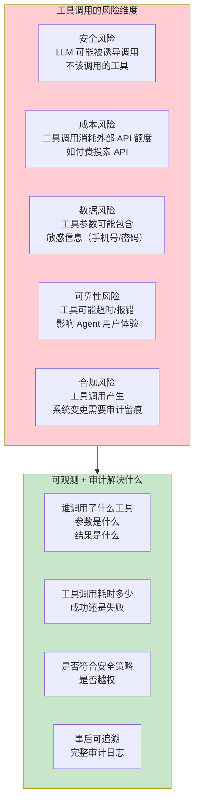
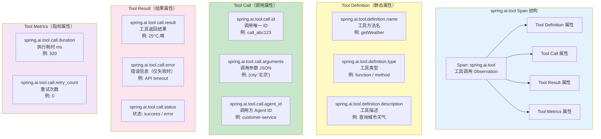
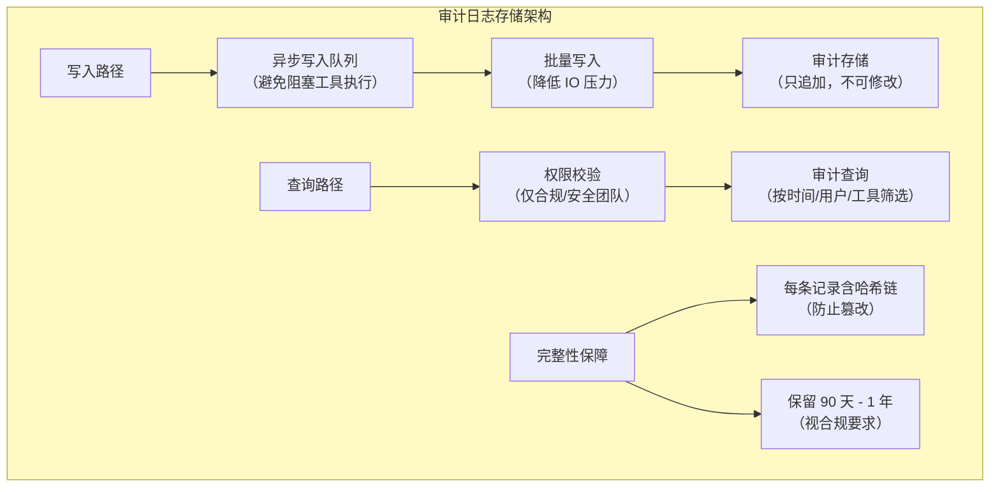

# 32-工具执行可观测与审计

> **定位**：讲透 Spring AI 2.0 中 spring.ai.tool Observation 的完整体系——Tool Call Span 的属性详解、参数和结果的记录方式与安全注意、工具执行审计日志规范、安全审计需求。读完这篇，你能为 Agent 的每一次工具调用建立完整的可追溯审计链路。
>
> **读者画像**：已经理解全链路可观测性（[31-全链路可观测性](31-全链路可观测性.md)），需要深入工具调用层面的监控和安全审计。
>
> **前置阅读**：[31-全链路可观测性](31-全链路可观测性.md)、[03-工具调用](03-工具调用.md)。

---

## 1. 为什么工具调用需要专属的可观测

### 1.1 工具调用是 Agent 系统中风险最高的环节

LLM 推理本身只是"生成文本"，不会修改任何系统状态。但工具调用不同——它可以查询数据库、调用外部 API、发邮件、创建订单、修改文件。每一次工具调用都可能产生**真实的副作用**：



### 1.2 审计 vs 监控的区别

| 维度 | 监控（Observability） | 审计（Audit） |
|------|---------------------|-------------|
| **目的** | 发现性能问题、定位异常 | 合规追溯、安全分析 |
| **数据范围** | 采样（10%-100%） | 全量（100%，不可遗漏） |
| **数据格式** | Metrics + Trace + Logs | 结构化审计日志（不可篡改） |
| **保留时长** | 7-30 天 | 90 天 - 数年（视合规要求） |
| **访问权限** | 运维/SRE 可访问 | 仅安全/合规团队可访问 |
| **数据完整性** | 允许丢失部分数据 | 不允许任何丢失 |

工具调用同时需要两者——监控用于性能优化，审计用于安全合规。

---

## 2. Tool Call Span 结构详解

### 2.1 Span 结构图



### 2.2 Span 属性完整对照表

| 属性名 | 类型 | 来源 | 说明 |
|--------|------|------|------|
| `spring.ai.tool.definition.name` | string | @Tool 注解的方法名 | 工具标识，用于搜索和统计 |
| `spring.ai.tool.definition.type` | string | Spring AI 自动推断 | `function`（函数式）或 `method`（注解式） |
| `spring.ai.tool.definition.description` | string | @Tool(description=...) | 工具功能描述 |
| `spring.ai.tool.call.id` | string | Spring AI 自动生成 | 唯一调用标识，关联 LLM 返回的 tool_call_id |
| `spring.ai.tool.call.arguments` | string(JSON) | LLM 返回的参数 | 调用参数，JSON 格式字符串 |
| `spring.ai.tool.call.result` | string | 工具方法返回值 | 执行结果（受 include-result 配置控制） |
| `spring.ai.tool.call.error` | string | 异常信息 | 仅在执行失败时存在 |
| `spring.ai.tool.call.status` | string | Spring AI 自动填充 | `success` 或 `error` |
| `spring.ai.tool.call.duration` | long(ms) | Spring AI 自动测量 | 方法执行耗时 |

---

## 3. 开启参数和结果记录

### 3.1 配置方式

默认情况下，Spring AI 可能不记录工具调用的完整参数和结果（出于性能和安全考虑）。你需要显式开启：

```yaml
# application.yml
spring:
  ai:
    chat:
      observations:
        log-prompt: true          # 记录 Prompt（用户输入）——ChatObservationProperties 实证
        log-completion: true      # 记录 Completion（LLM 输出）
    # 工具调用参数和结果记录（ToolCallingProperties 实证：前缀 spring.ai.tools.observations.*）
    tools:
      observations:
        include-content: true     # 记录工具调用参数与结果
```

### 3.2 编程式配置

```java
// Spring AI 2.0.0
// 编程式控制工具 Observation 的内容记录
// 真实接口：ToolCallingObservationConvention（org.springframework.ai.tool.observation），
// 上下文是 ToolCallingObservationContext（getToolDefinition/getToolType/getToolCallId/getToolCallArguments/getToolCallResult）。
// import: io.micrometer.common.KeyValue / KeyValues
//         org.springframework.ai.tool.observation.ToolCallingObservationContext / ToolCallingObservationConvention
@Configuration
public class ToolObservationConfiguration {

    @Bean
    public ToolCallingObservationConvention customToolObservationConvention() {
        return new ToolCallingObservationConvention() {

            @Override
            public String getName() {
                return "ai.platform.tool.custom";
            }

            @Override
            public String getContextualName(
                    ToolCallingObservationContext context) {
                // 自定义 Span 显示名
                return "tool:" + context.getToolDefinition().name();
            }

            @Override
            public KeyValues getLowCardinalityKeyValues(
                    ToolCallingObservationContext context) {
                // 低基数属性——值种类有限，适合做标签筛选
                return KeyValues.of(
                        "spring.ai.tool.definition.name",
                        context.getToolDefinition().name(),
                        "spring.ai.tool.definition.type",
                        context.getToolType(),
                        "spring.ai.tool.call.status",
                        context.getToolCallResult() != null
                                ? "success" : "error"
                );
            }

            @Override
            public KeyValues getHighCardinalityKeyValues(
                    ToolCallingObservationContext context) {
                // 高基数属性——值变化大，不适合做标签但适合全文搜索
                KeyValues keyValues = KeyValues.of(
                        "spring.ai.tool.call.id",
                        context.getToolCallId()
                );

                // 参数记录（需安全过滤）
                if (shouldRecordArguments(context)) {
                    keyValues = keyValues.and(
                            "spring.ai.tool.call.arguments",
                            sanitizeArguments(context.getToolCallArguments())
                    );
                }

                // 结果记录（需安全过滤 + 长度限制）
                if (shouldRecordResult(context)) {
                    keyValues = keyValues.and(
                            "spring.ai.tool.call.result",
                            sanitizeResult(context.getToolCallResult())
                    );
                }

                return keyValues;
            }

            private boolean shouldRecordArguments(ToolCallingObservationContext ctx) {
                // 某些敏感工具不记录参数（如包含密码的工具）
                return !ctx.getToolDefinition().name()
                        .contains("password");
            }

            private boolean shouldRecordResult(ToolCallingObservationContext ctx) {
                // 某些工具返回大量数据（如全文搜索），不记录结果
                return !ctx.getToolDefinition().name()
                        .contains("bulkSearch");
            }

            private String sanitizeArguments(String args) {
                // 过滤参数中的敏感字段
                return args.replaceAll("(\"password\"\\s*:\\s*)\"[^\"]*\"",
                        "$1\"[REDACTED]\"");
            }

            private String sanitizeResult(Object result) {
                String str = String.valueOf(result);
                // 限制最大长度
                if (str.length() > 2000) {
                    return str.substring(0, 2000) + "...[TRUNCATED]";
                }
                return str;
            }
        };
    }
}
```

---

## 4. 工具执行审计日志规范

### 4.1 审计日志数据模型

```java
// Spring AI 2.0.0
// 工具调用审计日志——结构化记录，不可篡改
public record ToolAuditRecord(
        String auditId,            // 审计记录唯一 ID
        String traceId,            // 关联的 Trace ID
        String spanId,             // 关联的 Span ID
        String toolCallId,         // LLM 返回的 tool_call_id
        String toolName,           // 工具方法名
        String toolType,           // 工具类型
        String agentId,            // 调用方 Agent 标识
        String userId,             // 最终用户标识
        String tenantId,           // 租户标识
        String argumentsJson,      // 调用参数（JSON，已脱敏）
        String resultSummary,      // 结果摘要（不是完整结果）
        String errorMessage,       // 错误信息（仅失败时）
        ToolCallStatus status,     // SUCCESS / FAILED / DENIED / TIMEOUT
        long durationMs,           // 执行耗时
        Instant calledAt,          // 调用时间
        Instant completedAt,       // 完成时间
        String requestSource,      // 请求来源 IP
        String policyDecision      // 策略引擎的决策结果
) {}

public enum ToolCallStatus {
    SUCCESS,    // 成功执行
    FAILED,     // 执行失败
    DENIED,     // 被安全策略拒绝
    TIMEOUT,    // 执行超时
    RATE_LIMITED // 被限流
}
```

### 4.2 审计日志写入实现

```java
// Spring AI 2.0.0
// 工具调用审计日志记录器——通过 Observation Handler 拦截
// WebFlux 铁律：禁止 MDC/ThreadLocal；traceId 用 Tracer.currentSpan()（Observation.Context 无 getTraceId）。
// import: io.micrometer.observation.Observation / io.micrometer.common.KeyValue
//         io.micrometer.tracing.Tracer / Span / SpanContext   // ⚠ 需引入依赖 io.micrometer:micrometer-tracing（本地未下载，未 javap 实证）
@Component
public class ToolAuditHandler
        implements ObservationHandler<Observation.Context> {

    private final ToolAuditRepository auditRepo;
    private final PIIFilter piiFilter;
    private final Tracer tracer;   // ⚠ 需引入依赖 io.micrometer:micrometer-tracing（本地未下载，未 javap 实证）

    public ToolAuditHandler(ToolAuditRepository auditRepo,
                            PIIFilter piiFilter, Tracer tracer) {
        this.auditRepo = auditRepo;
        this.piiFilter = piiFilter;
        this.tracer = tracer;
    }

    @Override
    public boolean supportsContext(Observation.Context context) {
        return context.getName().startsWith("spring.ai.tool");
    }

    @Override
    public void onStart(Observation.Context context) {
        // 记录开始时间
        context.put("audit.startTime", Instant.now());
        // 在 Span 存活期捕获 TraceId/SpanId（onStop 时 currentSpan 可能已结束）
        Span span = tracer.currentSpan();
        if (span != null) {
            SpanContext spanContext = span.context();
            context.put("audit.traceId", spanContext.traceId());
            context.put("audit.spanId", spanContext.spanId());
        }
    }

    @Override
    public void onStop(Observation.Context context) {
        Instant startTime = (Instant) context.get("audit.startTime");
        Instant endTime = Instant.now();
        long durationMs = java.time.Duration.between(startTime, endTime).toMillis();

        // 提取属性
        String toolName = getAttributeValue(context,
                "spring.ai.tool.definition.name");
        String toolCallId = getAttributeValue(context,
                "spring.ai.tool.call.id");
        String arguments = getAttributeValue(context,
                "spring.ai.tool.call.arguments");
        String result = getAttributeValue(context,
                "spring.ai.tool.call.result");
        String error = getAttributeValue(context,
                "spring.ai.tool.call.error");

        // WebFlux 铁律：请求上下文（agentId/userId/tenantId）经 Reactor Context 传播，
        // 禁止 MDC。此处从 Observation.Context 属性读取（由上游 Advisor/Convention 写入，
        // 通常来自 ChatClientRequest.context → Reactor Context → Observation.Context）。
        String traceId = (String) context.get("audit.traceId");
        String spanId = (String) context.get("audit.spanId");
        String agentId = (String) context.get("agentId");
        String userId = (String) context.get("userId");
        String tenantId = (String) context.get("tenantId");
        String requestSource = (String) context.get("requestSource");
        String policyDecision = (String) context.get("policyDecision");

        // 构建 PII 脱敏后的审计记录
        ToolAuditRecord record = new ToolAuditRecord(
                UUID.randomUUID().toString(),
                traceId != null ? traceId : "unknown",
                spanId != null ? spanId : "unknown",
                toolCallId,
                toolName,
                "method",
                agentId,
                userId,
                tenantId,
                piiFilter.filter(arguments),       // 参数 PII 脱敏
                summarizeResult(result),            // 结果摘要（非完整结果）
                error,
                error != null ? ToolCallStatus.FAILED : ToolCallStatus.SUCCESS,
                durationMs,
                startTime,
                endTime,
                requestSource,
                policyDecision
        );

        // 异步写入审计存储（不阻塞主流程）
        auditRepo.saveAsync(record);
    }

    @Override
    public void onError(Observation.Context context) {
        // 记录工具执行异常
        Throwable error = context.getError();
        context.addLowCardinalityKeyValue(KeyValue.of("spring.ai.tool.call.error",
                error != null ? error.getMessage() : "unknown error"));
    }

    // 结果摘要——只保留前 200 字符，避免超大结果占用审计存储
    private String summarizeResult(String result) {
        if (result == null) return null;
        if (result.length() <= 200) return result;
        return result.substring(0, 200) + "...[TRUNCATED, total="
                + result.length() + "]";
    }

    private String getAttributeValue(Observation.Context context, String key) {
        // Observation.Context 无 getKeyValue()/getContextKeyValues()，
        // 用 getAllKeyValues() 遍历（Micrometer 实证）
        return context.getAllKeyValues().stream()
                .filter(kv -> kv.getKey().equals(key))
                .map(KeyValue::getValue)
                .findFirst()
                .orElse(null);
    }
}
```

### 4.3 审计日志的存储要求



---

## 5. 安全审计需求

### 5.1 需要审计的关键场景

| 场景 | 审计内容 | 告警条件 |
|------|---------|---------|
| **数据查询工具** | 查了哪个用户/订单的数据 | 非工作时间查询、批量查询 |
| **数据写入工具** | 创建/修改了什么 | 未经审批的写入、敏感字段修改 |
| **外部 API 调用** | 调用了哪个外部服务 | 异常高频调用、非常规参数 |
| **文件操作工具** | 读取/写入了什么文件 | 访问敏感目录、大量文件下载 |
| **权限敏感工具** | 谁触发、什么参数 | 越权调用、参数注入痕迹 |

### 5.2 基于审计的异常检测

```java
// Spring AI 2.0.0
// 工具调用异常检测——基于审计数据进行实时分析
@Service
public class ToolAnomalyDetector {

    private final ToolAuditRepository auditRepo;
    private final AlertService alertService;

    // 检测异常工具调用模式
    @Scheduled(fixedDelay = 60_000)  // 每分钟检查一次
    public void detectAnomalies() {
        Instant oneMinuteAgo = Instant.now().minus(Duration.ofMinutes(1));

        // 规则 1：单个用户 1 分钟内工具调用超过 50 次（可能是攻击）
        List<UserCallCount> topUsers = auditRepo
                .findTopCallers(oneMinuteAgo, 10);
        topUsers.stream()
                .filter(u -> u.callCount() > 50)
                .forEach(u -> alertService.alert(
                        "异常工具调用频率",
                        "用户 " + u.userId() + " 在 1 分钟内调用了 "
                                + u.callCount() + " 次工具",
                        AlertSeverity.HIGH
                ));

        // 规则 2：工具调用失败率突然升高
        double failureRate = auditRepo
                .calculateFailureRate(oneMinuteAgo);
        if (failureRate > 0.3) {
            alertService.alert(
                    "工具调用失败率异常",
                    "最近 1 分钟失败率: " + (failureRate * 100) + "%",
                    AlertSeverity.MEDIUM
            );
        }

        // 规则 3：非工作时间调用敏感工具
        List<ToolAuditRecord> sensitiveCalls = auditRepo
                .findSensitiveToolCalls(oneMinuteAgo);
        sensitiveCalls.stream()
                .filter(this::isOffHours)
                .forEach(record -> alertService.alert(
                        "非工作时间敏感工具调用",
                        "工具: " + record.toolName()
                                + ", 用户: " + record.userId(),
                        AlertSeverity.MEDIUM
                ));
    }

    private boolean isOffHours(ToolAuditRecord record) {
        int hour = record.calledAt().atZone(
                ZoneId.of("Asia/Shanghai")).getHour();
        return hour < 7 || hour > 22;
    }
}

public record UserCallCount(String userId, long callCount) {}
```

### 5.3 PII 过滤策略

工具参数和结果中经常包含敏感信息。在写入审计日志前必须脱敏：

```java
// Spring AI 2.0.0
// PII 脱敏过滤器
@Component
public class PIIFilter {

    private static final Map<Pattern, String> PATTERNS = Map.of(
            // 手机号：保留前 3 后 4
            Pattern.compile("(\\d{3})\\d{4}(\\d{4})"),
            "$1****$2",

            // 身份证号：保留前 6 后 4
            Pattern.compile("(\\d{6})\\d{8}(\\d{4})"),
            "$1********$2",

            // 邮箱：保留首字符和域名
            Pattern.compile("(\\w)\\w*@(\\w+\\.\\w+)"),
            "$1***@$2",

            // 银行卡号：保留后 4 位
            Pattern.compile("\\d{12}(\\d{4})"),
            "************$1"
    );

    public String filter(String input) {
        if (input == null || input.isEmpty()) {
            return input;
        }

        String result = input;
        for (Map.Entry<Pattern, String> entry : PATTERNS.entrySet()) {
            result = entry.getKey().matcher(result)
                    .replaceAll(entry.getValue());
        }
        return result;
    }

    // 判断是否包含疑似 PII
    public boolean containsPII(String input) {
        if (input == null) return false;
        return PATTERNS.keySet().stream()
                .anyMatch(p -> p.matcher(input).find());
    }
}
```

---

## 6. 完整审计配置示例

### 6.1 审计专用配置

```java
// Spring AI 2.0.0
// 完整的工具审计配置
@Configuration
public class ToolAuditConfiguration {

    // 审计日志写入到独立的数据库（与业务数据库隔离）
    @Bean
    @ConfigurationProperties(prefix = "audit.datasource")
    public DataSource auditDataSource() {
        return DataSourceBuilder.create().build();
    }

    // 审计 Repository 使用独立的数据源
    @Bean
    public ToolAuditRepository toolAuditRepository(
            @Qualifier("auditDataSource") DataSource dataSource) {
        return new JdbcToolAuditRepository(dataSource);
    }

    // 注册审计 Observation Handler
    @Bean
    public ToolAuditHandler toolAuditHandler(
            ToolAuditRepository repo, PIIFilter filter) {
        return new ToolAuditHandler(repo, filter);
    }

    // 工具执行前的安全策略检查
    @Bean
    public ToolSecurityAdvisor toolSecurityAdvisor(
            PolicyEngine policyEngine,
            ToolAuditHandler auditHandler) {
        return new ToolSecurityAdvisor(policyEngine, auditHandler);
    }
}
```

### 6.2 工具安全拦截 Advisor

```java
// Spring AI 2.0.0
// 在工具执行前进行安全策略检查（Demo 骨架）
// import: java.util.Map
//         org.springframework.ai.chat.client.ChatClientRequest / ChatClientResponse
//         org.springframework.ai.chat.client.advisor.api.CallAdvisor / CallAdvisorChain
public class ToolSecurityAdvisor implements CallAdvisor {

    private final PolicyEngine policyEngine;
    private final ToolAuditHandler auditHandler;

    public ToolSecurityAdvisor(PolicyEngine policyEngine,
                                ToolAuditHandler auditHandler) {
        this.policyEngine = policyEngine;
        this.auditHandler = auditHandler;
    }

    @Override
    public ChatClientResponse adviseCall(ChatClientRequest request,
                                          CallAdvisorChain chain) {
        // 在 Tool Calling 前检查每个工具调用的权限
        Map<String, Object> requestContext = request.context();
        String userId = (String) requestContext.get("userId");
        String agentId = (String) requestContext.get("agentId");

        // 注意：Advisor 不是工具级拦截的正确落点——HITL/工具权限拦截应放在
        // ToolCallingManager 装饰器或 ToolCallback 包装层（见 [附录 05-SpringAI2-API基准/02-Tool与Observation真实API]）。
        // 这里仅演示从 request.context() 读取请求上下文，再放行。
        return chain.nextCall(request);
    }
}

// 工具调用拦截器——在 Spring AI 执行工具方法前拦截
@Component
public class ToolExecutionInterceptor {

    private final PolicyEngine policyEngine;
    private final AuditLogger auditLogger;

    public ToolExecutionInterceptor(PolicyEngine policyEngine,
                                     AuditLogger auditLogger) {
        this.policyEngine = policyEngine;
        this.auditLogger = auditLogger;
    }

    // 在工具执行前调用
    public void beforeExecution(String toolName, String arguments,
                                 String userId, String agentId) {
        ToolPolicyContext ctx = new ToolPolicyContext(
                toolName, arguments, userId, agentId, Instant.now());

        PolicyDecision decision = policyEngine.evaluate(ctx);

        if (decision.decision() == Decision.DENY) {
            // 记录被拒绝的调用
            auditLogger.logDenied(toolName, arguments, userId,
                    agentId, decision.reason());
            throw new ToolAccessDeniedException(decision.reason());
        }
    }
}
```

---

## 7. 适用场景与不适用场景

### 适用场景

- **金融/医疗/政务行业**：工具调用涉及敏感数据操作，强制审计
- **企业级 Agent 系统**：需要完整的操作追溯能力
- **多租户 SaaS**：需要按租户隔离审计、证明数据安全
- **合规要求场景**：需要通过 ISO27001、SOC2、GDPR 等审计
- **安全敏感工具**：涉及数据库写入、外部 API 调用、文件操作的工具

### 不适用场景

- **只读工具的 Demo**：简单的查询工具，没有安全风险
- **学习/实验项目**：理解工具调用机制阶段，审计引入不必要的复杂度
- **内部低风险工具**：不涉及敏感数据、不产生副作用的内部工具
- **极低调用频率**：日均几十次调用的工具，手动检查即可

---

## 8. 本章总结

| 概念 | 一句话 |
|------|--------|
| **spring.ai.tool Span** | 工具调用的完整 Observation——包含定义、调用、结果、指标四类属性 |
| `spring.ai.tool.definition.name` | 工具方法名，用于识别和统计 |
| `spring.ai.tool.call.arguments` | 调用参数（JSON），需 PII 脱敏后记录 |
| `spring.ai.tool.call.result` | 工具返回结果，需长度限制和脱敏 |
| `spring.ai.tool.call.status` | 调用状态：success / error |
| **审计 vs 监控** | 审计是全量、不可篡改、长期保留；监控是采样、可丢失、短期保留 |
| **ToolAuditRecord** | 结构化审计记录——关联 Trace ID，包含完整调用上下文 |
| **PII 过滤** | 手机号、身份证、邮箱、银行卡等敏感信息在记录前必须脱敏 |
| **异常检测** | 基于审计数据检测异常调用模式（高频、非工作时间、高失败率） |
| **安全拦截** | 在工具执行前通过策略引擎检查权限，拒绝则记录审计并抛异常 |

---

> **上一篇**：[31-全链路可观测性](31-全链路可观测性.md) — 本文是其工具调用层面的深入展开。
>
> **下一篇**：[57-多页面流式响应与会话管理](57-多页面流式响应与会话管理.md) — 流式响应的连接管理和断线重连。
>
> **想深入**：[29-管控分离架构](29-管控分离架构.md) — 控制面的策略引擎和安全策略是工具审计的上游决策者。
>
> **机制层下钻**：[教程 03-自定义观测点与扩展点] — 本文审计 Handler 的完整机制（领域 Context/Convention/Filter 四件套、同步入队异步出队的成本与审计管道）。
