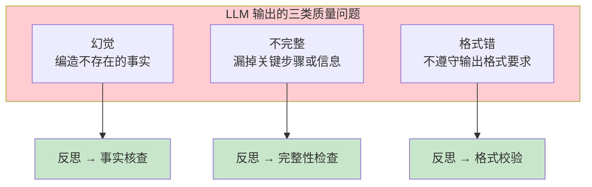
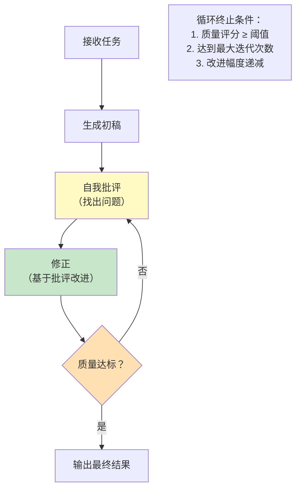
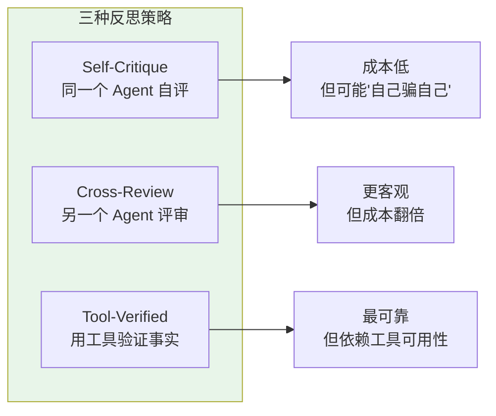
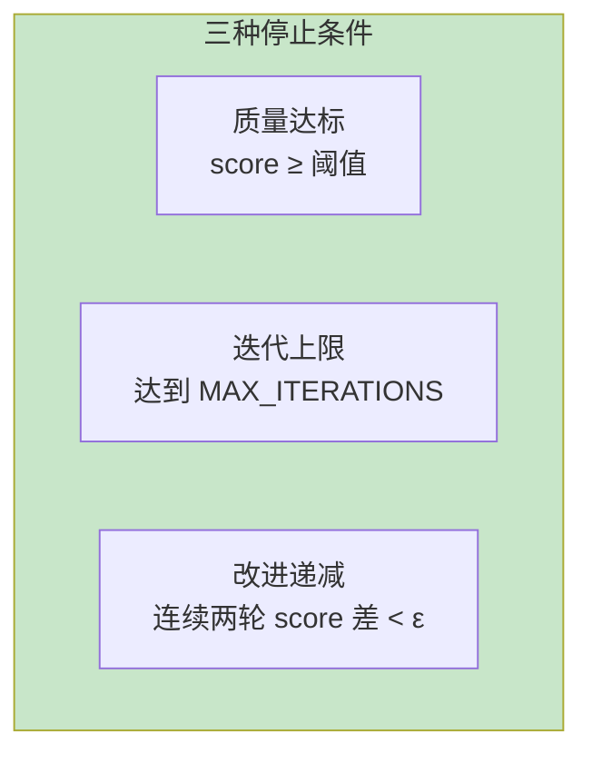
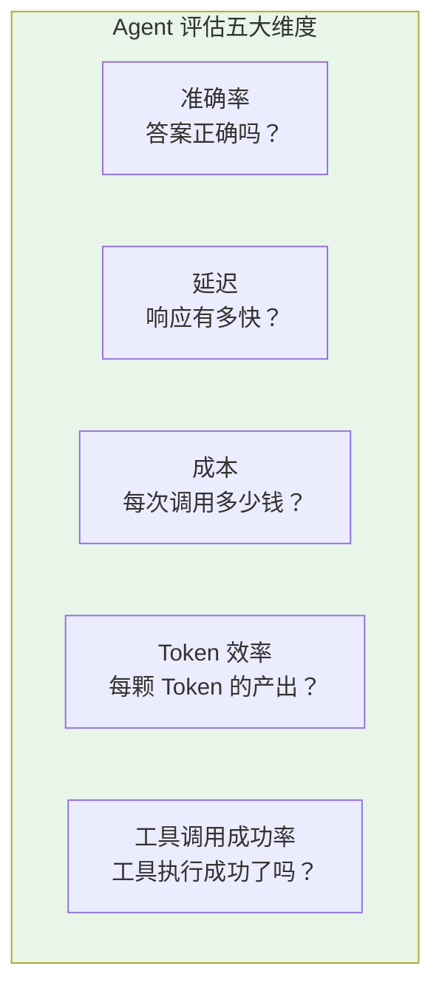
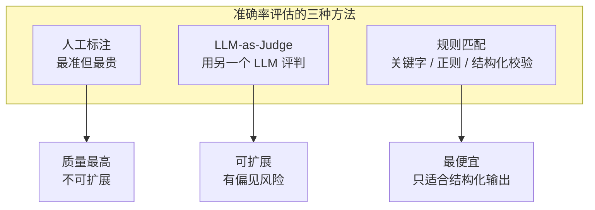
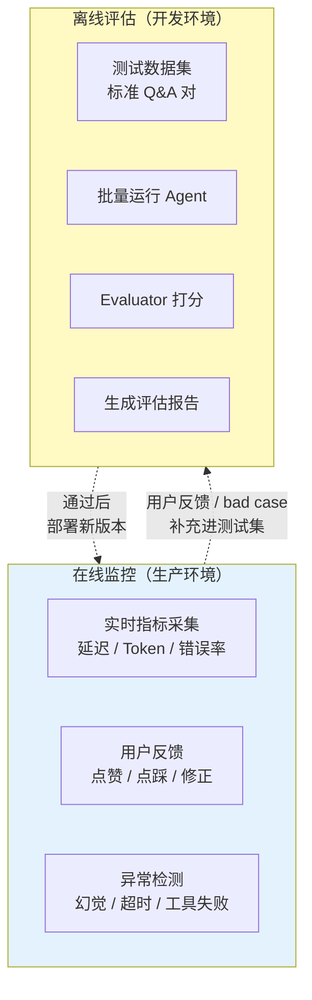
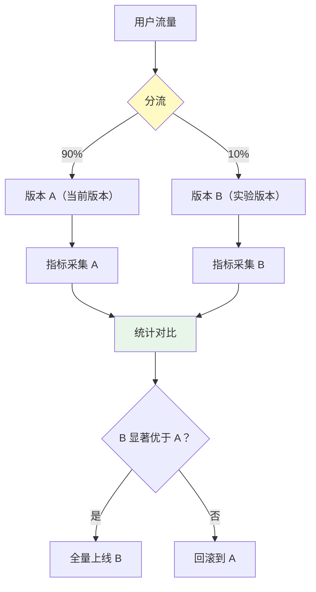
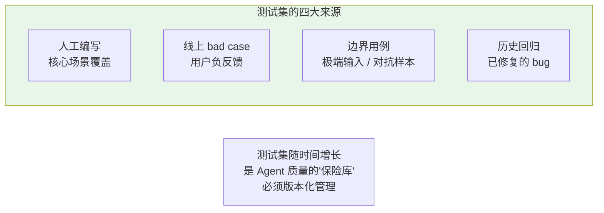
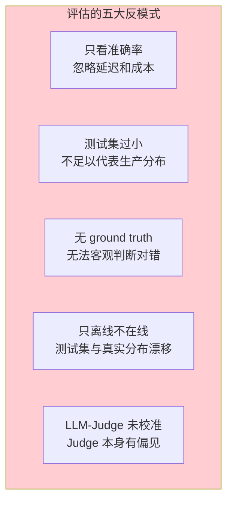

# 32-自我反思与 Agent 评估

> **定位**：讲透 Agent 的自我修正与质量保障——Reflection 模式（输出自评 → 迭代修正）、评估指标体系（准确率 / 延迟 / 成本 / Token 效率 / 工具调用成功率）、在线监控 + 离线评估闭环、A/B 测试与回归测试、Spring AI Evaluator API。读完这篇，你能让 Agent 像人类一样"检查自己的作业"，并建立系统化的质量度量体系。
>
> **读者画像**：已经能编排多 Agent 工作流，需要让 Agent 输出更可靠、并且能量化 Agent 质量的开发者。
>
> **前置阅读**：[31-Agent 工作流编排](31-Agent工作流编排.md)、[29-上下文工程](29-上下文工程.md)。

---

## 1. 为什么 Agent 需要"反思"

LLM 是**一次性生成**的——它不会自动检查自己的答案对不对。这导致三类典型问题：



**反思（Reflection）** 是一种让 Agent 对自己的输出进行自评、发现问题、迭代修正的模式。灵感来自人类的写作过程：**先写初稿，再修改，再校对**。

---

## 2. Reflection 模式

### 2.1 Reflection 循环



### 2.2 三种反思策略



| 策略 | 原理 | 成本 | 可靠性 | 适用场景 |
|------|------|------|--------|---------|
| Self-Critique | 同一个 LLM 批评自己的输出 | 1x | 中 | 代码审查、文本润色 |
| Cross-Review | 另一个 LLM 实例评审 | 2x | 高 | 高质量要求的正式输出 |
| Tool-Verified | 调用工具 / 检索验证事实 | 1x + 工具 | 最高 | 事实性回答、计算 |

### 2.3 Java 代码：Self-Critique 实现

```java
@Service
public class ReflectionAgent {

    private final ChatClient agent;
    private static final int MAX_ITERATIONS = 3;
    private static final double QUALITY_THRESHOLD = 0.85;

    public String generateWithReflection(String task) {
        // 1. 生成初稿
        String draft = agent.prompt()
            .system("你是一个专业写作助手。根据要求生成内容。")
            .user(task)
            .call()
            .content();

        // 2. 反思循环
        for (int i = 0; i < MAX_ITERATIONS; i++) {
            // 2a. 自评
            EvaluationResult eval = selfCritique(task, draft);

            // 2b. 质量达标则终止
            if (eval.score() >= QUALITY_THRESHOLD) {
                return draft;
            }

            // 2c. 基于批评修正
            draft = agent.prompt()
                .system("你是一个专业写作助手。根据评审意见改进内容。")
                .user("""
                    原始任务：%s
                    当前草稿：%s
                    评审意见：%s
                    请改进草稿。
                    """.formatted(task, draft, eval.feedback()))
                .call()
                .content();
        }

        return draft;  // 达到最大迭代，返回最终版本
    }

    private EvaluationResult selfCritique(String task, String draft) {
        String response = agent.prompt()
            .system("""
                你是一个严格的评审员。评估以下内容的质量。
                输出 JSON：
                {"score": 0.0-1.0, "feedback": "具体改进建议"}
                评分维度：准确性、完整性、格式正确性、逻辑连贯性。
                """)
            .user("任务：" + task + "\n待评审内容：" + draft)
            .call()
            .content();
        return parseEvaluation(response);
    }
}
```

### 2.4 何时停止反思

反思循环最怕**无限迭代**——每次改动一点点，永远不会收敛。



```java
// 改进递减检测
double prevScore = 0;
double improvementDelta = 0.01;  // 最小改进幅度

for (int i = 0; i < MAX_ITERATIONS; i++) {
    EvaluationResult eval = selfCritique(task, draft);
    if (eval.score() >= QUALITY_THRESHOLD) break;
    if (i > 0 && eval.score() - prevScore < improvementDelta) {
        // 改进幅度太小，不值得继续
        break;
    }
    prevScore = eval.score();
    draft = revise(task, draft, eval.feedback());
}
```

> **成本警告**：每轮反思 = 1 次批评 + 1 次修正 = 2 次 LLM 调用。3 轮反思就是 7 次调用（1 初稿 + 3×2）。**只在高质量要求场景使用**。

---

## 3. Agent 评估指标体系

反思是"Agent 自我修正"，评估是"外部度量 Agent 质量"。两者互补。

### 3.1 五大评估维度



### 3.2 指标体系详解

| 维度 | 指标 | 计算方式 | 目标值 |
|------|------|---------|--------|
| **准确率** | 答案正确率 | 正确答案 / 总问题 | > 90% |
| **准确率** | 忠实度 | 有依据的句子 / 总句子 | > 95% |
| **准确率** | 幻觉率 | 编造内容 / 总内容 | < 3% |
| **延迟** | 首字节延迟（TTFT） | 请求到第一个 Token 的时间 | < 500ms |
| **延迟** | 端到端延迟 | 请求到完整响应的时间 | < 5s |
| **成本** | 单次请求成本 | Token 数 × 单价 | 可接受范围 |
| **Token 效率** | 输入/输出比 | 输出 Token / 输入 Token | 越高越好 |
| **工具调用** | 调用成功率 | 成功调用 / 总调用 | > 95% |
| **工具调用** | 参数正确率 | 参数正确 / 总调用 | > 98% |
| **工具调用** | 不必要调用率 | 多余调用 / 总调用 | < 10% |

### 3.3 准确率的评估方法

准确率是最难量化的维度——"正确"本身就很主观。业界有三种方法：



**推荐组合**：LLM-as-Judge 做大规模评估 + 人工抽检做校准 + 规则匹配做格式校验。

---

## 4. Spring AI Evaluator API

Spring AI 2.0 提供了内置的评估抽象，用于系统性评估生成质量。

### 4.1 Relevancy Evaluator（相关性评估）

评估回答是否与问题和检索上下文相关：

```java
import org.springframework.ai.evaluation.Evaluator;
import org.springframework.ai.evaluation.RelevancyEvaluator;
import org.springframework.ai.evaluation.EvaluationResponse;

// 创建相关性评估器
Evaluator relevancyEvaluator = new RelevancyEvaluator(chatModel);

// 评估一条问答
EvaluationResponse result = relevancyEvaluator.evaluate(
    new EvaluationRequest(
        userQuestion,         // 用户问题
        retrievalContext,     // 检索到的上下文
        agentAnswer           // Agent 的回答
    )
);

boolean isRelevant = result.isPass();
double score = result.getScore();   // 0.0 - 1.0
String feedback = result.getFeedback();
```

### 4.2 FactChecking Evaluator（事实核查）

评估回答是否忠实于检索上下文（检测幻觉）：

```java
import org.springframework.ai.evaluation.FactCheckingEvaluator;

Evaluator factChecker = new FactCheckingEvaluator(chatModel);

EvaluationResponse factResult = factChecker.evaluate(
    new EvaluationRequest(
        userQuestion,
        retrievalContext,
        agentAnswer
    )
);

if (!factResult.isPass()) {
    // 检测到幻觉！回答中有检索上下文不支持的内容
    logger.warn("检测到幻觉: {}", factResult.getFeedback());
}
```

### 4.3 批量评估管线

```java
@Service
public class AgentEvaluationPipeline {

    private final Evaluator relevancyEvaluator;
    private final Evaluator factChecker;
    private final List<TestExample> testDataset;

    /**
     * 对整个测试集做批量评估
     */
    public EvaluationReport evaluate() {
        EvaluationReport report = new EvaluationReport();

        for (TestExample example : testDataset) {
            // 运行 Agent
            String answer = agent.call(example.question());

            // 评估
            boolean relevant = relevancyEvaluator
                .evaluate(new EvaluationRequest(
                    example.question(), example.context(), answer))
                .isPass();

            boolean factual = factChecker
                .evaluate(new EvaluationRequest(
                    example.question(), example.context(), answer))
                .isPass();

            report.record(example.id(), relevant, factual);
        }

        return report.summary();
    }
}
```

| Evaluator 类型 | 评估什么 | 底层原理 |
|---------------|---------|---------|
| RelevancyEvaluator | 回答是否切题 | LLM 判断 Q-A-Ctx 三者关系 |
| FactCheckingEvaluator | 回答是否忠于上下文 | LLM 逐句核对答案与上下文 |
| 自定义 Evaluator | 任意维度 | 实现 Evaluator 接口 |

---

## 5. 在线监控 + 离线评估闭环



### 5.1 在线监控实现

```java
@Aspect
@Component
public class AgentMonitoringAspect {

    private final MeterRegistry metrics;
    private final FeedbackStore feedbackStore;

    @Around("@annotation(AgentEndpoint)")
    public Object monitor(ProceedingJoinPoint pjp) throws Throwable {
        long start = System.nanoTime();
        String requestId = UUID.randomUUID().toString();

        try {
            Object result = pjp.proceed();
            long durationMs = (System.nanoTime() - start) / 1_000_000;

            metrics.timer("agent.request", "endpoint", endpoint)
                   .record(durationMs, TimeUnit.MILLISECONDS);

            return result;
        } catch (Exception e) {
            metrics.counter("agent.error", "type", e.getClass().getSimpleName())
                   .increment();
            throw e;
        }
    }

    /**
     * 用户反馈接口
     */
    public void recordFeedback(String requestId, boolean positive, String comment) {
        feedbackStore.save(requestId, positive, comment);
        if (!positive) {
            // 负反馈加入 bad case 池，供离线评估使用
            badCaseCollector.add(requestId);
        }
    }
}
```

### 5.2 离线评估报告

```java
public class EvaluationReport {
    private int totalExamples;
    private int relevantCount;
    private int factualCount;
    private double avgLatencyMs;
    private double avgTokenCost;

    public void printSummary() {
        System.out.printf("""
            === Agent 评估报告 ===
            总样本数: %d
            相关性通过率: %.1f%%
            事实性通过率: %.1f%%
            平均延迟: %.0fms
            平均成本: $%.4f/请求
            """,
            totalExamples,
            100.0 * relevantCount / totalExamples,
            100.0 * factualCount / totalExamples,
            avgLatencyMs,
            avgTokenCost
        );
    }
}
```

---

## 6. A/B 测试与回归测试

### 6.1 A/B 测试架构

当你改了 Prompt、换了模型、加了反思机制，怎么知道是"变好了"还是"变差了"？



```java
@Service
public class AbTestRouter {

    private static final double EXPERIMENT_RATIO = 0.1;

    public String route(String userId, String question) {
        // 基于 userId 的确定性分流（同一用户始终进同一组）
        int hash = Math.abs(userId.hashCode());
        boolean isExperiment = (hash % 100) < (EXPERIMENT_RATIO * 100);

        if (isExperiment) {
            metrics.increment("ab.experiment.requests");
            return agentV2.answer(question);  // 新版本（如加了反思）
        } else {
            metrics.increment("ab.control.requests");
            return agentV1.answer(question);  // 当前版本
        }
    }
}
```

### 6.2 回归测试

每次改 Prompt 或升级模型后，跑一遍固定的测试集，确保质量没有退化。

```java
@SpringBootTest
class AgentRegressionTest {

    @Autowired
    private ChatClient agent;

    @ParameterizedTest
    @MethodSource("testDataset")
    void testAgentQuality(TestExample example) {
        String answer = agent.prompt().user(example.question()).call().content();

        // 结构化校验
        assertTrue(answer.contains(example.expectedKeyword()),
            "回答应包含关键词: " + example.expectedKeyword());

        // LLM-as-Judge 校验
        EvaluationResponse eval = relevancyEvaluator.evaluate(
            new EvaluationRequest(example.question(), example.context(), answer));
        assertTrue(eval.isPass(), "回答相关性不达标: " + eval.getFeedback());
    }

    static Stream<TestExample> testDataset() {
        return loadFromCsv("src/test/resources/agent-test-dataset.csv").stream();
    }
}
```

### 6.3 测试集管理



---

## 7. 评估的反模式



| 反模式 | 后果 | 正确做法 |
|--------|------|---------|
| 只看准确率 | 上线后发现太慢太贵 | 多维度综合评估 |
| 测试集过小 | 过拟合少量样本 | 至少 200+ 条 |
| 无 ground truth | 评估本身不可靠 | 人工标注基准 |
| 只离线 | 生产漂移无法发现 | 在线 + 离线闭环 |
| Judge 未校准 | LLM 评估有系统性偏差 | 人工抽检 + 交叉验证 |

---

## 8. 适用场景与不适用场景

### ✅ 适用场景

- 高质量要求场景（医疗、法律、金融）
- 生产级 Agent 系统（需要持续质量保障）
- 频繁迭代的 Agent（Prompt / 模型经常变）
- 需要量化 Agent 质量的团队

### ❌ 不适用场景

- 原型阶段（先跑通再说）
- 创意生成场景（反思可能抑制创造力）
- 极低延迟场景（反思增加数秒延迟）
- 成本极敏感场景（反思翻倍 LLM 调用）

---

## 9. 本章总结

| 概念 | 一句话 |
|------|--------|
| **Reflection 模式** | 生成 → 自评 → 修正 → 评估的迭代循环 |
| **三种反思策略** | Self-Critique / Cross-Review / Tool-Verified |
| **停止条件** | 质量达标 / 迭代上限 / 改进递减 |
| **评估五维度** | 准确率 / 延迟 / 成本 / Token 效率 / 工具成功率 |
| **Spring AI Evaluator** | RelevancyEvaluator + FactCheckingEvaluator |
| **在线+离线闭环** | 在线监控采集 bad case → 离线评估验证修复 |
| **A/B 测试** | 确定性分流 + 统计显著性检验 |
| **回归测试** | 固定测试集 + CI 集成 |

**下一篇**：[33-Agent 性能优化](33-Agent性能优化.md) — 批量推理、并行工具调用、流式 + 缓存、虚拟线程。

---

> **前置回顾**：[31-Agent 工作流编排](31-Agent工作流编排.md)讲了 IterativeRefinementWorkflow——本章的 Reflection 模式是其理论支撑。
> **RAG 评估**：检索召回率和答案忠实度的评估，详见 [30-高级 RAG 与 Agentic RAG](30-高级RAG与AgenticRAG.md) 第 7 节。
> **上下文影响**：Token 效率与上下文工程紧密相关，详见 [29-上下文工程](29-上下文工程.md)。
