# 34-高级记忆架构

> **定位**：讲透 Agent 的高级记忆系统——三层记忆架构（短期上下文窗口 → 长期向量化存储 → 外部 RAG 检索）、语义记忆 vs 情景记忆的分类学、记忆演化（遗忘曲线 / 衰减 / 重要性评分）、记忆隔离与多租户、在 Spring AI 中实现高级记忆的完整架构设计。读完这篇，你的 Agent 将拥有类似人类的"记忆能力"——能记住重要的、遗忘琐碎的、按需回忆相关的。
>
> **读者画像**：已经掌握 [04-基础记忆管理](04-记忆与会话管理.md) 的 ChatMemory + MessageWindowChatMemory，需要设计企业级长期记忆系统的资深架构师。
>
> **前置阅读**：[04-记忆与会话管理](04-记忆与会话管理.md)、[29-上下文工程](29-上下文工程.md)、[05-RAG 检索增强生成](05-RAG检索增强生成.md)。

---

## 1. 基础记忆的天花板

[04 章](04-记忆与会话管理.md)讲的 `MessageWindowChatMemory` 是一个**滑动窗口**——保留最近 N 条消息，超出的直接丢弃。这在简单多轮对话中够用，但生产级 Agent 会遇到四个硬伤。

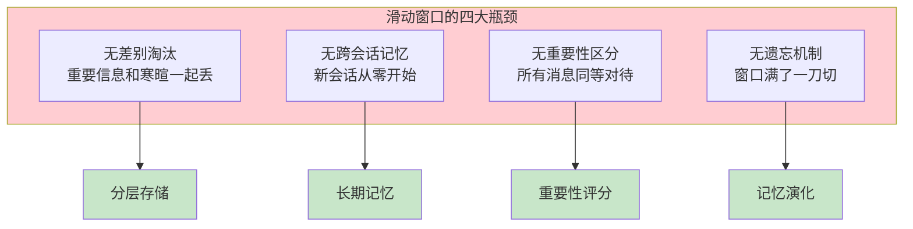

### 1.1 真实场景的痛点

| 场景 | 滑动窗口的问题 | 用户感受 |
|------|-------------|---------|
| 长期客服（月度对话） | 上周讨论过的方案全忘了 | "Agent 怎么又问一遍？" |
| 个性化助手 | 不记得用户偏好 | "我每次都要重新说一遍" |
| 多轮复杂咨询 | 早期关键信息被淘汰 | "Agent 忘了我最初说的条件" |
| 多会话场景 | 会话间完全隔离 | "在 A 会话里说的，B 会话不知道" |

**根本原因**：滑动窗口把记忆当作**无差别的消息队列**，而人类记忆是**有层次、有权重、有遗忘**的复杂系统。

---

## 2. 三层记忆架构

### 2.1 人类记忆的类比

在设计 Agent 记忆系统之前，先理解人类记忆的三层结构：

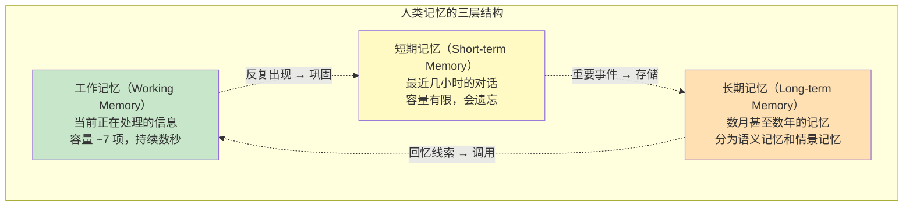

### 2.2 Agent 的三层记忆架构

将人类记忆模型映射到 Agent 系统架构：

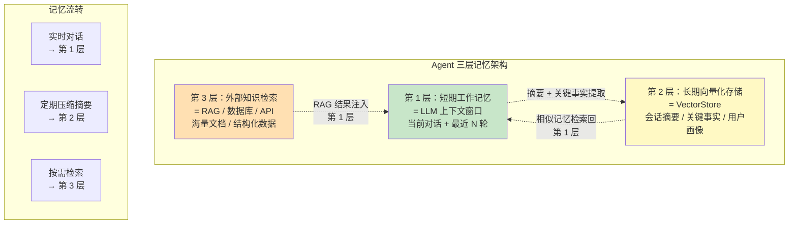

### 2.3 三层对比

| 层级 | 存储 | 容量 | 持久性 | 延迟 | 成本 |
|------|------|------|--------|------|------|
| **第 1 层：工作记忆** | LLM 上下文窗口 | 128K-1M Token | 单次请求 | 0（已在内存） | Token 计费 |
| **第 2 层：长期存储** | VectorStore（PgVector / Redis） | 无限 | 永久（或 TTL） | ~50ms（查询） | 存储成本 |
| **第 3 层：外部检索** | RAG / 数据库 / API | 无限 | 永久 | ~200ms-2s | 取决于源 |

### 2.4 各层职责

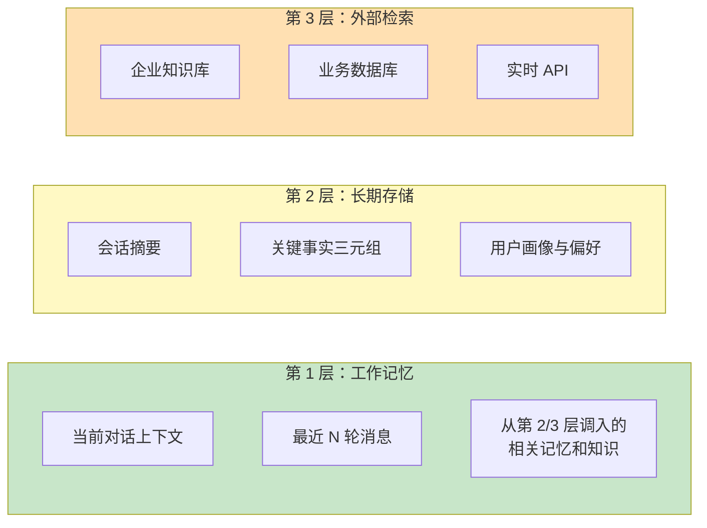

### 2.5 Java 代码：三层记忆架构实现

```java
@Service
public class ThreeTierMemoryService {

    private final ChatMemory shortTermMemory;           // 第 1 层
    private final VectorStore longTermStore;            // 第 2 层
    private final EmbeddingModel embeddingModel;
    private final QuestionAnswerAdvisor externalRag;    // 第 3 层

    /**
     * 写入记忆：对话结束后，将重要信息存入第 2 层
     */
    public void persist(String userId, String conversationId) {
        List<Message> history = shortTermMemory.get(conversationId);

        // 1. 提取关键事实（实体 + 关系 + 事件）
        List<MemoryFragment> fragments = extractKeyFacts(history);

        // 2. 为每个片段打重要性评分
        fragments.forEach(f -> f.setImportance(scoreImportance(f)));

        // 3. 存入第 2 层（向量化 + 元数据）
        List<Document> docs = fragments.stream()
            .map(f -> new Document(
                f.content(),
                Map.of(
                    "userId", userId,
                    "conversationId", conversationId,
                    "type", f.type().name(),
                    "importance", f.importance(),
                    "timestamp", Instant.now().toString()
                )
            ))
            .toList();
        longTermStore.add(docs);

        // 4. 清理第 1 层（可选：保留最近 N 条作为继续对话的上下文）
    }

    /**
     * 读取记忆：对话开始时，从第 2 层检索相关长期记忆注入第 1 层
     */
    public String recall(String userId, String userInput) {
        // 1. 从第 2 层检索与当前输入相关的长期记忆
        List<Document> memories = longTermStore.similaritySearch(
            SearchRequest.builder()
                .query(userInput)
                .topK(5)
                .filterExpression("userId == '" + userId + "'")  // 租户隔离
                .similarityThreshold(0.7)
                .build()
        );

        // 2. 组装为上下文摘要
        String memoryContext = memories.stream()
            .map(Document::getText)
            .collect(Collectors.joining("\n"));

        // 3. 返回给第 1 层使用
        return memoryContext;
    }
}
```

---

## 3. 语义记忆 vs 情景记忆

人类长期记忆分为两种类型，Agent 记忆系统也应该区分：

### 3.1 两种记忆类型

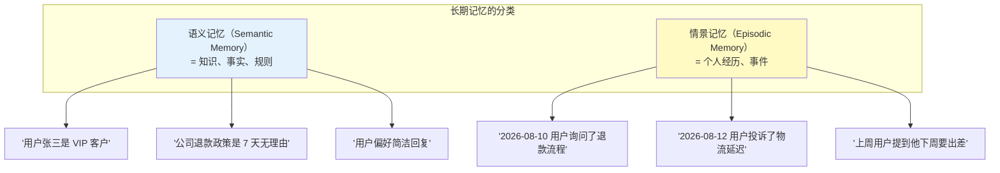

### 3.2 两者的区别

| 维度 | 语义记忆 | 情景记忆 |
|------|---------|---------|
| **内容** | 事实、知识、偏好 | 事件、经历、交互记录 |
| **时间性** | 无时间戳（"张三是 VIP"） | 有时间戳（"8 月 10 日发生了什么"） |
| **抽象度** | 高（抽象提取） | 低（具体事件） |
| **变化频率** | 低（稳定事实） | 高（持续产生新事件） |
| **检索方式** | 关键词 / 语义匹配 | 时间范围 + 语义匹配 |
| **遗忘曲线** | 缓慢遗忘 | 较快遗忘（除非重要事件） |
| **存储结构** | Key-Value / 知识图谱 | 时序向量库 |

### 3.3 实现：双类型记忆存储

```java
@Service
public class TypedMemoryService {

    private final VectorStore vectorStore;
    private final KeyValueStore profileStore;  // 存语义记忆

    /**
     * 写入语义记忆（用户画像、稳定偏好）
     */
    public void saveSemanticMemory(String userId, String key, String value) {
        // 语义记忆适合用 Key-Value 存储，更新而非追加
        profileStore.put("user:" + userId + ":" + key, value);
    }

    /**
     * 读取语义记忆
     */
    public String loadSemanticMemory(String userId, String key) {
        return profileStore.get("user:" + userId + ":" + key);
    }

    /**
     * 写入情景记忆（交互事件）
     */
    public void saveEpisodicMemory(String userId, String event, String conversationId) {
        Document doc = new Document(
            event,
            Map.of(
                "userId", userId,
                "conversationId", conversationId,
                "type", "EPISODIC",
                "timestamp", Instant.now().toString(),
                "importance", scoreImportance(event)
            )
        );
        vectorStore.add(List.of(doc));
    }

    /**
     * 检索情景记忆（支持时间范围 + 语义相似度）
     */
    public List<Document> recallEpisodic(String userId, String query,
                                          Instant from, Instant to) {
        return vectorStore.similaritySearch(
            SearchRequest.builder()
                .query(query)
                .topK(10)
                .filterExpression("""
                    userId == '%s' && type == 'EPISODIC'
                    && timestamp >= '%s' && timestamp <= '%s'
                    """.formatted(userId, from, to))
                .build()
        );
    }
}
```

### 3.4 从对话中自动提取两类记忆

```java
@Service
public class MemoryExtractor {

    private final ChatClient extractor;

    /**
     * 分析一段对话，提取语义记忆和情景记忆
     */
    public ExtractionResult extract(String userId, List<Message> conversation) {
        String transcript = conversation.stream()
            .map(m -> m.getType() + ": " + m.getText())
            .collect(Collectors.joining("\n"));

        String json = extractor.prompt()
            .system("""
                分析以下对话，提取两种记忆：

                1. 语义记忆（稳定事实）：用户画像、偏好、身份信息
                   格式：{"type": "SEMANTIC", "key": "preference.style", "value": "简洁"}

                2. 情景记忆（具体事件）：发生了什么事
                   格式：{"type": "EPISODIC", "event": "用户咨询了退款流程", "importance": 0.7}

                输出 JSON 数组。
                """)
            .user(transcript)
            .call()
            .content();

        return parseExtraction(json);
    }
}
```

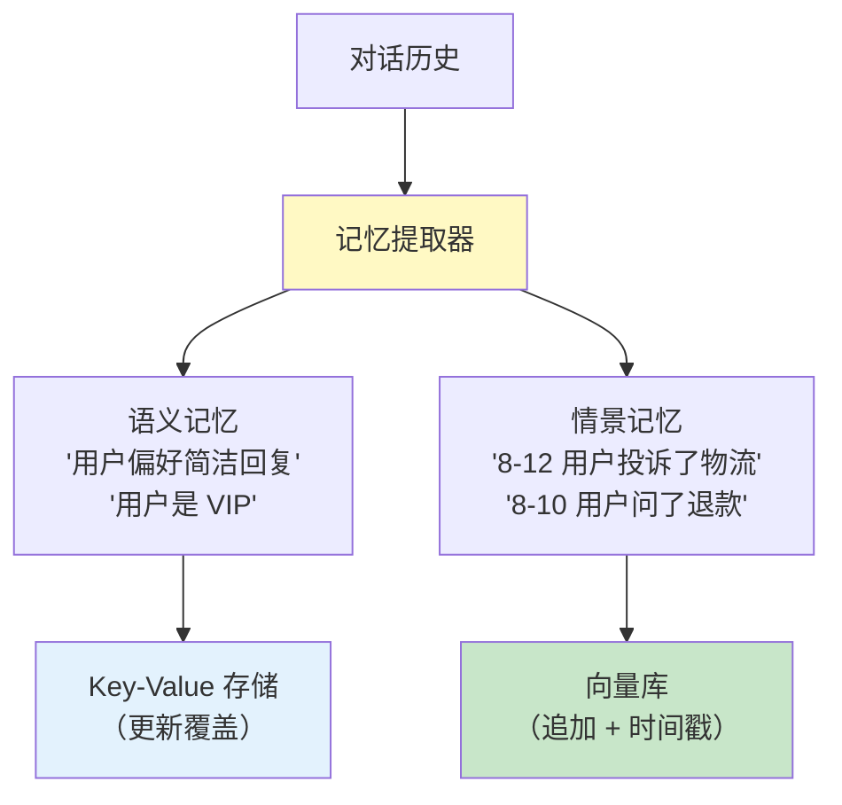

---

## 4. 记忆演化：遗忘、衰减与重要性

人类不会记住所有事情——我们会**遗忘**。这不是缺陷，而是**特性**——遗忘让我们聚焦于重要的信息。Agent 也需要类似机制。

### 4.1 遗忘曲线

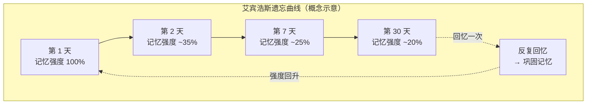

### 4.2 记忆衰减算法

每条记忆有一个**衰减权重**，随时间递减。但**被回忆**（检索命中）会增强权重。

```java
@Service
public class MemoryDecayService {

    private static final double BASE_DECAY_RATE = 0.95;  // 每天衰减 5%
    private static final double RECALL_BOOST = 1.3;      // 每次回忆增强 30%

    /**
     * 计算一条记忆的当前有效权重
     */
    public double calculateEffectiveWeight(MemoryRecord memory) {
        long daysSinceCreation = ChronoUnit.DAYS.between(
            memory.getCreatedAt(), Instant.now());

        long daysSinceLastRecall = ChronoUnit.DAYS.between(
            memory.getLastRecalledAt(), Instant.now());

        // 基础衰减：时间越久越弱
        double timeDecay = Math.pow(BASE_DECAY_RATE, daysSinceCreation);

        // 回忆增强：被回忆过多少次
        double recallMultiplier = Math.pow(RECALL_BOOST, memory.getRecallCount());

        // 重要性加权
        double importance = memory.getImportance();

        // 最终有效权重
        return importance * timeDecay * recallMultiplier;
    }

    /**
     * 定期清理低权重记忆（遗忘机制）
     */
    @Scheduled(cron = "0 0 3 * * *")  // 每天凌晨 3 点
    public void forgetLowWeightMemories() {
        double forgetThreshold = 0.05;  // 低于此权重的记忆被遗忘

        List<MemoryRecord> all = memoryRepo.findAll();
        List<MemoryRecord> toForget = all.stream()
            .filter(m -> calculateEffectiveWeight(m) < forgetThreshold)
            .filter(m -> m.getImportance() < 0.8)  // 高重要性记忆永不遗忘
            .toList();

        memoryRepo.deleteAll(toForget);
        log.info("遗忘清理：删除了 {} 条低权重记忆", toForget.size());
    }
}
```

### 4.3 重要性评分

不同记忆应该有不同的权重。一次普通的"你好"和"用户透露他有严重过敏史"的重要性天差地别。

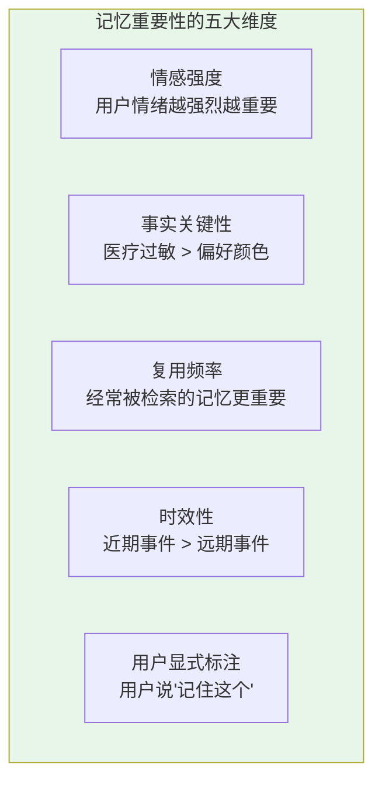

```java
@Service
public class ImportanceScorer {

    private final ChatClient scorer;

    public double score(String content, String userId) {
        String result = scorer.prompt()
            .system("""
                评估以下信息的记忆重要性，输出 0.0-1.0 的分数。
                考虑维度：
                - 是否涉及用户安全 / 健康（如过敏史 → 1.0）
                - 是否涉及核心业务（如订单 / 支付 → 0.8）
                - 是否是稳定偏好（如语言偏好 → 0.6）
                - 是否是一次性信息（如临时天气 → 0.2）
                - 是否是寒暄 / 无意义内容（如"你好" → 0.05）
                """)
            .user(content)
            .call()
            .content();
        return Double.parseDouble(result.trim());
    }
}
```

| 信息类型 | 重要性 | 遗忘策略 |
|---------|--------|---------|
| 医疗 / 安全信息 | 1.0 | 永不遗忘 |
| 核心业务数据 | 0.8-0.9 | 永不遗忘 |
| 用户稳定偏好 | 0.5-0.7 | 缓慢衰减 |
| 具体事件细节 | 0.3-0.5 | 正常衰减 |
| 寒暄 / 无意义 | 0.05-0.1 | 快速遗忘 |

### 4.4 记忆巩固：从情景到语义

人类在睡眠时会将**情景记忆**巩固为**语义记忆**——反复出现的事件模式被提取为通用知识。Agent 也可以做类似处理：

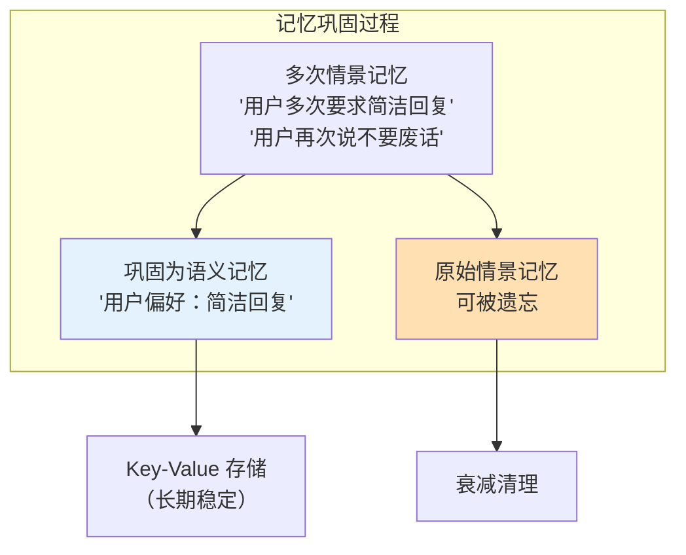

```java
@Scheduled(cron = "0 0 4 * * 0")  // 每周日凌晨 4 点执行巩固
public void consolidateMemories() {
    // 1. 找出高频出现的情景记忆模式
    Map<String, Long> patterns = findRecurringEpisodicPatterns();

    // 2. 将高频模式提取为语义记忆
    patterns.entrySet().stream()
        .filter(e -> e.getValue() >= 3)  // 出现 3 次以上的模式
        .forEach(e -> {
            String semanticKey = extractKey(e.getKey());
            String semanticValue = extractValue(e.getKey());
            profileStore.put(semanticKey, semanticValue);
        });

    // 3. 原始情景记忆降低权重（已巩固到语义层）
    // 下次遗忘清理时会自然回收
}
```

---

## 5. 记忆隔离与多租户

### 5.1 多租户记忆隔离

企业级 Agent 服务多个用户 / 组织，记忆必须严格隔离：

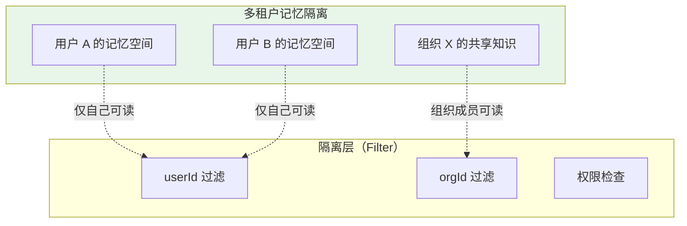

### 5.2 隔离实现

```java
@Service
public class MultiTenantMemoryService {

    /**
     * 写入记忆时强制带 userId
     */
    public void save(String userId, String orgId, MemoryRecord memory) {
        memory.setUserId(userId);
        memory.setOrgId(orgId);
        memory.setCreatedAt(Instant.now());
        memoryStore.save(memory);
    }

    /**
     * 读取时强制过滤——绝不跨租户
     */
    public List<MemoryRecord> recall(String userId, String orgId, String query) {
        return vectorStore.similaritySearch(
            SearchRequest.builder()
                .query(query)
                .topK(5)
                .filterExpression("""
                    userId == '%s' || (orgId == '%s' && scope == 'SHARED')
                    """.formatted(userId, orgId))
                .build()
        );
    }
}
```

### 5.3 记忆权限模型

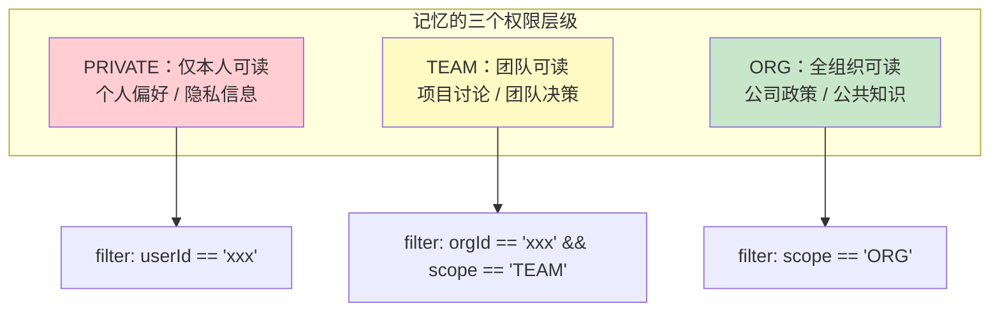

> **安全警告**：多租户记忆隔离是安全底线。**任何记忆检索都必须带 userId/orgId 过滤条件**，绝不能做全库搜索。建议在代码审查时检查每一条 `similaritySearch` 是否包含 filter。

---

## 6. 完整架构：Spring AI 中的高级记忆

### 6.1 整体架构图

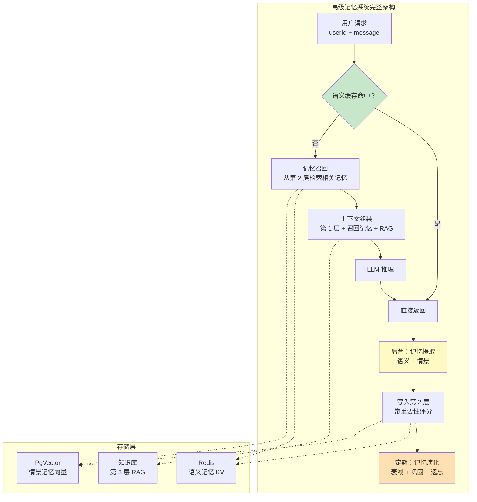

### 6.2 核心 Service 整合

```java
@Service
public class AdvancedMemoryAgent {

    private final ThreeTierMemoryService memory;
    private final TypedMemoryService typedMemory;
    private final MemoryDecayService decay;
    private final ImportanceScorer scorer;
    private final ChatClient agent;

    /**
     * 完整的带记忆 Agent 请求处理
     */
    public String chat(String userId, String userInput) {
        // 1. 召回长期记忆（第 2 层 → 第 1 层）
        String episodicContext = typedMemory.recallEpisodic(
            userId, userInput, Instant.now().minus(Duration.ofDays(30)), Instant.now());

        String semanticContext = typedMemory.loadAllSemantic(userId);

        // 2. 组装增强 Prompt
        String enhancedPrompt = """
            [用户画像]
            %s

            [相关历史记忆]
            %s

            [当前问题]
            %s
            """.formatted(semanticContext, episodicContext, userInput);

        // 3. LLM 推理
        String answer = agent.prompt()
            .system(buildSystemPrompt(userId))
            .user(enhancedPrompt)
            .call()
            .content();

        // 4. 异步提取并存储记忆（不阻塞响应）
        CompletableFuture.runAsync(() -> {
            ExtractionResult extracted = typedMemory.extract(userId, List.of(
                new UserMessage(userInput),
                new AssistantMessage(answer)
            ));
            extracted.getAll().forEach(memory -> {
                memory.setImportance(scorer.score(memory.getContent(), userId));
                typedMemory.save(userId, memory);
            });
        });

        return answer;
    }
}
```

### 6.3 记忆摘要 Advisor

将三层记忆封装为 Spring AI Advisor，对业务代码透明：

```java
public class AdvancedMemoryAdvisor implements BaseAdvisor {

    private final TypedMemoryService typedMemory;
    private final String userId;

    @Override
    public AdvisedRequest before(AdvisedRequest request) {
        // 请求前：召回相关记忆，注入上下文
        String recalled = typedMemory.recallEpisodic(
            userId, request.userText(),
            Instant.now().minus(Duration.ofDays(30)), Instant.now());

        if (!recalled.isEmpty()) {
            // 将记忆作为 system 补充消息注入
            request = request.appendSystem(
                "[相关历史记忆]\n" + recalled);
        }
        return request;
    }

    @Override
    public AdvisedResponse after(AdvisedResponse response) {
        // 请求后：异步提取并存储新记忆
        CompletableFuture.runAsync(() -> {
            typedMemory.extractAndSave(userId,
                response.request().userText(),
                response.content());
        });
        return response;
    }
}

// 使用
ChatClient client = ChatClient.builder(chatModel)
    .defaultAdvisors(new AdvancedMemoryAdvisor(typedMemory, currentUserId))
    .build();
```

---

## 7. 记忆系统的运维

### 7.1 记忆生命周期管理

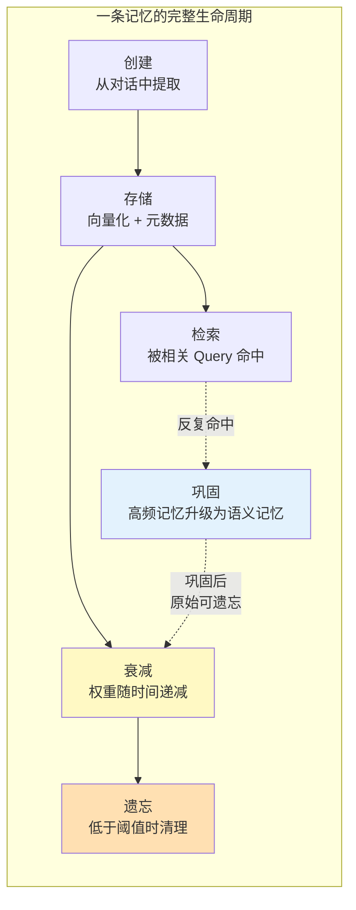

### 7.2 合规与隐私

| 合规要求 | 实现方式 |
|---------|---------|
| 用户要求删除所有记忆 | 按 userId 级联删除（GDPR 被遗忘权） |
| 敏感信息不存储 | 在提取阶段做 PII 检测和脱敏 |
| 记忆有 TTL | 设置过期时间，自动清理 |
| 审计追溯 | 记录每条记忆的来源（conversationId + timestamp） |
| 数据本地化 | 记忆存储按地区分库 |

```java
/**
 * GDPR 被遗忘权：删除用户全部记忆
 */
public void forgetUser(String userId) {
    // 删除语义记忆
    profileStore.deleteByPrefix("user:" + userId + ":");

    // 删除情景记忆
    vectorStore.delete(
        FilterExpressionBuilder.eq("userId", userId).build()
    );

    // 删除会话历史
    chatMemory.clear(userId);

    // 记录审计日志
    auditLog.record("USER_FORGOTTEN", userId, Instant.now());
}
```

---

## 8. 适用场景与不适用场景

### ✅ 适用场景

- 长期陪伴型 Agent（个人助理、心理咨询、学习辅导）
- 个性化推荐型 Agent（需要记住用户偏好）
- 多会话连续服务（跨会话保持上下文）
- 企业级客服系统（记住客户历史交互）
- 需要记忆演化和遗忘的真实智能系统

### ❌ 不适用场景

- 一次性问答（不需要长期记忆）
- 强无状态 API（RESTful 公开服务）
- 数据合规不允许存储用户数据的场景
- 极简原型阶段（先用 MessageWindowChatMemory 跑通）
- 对话轮数极少的场景（短期记忆足够）

---

## 9. 本章总结

| 概念 | 一句话 |
|------|--------|
| **三层记忆架构** | 工作记忆（上下文窗口）→ 长期存储（VectorStore）→ 外部检索（RAG） |
| **语义记忆** | 稳定事实 / 偏好 / 知识，用 Key-Value 存储 |
| **情景记忆** | 具体事件 / 交互记录，用向量库 + 时间戳存储 |
| **记忆衰减** | 权重随时间递减，被回忆时增强 |
| **重要性评分** | 不同信息有不同权重，高重要性永不遗忘 |
| **记忆巩固** | 高频情景记忆巩固为语义记忆 |
| **多租户隔离** | 每次检索强制带 userId/orgId 过滤 |
| **遗忘机制** | 定期清理低权重记忆，聚焦重要信息 |

**本系列到此完成**。回顾整个进阶教程：
- [29-上下文工程](29-上下文工程.md) — 上下文窗口的 RAM 管理
- [30-高级 RAG 与 Agentic RAG](30-高级RAG与AgenticRAG.md) — 从塞文档到自主检索
- [31-Agent 工作流编排](31-Agent工作流编排.md) — DAG / 状态机 / 条件分支
- [32-自我反思与 Agent 评估](32-自我反思与Agent评估.md) — 自评迭代 + 质量度量
- [33-Agent 性能优化](33-Agent性能优化.md) — 延迟 / 成本 / 并发优化
- **34-高级记忆架构** — 三层记忆 + 演化 + 遗忘

---

> **前置回顾**：[04-记忆与会话管理](04-记忆与会话管理.md)介绍了 MessageWindowChatMemory——本章是它的"企业级终极进化版"。
> **上下文协同**：记忆的召回结果需要注入上下文窗口，拼接策略详见 [29-上下文工程](29-上下文工程.md)。
> **性能考量**：记忆检索的延迟优化（语义缓存 / 并行检索），详见 [33-Agent 性能优化](33-Agent性能优化.md)。
> **RAG 对比**：第 3 层外部检索与 [05-RAG 检索增强生成](05-RAG检索增强生成.md) 和 [30-高级 RAG](30-高级RAG与AgenticRAG.md) 的技术栈一致，区别在于记忆是"个人化的 RAG"。
