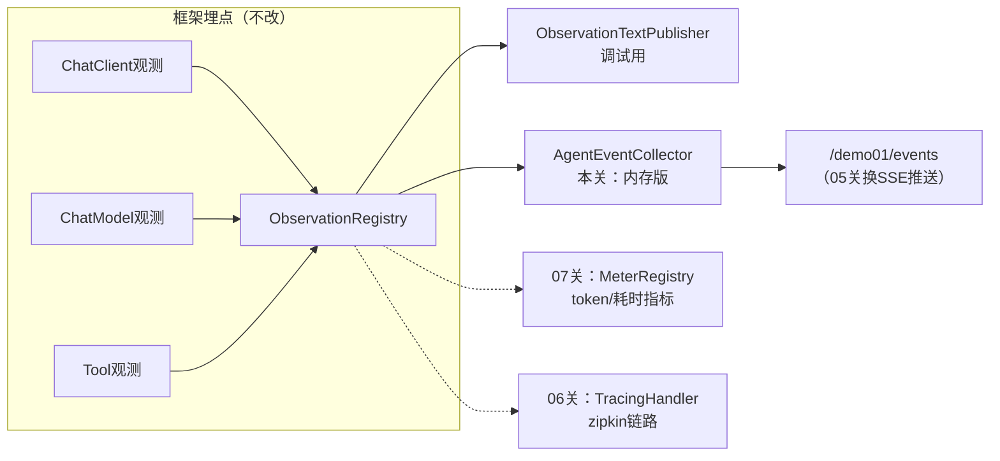
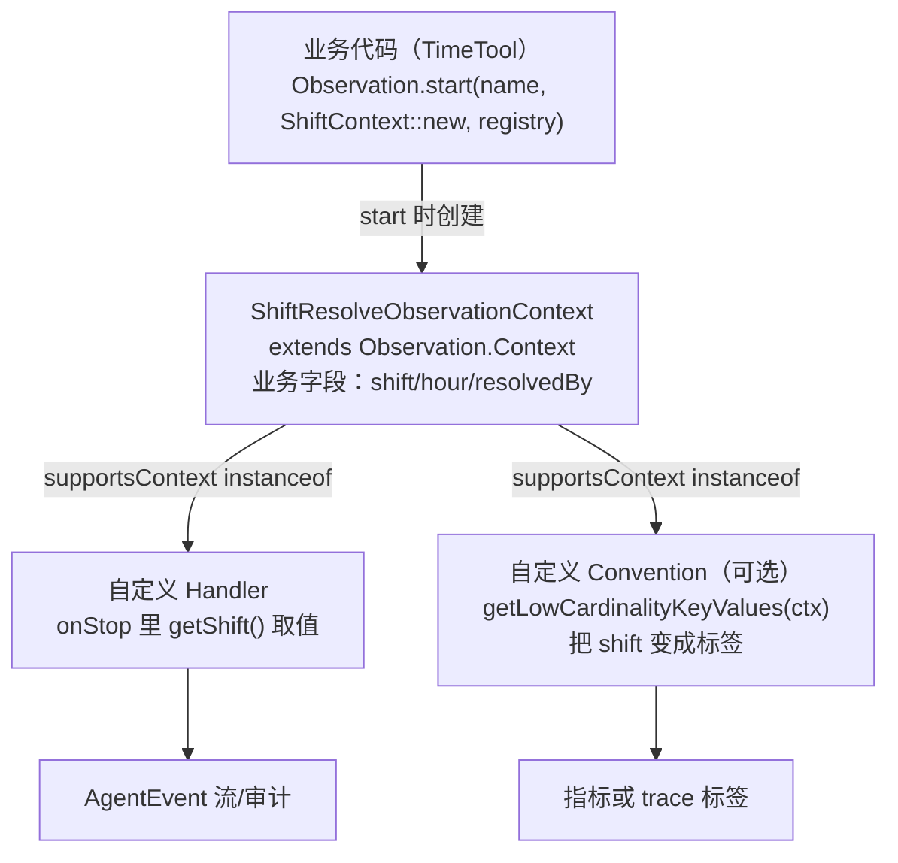

# 03 自定义 Handler：把 Agent 各阶段输出收集成事件流

> **定位**：console 散落的文本只适合单次调试。这一关做你要的第二层——**自定义消费**：写一个 Agent 事件收集 Handler，把 LLM 调用、工具执行、错误按阶段抽取成结构化事件（`AgentEvent`），存进按 traceId 归组的会话缓冲，并暴露查询接口。它是 05 关前端时间线的直接数据源。
>
> **前置阅读**：[教程 02]。

---

## 3.1 设计先行：工业级的事件模型

不直接把 `Observation.Context` 塞给前端——Context 是框架对象（含不可序列化字段），且暴露面失控。正确做法：**在 Handler 里抽取领域字段，产出自己的 DTO**（这与 CLAUDE.md"存可序列化 Map、读时重建"的教训同源——凡跨边界传对象，先定义稳定契约）：

```java
// src/main/java/demo/demo01/obs/AgentEvent.java
package demo.demo01.obs;

import java.time.Instant;

/** Agent 阶段事件的稳定契约：阶段类型 + 摘要 + 时间戳 */
public record AgentEvent(
        String phase,      // CHAT_CLIENT / LLM / TOOL / ERROR / BUSINESS
        String name,       // span 名或工具名
        String detail,     // 摘要（prompt片段/参数/结果）
        Instant time) {
}
```

## 3.2 收集器：一个 Handler，认领三类 Context

```java
// src/main/java/demo/demo01/obs/AgentEventCollector.java（完整文件，v1）
package demo.demo01.obs;

import io.micrometer.observation.Observation;
import io.micrometer.observation.ObservationHandler;
import org.springframework.ai.chat.client.observation.ChatClientObservationContext;
import org.springframework.ai.chat.observation.ChatModelObservationContext;
import org.springframework.ai.tool.observation.ToolCallingObservationContext;
import org.springframework.stereotype.Component;

import java.time.Instant;
import java.util.List;
import java.util.concurrent.ConcurrentHashMap;
import java.util.concurrent.CopyOnWriteArrayList;

@Component
public class AgentEventCollector implements ObservationHandler<Observation.Context> {

    /** 分组键 -> 事件序列；06 关引入 Tracer 后 key 换成真实 traceId，此处先用固定分组占位 */
    private final ConcurrentHashMap<String, List<AgentEvent>> buffer = new ConcurrentHashMap<>();

    @Override
    public boolean supportsContext(Observation.Context context) {
        return context instanceof ChatClientObservationContext
                || context instanceof ChatModelObservationContext
                || context instanceof ToolCallingObservationContext;
    }

    @Override
    public void onStop(Observation.Context context) {
        if (context instanceof ChatClientObservationContext) {
            accept(new AgentEvent("CHAT_CLIENT", "chat-client", "请求参数已送入", Instant.now()));
        } else if (context instanceof ChatModelObservationContext cm) {
            String prompt = String.valueOf(cm.getRequest().getContents());
            accept(new AgentEvent("LLM", "chat-model", "prompt摘要: " + prompt.substring(0, Math.min(80, prompt.length())), Instant.now()));
        } else if (context instanceof ToolCallingObservationContext tc) {
            accept(new AgentEvent("TOOL", tc.getToolDefinition().name(),
                    "参数=" + tc.getToolCallArguments() + " 结果=" + brief(tc.getToolCallResult()), Instant.now()));
        }
    }

    @Override
    public void onError(Observation.Context context) {
        accept(new AgentEvent("ERROR", "error", String.valueOf(context.getError()), Instant.now()));
    }

    /**
     * 事件唯一入口：分组入 buffer。
     * 设为 public 是刻意的——05 关的 SSE 推送在 09 关被 RAG Handler 复用，都走这个口，
     * 保证"任何来源的事件都经过同一条管线"。
     */
    public void accept(AgentEvent event) {
        buffer.computeIfAbsent(currentGroup(), k -> new CopyOnWriteArrayList<>()).add(event);
    }

    private String brief(String result) {
        if (result == null) return "null";
        return result.length() > 100 ? result.substring(0, 100) + "..." : result;
    }

    /** demo：固定分组；生产用 06 关 traceId 或业务会话号 */
    private String currentGroup() { return "default"; }

    public List<AgentEvent> drain(String group) { return buffer.getOrDefault(group, List.of()); }

    public List<AgentEvent> drain() { return drain("default"); }
}
```

要点：

- **`instanceof` 模式匹配分派**——一个 Handler 认领三类 Context，比写三个类更聚拢"事件流"这个概念；类多了再拆是 04 关之后的重构选项。
- **`accept()` 是事件唯一入口**——本关只做"入 buffer"，05 关在同一个方法里加 SSE 广播、09 关的 RAG Handler 也调它：管线单一出口，前端时间线不用区分事件来自哪个 Handler。
- **只存摘要不存全文**——prompt/结果截断。这是工业系统的边界纪律：观测系统自身不能成为内存泄漏源（LLM 长文本、大 JSON 结果很常见）。
- **ConcurrentHashMap + CopyOnWriteArrayList**——Handler 回调可能来自不同线程（WebFlux 事件循环），写侧并发安全是底线。

## 3.3 暴露查询接口（为 05 关前端做准备）

`InspectionController` 本关后的**完整文件**（v2：注入 `AgentEventCollector` + `/events`；ChatClient 仍由 `ChatConfig` 提供，demo01 风格纯注入）：

```java
// src/main/java/demo/demo01/controller/InspectionController.java（本关完整版）
package demo.demo01.controller;

import demo.demo01.obs.AgentEvent;
import demo.demo01.obs.AgentEventCollector;
import org.springframework.ai.chat.client.ChatClient;
import org.springframework.beans.factory.annotation.Autowired;
import org.springframework.web.bind.annotation.GetMapping;
import org.springframework.web.bind.annotation.RequestMapping;
import org.springframework.web.bind.annotation.RestController;

import java.util.List;

@RestController
@RequestMapping("/demo01")
public class InspectionController {

    @Autowired
    private ChatClient client;                 // ChatConfig v2 提供（TimeTool 已带观测）

    @Autowired
    private AgentEventCollector eventCollector;

    @GetMapping("/inspect")
    public String inspect(String prompt) {
        return client.prompt().user(prompt).call().content();
    }

    @GetMapping("/events")
    public List<AgentEvent> events() {
        return eventCollector.drain();
    }
}
```

## 3.4 为什么这个架构是"工业可落地"的



这个"一源多消费者"结构就是管控分离思想在观测层的投影：**埋点（Data Plane）与消费（不同受众的观测视图）解耦**。生产演进路径也很清晰：把 `buffer` 换成 Redis/MQ、把 `drain` 换成 SSE——类边界都不用动。内存版之所以"简约但架构正确"，正因为它守住了接口契约（`AgentEvent`）和职责边界。

**何时该自定义 Handler、何时不用**：

| 场景 | 选择 |
|---|---|
| 只是本地调试看过程 | `ObservationTextPublisher` 够了，别写代码 |
| 要把过程给前端/审计/落库 | 自定义 Handler + 稳定 DTO（本关姿势） |
| 只要指标（QPS/耗时/token） | 不写 Handler，用 Micrometer（07 关，`ChatModelMeterObservationHandler` 已内置） |
| 要改标签/名称 | 不是 Handler 的事，用 Convention（04 关） |

## 3.5 进阶：仿 ToolCallingObservationContext 造自己的领域 Context

### 3.5.1 为什么要自定义 Context

01 关你给 `getCurrentShift` 手动埋观测时，用的是裸 `Observation.Context`——**业务数据（班次、小时数）只能靠外部变量记住，观测里"看不见"它们**。回看 Spring AI 的做法：`ToolCallingObservationContext extends Observation.Context`，把 `toolDefinition/toolCallArguments/toolCallResult` 全做成 Context 的字段，Handler/Convention 用 `instanceof` 精确认领、用类型安全的 getter 取值（javap 实证：该类提供 `getToolCallArguments()`/`setToolCallResult()` 等访问器 + `Builder` 六件套）。

这就是**自定义 Context 埋点**的标准范式，适合你项目里所有"框架不认识、但值得观测的业务操作"：

| 你的观测需求 | 该不该自定义 Context |
|---|---|
| 框架已有观测点（LLM/工具/ChatClient），只是想消费 | **不用**——直接 `instanceof` 认领框架 Context（本关 3.2 的姿势） |
| 手动埋自己的业务操作，且结果要被 Handler/Convention 消费 | **用**——业务字段进 Context，类型安全且 `supportsContext` 精确路由 |
| 只是本地看看耗时，没有任何下游消费 | 不用——裸 `Observation.Context` 足够（01 关姿势） |

`Observation.Context` 本身就是个"Map + 领域字段"容器（javap 实证：`put(Object,T)`/`get(Object)` 泛型键值对 + `getName()`/`getError()` 等），继承它 = 免费获得 Map 能力和生命周期回调资格，你只需加自己的领域字段。

### 3.5.2 三件套：Context + Convention + Handler

自定义 Context 埋点的完整拼装（全部 API 已对本地 micrometer-observation jar javap 实证）：



动手：把 01 关裸 Context 的 `shift.resolve` 升级为类型化观测。三个新文件 + TimeTool 升 v3（本关后**完整快照**）：

**① 领域 Context——业务字段的类型安全载体**（完整文件）：

```java
// src/main/java/demo/demo01/obs/ShiftResolveObservationContext.java
package demo.demo01.obs;

import io.micrometer.observation.Observation.Context;

/**
 * 班次判定的领域观测上下文——仿 ToolCallingObservationContext 的"Context 即领域数据袋"范式。
 * 业务字段全部 private + getter，resolve 结果在计算完成后 set 进来（onStop 时 Handler 才取得到）。
 */
public class ShiftResolveObservationContext extends Context {

    private final int hour;          // 判定依据（start 前就已知 → 构造传入）
    private String shift;            // 判定结果（start 后才产出 → setter 回填）
    private String resolvedBy;       // 判定来源（排班表/本地规则），便于区分慢/快路径

    public ShiftResolveObservationContext(int hour) {
        this.hour = hour;
    }

    public int getHour() { return hour; }
    public String getShift() { return shift; }
    public String getResolvedBy() { return resolvedBy; }

    public void setResolved(String shift, String resolvedBy) {
        this.shift = shift;
        this.resolvedBy = resolvedBy;
    }
}
```

**② Convention——把领域字段翻译成低基数标签**（完整文件；也可不写，见 3.5.3）：

```java
// src/main/java/demo/demo01/obs/ShiftResolveObservationConvention.java
package demo.demo01.obs;

import io.micrometer.common.KeyValue;
import io.micrometer.common.KeyValues;
import io.micrometer.observation.ObservationConvention;
import org.springframework.stereotype.Component;

/**
 * shift.resolve 观测的命名约定：shift（3 个可枚举值，低基数）进标签，
 * hour 属于高基数倾向字段（24 个值勉强可枚举，但聚合价值低）放高基数通道——只进 trace 不进指标。
 * 注册方式：实现 GlobalObservationConvention 并声明为 Bean，Boot 自动装配进 ObservationRegistry。
 */
@Component
public class ShiftResolveObservationConvention implements ObservationConvention<ShiftResolveObservationContext> {

    @Override
    public KeyValues getLowCardinalityKeyValues(ShiftResolveObservationContext context) {
        return KeyValues.of(KeyValue.of("shift", String.valueOf(context.getShift())));
    }

    @Override
    public KeyValues getHighCardinalityKeyValues(ShiftResolveObservationContext context) {
        return KeyValues.of(KeyValue.of("shift.resolve.hour", String.valueOf(context.getHour())));
    }

    @Override
    public boolean supportsContext(io.micrometer.observation.Observation.Context context) {
        return context instanceof ShiftResolveObservationContext;   // ★ 类型路由：只认领自己的 Context
    }
}
```

> 装配说明：Boot 的 Observation 自动配置会把容器里所有 `ObservationHandler` 与 `GlobalObservationConvention` Bean 注册进 `ObservationRegistry`（javap 实证 `ObservationConfig.observationHandler(...)/observationConvention(GlobalObservationConvention)`）。注意 Convention 要被全局注册必须实现 **`GlobalObservationConvention`** 子接口（上面的类为教学清晰实现的是 `ObservationConvention`——按 04 关的 `@Bean` 定制风格挂到具体观测时无需 Global；若要全局生效把 implements 换成 `GlobalObservationConvention`，两者方法签名完全一致）。

**③ Handler 消费——AgentEventCollector 加一个认领分支**（v2 增量，加在类内即可）：

```java
// AgentEventCollector 内新增（v2 增量；imports 补 demo.demo01.obs 同包无需，ChatModel 那段不变）
@Override
public boolean supportsContext(Observation.Context context) {
    return context instanceof ChatClientObservationContext
            || context instanceof ChatModelObservationContext
            || context instanceof ToolCallingObservationContext
            || context instanceof ShiftResolveObservationContext;   // ★ 新增认领
}

// onStop 的分派链里新增一个分支：
else if (context instanceof ShiftResolveObservationContext sr) {
    accept(new AgentEvent("BUSINESS", "shift.resolve",
            "班次=" + sr.getShift() + " 来源=" + sr.getResolvedBy()
                    + " hour=" + sr.getHour(), Instant.now()));
}
```

**④ 业务代码升级——start 时喂 Context，结果回填**（TimeTool v3 完整文件）：

```java
// src/main/java/demo/demo01/tools/TimeTool.java（本关完整版 v3）
package demo.demo01.tools;

import demo.demo01.obs.ShiftResolveObservationContext;
import io.micrometer.observation.Observation;
import io.micrometer.observation.ObservationRegistry;
import org.springframework.ai.tool.annotation.Tool;
import org.springframework.beans.factory.annotation.Autowired;

import java.time.LocalDateTime;
import java.time.format.DateTimeFormatter;

public class TimeTool {

    @Autowired
    private ObservationRegistry registry;

    @Tool(description = "获取当前系统时间，格式 yyyy-MM-dd HH:mm:ss。巡检、工单、报告都需要时间戳时必须先调用此工具")
    public String getCurrentTime() {
        return LocalDateTime.now().format(DateTimeFormatter.ofPattern("yyyy-MM-dd HH:mm:ss"));
    }

    @Tool(description = "获取当前班次（morning/afternoon/night），用于巡检排班和交接记录")
    public String getCurrentShift() {
        int hour = LocalDateTime.now().getHour();
        // ★ 类型化观测：Supplier 提供自己的 Context，框架在 start 时创建并回调 Handler/Convention
        Observation obs = Observation.start("shift.resolve",
                () -> new ShiftResolveObservationContext(hour), registry);
        try (Observation.Scope scope = obs.openScope()) {
            String shift = hour < 8 ? "morning" : hour < 16 ? "afternoon" : "night";
            ShiftResolveObservationContext ctx = (ShiftResolveObservationContext) obs.getContext();
            ctx.setResolved(shift, "local-rule");   // ★ 结果回填——onStop 前必须完成，Handler 才取得到
            return "{\"shift\":\"" + shift + "\",\"hour\":" + hour + "}";
        } catch (Exception e) {
            obs.error(e);
            throw e;
        } finally {
            obs.stop();
        }
    }
}
```

`ChatConfig` 不变（v2 已把 TimeTool 注册为 Bean）。`Observation.start(String, Supplier<T>, ObservationRegistry)` 与 `obs.getContext()` 均已 javap 实证存在。

### 3.5.3 关键机制与易错点

- **`Supplier<T>` 在 start 时机执行**——`Observation.start("shift.resolve", () -> new ShiftResolveObservationContext(hour), registry)` 的 lambda 延迟到 start 才构造 Context，"start 前已知"的字段用闭包捕获传入；
- **结果必须 stop 前回填**——Handler 的 `onStop` 与 Convention 的标签方法都在 stop 边界触发，之后 set 的字段无人看见。这是该范式最常见的 bug："明明 set 了，事件里却是 null"——多半是把回填写在了 `obs.stop()` 之后（或 observe() 的 lambda 外）；
- **`supportsContext` 是唯一路由器**——Registry 广播给所有 Handler，靠 `instanceof` 各取所需；Context 类型就是你观测点的"身份证"；
- **Convention 是可选件**——不写 Convention，Console/Handler 消费照常；写了才有标签（供 07 关指标分组）。日常一步式写法也可用 `observe()`：`Observation.createNotStarted(name, supplier, registry).observe(() -> { ... 回填 ... })`，lambda 内回填天然满足"stop 前完成"；
- **别把敏感/大文本放 Context 字段**——Context 会流经所有 Handler（含未来的 tracing 导出），遵守 3.2 的截断纪律。

### 3.5.4 Postman 验证（本节专属）

| 用例 | 方法/URL | 现象 |
|---|---|---|
| 触发班次判定 | `GET /demo01/inspect?prompt=现在是什么班次？` 后查 `GET /demo01/events` | 出现 `phase=BUSINESS, name=shift.resolve`，detail 含 `班次=... 来源=local-rule hour=...` |
| Convention 生效 | 观察 console 的 `shift.resolve` span 输出 | KeyValues 含 `shift='...'`（低基数）与 `shift.resolve.hour='...'`（高基数通道） |

## 3.6 Postman 测试

| 用例 | 方法/URL | 现象 |
|---|---|---|
| 触发一轮工具调用 | `GET http://localhost:8080/demo01/inspect?prompt=现在几点？当前是什么班次？给交接记录写一句总结` | 返回自然语言结论 |
| 查看事件流 | `GET http://localhost:8080/demo01/events` | JSON 数组，按序出现 `CHAT_CLIENT` → `LLM` → `TOOL(getCurrentTime)` → `TOOL(getCurrentShift)` → `LLM`，与你 01 关看到的 span 树一一对应 |
| 错误事件 | 在 `getCurrentShift` 里临时抛异常，重复上一用例，再查 `/events` | 数组中出现 `phase=ERROR` 条目，detail 含异常信息 |
| 无工具对比 | `GET /demo01/inspect?prompt=你好` 后查 `/events` | 只有 `CHAT_CLIENT`+`LLM`，无 `TOOL` |

**验证要点**：`/events` 的顺序与 `ObservationTextPublisher` 的输出顺序一致——同一事件流、两种消费形态，这就是 02 关广播机制的实证。

## 3.7 本关沉淀

- 自定义 Handler 的三步：稳定 DTO → 类型化认领 → `onStop` 抽取（错误另挂 `onError`）；
- 截断、并发安全、不外泄框架对象——观测代码自己的工程纪律；
- 自定义 Context 埋点（仿 ToolCallingObservationContext）：领域字段进 Context、Supplier 闭包喂初值、结果 stop 前回填、`supportsContext` 类型路由；Convention 可选，负责把领域字段翻译成标签；
- "内存 buffer + REST 查询"是通往生产存储（Redis/MQ）的最小正确骨架。

**下一关**：事件里想带班次等业务标签？想对观测内容做统一加工？→ Convention 与 Filter。[教程 04]
