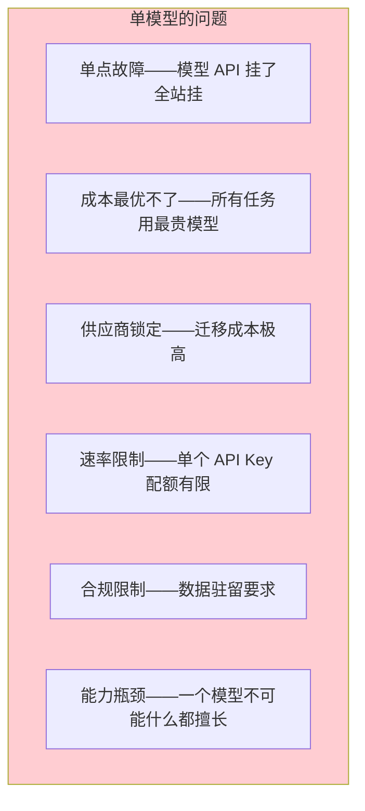
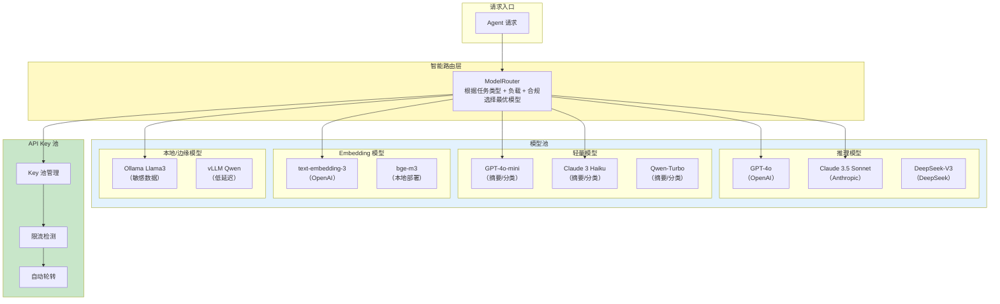
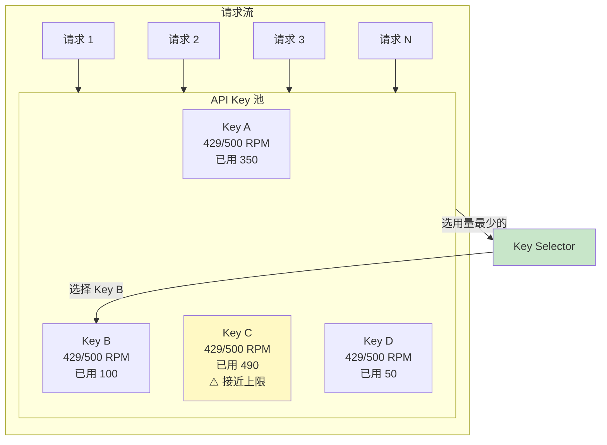
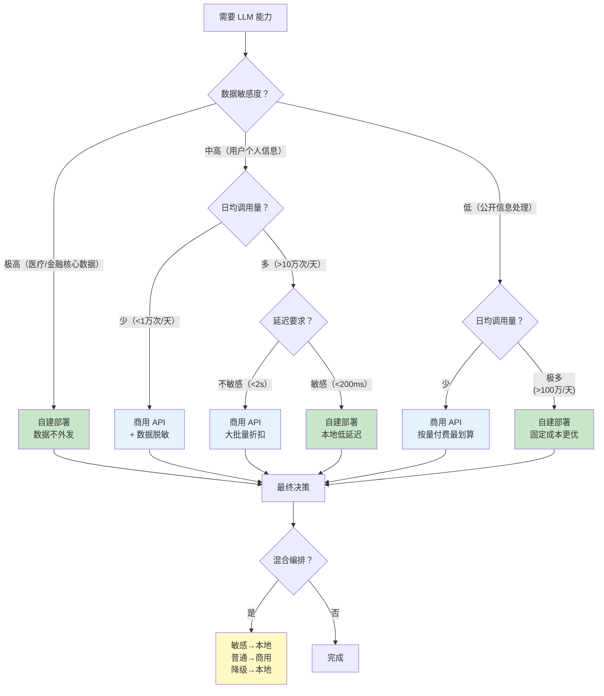

# 39-多模型协作与供应策略

> **定位**：讲透生产级 Agent 的模型编排策略——不同任务用不同模型（推理用强模型、摘要用小模型、Embedding 用专用模型）、多供应商冗余（同一模型多供应商备份）、API Key 池管理（限流配额轮转）、自建 vs 商用决策框架、边缘部署与云模型混合编排。读完这篇，你的 Agent 不再被单一模型绑定，成本可控且高可用。
>
> **读者画像**：正在设计生产级 Agent 架构，需要优化模型选择、降低成本、提高可用性的架构师。
>
> **前置阅读**：[37-响应式错误处理](37-响应式错误处理.md)、[38-Agent治理与合规框架](38-Agent治理与合规框架.md)。

---

## 1. 为什么要做多模型编排

### 1.1 单一模型的局限性

生产环境中只依赖一个模型存在多个问题：



### 1.2 多模型编排的价值

| 策略 | 价值 |
|------|------|
| **任务路由** | 简单任务用小模型（便宜快），复杂任务用大模型（贵但好） |
| **供应商冗余** | 主供应商挂了，自动切换备选 |
| **API Key 池** | 多个 Key 轮转，突破单 Key 限流 |
| **混合部署** | 敏感数据用本地模型，非敏感用云模型 |
| **模型降级** | 高负载时自动降级到更小更快的模型 |

---

## 2. 多模型编排架构



---

## 3. 任务路由——不同任务用不同模型

### 3.1 任务分类与模型匹配

```java
public enum TaskType {
    // 推理类——需要强模型
    COMPLEX_REASONING("复杂推理", ModelTier.PREMIUM),
    CODE_GENERATION("代码生成", ModelTier.PREMIUM),
    MULTI_STEP_PLANNING("多步规划", ModelTier.PREMIUM),

    // 轻量类——用小模型
    SUMMARIZATION("摘要", ModelTier.LIGHT),
    CLASSIFICATION("分类", ModelTier.LIGHT),
    SENTIMENT_ANALYSIS("情感分析", ModelTier.LIGHT),
    KEYWORD_EXTRACTION("关键词提取", ModelTier.LIGHT),

    // 专用类
    EMBEDDING("向量化", ModelTier.EMBEDDING),
    TRANSLATION("翻译", ModelTier.STANDARD),
    SIMPLE_QA("简单问答", ModelTier.STANDARD),

    // 敏感类——用本地模型
    SENSITIVE_QUERY("敏感数据查询", ModelTier.LOCAL);

    private final String description;
    private final ModelTier tier;

    TaskType(String description, ModelTier tier) {
        this.description = description;
        this.tier = tier;
    }
}

public enum ModelTier {
    PREMIUM,    // 强模型：GPT-4o / Claude 3.5 Sonnet
    STANDARD,   // 标准模型：GPT-4o-mini / Claude 3 Haiku
    LIGHT,      // 轻量模型：GPT-4o-mini / Qwen-Turbo
    EMBEDDING,  // 专用 Embedding
    LOCAL       // 本地模型
}
```

### 3.2 模型路由器

```java
import org.springframework.stereotype.Service;
import java.util.*;

@Service
public class ModelRouter {

    private final Map<ModelTier, List<ModelEndpoint>> modelPool;
    private final LoadBalancer loadBalancer;
    private final ComplianceChecker complianceChecker;

    public ModelRouter(List<ModelEndpoint> endpoints,
                       LoadBalancer loadBalancer,
                       ComplianceChecker complianceChecker) {
        this.loadBalancer = loadBalancer;
        this.complianceChecker = complianceChecker;
        this.modelPool = groupByTier(endpoints);
    }

    /**
     * 根据任务类型选择模型
     */
    public Mono<ModelEndpoint> selectModel(TaskType taskType, String userId, String region) {
        ModelTier tier = taskType.tier;
        List<ModelEndpoint> candidates = modelPool.getOrDefault(tier, List.of());

        // 1. 合规过滤——排除不满足数据驻留要求的模型
        List<ModelEndpoint> compliant = candidates.stream()
            .filter(ep -> complianceChecker.isCompliant(ep, region))
            .toList();

        if (compliant.isEmpty()) {
            return Mono.error(new NoAvailableModelException(
                "没有满足合规要求的模型 for tier=" + tier + ", region=" + region));
        }

        // 2. 健康过滤——排除不可用的端点
        List<ModelEndpoint> healthy = compliant.stream()
            .filter(ModelEndpoint::isHealthy)
            .filter(ep -> ep.hasAvailableKey())
            .toList();

        if (healthy.isEmpty()) {
            // 尝试降级到更低的 tier
            return fallbackToLowerTier(tier, userId, region);
        }

        // 3. 负载均衡——从候选中选一个
        return Mono.just(loadBalancer.select(healthy));
    }

    private Map<ModelTier, List<ModelEndpoint>> groupByTier(List<ModelEndpoint> endpoints) {
        Map<ModelTier, List<ModelEndpoint>> pool = new EnumMap<>(ModelTier.class);
        for (ModelEndpoint ep : endpoints) {
            pool.computeIfAbsent(ep.tier(), k -> new ArrayList<>()).add(ep);
        }
        return pool;
    }

    private Mono<ModelEndpoint> fallbackToLowerTier(ModelTier tier,
                                                      String userId, String region) {
        ModelTier fallback = switch (tier) {
            case PREMIUM -> ModelTier.STANDARD;
            case STANDARD -> ModelTier.LIGHT;
            default -> null;
        };

        if (fallback == null) {
            return Mono.error(new NoAvailableModelException("所有模型均不可用"));
        }

        log.warn("Tier {} 无可用模型，降级到 {}", tier, fallback);
        return selectModel(forTier(fallback), userId, region);
    }
}
```

### 3.3 负载均衡策略

```java
public interface LoadBalancer {
    ModelEndpoint select(List<ModelEndpoint> candidates);
}

/**
 * 加权随机——按权重分配流量
 */
@Component("weightedLoadBalancer")
public class WeightedLoadBalancer implements LoadBalancer {

    @Override
    public ModelEndpoint select(List<ModelEndpoint> candidates) {
        int totalWeight = candidates.stream()
            .mapToInt(ModelEndpoint::weight)
            .sum();

        int random = ThreadLocalRandom.current().nextInt(totalWeight);
        int cumulative = 0;

        for (ModelEndpoint ep : candidates) {
            cumulative += ep.weight();
            if (random < cumulative) return ep;
        }

        return candidates.get(candidates.size() - 1);
    }
}

/**
 * 最低延迟优先——选择响应最快的模型
 */
@Component("latencyLoadBalancer")
public class LatencyLoadBalancer implements LoadBalancer {

    @Override
    public ModelEndpoint select(List<ModelEndpoint> candidates) {
        return candidates.stream()
            .min(Comparator.comparingDouble(ModelEndpoint::getAvgLatencyMs))
            .orElse(candidates.get(0));
    }
}

/**
 * 最低成本优先——选择最便宜的模型
 */
@Component("costLoadBalancer")
public class CostLoadBalancer implements LoadBalancer {

    @Override
    public ModelEndpoint select(List<ModelEndpoint> candidates) {
        return candidates.stream()
            .min(Comparator.comparingDouble(ModelEndpoint::getCostPerToken))
            .orElse(candidates.get(0));
    }
}
```

---

## 4. 多供应商冗余

### 4.1 同一模型的多供应商备份

```java
public record ModelEndpoint(
    String name,              // "openai-gpt4o" / "azure-gpt4o-eastus"
    ModelTier tier,
    String provider,          // "OpenAI" / "Azure" / "AWS Bedrock"
    String baseUrl,
    String modelName,
    int weight,               // 流量权重
    double costPerToken,      // 每千 Token 成本（美元）
    double avgLatencyMs,      // 平均延迟
    boolean healthy,          // 健康状态
    List<ApiKey> apiKeys,     // 绑定的 API Key 池
    Set<String> regions       // 支持的地区
) {
    public boolean hasAvailableKey() {
        return apiKeys.stream().anyMatch(ApiKey::isAvailable);
    }

    public double getAvgLatencyMs() { return avgLatencyMs; }
    public double getCostPerToken() { return costPerToken; }
}

// 同一模型（GPT-4o）的多个供应商
@Bean
public List<ModelEndpoint> gpt4oEndpoints() {
    return List.of(
        new ModelEndpoint("openai-gpt4o", ModelTier.PREMIUM,
            "OpenAI", "https://api.openai.com", "gpt-4o",
            50,   // 50% 流量
            0.01, // $0.01/1K tokens
            800,
            true,
            openAIKeys,
            Set.of("US", "EU", "OTHER")
        ),
        new ModelEndpoint("azure-gpt4o-eastus", ModelTier.PREMIUM,
            "Azure", "https://xxx.openai.azure.com", "gpt-4o",
            30,   // 30% 流量
            0.01,
            600,
            true,
            azureKeys,
            Set.of("US", "EU", "OTHER")
        ),
        new ModelEndpoint("aws-bedrock-gpt4o", ModelTier.PREMIUM,
            "AWS", "https://bedrock.aws.amazon.com", "gpt-4o",
            20,   // 20% 流量
            0.01,
            700,
            true,
            awsKeys,
            Set.of("US", "EU", "OTHER")
        )
    );
}
```

### 4.2 自动故障切换

```java
@Service
public class FailoverChatClient {

    private final ModelRouter modelRouter;

    /**
     * 调用 LLM——自动故障切换
     */
    public Mono<String> call(TaskType taskType, String prompt, String userId, String region) {
        return modelRouter.selectModel(taskType, userId, region)
            .flatMap(endpoint -> doCallWithFailover(endpoint, taskType, prompt, userId, region));
    }

    private Mono<String> doCallWithFailover(ModelEndpoint endpoint, TaskType taskType,
                                             String prompt, String userId, String region) {
        return doCall(endpoint, prompt)
            .timeout(Duration.ofSeconds(30))
            // 失败时标记端点不健康
            .doOnError(error -> {
                log.warn("端点 {} 调用失败：{}", endpoint.name(), error.getMessage());
                endpoint.markUnhealthy(error);
            })
            // 故障切换——选择另一个端点重试
            .onErrorResume(error -> {
                log.info("故障切换：从 {} 切换到备选模型", endpoint.name());
                return modelRouter.selectModel(taskType, userId, region)
                    .filter(newEndpoint -> !newEndpoint.name().equals(endpoint.name()))
                    .flatMap(newEndpoint -> doCall(newEndpoint, prompt)
                        .doOnNext(result -> log.info(
                            "故障切换成功：{} → {}", endpoint.name(), newEndpoint.name()))
                    );
            });
    }

    private Mono<String> doCall(ModelEndpoint endpoint, String prompt) {
        // 从 Key 池获取一个可用的 Key
        ApiKey key = endpoint.acquireKey();

        return WebClient.create(endpoint.baseUrl())
            .post()
            .uri("/v1/chat/completions")
            .header("Authorization", "Bearer " + key.value())
            .bodyValue(Map.of(
                "model", endpoint.modelName(),
                "messages", List.of(Map.of("role", "user", "content", prompt))
            ))
            .retrieve()
            .bodyToMono(String.class)
            .doFinally(signal -> key.release());
    }
}
```

---

## 5. API Key 池管理

### 5.1 为什么要 Key 池

每个 LLM 供应商对单个 API Key 都有速率限制（RPM = 每分钟请求数，TPM = 每分钟 Token 数）。突破限制的方法是使用多个 Key 轮转：



### 5.2 Key 池实现

```java
import org.springframework.stereotype.Component;
import java.util.*;
import java.util.concurrent.*;
import java.util.concurrent.atomic.AtomicInteger;

@Component
public class ApiKeyPool {

    private final Map<String, List<ManagedKey>> pools = new ConcurrentHashMap<>();

    /**
     * 注册 Key 池
     */
    public void registerPool(String poolName, List<String> keys, int rateLimitPerMinute) {
        List<ManagedKey> managedKeys = keys.stream()
            .map(key -> new ManagedKey(key, rateLimitPerMinute))
            .toList();
        pools.put(poolName, new CopyOnWriteArrayList<>(managedKeys));
    }

    /**
     * 获取一个可用的 Key——选择使用量最低的
     */
    public Optional<ManagedKey> acquireKey(String poolName) {
        List<ManagedKey> keys = pools.get(poolName);
        if (keys == null || keys.isEmpty()) return Optional.empty();

        // 清理过期计数
        keys.forEach(ManagedKey::resetIfExpired);

        // 选择使用量最低且可用的 Key
        return keys.stream()
            .filter(ManagedKey::isAvailable)
            .min(Comparator.comparingInt(ManagedKey::getCurrentUsage))
            .map(key -> {
                key.incrementUsage();
                return key;
            });
    }

    /**
     * 标记 Key 被限流——暂时禁用
     */
    public void markRateLimited(String poolName, String keyValue, Duration cooldown) {
        pools.getOrDefault(poolName, List.of()).stream()
            .filter(k -> k.value.equals(keyValue))
            .findFirst()
            .ifPresent(key -> key.markRateLimited(cooldown));
    }

    public static class ManagedKey {
        private final String value;
        private final int rateLimitPerMinute;
        private final AtomicInteger currentUsage = new AtomicInteger(0);
        private volatile long windowStart = System.currentTimeMillis();
        private volatile long rateLimitedUntil = 0;

        public ManagedKey(String value, int rateLimitPerMinute) {
            this.value = value;
            this.rateLimitPerMinute = rateLimitPerMinute;
        }

        public boolean isAvailable() {
            if (System.currentTimeMillis() < rateLimitedUntil) return false;
            resetIfExpired();
            return currentUsage.get() < rateLimitPerMinute;
        }

        public void incrementUsage() {
            currentUsage.incrementAndGet();
        }

        public int getCurrentUsage() {
            return currentUsage.get();
        }

        public void resetIfExpired() {
            long now = System.currentTimeMillis();
            if (now - windowStart > 60_000) {  // 1 分钟窗口
                currentUsage.set(0);
                windowStart = now;
            }
        }

        public void markRateLimited(Duration cooldown) {
            rateLimitedUntil = System.currentTimeMillis() + cooldown.toMillis();
        }
    }
}
```

### 5.3 Key 池监控

```java
@Component
public class ApiKeyPoolMonitor {

    private final ApiKeyPool keyPool;
    private final MeterRegistry meterRegistry;

    @Scheduled(fixedRate = 30_000)
    public void reportKeyPoolStatus() {
        for (String poolName : keyPool.getPoolNames()) {
            List<ApiKeyPool.ManagedKey> keys = keyPool.getKeys(poolName);
            int available = (int) keys.stream().filter(ApiKeyPool.ManagedKey::isAvailable).count();
            int rateLimited = (int) keys.stream()
                .filter(k -> System.currentTimeMillis() < k.rateLimitedUntil).count();

            meterRegistry.gauge("apikey.pool.available",
                Tags.of("pool", poolName), available);
            meterRegistry.gauge("apikey.pool.ratelimited",
                Tags.of("pool", poolName), rateLimited);

            if (available == 0) {
                log.error("Key 池 {} 所有 Key 都不可用！", poolName);
                alertService.sendAlert(AlertLevel.CRITICAL,
                    String.format("API Key 池 %s 耗尽", poolName));
            }
        }
    }
}
```

---

## 6. 自建 vs 商用决策框架

### 6.1 决策矩阵

| 维度 | 商用 API（GPT-4o 等） | 自建部署（Llama3/Qwen） |
|------|---------------------|----------------------|
| **初始成本** | 极低（按量付费） | 高（GPU 服务器） |
| **边际成本** | 持续按 Token 付费 | 固定成本（电费+折旧） |
| **质量** | 最高（GPT-4o / Claude 3.5） | 中上（Llama3-70B / Qwen） |
| **延迟** | 300-2000ms（网络） | 50-500ms（本地） |
| **数据隐私** | 数据需发送到外部 | 数据完全自控 |
| **合规** | 需满足数据驻留 | 天然满足 |
| **可用性** | 依赖供应商 SLA | 自主控制 |
| **定制化** | 有限（微调受限） | 完全可控（任意微调） |
| **运维复杂度** | 极低 | 高（需要 MLOps 团队） |

### 6.2 决策树



### 6.3 成本估算

```java
@Service
public class CostEstimator {

    /**
     * 估算商用 API 月成本
     */
    public double estimateApiCost(int dailyCalls, int avgInputTokens,
                                   int avgOutputTokens, double pricePerMillionTokens) {
        int monthlyTokens = (avgInputTokens + avgOutputTokens) * dailyCalls * 30;
        return (monthlyTokens / 1_000_000.0) * pricePerMillionTokens;
    }

    /**
     * 估算自建部署月成本
     */
    public double estimateSelfHostedCost(int dailyCalls, String gpuType) {
        // GPU 服务器月租费
        double gpuMonthlyCost = switch (gpuType) {
            case "A100-80GB" -> 15_000;  // 约 15000 元/月
            case "A100-40GB" -> 8_000;
            case "A6000" -> 5_000;
            case "RTX-4090" -> 2_000;
            default -> 5_000;
        };

        // 运维成本（MLOps 工程师时间分摊）
        double opsCost = 10_000;

        return gpuMonthlyCost + opsCost;
    }

    /**
     * 盈亏平衡点——日调用量达到多少时自建更划算
     */
    public int breakEvenPoint(double pricePerMillionTokens,
                              int avgTokensPerCall, double monthlySelfHostedCost) {
        double dailyApiCost = avgTokensPerCall * pricePerMillionTokens / 1_000_000;
        return (int) (monthlySelfHostedCost / 30 / dailyApiCost);
    }
}
```

---

## 7. 边缘部署——本地模型与云模型混合

### 7.1 Ollama 本地部署

```java
@Configuration
public class LocalModelConfig {

    /**
     * 配置 Ollama 本地模型端点
     */
    @Bean
    public ModelEndpoint ollamaLlama3() {
        return new ModelEndpoint(
            "ollama-llama3", ModelTier.LOCAL,
            "Ollama", "http://localhost:11434", "llama3:70b",
            100,   // 本地模型权重高
            0,     // 本地部署无 Token 费用
            100,   // 本地延迟低
            true,
            List.of(),  // 不需要 API Key
            Set.of("ALL")  // 所有地区都可用
        );
    }
}
```

### 7.2 混合编排策略

```java
@Service
public class HybridModelOrchestrator {

    /**
     * 敏感数据路由到本地模型，普通数据路由到云模型
     */
    public Mono<String> chat(ChatRequest request) {
        // 1. 检查输入是否包含敏感数据
        DataSanitizer.SanitizationResult sanitization =
            dataSanitizer.sanitize(request.message());

        if (sanitization.hasSensitiveData() && !sanitization.canSanitize()) {
            // 无法脱敏的敏感数据——必须用本地模型
            log.info("检测到不可脱敏的敏感数据，路由到本地模型");
            return callLocalModel(request);
        }

        // 2. 根据任务复杂度路由
        TaskType taskType = classifyTask(request.message());

        if (taskType == TaskType.COMPLEX_REASONING) {
            // 复杂推理——用云端的强模型
            return callCloudModel(request, ModelTier.PREMIUM);
        } else if (taskType == TaskType.SIMPLE_QA) {
            // 简单问答——用本地模型（延迟低，免费）
            return callLocalModel(request);
        } else {
            // 标准任务——用云端标准模型
            return callCloudModel(request, ModelTier.STANDARD);
        }
    }

    /**
     * 云模型降级到本地模型
     */
    private Mono<String> callCloudModel(ChatRequest request, ModelTier tier) {
        return cloudChatClient.call(request, tier)
            .timeout(Duration.ofSeconds(15))
            .onErrorResume(error -> {
                log.warn("云模型不可用，降级到本地模型：{}", error.getMessage());
                return callLocalModel(request);
            });
    }

    private Mono<String> callLocalModel(ChatRequest request) {
        return localChatClient.call(request)
            .onErrorResume(error -> Mono.just(
                "本地模型也不可用，请稍后重试"));
    }
}
```

---

## 8. vLLM 高性能本地推理

对于需要高吞吐量的场景，vLLM 比直接用 Ollama 更高效：

```java
@Configuration
public class VLLMConfig {

    /**
     * vLLM 部署——支持连续批处理和高吞吐
     */
    @Bean
    public ModelEndpoint vllmEndpoint() {
        return new ModelEndpoint(
            "vllm-qwen-72b", ModelTier.LOCAL,
            "vLLM", "http://gpu-server:8000", "Qwen2-72B",
            80,
            0,
            80,    // vLLM PagedAttention 延迟极低
            true,
            List.of(),
            Set.of("ALL")
        );
    }
}

// vLLM 启动命令参考：
// python -m vllm.entrypoints.openai.api_server \
//   --model Qwen/Qwen2-72B-Instruct \
//   --tensor-parallel-size 4 \
//   --max-model-len 32768
```

---

## 9. 适用场景与不适用场景

### 适用场景

- 生产级 Agent（需要高可用、低成本）
- 多业务场景 Agent（不同任务不同模型）
- 合规要求高的场景（数据驻留）
- 高流量场景（需要 API Key 池突破限流）
- 成本敏感的场景（简单任务用小模型省钱）

### 不适用场景

- 原型/Demo 阶段（直接用一个模型更简单）
- 调用量极低的场景（单模型就够了）
- 团队没有 MLOps 能力（混合部署运维复杂）
- 对延迟要求极端（多一层路由增加延迟）

---

## 10. 本章总结

| 概念 | 一句话 |
|------|--------|
| **任务路由** | 不同任务用不同模型——推理用强模型，摘要用小模型 |
| **模型分层** | PREMIUM / STANDARD / LIGHT / EMBEDDING / LOCAL 五层 |
| **多供应商冗余** | 同一模型多供应商备份，自动故障切换 |
| **API Key 池** | 多 Key 轮转突破单 Key 速率限制 |
| **负载均衡** | 加权随机 / 最低延迟 / 最低成本三种策略 |
| **自建 vs 商用** | 数据敏感度 + 调用量 + 延迟要求决定 |
| **边缘部署** | Ollama（简单）/ vLLM（高性能）本地模型 |
| **混合编排** | 敏感数据走本地，普通数据走云端，自动降级 |

**下一篇**：[40-Agent架构反模式与避坑指南](40-Agent架构反模式与避坑指南.md) — 全量反模式汇总，整个教程体系的收官篇。

---

> **想深入？→ [教程 37-响应式错误处理]**：多模型故障切换的响应式实现。
> **想深入？→ [教程 38-Agent治理与合规框架]**：模型卡片和数据驻留的合规要求。
> **想深入？→ [教程 40-Agent架构反模式与避坑指南]**：「单模型无降级」反模式的完整分析。
