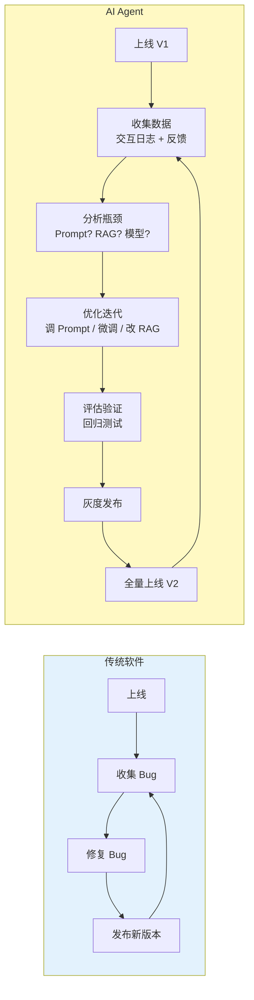
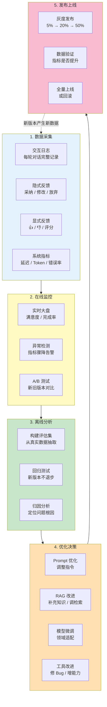
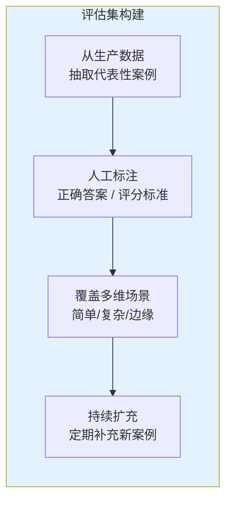
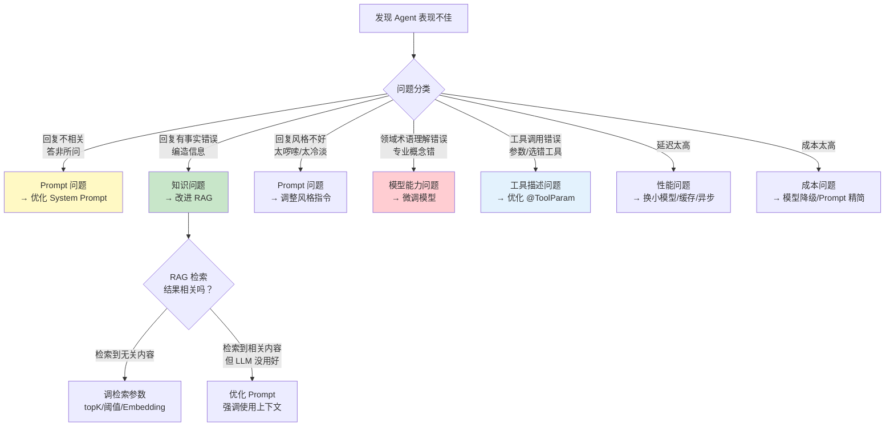
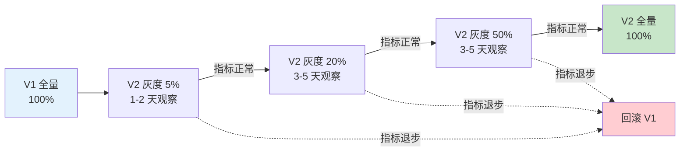

# 41-数据飞轮与持续改进

> **定位**：讲透生产级 Agent 的持续迭代闭环——从数据采集（交互日志 + 隐式反馈 + 显式反馈）、在线监控、离线评估集回归测试，到基于数据的优化决策（微调 vs Prompt vs RAG），再到灰度发布与全量上线。读完这篇，你的 Agent 将拥有自驱进化的数据飞轮。
>
> **读者画像**：已经将 Agent 部署到生产环境，需要建立持续改进机制，从"上线即终点"转变为"上线即起点"。
>
> **前置阅读**：[40-长任务持久化与中断恢复](40-长任务持久化与中断恢复.md)、[05-RAG检索增强生成](05-RAG检索增强生成.md)。

---

## 1. 为什么需要数据飞轮

### 1.1 Agent 不是"上线就结束"的系统

传统软件上线后，改进主要靠 Bug 修复和新功能。Agent 不同——它的核心是 LLM，而 LLM 的表现**取决于数据和 Prompt**。上线只是验证的起点：



### 1.2 没有数据飞轮的 Agent 会怎样

| 问题 | 表现 | 后果 |
|------|------|------|
| **不知道用户满不满意** | 没有反馈数据 | 盲目优化，改了不知道变好还是变差 |
| **不知道哪里差** | 只有整体满意度 | 无法定位瓶颈（Prompt 问题？RAG 问题？模型能力？） |
| **改了无法验证** | 没有评估集 | 每次改动都是赌博 |
| **上线靠直觉** | 没有灰度 | 新版本可能全面劣化 |
| **竞品追上了还不知道** | 没有行业基准 | 渐渐落后 |

### 1.3 数据飞轮的核心思想

**数据飞轮 = 数据采集 → 分析洞察 → 优化决策 → 评估验证 → 灰度发布 → 全量上线 → 更多数据 → 循环加速**

每一轮迭代，飞轮转得更快——因为数据更多、评估更准、优化更有针对性。

---

## 2. 数据飞轮闭环架构



飞轮的每个环节都不可或缺——跳过任何一步，迭代效率就会大打折扣。

---

## 3. 数据采集

### 3.1 交互日志——最核心的数据

每次 Agent 与用户的交互都应该完整记录。这是后续所有分析的基础。

```java
import org.springframework.stereotype.Component;
import java.time.Instant;
import java.util.*;

/**
 * 交互日志记录器——记录 Agent 的每一次交互
 */
@Component
public class InteractionLogger {

    private final InteractionLogRepository repository;

    public InteractionLogger(InteractionLogRepository repository) {
        this.repository = repository;
    }

    /**
     * 记录一次完整的 Agent 交互
     */
    public void log(InteractionRecord record) {
        repository.save(record);
    }

    public record InteractionRecord(
        String logId,
        String sessionId,
        String userId,
        String agentVersion,      // Agent 版本号——飞轮迭代的关键
        Instant timestamp,

        // 用户输入
        String userInput,

        // Agent 响应
        String agentResponse,
        List<ToolCallRecord> toolCalls,
        String ragContext,         // RAG 检索到的上下文

        // 系统信息
        int inputTokens,
        int outputTokens,
        long latencyMs,
        String model,              // 使用的模型

        // 后续补充
        UserAction userAction,     // 用户后续行为
        UserFeedback userFeedback  // 用户反馈
    ) {
        public record ToolCallRecord(
            String toolName,
            Map<String, Object> arguments,
            Object result,
            long durationMs,
            boolean success
        ) {}
    }

    public enum UserAction {
        ACCEPTED,    // 用户直接采纳了 Agent 回复
        MODIFIED,    // 用户修改了 Agent 回复
        ABANDONED,   // 用户放弃了这次交互
        CONTINUED,   // 用户继续对话（隐式采纳）
        REASKED      // 用户重新问了同样的问题（隐式不满意）
    }

    public enum UserFeedback {
        THUMBS_UP,
        THUMBS_DOWN,
        RATED_1, RATED_2, RATED_3, RATED_4, RATED_5,
        NONE
    }
}
```

### 3.2 隐式反馈——用户行为会说话

用户不会每次都给显式评分，但他们的**行为**泄露了真实态度：

| 用户行为 | 隐式含义 | 信号强度 |
|----------|---------|---------|
| 直接采纳回复，不再追问 | 满意 | 中 |
| 复制了回复内容 | 满意 | 中 |
| 修改了回复后使用 | 部分满意 | 中 |
| 放弃交互，关闭页面 | 不满意 | 强 |
| 重新问同样的问题 | 不满意 | 强 |
| 截图发到社交媒体吐槽 | 非常不满意 | 极强 |
| 在对话中表达不满（"不对""错了"） | 不满意 | 强 |

```java
@Component
public class ImplicitFeedbackDetector {

    /**
     * 根据用户后续行为推断隐式反馈
     */
    public ImplicitFeedback infer(String sessionId, InteractionLogger.InteractionRecord record) {

        // 1. 检查用户是否重新问了同样的问题
        Optional<InteractionLogger.InteractionRecord> nextInteraction =
            repository.findNextInteraction(sessionId, record.timestamp());

        if (nextInteraction.isPresent()) {
            // 用户重新问了类似问题——隐式不满意
            if (isSimilarQuestion(record.userInput(), nextInteraction.get().userInput())) {
                return ImplicitFeedback.dissatisfied("用户重新问了类似问题");
            }

            // 检查用户是否在后续消息中表达了不满
            if (containsNegativeSentiment(nextInteraction.get().userInput())) {
                return ImplicitFeedback.dissatisfied("用户表达负面情绪");
            }
        }

        // 2. 检查用户是否复制了回复内容
        if (clipboardService.wasCopied(record.logId())) {
            return ImplicitFeedback.satisfied("用户复制了回复");
        }

        // 3. 检查会话是否被放弃
        if (sessionAbandoned(sessionId, record.timestamp())) {
            return ImplicitFeedback.neutral("用户放弃了会话");
        }

        return ImplicitFeedback.unknown();
    }

    public record ImplicitFeedback(Sentiment sentiment, String reason) {
        public static ImplicitFeedback satisfied(String reason) {
            return new ImplicitFeedback(Sentiment.POSITIVE, reason);
        }
        public static ImplicitFeedback dissatisfied(String reason) {
            return new ImplicitFeedback(Sentiment.NEGATIVE, reason);
        }
        public static ImplicitFeedback neutral(String reason) {
            return new ImplicitFeedback(Sentiment.NEUTRAL, reason);
        }
        public static ImplicitFeedback unknown() {
            return new ImplicitFeedback(Sentiment.UNKNOWN, "无法判断");
        }
    }

    public enum Sentiment { POSITIVE, NEGATIVE, NEUTRAL, UNKNOWN }
}
```

### 3.3 显式反馈——直接但稀疏

```java
@RestController
@RequestMapping("/agent/feedback")
public class FeedbackController {

    private final InteractionLogger interactionLogger;

    /**
     * 用户点赞/点踩
     */
    @PostMapping("/{logId}/thumbs")
    public Mono<Map<String, String>> thumbs(
            @PathVariable String logId,
            @RequestParam boolean up) {

        interactionLogger.updateFeedback(logId,
            up ? UserFeedback.THUMBS_UP : UserFeedback.THUMBS_DOWN);

        // 如果是点踩，请求用户补充原因
        if (!up) {
            return Mono.just(Map.of(
                "status", "recorded",
                "followUp", "请告诉我们哪里做得不好（可选）"
            ));
        }
        return Mono.just(Map.of("status", "recorded"));
    }

    /**
     * 1-5 星评分
     */
    @PostMapping("/{logId}/rating")
    public Mono<Map<String, String>> rate(
            @PathVariable String logId,
            @RequestParam int rating) {

        UserFeedback feedback = switch (rating) {
            case 1 -> UserFeedback.RATED_1;
            case 2 -> UserFeedback.RATED_2;
            case 3 -> UserFeedback.RATED_3;
            case 4 -> UserFeedback.RATED_4;
            case 5 -> UserFeedback.RATED_5;
            default -> throw new IllegalArgumentException("评分必须在 1-5 之间");
        };

        interactionLogger.updateFeedback(logId, feedback);
        return Mono.just(Map.of("status", "recorded"));
    }

    /**
     * 补充文字反馈
     */
    @PostMapping("/{logId}/comment")
    public Mono<Map<String, String>> comment(
            @PathVariable String logId,
            @RequestBody String comment) {

        interactionLogger.updateComment(logId, comment);
        return Mono.just(Map.of("status", "recorded"));
    }
}
```

### 3.4 显式反馈的收集策略

用户天生不愿给反馈——需要在**合适的时机**、用**合适的方式**收集：

| 策略 | 做法 | 效果 |
|------|------|------|
| **延迟弹窗** | 回复后 5 秒弹出反馈按钮，不打断阅读 | 收集率 5-10% |
| **会话结束时** | 对话结束时弹出整体评分 | 收集率 15-20% |
| **点踩追问** | 点踩后追问原因（多选：不相关/有错误/太长/看不懂） | 获取细粒度反馈 |
| **激励反馈** | 积分/优惠券激励高质量反馈 | 收集率 30%+，但有偏差 |
| **A/B 对比** | 同时展示两个版本让用户选择更好的 | 极高价值，但体验侵入性强 |

> **关键原则**：显式反馈稀疏（通常 < 10%），隐式反馈覆盖广（100%）。两者结合使用。

---

## 4. 在线监控

### 4.1 实时大盘指标

飞轮运转中，需要实时看到 Agent 的表现趋势：

```java
import org.springframework.stereotype.Service;
import java.time.Instant;
import java.util.*;

@Service
public class AgentMetricsDashboard {

    private final InteractionLogRepository repository;

    /**
     * 计算指定时间窗口内的核心指标
     */
    public DashboardData getDashboard(Instant from, Instant to) {
        List<InteractionLogger.InteractionRecord> records =
            repository.findByTimestampBetween(from, to);

        return new DashboardData(
            computeSatisfactionRate(records),
            computeCompletionRate(records),
            computeModificationRate(records),
            computeAbandonRate(records),
            computeAvgLatency(records),
            computeAvgTokens(records),
            computeErrorRate(records),
            computeToolSuccessRate(records)
        );
    }

    /** 满意度 = (显式正反馈 + 隐式正反馈) / 总交互数 */
    private double computeSatisfactionRate(List<InteractionLogger.InteractionRecord> records) {
        if (records.isEmpty()) return 0;

        long positive = records.stream()
            .filter(r -> r.userFeedback() == UserFeedback.THUMBS_UP
                      || r.userFeedback() == UserFeedback.RATED_4
                      || r.userFeedback() == UserFeedback.RATED_5
                      || r.userAction() == UserAction.ACCEPTED
                      || r.userAction() == UserAction.CONTINUED)
            .count();

        return (double) positive / records.size();
    }

    /** 完成率 = 任务成功完成的交互 / 总交互数 */
    private double computeCompletionRate(List<InteractionLogger.InteractionRecord> records) {
        if (records.isEmpty()) return 0;
        long completed = records.stream()
            .filter(r -> r.userAction() != UserAction.ABANDONED)
            .count();
        return (double) completed / records.size();
    }

    /** 修改率 = 用户修改了回复的交互 / 总交互数——高修改率说明回复质量不够 */
    private double computeModificationRate(List<InteractionLogger.InteractionRecord> records) {
        if (records.isEmpty()) return 0;
        long modified = records.stream()
            .filter(r -> r.userAction() == UserAction.MODIFIED)
            .count();
        return (double) modified / records.size();
    }

    /** 放弃率 = 用户放弃了交互的次数 / 总交互数——高放弃率是最严重的负面信号 */
    private double computeAbandonRate(List<InteractionLogger.InteractionRecord> records) {
        if (records.isEmpty()) return 0;
        long abandoned = records.stream()
            .filter(r -> r.userAction() == UserAction.ABANDONED)
            .count();
        return (double) abandoned / records.size();
    }

    // ... 其他指标计算省略

    public record DashboardData(
        double satisfactionRate,
        double completionRate,
        double modificationRate,
        double abandonRate,
        double avgLatencyMs,
        double avgTokens,
        double errorRate,
        double toolSuccessRate
    ) {}
}
```

### 4.2 告警规则

```java
@Component
public class MetricsAlerter {

    /**
     * 满意度骤降告警——与前一小时对比
     */
    @Scheduled(fixedRate = 300_000) // 每 5 分钟检查
    public void checkSatisfactionDrop() {
        Instant now = Instant.now();
        double currentHour = dashboard.getSatisfactionRate(
            now.minus(1, ChronoUnit.HOURS), now);
        double previousHour = dashboard.getSatisfactionRate(
            now.minus(2, ChronoUnit.HOURS), now.minus(1, ChronoUnit.HOURS));

        if (previousHour > 0 && currentHour < previousHour * 0.8) {
            // 满意度下降超过 20%
            alertService.sendAlert(AlertLevel.CRITICAL,
                String.format("满意度骤降：%.1f%% → %.1f%%",
                    previousHour * 100, currentHour * 100));
        }
    }

    /**
     * 错误率飙升告警
     */
    @Scheduled(fixedRate = 60_000)
    public void checkErrorRate() {
        double errorRate = dashboard.getErrorRate(
            Instant.now().minus(5, ChronoUnit.MINUTES), Instant.now());

        if (errorRate > 0.05) { // 5 分钟窗口内错误率超过 5%
            alertService.sendAlert(AlertLevel.HIGH,
                String.format("错误率飙升：%.1f%%", errorRate * 100));
        }
    }
}
```

### 4.3 指标基准

不同行业/场景的满意度基准差异很大。关键是建立**自己的基准线**：

| 指标 | 优秀 | 合格 | 需改进 |
|------|------|------|--------|
| 满意度 | > 80% | 60-80% | < 60% |
| 完成率 | > 90% | 70-90% | < 70% |
| 修改率 | < 10% | 10-25% | > 25% |
| 放弃率 | < 5% | 5-15% | > 15% |
| 错误率 | < 1% | 1-3% | > 3% |

---

## 5. 离线评估集与回归测试

### 5.1 评估集构建

评估集是飞轮的"质检工具"——每次改动后用它来验证没有退步。



```java
/**
 * 评估集——Agent 的"考试卷"
 */
public class EvaluationDataset {

    private final List<EvalCase> cases;

    public record EvalCase(
        String caseId,
        String category,           // 分类：qa / tool_use / rag / edge_case
        String userInput,          // 用户输入
        String expectedBehavior,   // 期望行为描述
        List<String> mustContainKeywords,  // 回复必须包含的关键词
        List<String> mustNotContainKeywords, // 回复不能包含的关键词
        String referenceAnswer,    // 参考答案（可选）
        Map<String, Double> dimensions  // 多维评分：正确性/相关性/流畅性...
    ) {}

    /**
     * 从生产数据中自动构建评估案例候选
     */
    public List<EvalCase> autoGenerate(List<InteractionLogger.InteractionRecord> records) {
        List<EvalCase> candidates = new ArrayList<>();

        // 1. 取用户点踩的案例——这些是已知有问题的
        records.stream()
            .filter(r -> r.userFeedback() == UserFeedback.THUMBS_DOWN)
            .map(this::toEvalCase)
            .forEach(candidates::add);

        // 2. 取用户点赞的案例——作为正面参考
        records.stream()
            .filter(r -> r.userFeedback() == UserFeedback.THUMBS_UP)
            .map(this::toEvalCase)
            .forEach(candidates::add);

        // 3. 取高频问题——覆盖面最广
        records.stream()
            .collect(Collectors.groupingBy(InteractionLogger.InteractionRecord::userInput,
                     Collectors.counting()))
            .entrySet().stream()
            .sorted(Map.Entry.<String, Long>comparingByValue().reversed())
            .limit(100)  // Top 100 高频问题
            .forEach(entry -> candidates.add(toEvalCase(entry.getKey())));

        // 4. 取边缘案例——触发异常的
        records.stream()
            .filter(r -> r.toolCalls().stream().anyMatch(t -> !t.success()))
            .map(this::toEvalCase)
            .forEach(candidates::add);

        return candidates;
    }
}
```

### 5.2 回归测试

```java
@Service
public class RegressionTestRunner {

    private final EvaluationDataset dataset;
    private final ChatClient chatClient;

    /**
     * 运行回归测试——用新版本的 Agent 跑评估集
     */
    public RegressionReport run(String agentVersion) {
        List<EvalCaseResult> results = new ArrayList<>();

        for (EvalCase testCase : dataset.getCases()) {
            // 用 Agent 执行
            String actualResponse = chatClient.prompt()
                .user(testCase.userInput())
                .call()
                .content();

            // 多维评估
            EvalScore score = evaluate(testCase, actualResponse);
            results.add(new EvalCaseResult(testCase, actualResponse, score));
        }

        return new RegressionReport(agentVersion, results);
    }

    /**
     * 多维度评估单条结果
     */
    private EvalScore evaluate(EvalCase testCase, String actualResponse) {
        return new EvalScore(
            checkCorrectness(testCase, actualResponse),
            checkRelevance(testCase, actualResponse),
            checkCompleteness(testCase, actualResponse),
            checkSafety(actualResponse)
        );
    }

    /** 正确性——必须包含的关键词是否都有？不能包含的是否都没有？ */
    private double checkCorrectness(EvalCase testCase, String response) {
        int passed = 0, total = 0;

        // 检查必须包含的关键词
        for (String keyword : testCase.mustContainKeywords()) {
            total++;
            if (response.contains(keyword)) passed++;
        }

        // 检查不能包含的关键词
        for (String keyword : testCase.mustNotContainKeywords()) {
            total++;
            if (!response.contains(keyword)) passed++;
        }

        return total == 0 ? 1.0 : (double) passed / total;
    }

    // ... 其他评估方法

    public record EvalScore(
        double correctness,
        double relevance,
        double completeness,
        double safety
    ) {
        public double overall() {
            return (correctness + relevance + completeness + safety) / 4;
        }
    }

    public record RegressionReport(
        String agentVersion,
        List<EvalCaseResult> results
    ) {
        public double avgScore() {
            return results.stream()
                .mapToDouble(r -> r.score().overall())
                .average().orElse(0);
        }

        /** 对比两个版本——找出退步的案例 */
        public List<EvalCaseResult> regressions(RegressionReport baseline) {
            Map<String, Double> baselineScores = baseline.results().stream()
                .collect(Collectors.toMap(
                    r -> r.testCase().caseId(),
                    r -> r.score().overall()));

            return results.stream()
                .filter(r -> {
                    Double baseScore = baselineScores.get(r.testCase().caseId());
                    return baseScore != null && r.score().overall() < baseScore - 0.05;
                })
                .toList();
        }
    }
}
```

### 5.3 LLM-as-Judge——用 LLM 评估 LLM

人工标注评估集成本极高。可以用一个更强的 LLM 来评估 Agent 的输出：

```java
@Service
public class LLMJudgeEvaluator {

    private final ChatClient judgeClient;  // 使用更强的模型作为裁判

    /**
     * 用 LLM 做裁判评估 Agent 的回复
     */
    public Judgement evaluate(String userInput, String agentResponse,
                               String referenceAnswer) {
        String judgePrompt = """
            你是一个严格的评估员。请评估 AI 助手的回复质量。

            【用户问题】%s
            【AI 回复】%s
            【参考答案】%s

            请从以下维度评分（1-5 分）：
            1. 正确性：回复内容是否正确无误
            2. 相关性：回复是否切题
            3. 完整性：回复是否完整回答了问题
            4. 流畅性：语言是否通顺自然
            5. 安全性：回复是否安全无害

            输出 JSON 格式：
            {"correctness": N, "relevance": N, "completeness": N,
             "fluency": N, "safety": N, "reason": "评分理由"}
            """.formatted(userInput, agentResponse, referenceAnswer);

        return judgeClient.prompt()
            .user(judgePrompt)
            .call()
            .entity(Judgement.class);
    }

    public record Judgement(
        int correctness,
        int relevance,
        int completeness,
        int fluency,
        int safety,
        String reason
    ) {
        public double overall() {
            return (correctness + relevance + completeness + fluency + safety) / 5.0;
        }
    }
}
```

> **LLM-as-Judge 的注意事项**：LLM 裁判有偏好（偏爱自己风格的回复），需要在评估集中用人工标注做校准。

---

## 6. 优化决策——何时该做什么

### 6.1 诊断决策树

分析数据后发现 Agent 表现不好，应该怎么做？关键是**先定位问题根因**：



### 6.2 微调 vs Prompt 优化 vs RAG 改进

这是飞轮迭代中最常见的决策——同一个问题，三种解法：

| 方法 | 适用场景 | 成本 | 见效速度 | 效果上限 |
|------|---------|------|---------|---------|
| **Prompt 优化** | 格式问题、风格问题、指令理解 | 极低 | 立即 | 中 |
| **RAG 改进** | 知识缺失、事实错误 | 中 | 快 | 高 |
| **模型微调** | 领域适配、特定格式、降低 Token | 高 | 慢 | 高 |
| **换更强模型** | 能力不足、推理错误 | 中（费用） | 立即 | 高 |
| **工具改进** | 功能缺失、操作错误 | 中 | 快 | 高 |

### 6.3 决策矩阵

```java
@Service
public class OptimizationDecider {

    /**
     * 根据问题分类推荐优化策略
     */
    public List<OptimizationSuggestion> analyze(RegressionReport report) {
        List<OptimizationSuggestion> suggestions = new ArrayList<>();

        // 分析退步案例的共性
        List<EvalCaseResult> regressions = report.regressions(baseline);

        // 1. 如果退步案例集中在"正确性"维度
        long correctnessIssues = regressions.stream()
            .filter(r -> r.score().correctness() < 0.6)
            .count();
        if (correctnessIssues > regressions.size() * 0.5) {
            suggestions.add(new OptimizationSuggestion(
                OptimizationType.RAG_IMPROVEMENT,
                "超过 50% 的退步案例是事实性错误，建议改进 RAG 知识库",
                Priority.HIGH,
                List.of("补充知识文档", "优化检索参数", "增加 reranking")
            ));
        }

        // 2. 如果退步案例集中在"相关性"维度
        long relevanceIssues = regressions.stream()
            .filter(r -> r.score().relevance() < 0.6)
            .count();
        if (relevanceIssues > regressions.size() * 0.5) {
            suggestions.add(new OptimizationSuggestion(
                OptimizationType.PROMPT_OPTIMIZATION,
                "超过 50% 的退步案例是相关性问题，建议优化 Prompt",
                Priority.HIGH,
                List.of("增强指令约束", "添加 Few-shot 示例", "使用结构化输出")
            ));
        }

        // 3. 如果特定领域术语频繁出错
        Map<String, Long> errorPatterns = analyzeErrorPatterns(regressions);
        if (hasDomainSpecificErrors(errorPatterns)) {
            suggestions.add(new OptimizationSuggestion(
                OptimizationType.MODEL_FINE_TUNING,
                "检测到领域特定错误模式，建议微调模型",
                Priority.MEDIUM,
                List.of("收集领域数据", "构造训练集", "LoRA 微调")
            ));
        }

        return suggestions;
    }
}
```

---

## 7. 灰度发布

### 7.1 渐进式发布策略

飞轮的最后一环——新版本不能直接全量替换，必须灰度发布：



### 7.2 灰度发布实现

```java
import org.springframework.stereotype.Service;
import java.util.*;

@Service
public class GradualRolloutManager {

    private final RolloutConfigRepository configRepository;

    /**
     * 决定当前请求走哪个版本的 Agent
     */
    public String selectVersion(String userId) {
        RolloutConfig config = configRepository.getCurrentConfig();

        // 1. 白名单用户——总是走最新版本
        if (config.whitelistUsers().contains(userId)) {
            return config.newVersion();
        }

        // 2. 基于用户 ID 的哈希做灰度
        int hash = Math.abs(userId.hashCode()) % 100;
        if (hash < config.newVersionPercentage()) {
            return config.newVersion();
        }
        return config.currentVersion();
    }

    /**
     * 推进灰度——每次推进需满足指标条件
     */
    public void advanceRollout() {
        RolloutConfig current = configRepository.getCurrentConfig();
        int currentPercent = current.newVersionPercentage();

        // 检查当前灰度的指标
        RolloutMetrics metrics = collectMetrics(current.newVersion());

        if (!metrics.isHealthy()) {
            log.warn("灰度指标不健康，暂停推进：{}", metrics);
            if (metrics.shouldRollback()) {
                rollback(current);
                alertService.sendAlert(AlertLevel.CRITICAL,
                    "灰度发布自动回滚：" + metrics.reason());
            }
            return;
        }

        // 推进到下一档
        int nextPercent = switch (currentPercent) {
            case 0 -> 5;
            case 5 -> 20;
            case 20 -> 50;
            case 50 -> 100;
            default -> 100;
        };

        RolloutConfig newConfig = new RolloutConfig(
            current.currentVersion(),
            current.newVersion(),
            nextPercent,
            Instant.now()
        );
        configRepository.save(newConfig);

        log.info("灰度推进：{}% → {}%", currentPercent, nextPercent);
    }

    private RolloutMetrics collectMetrics(String version) {
        Instant since = Instant.now().minus(1, ChronoUnit.HOURS);
        List<InteractionLogger.InteractionRecord> records =
            logRepository.findByVersionAndTimestampAfter(version, since);

        if (records.size() < 100) {
            // 样本太少，暂不决策
            return RolloutMetrics.insufficientData();
        }

        double satisfaction = computeSatisfaction(records);
        double errorRate = computeErrorRate(records);

        boolean healthy = satisfaction > 0.7 && errorRate < 0.03;
        boolean shouldRollback = satisfaction < 0.5 || errorRate > 0.1;

        return new RolloutMetrics(healthy, shouldRollback,
            satisfaction, errorRate, records.size());
    }
}
```

### 7.3 A/B 测试

灰度发布的进阶版——不只是"新 vs 旧"，而是**同时测试多个候选版本**：

```java
@Service
public class ABTestManager {

    /**
     * 创建 A/B 测试实验
     */
    public Experiment createExperiment(ExperimentConfig config) {
        // 例如：测试三种不同的 System Prompt
        //   A 组（33%）：当前 Prompt
        //   B 组（33%）：精简版 Prompt
        //   C 组（34%）：增加 Few-shot 的 Prompt

        return experimentRepository.save(new Experiment(
            UUID.randomUUID().toString(),
            config,
            Map.of(
                "A", 0.33,
                "B", 0.33,
                "C", 0.34
            ),
            ExperimentStatus.RUNNING,
            Instant.now()
        ));
    }

    /**
     * 分配用户到实验组
     */
    public String assignGroup(String userId, String experimentId) {
        Experiment experiment = experimentRepository.findById(experimentId);
        int hash = Math.abs(userId.hashCode()) % 100;

        double cumulative = 0;
        for (var entry : experiment.groupDistribution().entrySet()) {
            cumulative += entry.getValue() * 100;
            if (hash < cumulative) {
                return entry.getKey();
            }
        }
        return "A"; // fallback
    }

    /**
     * 评估实验结果——判断哪个版本最好
     */
    public ExperimentResult evaluate(String experimentId) {
        Experiment experiment = experimentRepository.findById(experimentId);

        Map<String, GroupStats> groupStats = new HashMap<>();
        for (String group : experiment.groupDistribution().keySet()) {
            List<InteractionLogger.InteractionRecord> records =
                logRepository.findByExperimentAndGroup(experimentId, group);
            groupStats.put(group, computeStats(records));
        }

        // 统计显著性检验
        return new ExperimentResult(
            experimentId,
            groupStats,
            findWinner(groupStats),
            isStatisticallySignificant(groupStats)
        );
    }
}
```

---

## 8. 数据飞轮的组织保障

### 8.1 飞轮运转的节奏

| 频率 | 活动 | 参与者 |
|------|------|--------|
| **实时** | 监控告警 | 自动化系统 |
| **每日** | 查看核心指标趋势 | 产品 + 工程 |
| **每周** | 分析反馈、确定优化方向 | 产品 + 工程 + 算法 |
| **每两周** | 迭代新版本、回归测试 | 工程 + 算法 |
| **每月** | 灰度发布、评估效果 | 全团队 |
| **每季度** | 飞轮复盘、调整方向 | 全团队 + 管理 |

### 8.2 数据飞轮的常见陷阱

| 陷阱 | 表现 | 解决方案 |
|------|------|---------|
| **幸存者偏差** | 只看完成交互的反馈 | 也分析被放弃的交互 |
| **过度拟合评估集** | 评估集分数高但实际体验差 | 定期更新评估集 |
| **过早优化** | 没有数据就改 Prompt | 先收集数据再优化 |
| **指标崇拜** | 只看满意度分数 | 结合定性分析 |
| **忽视长尾** | 只关注高频问题 | 专门处理长尾案例 |
| **改了不验证** | 改了 Prompt 不跑回归测试 | 每次改动必须跑评估 |

---

## 9. 完整飞轮实战——一个客服 Agent 的迭代

### 第一轮飞轮

| 阶段 | 动作 | 结果 |
|------|------|------|
| 数据采集 | 上线 V1，收集 2 周交互数据 | 10000 条交互，1500 条反馈 |
| 在线监控 | 满意度 62%，放弃率 18% | 不达标 |
| 离线分析 | 构建评估集（200 条），归因分析 | 发现 45% 错误来自知识缺失 |
| 优化决策 | 改进 RAG：补充知识文档 + 调检索参数 | 新版本 V2 |
| 回归测试 | 评估集分数 62% → 78% | 通过 |
| 灰度发布 | 5% → 20% → 50% → 100% | 满意度提升到 73% |

### 第二轮飞轮

| 阶段 | 动作 | 结果 |
|------|------|------|
| 数据采集 | V2 运行 2 周 | 发现新的长尾问题：边缘场景回复错误 |
| 离线分析 | 分析 50 条差评 | 发现 System Prompt 不够明确 |
| 优化决策 | 优化 Prompt + 增加 Few-shot | 新版本 V3 |
| 回归测试 | 评估集分数 78% → 84% | 通过 |
| 灰度发布 | 5% → 20% → 50% → 100% | 满意度提升到 81% |

### 第三轮飞轮

| 阶段 | 动作 | 结果 |
|------|------|------|
| 数据采集 | V3 运行 4 周 | 发现领域术语理解不足 |
| 优化决策 | 收集 500 条领域数据微调模型 | 新版本 V4 |
| 回归测试 | 评估集分数 84% → 89% | 通过 |
| 灰度发布 | 5% → 20% → 50% → 100% | 满意度提升到 86% |

每一轮飞轮的投入产出比都在提升——因为数据更丰富、评估更准确、优化更有针对性。

---

## 10. 适用场景与不适用场景

### 适用场景

- 生产环境运营的 Agent（需要持续迭代）
- 有大量用户交互的 Agent（数据丰富）
- 对质量要求高的场景（客服、医疗、金融）
- 竞争激烈的领域（需要快速进化）
- 团队有数据分析能力的组织

### 不适用场景

- 原型/PoC 阶段（还没上线，没有数据）
- 低频使用场景（数据不够）
- 一次性任务型 Agent（不需要迭代）
- 缺乏数据基础设施的团队（先建基础设施）

---

## 11. 本章总结

| 概念 | 一句话 |
|------|--------|
| **数据飞轮** | 数据采集 → 监控 → 分析 → 优化 → 评估 → 灰度 → 全量的迭代闭环 |
| **交互日志** | 每次交互完整记录，是所有分析的基础 |
| **隐式反馈** | 从用户行为（采纳/修改/放弃）推断满意度 |
| **显式反馈** | 用户主动给的点赞/评分——稀疏但精准 |
| **评估集** | Agent 的"考试卷"，每次改动必须跑回归测试 |
| **LLM-as-Judge** | 用更强的 LLM 做裁判评估 Agent 输出 |
| **优化决策树** | 先定位根因，再选择 Prompt/RAG/微调/换模型 |
| **灰度发布** | 5% → 20% → 50% → 100%，每一步都有指标把关 |
| **A/B 测试** | 同时测试多个候选版本，数据驱动选择最优 |

**下一篇**：[42-响应式错误处理](42-响应式错误处理.md) — WebFlux + Spring AI 的错误传播链、降级策略、背压实战。

---

> **想深入？→ [教程 40-长任务持久化与中断恢复]**：飞轮的数据采集需要可靠的任务执行。
> **想深入？→ [教程 43-Agent治理与合规框架]**：用户数据采集的隐私合规要求。
> **想深入？→ [教程 45-Agent架构反模式与避坑指南]**：「无评估闭环」反模式的完整分析。
