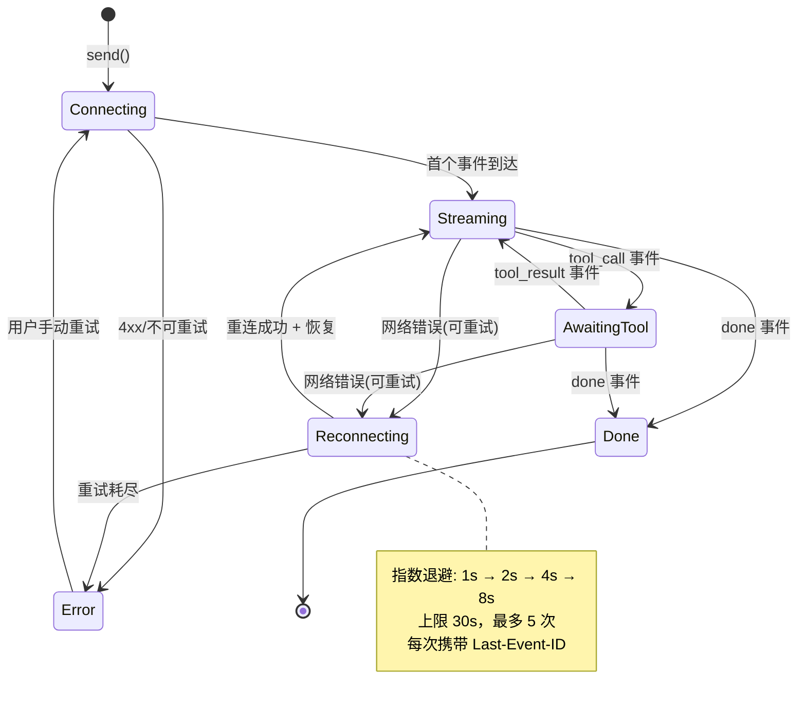

# 43-React 与 SSE 流式 UI

> **定位**：本文是前后端衔接的实战核心篇——React 前端如何消费 WebFlux 后端的 SSE 流式响应：连接管理、事件解析、断线重连、token 批量渲染、取消与清理。读者画像：已掌握 [教程 41 组件/Hook]、[教程 42 状态分层] 的开发者。前置阅读：[教程 09-SSE流式通信]（后端视角）、[教程 42 §三层状态模型]。
>
> **与教程 09 的分工**：教程 09 讲后端如何"产出"SSE 流（WebFlux Controller、Flux、心跳、代理配置）；本篇讲前端如何"消费"它。两端在"事件协议"处会合（协议设计深化见 [教程 44-Agentic-UI设计]、[教程 45-流式工具调用与事件协议]）。

---

## 1. 前端消费 SSE 的两条路

### 1.1 EventSource：简单但有硬伤

浏览器原生 `EventSource` API：

```ts
const es = new EventSource('/api/chat/stream?message=你好');
es.onmessage = e => append(JSON.parse(e.data));
es.onerror = () => { /* 浏览器会自动重连 */ };
```

| 能力 | EventSource | fetch + ReadableStream |
|------|-------------|----------------------|
| 自动重连 | ✅（且带 Last-Event-ID） | ❌ 需手写 |
| POST 请求体 | ❌ 只支持 GET，参数只能拼 URL | ✅ |
| 自定义 Header（Authorization） | ❌ | ✅ |
| 主动取消 | ✅ `close()` | ✅ AbortController |
| 读取事件类型/id 字段 | ✅ | 需手动解析 |
| 二进制 | ❌ | ✅ |

Agent 场景的对话请求几乎必然是 POST（携带长 prompt、上下文、会话 ID、租户头），且企业级系统要求 Authorization 头——**所以 Agent 前端的事实标准是 fetch + ReadableStream**。EventSource 仅适合"无需鉴权的简单通知流"。

### 1.2 fetch + ReadableStream：完整骨架

```ts
async function streamChat(
  request: ChatRequest,
  handlers: {
    onEvent: (event: AgentEvent) => void;
    onDone: () => void;
    onError: (error: Error) => void;
  },
  signal: AbortSignal
): Promise<void> {
  const response = await fetch('/api/chat', {
    method: 'POST',
    headers: {
      'Content-Type': 'application/json',
      'Authorization': `Bearer ${getAccessToken()}`,
      'Accept': 'text/event-stream',
    },
    body: JSON.stringify(request),
    signal,
  });

  if (!response.ok || !response.body) {
    throw new Error(`HTTP ${response.status}`);
  }

  const reader = response.body.getReader();
  const decoder = new TextDecoder('utf-8');
  let buffer = '';

  while (true) {
    const { done, value } = await reader.read();
    if (done) break;

    buffer += decoder.decode(value, { stream: true });  // stream:true 处理跨 chunk 的多字节中文
    const events = parseSSE(buffer);
    buffer = events.remainder;                          // 半条事件留到下一个 chunk

    for (const event of events.parsed) {
      handlers.onEvent(event);
    }
  }
  handlers.onDone();
}
```

三个关键细节：

1. **跨 chunk 拆分**：TCP 分块不保证对齐 SSE 事件边界，一个 `"data: {\"type\":\"to"` 可能断在 JSON 中间——必须用 buffer 暂存，凑齐完整事件再解析。
2. **多字节字符**：中文 UTF-8 一个字符 3 字节，chunk 可能截断在字节中间——`TextDecoder` 的 `{ stream: true }` 专门解决这个问题，漏掉会产生乱码。
3. **AbortController**：用户切换会话/关闭页签时调用 `controller.abort()`，同时后端 `Flux.doOnCancel()` 会感知断开（[教程 09 §9 取消处理]）。

### 1.3 SSE 帧解析器

```ts
interface ParsedEvents { parsed: AgentEvent[]; remainder: string; }

function parseSSE(buffer: string): ParsedEvents {
  const parsed: AgentEvent[] = [];
  // SSE 协议：事件以空行分隔；每行 field: value 格式
  const frames = buffer.split('\n\n');
  const remainder = frames.pop() ?? '';  // 最后一段可能不完整，留待下个 chunk

  for (const frame of frames) {
    let eventName = 'message';
    let data = '';
    for (const line of frame.split('\n')) {
      if (line.startsWith(':')) continue;            // 注释行：心跳（见教程 09 §7）
      if (line.startsWith('event:')) eventName = line.slice(6).trim();
      if (line.startsWith('data:')) data += line.slice(5).trim();
    }
    if (data) {
      try {
        parsed.push({ __type: eventName, ...JSON.parse(data) } as AgentEvent);
      } catch {
        // 心跳/非 JSON 数据忽略——流不能因一帧坏数据整体崩溃
      }
    }
  }
  return { parsed, remainder };
}
```

注释行（`: keep-alive`）就是后端的心跳（[教程 09 §7 心跳保活]）——前端解析时静默跳过，但它的存在维持了代理不掐断连接。

---

## 2. 封装为自定义 Hook：useChatStream

把 §1 的底层机制封装成 Hook，组件只面对语义化状态（[教程 41 §3.4 自定义 Hook 是前端的领域服务层]）：

```tsx
// hooks/useChatStream.ts
import { useReducer, useRef, useCallback } from 'react';

type StreamPhase = 'idle' | 'connecting' | 'streaming' | 'awaiting_tool' | 'done' | 'error';

interface StreamState {
  phase: StreamPhase;
  text: string;
  toolCalls: ToolCallInfo[];
}

function reducer(state: StreamState, action: StreamAction): StreamState {
  switch (action.type) {
    case 'TOKEN':   return { ...state, phase: 'streaming', text: state.text + action.content };
    case 'TOOL_START': return { ...state, phase: 'awaiting_tool',
                                toolCalls: [...state.toolCalls, { id: action.toolCallId, name: action.name, status: 'running' }] };
    case 'TOOL_END':   return { ...state, phase: 'streaming',
                                toolCalls: state.toolCalls.map(t =>
                                  t.id === action.toolCallId ? { ...t, status: 'done', durationMs: action.durationMs } : t) };
    case 'FINISH':  return { ...state, phase: 'done' };
    case 'FAIL':    return { ...state, phase: 'error' };
    case 'RESET':   return initialState;
  }
}

export function useChatStream(sessionId: string) {
  const [state, dispatch] = useReducer(reducer, initialState);
  const abortRef = useRef<AbortController | null>(null);  // ref：不触发渲染的可变引用

  const send = useCallback(async (message: string) => {
    abortRef.current?.abort();          // 掐掉上一次未完成的流
    const controller = new AbortController();
    abortRef.current = controller;

    dispatch({ type: 'RESET' });
    try {
      await streamChat(
        { sessionId, message },
        {
          onEvent: event => {
            switch (event.__type) {
              case 'token':       dispatch({ type: 'TOKEN', content: event.content }); break;
              case 'tool_call':   dispatch({ type: 'TOOL_START', toolCallId: event.toolCallId, name: event.name }); break;
              case 'tool_result': dispatch({ type: 'TOOL_END', toolCallId: event.toolCallId, durationMs: event.durationMs }); break;
              case 'done':        dispatch({ type: 'FINISH' }); break;
              case 'error':       dispatch({ type: 'FAIL', message: event.message }); break;
            }
          },
          onDone: () => dispatch({ type: 'FINISH' }),
          onError: (e) => {
            if (e.name === 'AbortError') return;  // 主动取消不是错误
            dispatch({ type: 'FAIL', message: e.message });
          },
        },
        controller.signal
      );
    } finally {
      if (abortRef.current === controller) abortRef.current = null;
    }
  }, [sessionId]);

  // 组件卸载时确保连接关闭——避免"离开页面后流还在跑"
  useEffect(() => () => abortRef.current?.abort(), []);

  return { ...state, send, cancel: () => abortRef.current?.abort() };
}
```

要点：
- **AbortController 放 useRef** 而非 state——它变了不需要重渲染（[教程 41 §3.3]）
- **依赖数组只有 sessionId**——send 的重建只随会话切换，输入内容变化不会导致 send 重建（对应 [教程 41 §3.2 的 SSE 依赖坑]）
- **主动取消与失败分流**——AbortError 是正常操作路径，不进错误态

---

## 3. 断线重连与 Last-Event-ID

网络抖动、Nginx 超时（[教程 09 §8 代理配置]）、后端滚动发布，都会掐断连接。企业级前端必须有重连策略：

### 3.1 重连状态机



### 3.2 断点恢复的实现

后端在每条事件上带递增序号 `id:` 字段（[教程 09 §5 ServerSentEvent 的 id 字段]、[教程 18 §Last-Event-ID 断点恢复]）。前端记录最新 id，重连时带上：

```ts
async function connectWithRecovery(sessionId: string, lastEventId: number) {
  return fetch('/api/chat', {
    // …headers 同 §1.2…
    // 方式一：标准头（需要后端支持）
    headers: { 'Last-Event-ID': String(lastEventId) },
    // 方式二：请求体字段（fetch 方案常用，更直观）
    body: JSON.stringify({ sessionId, message, resumeFromEventId: lastEventId }),
  });
}
```

后端从 Redis/内存缓冲区重放 `lastEventId` 之后的事件（缓冲区设计见 [教程 18 §4 Sink 与事件缓冲]，多实例下经 Redis Stream 广播）。**前端恢复后要做去重**：丢弃 `event.id <= lastEventId` 的重放事件，从 `lastEventId + 1` 开始应用。

```ts
function handleRecoveredEvent(event: AgentEvent & { id: number }) {
  if (event.id <= lastEventIdRef.current) return;  // 去重
  lastEventIdRef.current = event.id;
  dispatch(/* ... */);
}
```

---

## 4. 渲染性能：token 批量缓冲

### 4.1 问题：每 token 一次 setState

LLM 输出约 20-80 token/秒。每个 token 触发一次 dispatch → 一次重渲染 → React diff 整个消息区。长回答（2000 token）= 2000 次渲染，主线程被吃满，滚动和交互开始掉帧。

### 4.2 方案：requestAnimationFrame 批量刷新

把"收 token"与"渲染 token"解耦——token 先积攒在 ref 缓冲区（不触发渲染），每帧只 flush 一次：

```tsx
export function useChatStream(sessionId: string) {
  const [state, dispatch] = useReducer(reducer, initialState);
  const pendingTokensRef = useRef<string[]>([]);   // 缓冲区：不触发渲染
  const rafRef = useRef<number | null>(null);

  const scheduleFlush = useCallback(() => {
    if (rafRef.current !== null) return;           // 已有调度，不重复
    rafRef.current = requestAnimationFrame(() => {
      rafRef.current = null;
      const chunk = pendingTokensRef.current.join('');
      pendingTokensRef.current = [];
      if (chunk) dispatch({ type: 'TOKEN', content: chunk });  // 每帧最多一次渲染
    });
  }, []);

  const handleToken = useCallback((content: string) => {
    pendingTokensRef.current.push(content);
    scheduleFlush();
  }, [scheduleFlush]);

  // 流结束时强制 flush，保证不丢尾部 token
  const flushNow = useCallback(() => {
    if (rafRef.current !== null) cancelAnimationFrame(rafRef.current);
    rafRef.current = null;
    const chunk = pendingTokensRef.current.join('');
    pendingTokensRef.current = [];
    if (chunk) dispatch({ type: 'TOKEN', content: chunk });
  }, []);

  useEffect(() => () => {
    if (rafRef.current !== null) cancelAnimationFrame(rafRef.current);
  }, []);

  /* …send/事件接线：token 事件 → handleToken，done/error → flushNow… */
}
```

效果：渲染频率从"每 token 一次"降到"每帧一次"（60Hz 屏幕上 ≤ 60 次/秒），且视觉上 token 是成组出现的——反而更接近人类打字的自然节奏。这是"流式 UI 的背压"——与后端 Reactor 的 buffer/bample 缓冲操作符（[附录 01-WebFlux与响应式编程/01-背压与流量控制 §缓冲策略]）是同一个问题在两端的解法。

### 4.3 配套：状态下沉 + memo

批量缓冲解决"频率"，还要解决"范围"（[教程 41 §5.3 状态下沉]、[教程 42 §4.3]）：

```tsx
// 只有流式输出区订阅高频状态；侧边栏/历史列表不参与 token 渲染
function ChatMain({ sessionId }: { sessionId: string }) {
  return (
    <>
      <SessionSidebar />                     {/* 订阅 Zustand 切片，与流式无关 */}
      <MessageHistory sessionId={sessionId} /> {/* TanStack Query 数据 */}
      <LiveStreamArea sessionId={sessionId} />  {/* 唯一的高频渲染区 */}
    </>
  );
}

const LiveStreamArea = React.memo(function LiveStreamArea({ sessionId }: { sessionId: string }) {
  const { phase, text, toolCalls, cancel } = useChatStream(sessionId);
  return (
    <div>
      {toolCalls.map(t => <ToolCallBadge key={t.id} tool={t} />)}
      <div className="streaming-text">{text}</div>
      {phase === 'streaming' && <StopButton onClick={cancel} />}
    </div>
  );
});
```

---

## 5. 多会话与页面生命周期

### 5.1 会话切换的清理纪律

```tsx
function ChatPage({ sessionId }: { sessionId: string }) {
  // useChatStream 内部的 useEffect/useRef 清理保证了：
  // 1. sessionId 变化 → 旧流 abort、状态 RESET
  // 2. 组件卸载 → abort + 取消 rAF
  const stream = useChatStream(sessionId);
  return <LiveStreamArea {...stream} sessionId={sessionId} />;
}
```

组件/Hook 的清理函数（[教程 41 §3.2 useEffect 清理]）是 React 版的 try-with-resources。**每一条会"逃逸"的资源（连接、rAF、定时器、订阅）都必须有配对的清理**，否则会出现"后台还在收上一个会话的 token"这类诡异 bug。

### 5.2 与后端多页面会话管理对齐

多页签同时打开同一会话时，后端用会话级 Sink fan-out 把一条流推给所有连接（[教程 18 §多页面同步]）。前端侧的配合点：
- 每个页签独立建立 SSE 连接，携带同一 sessionId
- 各页签独立渲染，不跨页签同步 UI（同步由服务端广播保证）
- 页签关闭只断自己的连接；会话流的生命周期由服务端管理

### 5.3 页面可见性与生产环境

- `document.visibilityState === 'hidden'` 时可以停止 rAF 刷新（浏览器本来也会节流），但**不要 abort 连接**——回到页签要能立即恢复渲染
- 开发环境的 React StrictMode 会双执行 effect——SSE 连接会建立两次。这是**故意的**：用来暴露"清理函数缺失"的 bug。正确姿势是确保清理配对，而不是关掉 StrictMode

---

## 6. 常见误区与反模式

| 反模式 | 症状 | 纠正 |
|--------|------|------|
| EventSource 发对话 | 无法 POST/带鉴权头，长 prompt 拼 URL | fetch + ReadableStream |
| 不处理跨 chunk 边界 | 偶发 JSON 解析失败/中文乱码 | buffer + parseSSE remainder；TextDecoder stream:true |
| 每 token setState | 长回答时 UI 卡顿 | ref 缓冲 + rAF 批量 flush |
| AbortError 当故障 | 用户取消显示"出错了" | 按异常类型分流 |
| 无清理的连接 | 切会话后旧流仍在写入 | abortRef + useEffect 清理配对 |
| 重连无退避 | 服务端故障时被重连风暴打爆 | 指数退避 + 上限 + 重试次数 |
| 重放不去重 | 断线恢复后内容重复 | 记录 lastEventId，过滤 ≤id 的事件 |
| 流式状态上提全局 | token 更新连坐全站渲染 | 高频状态隔离在流式组件（[教程 42 §5]） |

---

## 7. 适用场景与不适用场景

### 适用场景

- Agent 对话流式输出（token 打字机 + 工具调用中间态）——本篇方案的标准场景
- 长任务进度推送（构建进度、批量处理）——事件模型换成任务进度语义即可
- 需要鉴权、POST 请求体、精确取消的企业级前端
- 弱网环境需要断点恢复的移动端/跨国场景（配合 Last-Event-ID）

### 不适用场景

- 双向高频通信（协同编辑、多人游戏）——用 WebSocket
- 客户端只发不收（表单提交）——普通 fetch
- 秒级完成的短请求——流式的复杂度不值得，直接 await JSON
- 需要服务端主动建连的场景（SSE 本质还是客户端发起的 HTTP）——WebPush 或消息通道

---

## 8. 总结

| 概念 | 一句话 |
|------|--------|
| fetch + ReadableStream | Agent 前端消费 SSE 的事实标准（POST/鉴权/取消） |
| parseSSE + buffer | 跨 chunk 边界安全解析，remainder 留待下个数据块 |
| useChatStream | 连接管理 + 状态机 + 清理纪律的领域 Hook |
| AbortController + ref | 主动取消的正确通道；AbortError 不是故障 |
| Last-Event-ID + 去重 | 断线重连与断点恢复，重放事件按 id 过滤 |
| rAF 批量缓冲 | 流式 UI 的前端背压：每帧最多一次渲染 |
| 清理配对 | 每条逃逸资源（连接/rAF/订阅）都要有 finally 清理 |
| 状态隔离 | 高频流式状态只存在于流式组件内部 |

**下一篇**：[44-Agentic-UI设计.md](44-Agentic-UI设计.md) — 从"消费文本流"到"渲染 Agent 的思考与行动"：事件协议设计、工具透明化、生成式 UI 与 HITL 交互。
