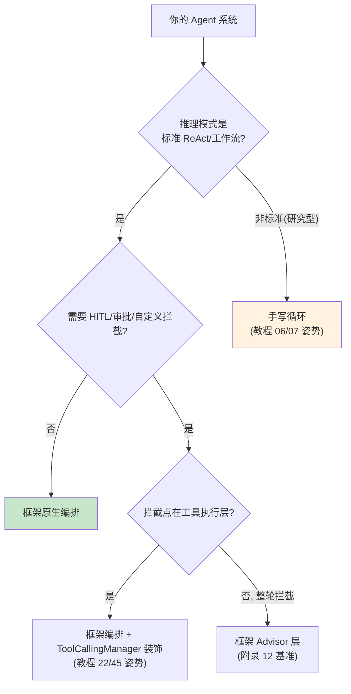
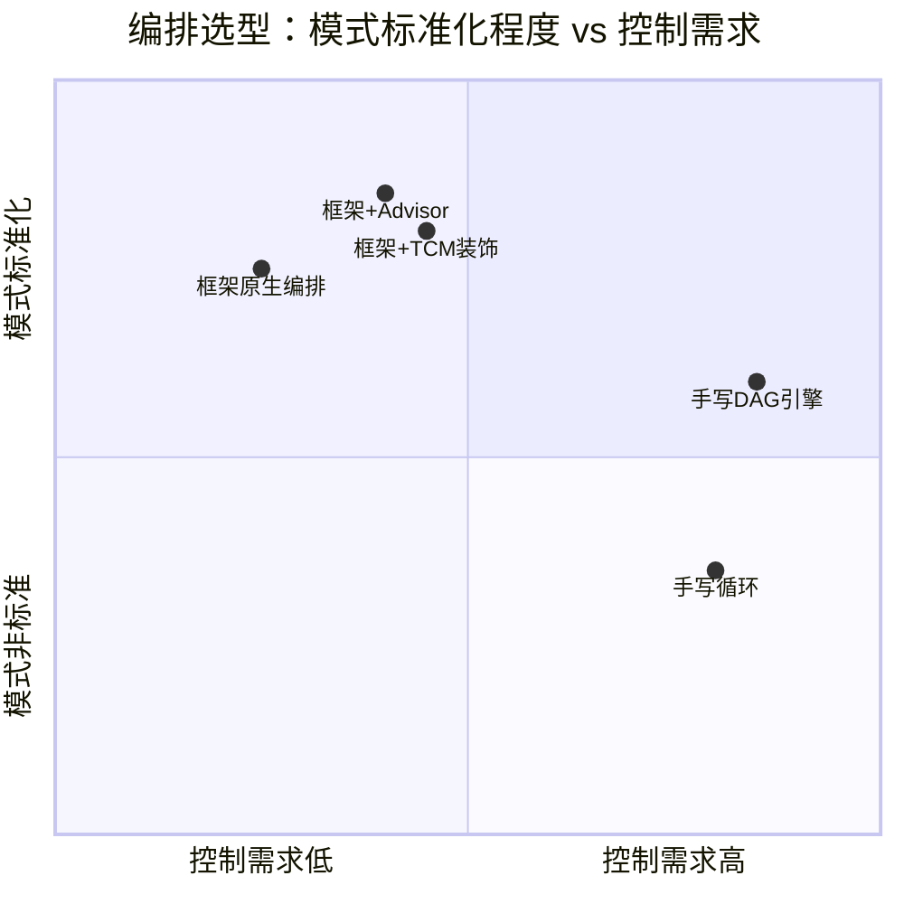
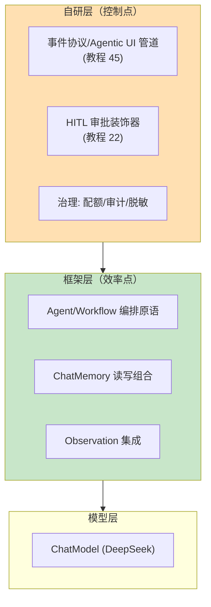

# 46-Spring AI 2.0 Agentic 架构：框架原生 Agent 编排

> **定位**：本文回答一个全体系悬而未决的问题——**什么时候该用 Spring AI 2.0 原生的 agentic/编排能力，什么时候手写**。对照手写编排（教程 06/07/31）与框架原生抽象，给出选型决策框架。读者画像：读完编排相关章节、准备动手做架构选型的开发者。前置阅读：[教程 31-Agent工作流编排]、[教程 45-流式工具调用与事件协议]。
>
> **为什么现在讲**：本体系教程 00-45 的编排、Agent 循环、记忆、评估全部手写实现——这是学习路径的正确选择（理解原理），但生产选型时必须知道框架提供了什么、边界在哪，避免"手写一切"的惯性。

---

## 1. 问题：手写与框架的边界

本体系已手写过：ReAct 循环（教程 06）、Plan-and-Execute（教程 07）、多 Agent 协作（教程 08）、DAG 编排（教程 31）、Checkpoint 长任务（教程 35）。手写的价值是**完全控制**；代价是**重复造轮子 + 自担边界情况**（死循环防护、预算控制、恢复语义都要自己写对）。

Spring AI 2.0 的 agentic 方向（agentic-core 等）提供的是**框架级的 Agent/Workflow 抽象**——生命周期管理、编排原语、记忆读写分离、评估钩子。选型问题不是"谁更好"，是**控制点在哪**：

## 2. 框架原生能力盘点（2.0 方向）

> 以下为 Spring AI 2.x agentic 方向的能力地图。**注意**：该方向 API 仍在演进，具体签名以引入版本文档为准——本文讲选型框架，不提供可能过时的 API 细节（这是本体系 API 真实性纪律的延续，见附录 12）。

| 能力域 | 框架提供 | 本体系对应手写篇 |
|--------|---------|-----------------|
| Agent 生命周期 | Agent 抽象（创建/运行/终止/状态） | 教程 11 状态管理 |
| 工作流编排 | Workflow/DAG 原语（步骤/分支/并行） | 教程 31 |
| 记忆读写分离 | ChatMemory reader/writer 组合形态 | 教程 04/34 |
| 模型路由 | ChatModel 多实例 + 路由 | 教程 27 |
| 评估钩子 | 评估集成点 | 教程 32 |
| 可观测 | 原生 Observation（gen_ai semconv） | 教程 16/17 |

## 3. 选型决策框架（四象限）

| 象限 | 选型 | 典型场景 |
|------|------|---------|
| 标准+低控制 | 框架原生 | 客服 Agent、标准 ReAct 问答 |
| 标准+中控制 | 框架 + TCM 装饰/Advisor | 企业级（审计/HITL/脱敏拦截） |
| 非标准+高控制 | 手写循环/引擎 | 研究型模式、特殊领域协议（项目 06 风控的分级决策） |
| 非标准+低控制 | ⚠️ 警惕——先质疑"真的非标准吗" | 多数自认为特殊的场景其实是标准 ReAct + 好的提示词 |

**第四象限的警告**是本篇最重要的实践建议：手写的冲动往往来自"我的场景特殊"，但拆解后多数是标准模式+特制 Prompt。判断方法：先写一页"模式说明书"（状态机图+每步输入输出），80% 的情况会发现它就是 ReAct 或简单 DAG。

## 4. 混合策略（企业级的主流形态）

真实系统很少纯手写或纯框架，主流是**分层混合**：

**原则：治理与契约自研，编排与集成用框架**——治理（审计/审批/脱敏）是企业的差异化控制点，必须握在手里；编排原语（步骤/分支）是无差异的基础设施，框架维护比你维护可靠。这与 [教程 14 §管控分离] 的分层思想一脉相承：控制面自建、通用执行能力采用标准化组件。

## 5. 迁移路径（从手写到框架）

已有手写系统的迁移不是重写，是**逐层替换**：

1. **先包一层**：手写编排外露的接口先稳定下来（[教程 45] 的事件协议就是这样的稳定契约）
2. **替换内部实现**：手写 DAG 执行器 → 框架 Workflow 原语（接口不变，行为可对照测试）
3. **对照验证**：同一评估集（[教程 32]）跑迁移前后，行为等价才切流
4. **保留退出能力**：接口稳定意味着随时可退回手写——框架不是终点是选择

## 6. 适用与不适用

### 适用框架原生
- 标准 ReAct/工作流模式的业务 Agent
- 团队 Spring 技术栈成熟、追求维护成本最小化
- 编排需求随业务快速变化（框架原语跟得上）

### 不适用（手写更优）
- 模式本身是产品差异化的研究型 Agent（迁移成本 > 收益）
- 极致性能控制（每 token 的调度都要定制）
- 框架抽象与领域协议冲突（如金融风控的法定状态机，[项目 06]）
- 框架能力与需求 gap 过大且版本演进方向不确定时

## 7. 反模式

| 反模式 | 纠正 |
|--------|------|
| "框架崇拜"：能塞进框架的全塞 | 治理与契约自研（§4 原则） |
| "手写崇拜"：一切为了控制 | 80% 的"特殊"是标准模式（§3 警告） |
| 迁移=重写 | 逐层替换+对照评估（§5） |
| 按框架版本 API 写死在文档/代码 | 编排选型看能力地图，API 细节以版本为准（本文纪律） |
| 混合无边界（框架回调里塞治理） | 分层清晰：治理在自研装饰层，不进框架回调 |

## 8. 总结

| 概念 | 一句话 |
|------|--------|
| 选型四象限 | 模式标准化程度 × 控制需求 |
| 混合原则 | 治理与契约自研，编排与集成用框架 |
| 第四象限警告 | 自认为特殊的场景 80% 是标准模式 |
| 迁移路径 | 稳定接口 → 逐层替换 → 评估对照 → 保留退出 |
| 本教程体系定位 | 手写篇教你原理，本篇教你回到生产时的选型判断 |
