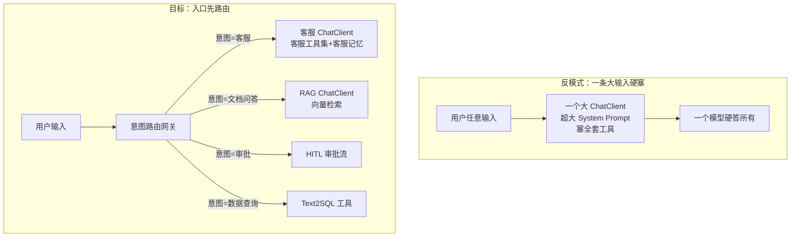
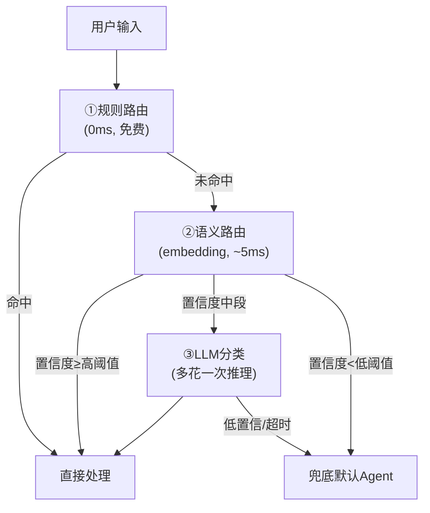
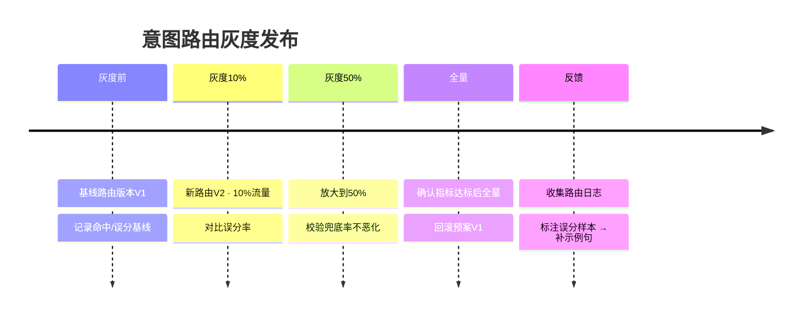

# 50-意图路由与路由编排

> **定位**：讲透 Agent 平台的"入口咽喉"——意图路由与路由编排（Intent Routing / Routing Orchestration）。在 [32-模型路由与降级](32-模型路由与降级.md) 讲的是"按成本/延迟选模型"，本文升级为**"按意图选工作流"**：系统收到一个用户请求，先识别它要干什么，再把它分发给正确的 Agent、工作流、工具或模型。读完这篇，你能把"多业务线共用一个入口"的烟囱，收敛成"一个智能路由网关"。
>
> **读者画像**：已经掌握 ChatClient、工具调用、多 Agent 编排，需要把"松散的多 Agent/多工具"收敛为"统一策略路由"的中高级架构师。
>
> **前置阅读**：[02-ChatClient与对话模型](02-ChatClient与对话模型.md)、[32-模型路由与降级](32-模型路由与降级.md)、[09-多Agent协作](09-多Agent协作.md)。想深入 embedding 原理 → [附录 01-LLM基础理论/01-Embedding原理](../附录/01-LLM基础理论/01-Embedding原理.md)。

---

## 1. 问题：入口为什么要"想一下"再分发

### 1.1 烟囱的代价

当你把客服、文档问答、数据分析、审批等多个业务线接进同一个 Agent 平台时，**直接拼一个大 Prompt 包打天下**是不可行的——不同业务的系统提示、工具集、记忆、模型成本都不一样。



**路由的价值**：每个业务线用自己专属的 Prompt、工具、记忆、模型、成本预算、审计策略——**而不是用一个臃肿的"万能 Agent"想覆盖一切**。这是"管控分离"理念（[教程 20](20-管控分离架构.md)）在入口侧的落地。

### 1.2 意图路由 ≠ 模型路由

| 维度 | 模型路由（教程32） | 意图路由（本文） |
|------|-------------------|------------------|
| 路由依据 | 任务复杂度、成本、延迟预算 | 用户的**意图**（要干什么） |
| 路由粒度 | 选择**模型** | 选择**工作流/Agent/工具集** |
| 分发产物 | ChatModel / ChatClient | 一个可执行的业务处理链 |
| 兜底 | 降级到便宜模型 | 兜底到默认 Agent 或人工 |
| 典型信号 | Token 数、优先级 | 语义相似度、分类置信度 |

两者可叠加：**先意图路由（选工作流）→ 再模型路由（工作流内选模型）**。本文聚焦前者，后者已在教程32讲透。

---

## 2. 三种意图识别方案与选型

意图识别是路由的第一步。**没有银弹**，三种方案各有权衡：

### 2.1 方案 A：规则路由（Regex / 关键词）

最快、可预测、零成本，但只能覆盖**明确关键字**的请求。

```java
// Spring AI 2.0.0 / Java 21 —— 概念代码：规则匹配
public RouteKey routeByRule(String input) {
    if (input.contains("退换货") || input.matches(".*订单\\s?[A-Z]\\d{8}.*")) {
        return RouteKey.ORDER_SERVICE;          // 客服-订单
    }
    if (input.contains("文档") && input.contains("搜索")) {
        return RouteKey.KNOWLEDGE_RAG;          // 文档问答
    }
    return RouteKey.UNKNOWN;                    // 交给更智能的下游
}
```

**适用**：高频、可枚举、字面明确的请求（如"转账""查余额"）。**不适用**：语义多变、有同义词、新话术频出的场景。

### 2.2 方案 B：Embedding 语义路由（Semantic Routing）

把"每个意图"用**若干个代表性示例句子**编码成向量，用户输入也编码成向量，算**余弦相似度**取最高者——这是可解释、低成本、无 LLM 延迟的语义路由。

```java
// Spring AI 2.0.0 —— EmbeddingModel#embed(String) 已 javap 实证
@Component
public class SemanticRouter {
    private final EmbeddingModel embeddingModel;   // spring-ai-model EmbeddingModel

    // 意图 → 该意图的代表性示例提问（越多越稳）
    private static final Map<RouteKey, List<String>> INTENT_EXAMPLES = Map.of(
        RouteKey.ORDER_SERVICE, List.of("我订单还没到，查一下", "怎么退换货", "物流到哪了"),
        RouteKey.KNOWLEDGE_RAG, List.of("公司年报里营收是多少", "搜索关于安全的制度文档"),
        RouteKey.APPROVAL_FLOW, List.of("帮我审批这笔报销", "流程卡住了，谁在审")
    );

    // 缓存：意图示例向量（启动时算好，避免每次重复 embed）
    private final Map<RouteKey, float[][]> intentVecCache = new HashMap<>();

    public RouteKey route(String input) {
        float[] inputVec = embeddingModel.embed(input);
        RouteKey best = RouteKey.UNKNOWN;
        double bestScore = -1.0;
        for (var e : INTENT_EXAMPLES.entrySet()) {
            double score = INTENT_EXAMPLES.get(e.getKey()).stream()
                .mapToDouble(s -> cosine(inputVec, embeddingModel.embed(s)))
                .max().orElse(0.0);
            if (score > bestScore) { bestScore = score; best = e.getKey(); }
        }
        return bestScore >= THRESHOLD ? best : RouteKey.UNKNOWN;  // 低于阈值→ UNKNOWN（兜底）
    }

    private static double cosine(float[] a, float[] b) {
        double dot = 0, na = 0, nb = 0;
        for (int i = 0; i < a.length; i++) {
            dot += a[i] * b[i]; na += a[i] * a[i]; nb += b[i] * b[i];
        }
        return dot / (Math.sqrt(na) * Math.sqrt(nb));
    }
}
```

- **低于阈值兜底**：语义路由的命门是**阈值**——太低会把"退换货"误分到"文档问答"，太高又全兜底。阈值需用真实语料标定（见 [附录 20](../附录/20-路由与推理策略/00-路由表与语义路由.md)）。
- **C++/嵌入侧注意**：`embed(String)` 每次调用一次模型，示例句可预计算缓存（上例 `intentVecCache` 预留），线上只对**用户输入**做一次 embed。

**适用**：意图类别有限（如 5~20 类）、每类有清晰示例、要求**低延迟低成本的语义判断**。**不适用**：意图极度开放、需要综合上下文推理（此时应看方案 C）。

### 2.3 方案 C：LLM 分类器（Structured Output）

借用略贵的模型做**开放式意图分类**，可结合系统上下文，输出结构化 JSON。

```java
// Spring AI 2.0.0 —— entity() 结构化输出已 javap 实证
record IntentResult(String intent, double confidence, String reason) {}

public RouteKey classifyWithLlm(String input, ChatClient intentClient) {
    IntentResult r = intentClient.prompt()
        .system("你是意图分类器。从 [order,knowledge,approval,data_query,other] 中选一个意图，"
               + "给出置信度(0-1)和一句判断依据。不确定选 other。")
        .user(input)
        .call()
        .entity(IntentResult.class, spec -> spec.useProviderStructuredOutput()); // 真实API
    return RouteKey.from(r.intent());
}
```

**适用**：意图开放、类别多、需要"读上下文的判断"。**不适用**：路由必须极快/绝对确定性、或要严格控制成本（每次路由都烧一次 Token）。

### 2.4 三层漏斗

生产实践常把三者**级联**：



**设计要点**：确定性（规则）先行省成本 → 语义充当主力（快且不烧 Token）→ LLM 只在模糊地带兜底。这也是本项目一贯的"**确定性先行、LLM 收尾**"方法论。

---

## 3. 路由编排中枢：从"选模型"到"选工作流"

识别意图后，路由网关要把请求**分发给真正的工作流**。这里复用 [32-模型路由](32-模型路由与降级.md) 的"多 ChatClient + @Qualifier"模式，但把路由目标从"模型"升级为"ChatClient + 配套执行链"。

### 3.1 路由目标：注册式（Route Table）

```java
// Spring AI 2.0.0 / Java 21 —— 概念代码：路由表（注册式分发目标）
@Component
public class RouteTable {
    // 每个意图绑定一条"可执行链"：ChatClient(带专属system/工具) + 可选前处理
    private final Map<RouteKey, RouteTarget> table = new EnumMap<>(RouteKey.class);

    // 通过构造注入各业务 ChatClient（各带专属 @Qualifier bean）
    public RouteTable(
        @Qualifier("orderChatClient") ChatClient orderClient,
        @Qualifier("ragChatClient")    ChatClient ragClient,
        @Qualifier("approvalWorkflow") ApprovalWorkflow approvalFlow) {

        table.put(RouteKey.ORDER_SERVICE,  RouteTarget.of(orderClient));
        table.put(RouteKey.KNOWLEDGE_RAG,  RouteTarget.of(ragClient));
        table.put(RouteKey.APPROVAL_FLOW,  RouteTarget.of(workflow -> approvalFlow.run(workflow)));
    }

    public Flux<ChatResponse> dispatch(RouteKey key, String userInput) {
        return table.getOrDefault(key, RouteTarget.fallback())
                    .execute(userInput);          // 统一出口：Mono/Flux 流式
    }
}
```

### 3.2 兜底与降级链

路由最怕**误分直达高风险业务**（把"帮我转账"误路由到普通问答，反之把闲聊路由到支付工具）。因此路由网关必须有**降级链**：

```java
// 概念代码：路由失败的多级兜底（呼应教程30容错/教程32降级）
public Flux<ChatResponse> safeDispatch(RouteKey key, String input, String tenantId) {
    return dispatch(key, input)
        .onErrorResume(ex -> logAndFallback(key, ex, input))   // 该工作流异常 → 兜底
        .switchIfEmpty(fallbackAgent(input));                  // 空结果 → 默认Agent
}
```

**要点**：高风险路由（支付、审批、删改）应设**保守阈值 + HITL 复核**（呼应 [28-Human-in-the-Loop](28-Human-in-the-Loop与审批流.md)），宁可通过率低，不可误放行。

---

## 4. 路由观测：命中率、兜底率、意图漂移

路由网关是"数据最多的地方"——每一次请求都留下路由信号。**可观测是意图路由的关键闭环**（呼应 [22-全链路可观测性](22-全链路可观测性.md) / [23-工具执行可观测与审计](23-工具执行可观测与审计.md)）。

### 4.1 关键指标

| 指标 | 定义 | 意义 |
|------|------|------|
| **命中率** | 落到明确意图的占比 | 语义覆盖是否够全 |
| **兜底率** | 落到 UNKNOWN 的占比 | 阈值是否过高/新意图涌现 |
| **误分率** | 落到错误意图的占比（抽样标注） | 语义质量的核心 |
| **意图漂移** | 某意图命中率随时间下降 | 用户话术变化/新场景涌出 |
| **路由延迟** | 规则/语义/LLM 各段耗时 | 入口加的延迟预算 |

### 4.2 意图漂移告警

用 Micrometer（配 [附录 18-Observation](../附录/18-Observation/00-Observation全景与核心概念.md)）打点，当某意图命中率跌破基线时触发"新意图涌现"告警，提示补充示例句——**这就是意图路由侧的数据飞轮**（呼应 [41-数据飞轮与持续改进](41-数据飞轮与持续改进.md)）。

```java
// Spring AI 2.0.0 —— Observation 计数器打点（概念代码）
routeObservationRegistry
    .observation("agent.intent.route")
    .lowCardinalityKeyValue("intent", key.name())
    .lowCardinalityKeyValue("stage", "semantic")
    .observe(context -> { ... });
```

### 4.3 路由审计回放

高风险业务的每次路由都应记录"输入→意图→置信度→所选工作流→产出"，供事后回放与合规审计（呼应 [25-历史记录持久化与合规](25-历史记录持久化与合规.md)）。

---

## 5. 路由 A/B 与灰度

意图路由的规则会变（新增意图、改示例句、调阈值），**上线前必须在灰度中验证误分率不上升**（呼应 [29-灰度发布与版本管理](29-灰度发布与版本管理.md)）。



**回滚预案**：路由版本要能秒级切回（路由配置与代码解耦，config 存 DB/配置中心），避免一次阈值调错引发全站误分。

---

## 6. 适用场景与不适用场景

### 适用场景 ✅
- 多业务线共用一个 Agent 入口，需要**按意图分流**到不同 Prompt/工具集/记忆。
- 请求类别有限且稳定（客服/检索/审批/数据…），每类有清晰代表语料。
- 要求"确定性先行保本 + 语义承接主力 + LLM 只兜底"的低延迟低成本路由。
- 需要路由**可观测、可审计、可灰度**的生产级平台。

### 不适用场景 ❌
- 单一业务、一套 Prompt 走天下，无需路由的简单场景（路由是过度设计）。
- 意图完全开放、无法枚举类别，需完全依赖 LLM 开放式理解（此时不该用固定类路由）。
- 路由必须绝对零误分（涉及支付/医疗）——任何路由都有误分率，需降级为**强制 HITL + 人工复核**而非纯自动路由。

---

## 总结

意图路由是 Agent 平台的**入口咽喉**：它把"一条大输入硬塞进一个大 Agent"的反模式，重构为"**先识别意图 → 再分发到正确的执行链**"。本章建立三根支柱：

1. **三种识别方案**（规则 / Embedding 语义路由 / LLM 分类）+ 三层漏斗（确定性先行、LLM 收尾）——先免费的，最后才烧 Token。
2. **路由编排中枢**：复用多 `ChatClient` + `@Qualifier` + 自研 `RouteTable`（教程32模式升级），配合兜底降级链。
3. **可观测闭环**：命中率/兜底率/误分率 + 意图漂移告警 + 审计回放 + 灰度发布——让路由规则能持续进化而不是僵死。

> **实操建议**：先用**规则 + 语义路由**跑通用例，观察兜底率；兜底率高再补示例句；只有语义也搞不定的开放意图，才引入 LLM 分类器。别一上来就烧 LLM。落到完整企业平台，见 [项目23-企业级Agent意图路由网关](../项目/23-企业级Agent意图路由网关/00-需求分析与架构设计.md)；想深入路由表/阈值标定 → [附录 20](../附录/20-路由与推理策略/00-路由表与语义路由.md)。
