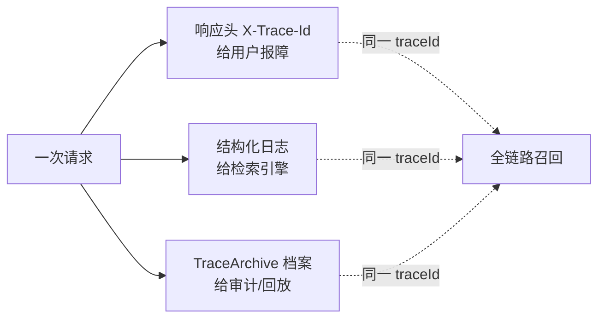

# 04 记录：traceId 落日志、响应头与链路档案

> **定位**：traceId 生成之后，工业系统要回答三个"记录"问题：**给用户看**（响应头回写 traceId，报错时用户报号）、**给机器看**（结构化日志进 ES/Loki）、**给审计看**（每次 Agent 交互的链路档案落库可查）。本关把三条记录通道一次做齐，并给出留存周期与隐私的红线。
>
> **读者画像**：完成 00-03 关，要把自己练手的 trace 能力变成"可查、可审计、可交差"的记录体系。
>
> **前置阅读**：[教程 03]。

---

## 4.1 通道一：traceId 回写响应头

工业惯例：API 出错时响应头带 `X-Trace-Id`，客服/用户报这个号，运维 `grep` 一下直达现场。实现是一个 WebFilter（与 03 关 TenantBaggageFilter 并列，`@Order` 稍后执行保证拿到最终 traceId）：

```java
// src/main/java/demo/demo01/obs/TraceIdResponseFilter.java（本关完整版）
package demo.demo01.obs;

import io.micrometer.tracing.Span;
import io.micrometer.tracing.Tracer;
import org.springframework.core.annotation.Order;
import org.springframework.stereotype.Component;
import org.springframework.web.server.ServerWebExchange;
import org.springframework.web.server.WebFilter;
import org.springframework.web.server.WebFilterChain;
import reactor.core.publisher.Mono;

@Component
@Order(-100)   // ★ 晚于 TenantBaggageFilter(-200)：行李先上车，再发身份证
public class TraceIdResponseFilter implements WebFilter {

    private final Tracer tracer;

    public TraceIdResponseFilter(Tracer tracer) {
        this.tracer = tracer;
    }

    @Override
    public Mono<Void> filter(ServerWebExchange exchange, WebFilterChain chain) {
        return chain.filter(exchange)
                .transformDeferred(call -> Mono.deferContextual(ctx -> {
                    // ★ 响应路径上读当前 span：WebFlux 下借助自动传播，此处仍在链路上下文
                    Span span = tracer.currentSpan();
                    if (span != null) {
                        exchange.getResponse().getHeaders().add("X-Trace-Id", span.context().traceId());
                    }
                    return call;
                }));
    }
}
```

验证：

```bash
curl -si -X POST "http://localhost:8080/chat" \
  -d "message=现在几点了" | head -8
# 预期响应头：X-Trace-Id: 64f8a1c2...
```

> 为什么用 `transformDeferred` + `deferContextual`：WebFlux 中 header 写入发生在响应组装时，直接在 filter 开头读 span 可能拿到 null（尚未进入订阅上下文）；挂到 Reactor Context 的自动传播链上读才稳定（[教程 10-WebFlux从零入门] 的订阅时机问题）。

## 4.2 通道二：结构化日志（给机器看）

grep 适合人肉排障，工业检索要结构化。最小改动：自定义 pattern 输出 KV 行（不引新依赖，与零额外安装偏好一致；将来换 Logstash encoder 只改 pattern 处）：

```yaml
# application-observation.yml（本关完整版：03 关基础上追加 logging 段）
management:
  tracing:
    sampling:
      probability: 1.0
    baggage:
      remote-fields:
        - tenant-id
      correlation:
        enabled: true
        fields:
          - tenant-id
logging:
  pattern:
    # ★ level 列必须保留 %X{traceId:-}/%X{spanId:-} 占位——自定义 pattern 会覆盖 Boot 默认的自动关联！
    level: "%5p [${spring.application.name:},%X{traceId:-},%X{spanId:-}]"
    console: "%d{HH:mm:ss.SSS} %-40.40logger{39} ${LOG_LEVEL_PATTERN:%5p} %m%n${LOG_EXCEPTION_CONVERSION_WORD:%wEx}"
```

输出变成可解析的稳定格式（`{tenant-id=...}` 由 03 关 correlation 附加）：

```text
14:02:11.221 INFO  d.d.tools.TimeTool [demo01,64f8...,aa11...] 开始调用工具  {tenant-id=plant-b}
```

黄金法则（后面每关通用）：**任何自定义日志 pattern，必须重读 00 关 0.3 的"覆盖即失效"边界，手动保留 traceId/spanId 占位**。

## 4.3 通道三：链路档案落库（审计视角）

APM（Zipkin 等）存 span，但 Agent 系统还需要一份**业务审计档案**：谁、哪个租户、问了什么、调了什么工具、耗时、traceId。这是"对话回放/合规留存"（[教程 企业级场景清单]）的存储侧基础。

> **需在 pom.xml 中添加依赖**（若尚无；由你决定版本管理方式）：
> spring-boot-starter-data-redis（Reactive）或 JDBC 二选一——本文用内存版演示接口，标注替换点，零额外安装。

先定义档案契约（完整文件）：

```java
// src/main/java/demo/demo01/obs/TraceArchive.java（本关完整版）
package demo.demo01.obs;

import java.time.Instant;

/** 一次 Agent 交互的链路档案：审计与排障的最小闭环记录 */
public record TraceArchive(
        String traceId,        // ★ 关联键：与日志/响应头/span 导出同号
        String tenantId,       // 来自 Baggage
        String userMessage,    // 入参摘要
        String toolsCalled,    // 本次触发的工具名（逗号分隔）
        long totalMillis,      // 端到端耗时
        Instant finishedAt) {
}
```

再写档案记录器（完整文件）：

```java
// src/main/java/demo/demo01/obs/TraceArchiveRecorder.java（本关完整版）
package demo.demo01.obs;

import io.micrometer.tracing.Tracer;
import org.springframework.stereotype.Component;
import reactor.core.publisher.Mono;
import reactor.core.publisher.Sinks;

import java.time.Duration;
import java.time.Instant;
import java.util.List;
import java.util.concurrent.CopyOnWriteArrayList;

@Component
public class TraceArchiveRecorder {

    private final Tracer tracer;
    private final List<TraceArchive> store = new CopyOnWriteArrayList<>();   // ★ 演示用内存库；生产替换 ReactiveRedisTemplate/JDBC（标注替换点）

    public TraceArchiveRecorder(Tracer tracer) {
        this.tracer = tracer;
    }

    /** 在响应完成时调用：抓 traceId + baggage 组装档案 */
    public Mono<Void> record(String userMessage, List<String> toolsCalled, long totalMillis) {
        return Mono.fromRunnable(() -> {
            var span = tracer.currentSpan();
            String traceId = span == null ? "no-trace" : span.context().traceId();
            String tenant = tracer.getBaggage("tenant-id") == null
                    ? "unknown" : tracer.getBaggage("tenant-id").get();
            store.add(new TraceArchive(traceId, tenant, userMessage,
                    String.join(",", toolsCalled), totalMillis, Instant.now()));
            if (store.size() > 1000) {   // ★ 内存防护；生产由存储层 TTL 管理
                store.remove(0);
            }
        });
    }

    /** 查询接口用：按 traceId 精确查 / 全量倒序 */
    public List<TraceArchive> findAll() {
        return store.reversed();
    }
}
```

查询端点（完整文件）：

```java
// src/main/java/demo/demo01/controller/ArchiveController.java（本关完整版）
package demo.demo01.controller;

import demo.demo01.obs.TraceArchiveRecorder;
import org.springframework.beans.factory.annotation.Autowired;
import org.springframework.web.bind.annotation.GetMapping;
import org.springframework.web.bind.annotation.RequestMapping;
import org.springframework.web.bind.annotation.RequestParam;
import org.springframework.web.bind.annotation.RestController;
import reactor.core.publisher.Mono;

import java.util.List;

@RestController
@RequestMapping("/archive")
public class ArchiveController {

    @Autowired
    private TraceArchiveRecorder recorder;

    // GET /archive/list?traceId=xxx （traceId 可省，省则全量）
    @GetMapping("/list")
    public Mono<List<demo.demo01.obs.TraceArchive>> list(@RequestParam(required = false) String traceId) {
        return Mono.fromSupplier(() -> {
            if (traceId == null || traceId.isBlank()) {
                return recorder.findAll();
            }
            return recorder.findAll().stream()
                    .filter(a -> a.traceId().equals(traceId))
                    .toList();
        });
    }
}
```

验证闭环三步：

```bash
curl -si -X POST http://localhost:8080/chat -H "X-Tenant-Id: plant-b" -d "message=现在几点了" | grep -i x-trace-id
# 拿到 X-Trace-Id: 64f8...
curl -s "http://localhost:8080/archive/list?traceId=64f8..."
# 预期：一条档案，tenantId=plant-b，toolsCalled 含 getCurrentTime
grep 64f8... logs/...   # 第三通道：日志同样召回
```

**三个通道同一个号**——这就是"记录"的完成态：



## 4.4 留存与隐私红线（架构师决策）

| 维度 | 建议 | 理由 |
|------|------|------|
| 日志留存 | 7~30 天 | 体积大，事故窗口外价值衰减 |
| 链路档案留存 | 90 天~1 年 | 审计/合规追溯窗口（金融类更长，见 [附录 12-AI治理与合规]） |
| 档案内容 | 入参**摘要**非全文 | prompt 可能含 PII；全文留存需脱敏管道（[教程 04] 脱敏 Filter 同思路） |
| 采样与全量 | span 采样、档案全量 | 档案轻量（一条一记录），span 重（一次几十条），分级留存是成本治理（07 关展开） |

适用场景：所有要"事后可查"的生产系统；尤其是对话类 Agent（回放争议交互）与工具类 Agent（操作审计）。

不适用场景：demo 阶段档案落库可省（内存版足够）；极高频低价值调用（心跳类）可按租户关闭档案。

## 4.5 常见误区

- **在 `record()` 里读 span 拿到 no-trace**：调用时机在响应组装之后、scope 已关。正确做法：traceId 在**还在链路内**时捕获（如 controller 层先取），把值传进 recorder——上面代码在 `Mono.fromRunnable` 同链路上下文执行所以能读到；若你的组装点更晚，改为显式传参。
- **档案当 span 替代品**：档案是"一次交互一行"的粗粒度，定位慢点仍需 span 树；两者是索引与详情的关系。
- **响应头回写后忽视 CSP/缓存**：`X-Trace-Id` 每请求不同，对带 CDN 缓存的响应要确认缓存 key 不含它（否则缓存击穿）。

## 4.6 本关交付与下一关

| 交付 | 验证 |
|------|------|
| X-Trace-Id 响应头 | curl -si |
| KV 结构化日志 | 控制台格式 |
| /archive/list 查询 | 按 traceId 命中 |

下一关 [教程 05]：**跨服务传播**——traceId + Baggage 如何坐上 `traceparent` 头穿过 WebClient 调用的下游服务，两服务拼接同一棵树；这是 07 关微服务架构的直接前置。

---

**实证基线**（javap / 配置元数据）：`Tracer.getBaggage(String)` 返回 `Baggage`（可 null），`BaggageView.get()` 返回 String；`management.tracing.*` 与 `management.zipkin.tracing.export.enabled` 键真实；本关未引入任何未实证 API。
