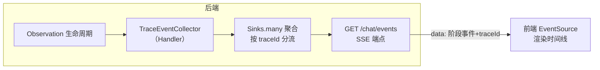

# 06 展示：SSE 推送 trace 时间线到前端

> **定位**：traceId 至此都在后端（日志/响应头/档案）。本关把它**推到用户眼前**：SSE 流里每个 Agent 阶段事件都带 traceId，前端渲染成时间线——"看得见的 Agent"是工业产品的标配体验，也是 08 关综合实战的展示层。技术主线：`ObservationHandler` 收集事件（[教程 03/05] 已建好的事件流设施）+ traceId 字段 + SSE 端点。
>
> **读者画像**：完成 00-05 关；已了解 18 系列的 AgentEventCollector/SSE 推送（本关复用其结构，聚焦 traceId 注入）。
>
> **前置阅读**：[教程 05]、[教程 04 §4.1]。

---

## 6.1 目标形态

用户在页面发问后，右侧实时长出时间线（每条含阶段/耗时/traceId）：

```text
● HTTP 请求进入        traceId=64f8a1c2...
● Agent 规划中         +0.3s
● 🔧 工具 getCurrentTime  +1.2s  ✓
● 远程服务 backend/time   +0.4s  ✓   （05 关的下游调用也进时间线）
● ✍ 生成回答中         +2.0s
✓ 完成                  共 3.9s   [复制 traceId]
```

价值：用户遇到"答错/超慢"时点【复制 traceId】报障——**排障入口从"工程师 grep 日志"前移到"用户一键报号"**（04 关 X-Trace-Id 的流式版）。



## 6.2 事件契约：traceId 是一等字段

```java
// src/main/java/demo/demo01/obs/TraceEvent.java（本关完整版）
package demo.demo01.obs;

import java.time.Instant;

/** 前端时间线的单条事件：阶段 + 耗时 + 链路号 */
public record TraceEvent(
        String phase,       // REQUEST / AGENT / TOOL / REMOTE / STREAM / ERROR / DONE
        String name,        // 展示名（工具名/端点名）
        long elapsedMillis, // 相对请求开始的耗时
        String traceId,     // ★ 全链路号：用户报障、前端与后端日志对齐的唯一凭据
        Instant time) {
}
```

## 6.3 收集器：Handler + Tracer 组合（完整文件）

结构沿用 18 系列的 AgentEventCollector 思路，差异点：① 事件里带 traceId；② 计时用 `ctx.put/get`（`Observation.Context` 无 `getDuration()`，铁律，[教程 02]）。

```java
// src/main/java/demo/demo01/obs/TraceEventCollector.java（本关完整版）
package demo.demo01.obs;

import io.micrometer.observation.Observation;
import io.micrometer.observation.ObservationHandler;
import io.micrometer.tracing.Tracer;
import org.springframework.ai.chat.client.observation.ChatClientObservationContext;
import org.springframework.ai.chat.observation.ChatModelObservationContext;
import org.springframework.ai.tool.observation.ToolCallingObservationContext;
import org.springframework.stereotype.Component;
import reactor.core.publisher.Flux;
import reactor.core.publisher.Sinks;

import java.time.Instant;
import java.util.List;
import java.util.concurrent.ConcurrentHashMap;
import java.util.concurrent.CopyOnWriteArrayList;

@Component
public class TraceEventCollector implements ObservationHandler<Observation.Context> {

    private final Tracer tracer;
    // ★ 简单起见：单一全局多播 sink；生产按 traceId 分流（Sinks many per trace + TTL 清理）
    private final Sinks.Many<TraceEvent> sink = Sinks.many().multicast().onBackpressureBuffer(256);
    private final ConcurrentHashMap<String, Long> startNanos = new ConcurrentHashMap<>();

    public TraceEventCollector(Tracer tracer) {
        this.tracer = tracer;
    }

    @Override
    public boolean supportsContext(Observation.Context context) {
        // ★ 只关心三段：ChatClient（AGENT）、ChatModel（LLM）、Tool（TOOL）
        return context instanceof ChatClientObservationContext
                || context instanceof ChatModelObservationContext
                || context instanceof ToolCallingObservationContext;
    }

    @Override
    public void onStart(Observation.Context context) {
        startNanos.put(key(context), System.nanoTime());
    }

    @Override
    public void onStop(Observation.Context context) {
        Long start = startNanos.remove(key(context));
        long elapsed = start == null ? 0 : (System.nanoTime() - start) / 1_000_000;
        String traceId = tracer.currentSpan() == null
                ? "no-trace" : tracer.currentSpan().context().traceId();   // ★ 与日志同源
        String phase = phaseOf(context);
        String name = nameOf(context);
        sink.tryEmitNext(new TraceEvent(phase, name, elapsed, traceId, Instant.now()));
    }

    private String key(Observation.Context context) {
        return System.identityHashCode(context) + "";
    }

    private String phaseOf(Observation.Context context) {
        if (context instanceof ToolCallingObservationContext) {
            return "TOOL";
        }
        if (context instanceof ChatModelObservationContext) {
            return "LLM";
        }
        return "AGENT";
    }

    private String nameOf(Observation.Context context) {
        if (context instanceof ToolCallingObservationContext tool) {
            return tool.getToolCallInfo().toolDefinition().name();   // 18系列实证过的真实链路
        }
        return context.getName() == null ? "chat" : context.getName();
    }

    public Flux<TraceEvent> stream() {
        return sink.asFlux();
    }
}
```

注册 Handler（完整文件）：

```java
// src/main/java/demo/demo01/config/ObservationConfig.java（本关完整版）
package demo.demo01.config;

import demo.demo01.obs.TraceEventCollector;
import io.micrometer.observation.ObservationPredicate;
import org.springframework.context.annotation.Bean;
import org.springframework.context.annotation.Configuration;

@Configuration
public class ObservationConfig {

    @Bean
    public ObservationPredicate traceEventPredicate() {
        // ★ 演示：全放行；生产用谓词降噪（只采本租户/采样命中的链路）
        return (name, context) -> true;
    }
}
```

> Handler 挂载说明：`TraceEventCollector` 标了 `@Component` 且实现 `ObservationHandler`，Boot 的 `ObservationRegistryCustomizer` 体系会把容器里所有 `ObservationHandler` Bean 自动挂进 `ObservationRegistry`（18 系列 03 关同机制，无需手写注册）。

## 6.4 SSE 端点（完整文件）

```java
// src/main/java/demo/demo01/controller/TraceEventController.java（本关完整版）
package demo.demo01.controller;

import demo.demo01.obs.TraceEventCollector;
import demo.demo01.obs.TraceEvent;
import org.springframework.beans.factory.annotation.Autowired;
import org.springframework.http.MediaType;
import org.springframework.web.bind.annotation.GetMapping;
import org.springframework.web.bind.annotation.RequestMapping;
import org.springframework.web.bind.annotation.RestController;
import reactor.core.publisher.Flux;

import java.time.Duration;

@RestController
@RequestMapping("/trace")
public class TraceEventController {

    @Autowired
    private TraceEventCollector collector;

    // SSE：事件流 + 15s 心跳保活
    @GetMapping(value = "/events", produces = MediaType.TEXT_EVENT_STREAM_VALUE)
    public Flux<TraceEvent> events() {
        return collector.stream().mergeWith(
                Flux.interval(Duration.ofSeconds(15)).map(i -> new TraceEvent("PING", "keepalive", 0, "no-trace", java.time.Instant.now())));
    }
}
```

### 验证（curl 消费 SSE）

```bash
curl -N "http://localhost:8080/trace/events" &
sleep 1
curl -si -X POST http://localhost:8080/chat -H "X-Tenant-Id: plant-b" -d "message=现在几点了" | grep -i x-trace-id
```

SSE 侧预期（依次）：

```text
data:{"phase":"AGENT","name":"chat client","elapsedMillis":3120,"traceId":"64f8a1c2...","time":"..."}
data:{"phase":"LLM","name":"spring.ai.chat","elapsedMillis":2900,"traceId":"64f8a1c2...","time":"..."}
data:{"phase":"TOOL","name":"getCurrentTime","elapsedMillis":450,"traceId":"64f8a1c2...","time":"..."}
```

**判读关键**：所有事件 traceId 与 X-Trace-Id 响应头一致、与日志方括号一致——三通道（日志/响应头/时间线）+ SSE 四处同号，展示闭环完成。

## 6.5 前端消费（讲解，不生成前端源码文件）

`EventSource('/trace/events')` 监听 message，按 `phase` 选图标、`elapsedMillis` 渲染时长、traceId 放"复制"按钮。两个体验决策：

- **按 traceId 过滤**：当前演示是全局多播，页面同时多人用会互相看见事件；生产在端点上加会话过滤（从认证态拿当前 traceId/会话 id，只推属于它的），或前端只渲染与本次请求 X-Trace-Id 匹配的事件——**推荐后者**，逻辑简单且不动 sink 结构。
- **时间线 ≠ trace 全量**：SSE 推的是精选阶段（业务可读），完整 span 树仍在导出端（04/07 关）；时间线给人看，瀑布图给工程师看，别混。

适用场景：Chat 类产品（生成过程可见）、长任务 Agent（进度条 + 断线重连）、HITL 审批（等待人工时时间线停在审批节点）。

不适用场景：高频内部 RPC 的观测（人看不过来，走 APM）；对延迟极度敏感的端点（事件序列化有微小开销，可用谓词关闭）。

## 6.6 常见误区

- **在 `onStop` 里拿不到 span（traceId=no-trace）**：stop 回调时 scope 可能已切换。稳妥法：`onStart` 时抓 traceId 存进 `context.put("traceId", id)`，`onStop` 从 `context.get` 取——与 18 系列计时同款 `ctx.put/get` 范式（铁律：`Observation.Context` 无 getDuration）。
- **SSE 断线后事件丢失**：`onBackpressureBuffer(256)` 只是缓冲上限，重连需要业务层补偿（按 traceId 从 04 关档案拉快照）。工业断线重连方案见 [教程 05]。
- **把 traceId 暴露当风险**：traceId 是随机 id、不含业务语义，可给前端；但**档案查询接口必须鉴权**（04 关 /archive/list 不能裸奔到公网）。

## 6.7 本关交付与下一关

| 交付 | 验证 |
|------|------|
| SSE 事件带 traceId | curl -N 四处同号 |
| 阶段时间线 | AGENT/LLM/TOOL 顺序事件 |
| 心跳保活 | 15s PING |

下一关 [教程 07]：**管控分离微服务落地**——网关/控制面/数据面三角色下的 traceId 架构、采样与留存策略、跨服务排障 SOP——进入架构师主战场。

---

**实证基线**：`ObservationHandler`/`ObservationPredicate` 自动挂载机制与三 ObservationContext 类型（18 系列 javap 实证沿用）；`Sinks.many().multicast().onBackpressureBuffer(int)`（Reactor 3.x 真实 API）；本关无未实证 API。
