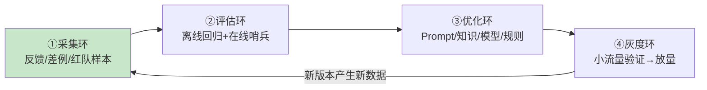

# 53-企业级数据飞轮闭环

> **定位**：讲透**飞轮作为平台**——把 [41-数据飞轮与持续改进](41-数据飞轮与持续改进.md) 的单业务飞轮升级为**企业级统一闭环**：采集→评估→优化→灰度四环合成一个平台，知识/评测/仿真各自飞轮（18/19/21 项目）汇流至此。涵盖：**四环数据流与元数据、飞轮防污染、多业务线联邦飞轮、飞轮健康度度量**。读完这篇，你能把散落各业务的"改进循环"收敛成一个**越跑越快的企业级飞轮平台**。读者画像：要回答"多个业务各自优化，怎么合成一个企业级持续改进引擎"的架构师。
>
> **前置阅读**：[41-数据飞轮与持续改进](41-数据飞轮与持续改进.md)、[29-灰度发布与版本管理](29-灰度发布与版本管理.md)、[37-自我反思与Agent评估](37-自我反思与Agent评估.md)。想深入评估工具 → [附录 12-评估与可观测生态](../附录/12-评估与可观测生态/00-Langfuse与Ragas集成.md)。

---

## 1. 飞轮的四环（企业级视角）

单业务飞轮（41）是"反馈→改进"；企业级飞轮是**四个环咬合的齿轮组**：



| 环 | 输入 | 输出 | 关键纪律 |
|----|------|------|---------|
| 采集 | 用户反馈/差例/拒绝样本/红队 | 带标注的改进候选 | **防污染**（恶意反馈/标注投毒） |
| 评估 | 改进候选 + 金标 | 量化改进证据 | 新旧对比显著性（防"看均值拍板"） |
| 优化 | 改进证据 + 归因 | Prompt 补丁/知识更新/规则 | 定向修复（差例归因到层） |
| 灰度 | 新版本 | 放量/回滚决策 | 指标守门 + 秒级回滚 |

## 2. 飞轮的元数据（让数据可追溯）

飞轮数据不是裸样本，每条带**血缘元数据**：

```java
// 概念代码：飞轮数据单元（血缘贯穿）
record FlywheelItem(String id, ItemSource source,        // FEEDBACK/DIFF_CASE/REDLINE/SIM
                    String bizLine, String agentVersion, // 产生它的业务线与版本
                    String promptVersion, String kbVersion,
                    Label label, long ts) {}              // 标注(人/LLM判/自动)
```

**价值**：评估发现"差例集中在 kbVersion v3 后"→ 直接定位是知识更新引入的回归（**归因到层**，呼应 [30-归因](../项目/30-企业级Agent可解释与透明平台/03-证据归因引擎.md) 的分层归因思想在飞轮侧的应用）。

## 3. 防污染（飞轮的免疫系统）

飞轮最大的风险是**被投毒**：恶意差评攻击竞品、标注污染让评估失真、红队样本混入训练式后门。三层防御：

1. **来源可信分级**：认证用户反馈 > 匿名反馈 > 外部爬取；低可信来源权重低。
2. **标注交叉验证**：LLM 判 + 抽样人审不一致率监控（呼应 [19-金标防污染](../项目/19-企业级Agent信任与评测平台/02-金标资产化.md)）。
3. **异常检测**：某来源差评率突变（可能是攻击）→ 冻结该来源待查。

## 4. 多业务线联邦飞轮

企业级飞轮不是"一个池子混所有数据"——**各业务线飞轮自治 + 联邦共享**：

- **自治**：每业务线自己的金标/差例/优化节奏（客服的"好"和风控的"好"标准不同）。
- **联邦**：跨线共享**脱敏的通用模式**（注入攻击样本/通用拒绝话术），**不共享**业务敏感数据（呼应 [27-联邦](../项目/27-企业级Agent协作平台/09-跨组织协作与联邦.md)、[26-多租户](26-多租户隔离与资源治理.md)）。

## 5. 飞轮健康度度量

飞轮本身要有仪表盘——**转速**（单位时间改进项数）、**转化率**（差例→修复上线比例）、**回归率**（改进引入的新问题率）、**周期时长**（差例发现→修复上线 P50 天数）。飞轮停转（转化率趋零）比飞轮慢更危险——说明改进管道堵了。

## 6. 适用场景与不适用场景

### 适用场景 ✅
- 多业务线 Agent 平台需要统一"越跑越好"引擎，且要防标注投毒/恶意反馈。
- 已有评测（19）、知识（18）、仿真（21）各自飞轮需收束的企业。

### 不适用场景 ❌
- 单业务小规模（41 的单飞轮够用，平台化是过度设计）。
- 无灰度能力时的"飞轮"（没有灰度守门，改进=赌博）。

---

## 总结

企业级数据飞轮 = **四环齿轮（采集/评估/优化/灰度）+ 血缘元数据 + 免疫系统（防污染）+ 联邦（多业务自治共享）+ 健康度仪表盘**。四根支柱：

1. **四环咬合**：任一环停转飞轮就停——采集无标注、评估无金标、优化无归因、灰度无守门，都是断点。
2. **血缘贯穿**：数据带版本血缘，差例能归因到层（Prompt/知识/模型/规则）。
3. **防污染三层**：来源分级 + 交叉验证 + 异常冻结——飞轮的免疫系统。
4. **联邦而非混池**：业务线自治 + 脱敏模式共享。

> **实操建议**：先跑通单业务四环（41→本教程），再加血缘与防污染，最后联邦化。落地完整平台 → [项目26-企业级Agent数据飞轮平台](../项目/26-企业级Agent数据飞轮平台/00-需求分析与架构设计.md)。
