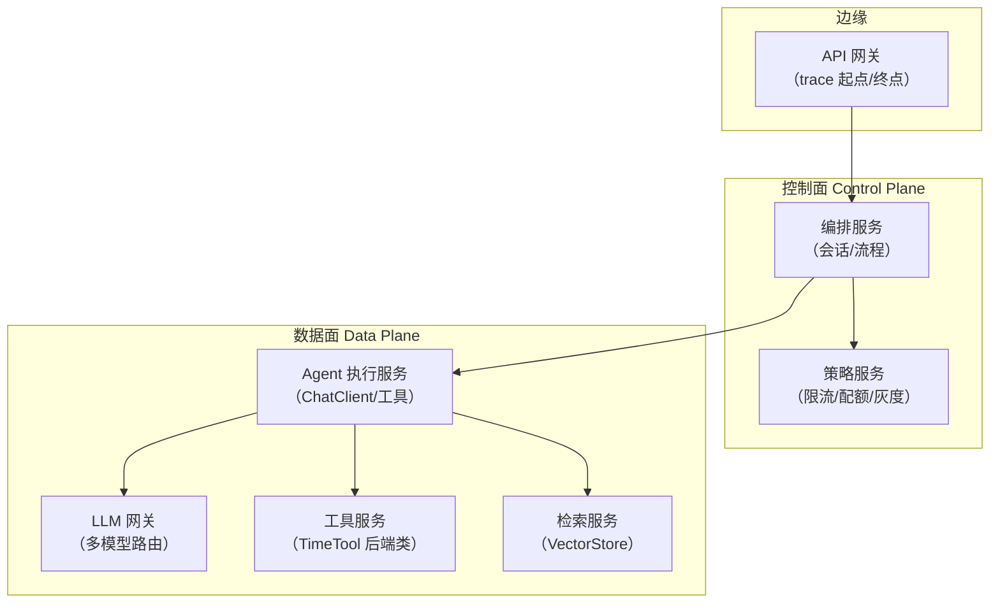
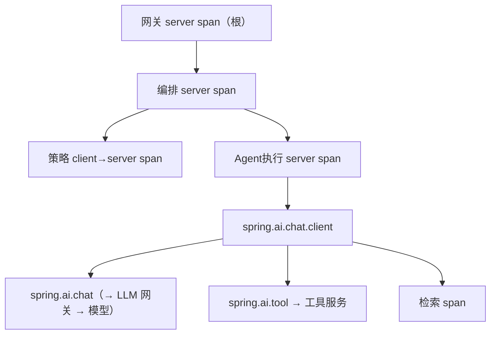
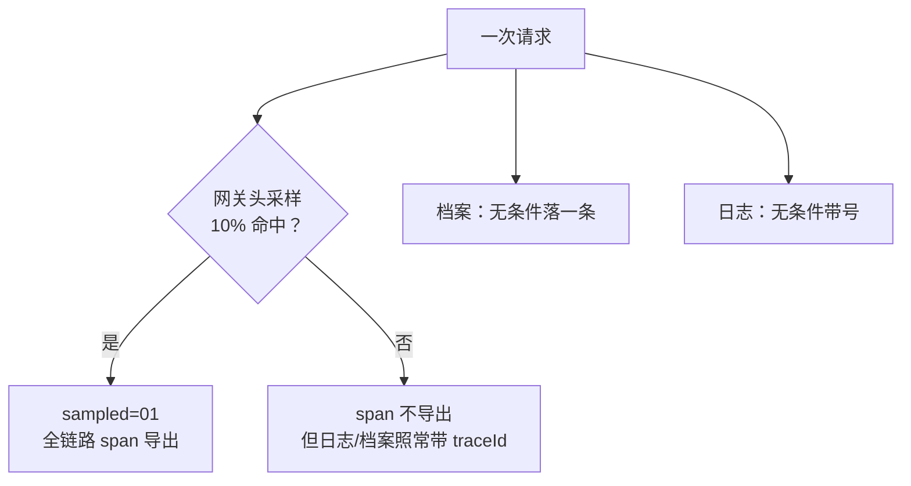

# 07 管控分离微服务落地：控制面与数据面的 traceId 架构

> **定位**：把 00-06 关的全部单点能力放进**企业拓扑**：API 网关 → 控制面（编排/策略/治理）→ 数据面（LLM 网关、Agent 执行、工具服务、检索服务）的多微服务架构里，traceId 如何贯穿、采样与留存如何分级、跨服务排障 SOP 长什么样。本关是架构师视角的"设计篇"，代码只给关键增量（各服务都复用前六关的同一套设施）。
>
> **读者画像**：完成 00-06 关；具备微服务基础（[教程 29-32、57-66、77-87 企业级篇]、[附录 06-企业级架构模式]）。
>
> **前置阅读**：[教程 05]、[附录 06-企业级架构模式]。

---

## 7.1 拓扑与 span 树：先画目标图

管控分离（Control/Data Plane 分离）下的典型 Agent 平台：



同一请求的 span 树（traceId 全程一个）：



**架构不变式**（设计审查清单）：

1. **网关是唯一根**：traceId 在网关生成（请求没带 traceparent 时），全链路用它；入口同时终结外部带来的旧链（5.6 选型第三分支），防 traceId 污染。
2. **每跳都是 client/server 成对 span**：树深度=调用深度，谁加了一跳一眼可见（防止服务间偷偷加代理）。
3. **baggage 白名单在网关收口**：tenant-id/gray-flag 由网关**覆写**注入（03 关安全红线），内部服务信任 baggage 不再校验——校验一次，处处受益。
4. **档案归控制面**：04 关 TraceArchive 的**存储与查询**放控制面（数据面各服务只上报），审计能力不散落。

## 7.2 每个服务要做的"最小一致集"

七个服务不需要七套代码——前六关的设施是**同构复制**的：

| 设施 | 来源 | 部署位置 |
|------|------|---------|
| tracing 两依赖 + sampling 配置 | 00/01 关 | **所有服务**（含网关） |
| baggage 白名单 + MDC correlation | 03 关 | 所有服务（网关负责写入） |
| X-Trace-Id 回写 | 04 关 | **仅网关**（对用户） |
| 档案记录与查询 | 04 关 | 数据面记录 → 控制面汇聚查询 |
| traceparent 传播 | 05 关 | 所有出站走自动装配 WebClient/RestClient Builder |
| SSE 时间线 | 06 关 | 网关聚合推送（面向用户） |

新增的关键增量代码只有一处——**网关入口过滤器**（终结外链 + 收口 baggage + 回写 traceId 三合一，WebFilter 骨架完整）：

```java
// 网关服务：gateway/TraceRootFilter.java（完整版；其余设施同 03/04 关）
package com.plant.gateway;

import io.micrometer.tracing.Span;
import io.micrometer.tracing.Tracer;
import org.springframework.core.annotation.Order;
import org.springframework.stereotype.Component;
import org.springframework.web.server.ServerWebExchange;
import org.springframework.web.server.WebFilter;
import org.springframework.web.server.WebFilterChain;
import reactor.core.publisher.Mono;

@Component
@Order(-300)   // ★ 网关最外层：先于一切业务过滤器
public class TraceRootFilter implements WebFilter {

    private final Tracer tracer;

    public TraceRootFilter(Tracer tracer) {
        this.tracer = tracer;
    }

    @Override
    public Mono<Void> filter(ServerWebExchange exchange, WebFilterChain chain) {
        // ① 不透传外部 traceparent：外部带来的链在这里终结（防污染/防伪造）
        //    （server span 已由框架基于"收到的 header"建立；网关策略层可选择
        //     忽略入站 traceparent —— 配 management.tracing.propagation 从 consume 剔除 W3C，
        //     或在更外层剥头；这里以"覆写 baggage"保证身份可信）
        // ② 身份收口：从 token 解析租户，覆写 baggage（不信任请求头）
        String tenant = resolveTenantFromToken(exchange);       // 鉴权实现略（[附录 08-Agent安全深度]）
        try (var baggage = tracer.createBaggageInScope("tenant-id", tenant)) {
            Span span = tracer.currentSpan();
            if (span != null) {
                // ③ 回写：用户报障入口
                exchange.getResponse().getHeaders().add("X-Trace-Id", span.context().traceId());
            }
            return chain.filter(exchange);
        }
    }

    private String resolveTenantFromToken(ServerWebExchange exchange) {
        var auth = exchange.getRequest().getHeaders().getFirst("Authorization");
        return auth == null ? "anonymous" : "tenant-of(" + auth.length() + ")";  // ★ 概念代码：真实解析见安全附录
    }
}
```

## 7.3 采样与留存：分级策略（成本治理主战场）

全采样是学习态（01 关），生产的 trace 体积 = 请求数 × span 数 × 字节数，必须分级：

| 层 | 策略 | 实现 |
|----|------|------|
| 正常流量 | 尾部采样：错误链**必留**、慢链必留、其余 5% | 网关/收集端按 traceId 聚合决策（Zipkin/Tempo 的 tail-based sampling，[附录 18-可观测平台实践/00]） |
| 头部快速采样 | 入口先 10% 决定是否带 sampled=01 | `management.tracing.sampling.probability: 0.1`（服务侧） |
| 高价值操作 | 强制全采：工具调用失败、HITL 审批、租户升级操作 | 服务侧 `ObservationPredicate`/span 标记 + 采样覆盖 |
| 档案（04 关） | **永远全量**（轻量：一交互一条） | TraceArchiveRecorder 本身不分采样 |
| 日志 | 全量留存 7~30 天（04 关红线表） | 日志平台 |

关键认知：**采样只影响 span 导出，不影响 traceId 生成与 MDC**（01 关 1.6）——所以"日志全量 + span 抽样 + 档案全量"三层可以独立决策，这是成本与可观测性的平衡点。



## 7.4 跨服务排障 SOP（把 01 关 1.5 放大成微服务版）

收到工单"用户 X 的 Agent 回答超慢，报障号 64f8a1c2..."：

| 步骤 | 动作 | 用到的通道 |
|------|------|-----------|
| 1 | 档案库查 traceId → 拿租户/工具清单/总耗时 | 04 关 TraceArchive |
| 2 | 日志平台 grep traceId → 按服务分组、时间排序 | 04 关结构化日志 |
| 3 | APM 打开该 traceId 瀑布图 → 定位最慢 span | span 导出（7.3） |
| 4 | 沿 parentId 上爬 → 定责到服务/外部模型 | 01 关族谱 |
| 5 | 若是 LLM 慢 → 看 gen_ai tag（模型/token 数） | [教程 20] |
| 6 | 若 span 未采样 → 凭日志+档案给出受限结论并标记"该操作加入强制全采白名单" | 7.3 高价值层 |

**每一步都有 fallback**：采样丢了 span，还有日志和档案兜底——这就是三层记录分级的意义。

## 7.5 服务网格/多语言边界

- **Java 服务间**：本系列方案（Micrometer Tracing）全覆盖。
- **多语言（Python 工具服务）**：约定共同说 W3C（05 关格式），对方用 OTel SDK 注入/提取 `traceparent`，树照样拼起来（baggage 头同理，字段名对齐白名单）。
- **消息队列异步段**（Kafka 触发的 Agent 任务）：生产者在发消息前把 traceId/spanId 塞 record header，消费者入口提取后 `nextSpan(parent)` 手动续链（02 关 2.5 范式 + 05 关 header 格式），跨度从"一次 RPC"变成"一条消息的因果"——异步链路的 traceId 断点是最常见的观测盲区，[教程 67-Kafka全景与核心概念] 结合处展开。

适用场景：≥3 个服务的 Agent 平台；多团队协作（traceId 是跨团队排障的中立语言）；有合规审计要求的行业（金融/医疗，[附录 12-AI治理与合规]）。

不适用场景：单体先行阶段（全套微服务 trace 是过度设计——但**代码同构性**（7.2 最小一致集）保证你从单体拆走时零改造）；纯内部低频管理后台（日志即可）。

## 7.6 常见误区

- **以为每个服务各自随机生成 traceId 也能串**：不能。没有传播就各自为根，树永远拼不起来——05 关断链排障表第一行。
- **把 baggage 当服务间业务协议**：07 关的 baggage 只承载观测身份（tenant/gray），业务参数仍走 API 契约；用 baggage 传业务字段 = 隐式耦合，换语言/换框架即断。
- **在数据面每个服务都建完整档案库**：档案汇聚到控制面统一存（7.1 不变式 4），数据面只上报——否则审计查询要扇出 N 个库。
- **忽视 LLM 供应商侧的"链路黑洞"**：出网到模型 API 的 span 你能建，但模型内部不可见；把 provider 请求 id 记为 span tag（`provider.request.id`），工单升级时拿它找供应商对账。

## 7.7 本关交付与下一关

| 交付 | 验证 |
|------|------|
| 网关 TraceRootFilter（终结+收口+回写） | 外部伪造 tenant-id 无效 |
| 分级采样策略表 | 错误链 100% 可查，正常链 5% |
| 六步跨服务排障 SOP | 拿报障号走完全程 |

下一关 [教程 08]：**存储工程**——span 数据落到哪（后端选型）、怎么建模（traceId 索引 vs 标签索引）、怎么查（查询路径与 TTL）；随后 [教程 09]（使用运营）与 [教程 19]（综合实战收官）。

---

**实证基线**：本关新增 API 仅网关过滤器（03/04 关已实证设施复用）；`resolveTenantFromToken` 显式标注概念代码；采样/传播配置键出处同 01/05 关。
