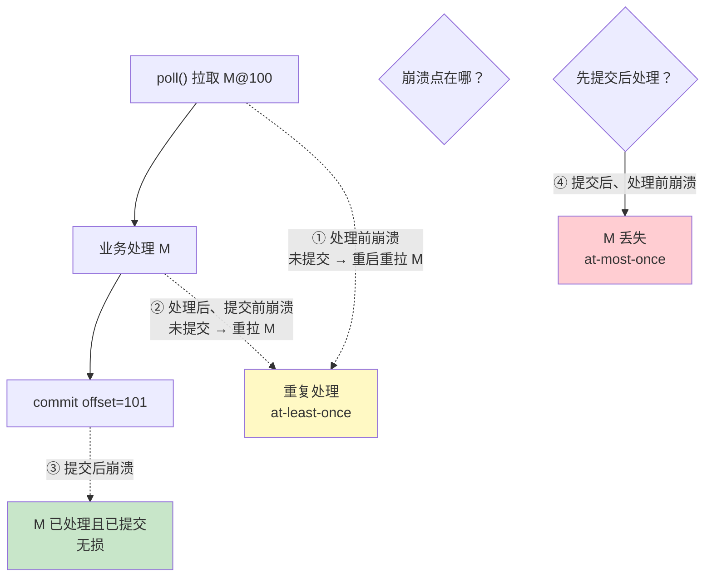
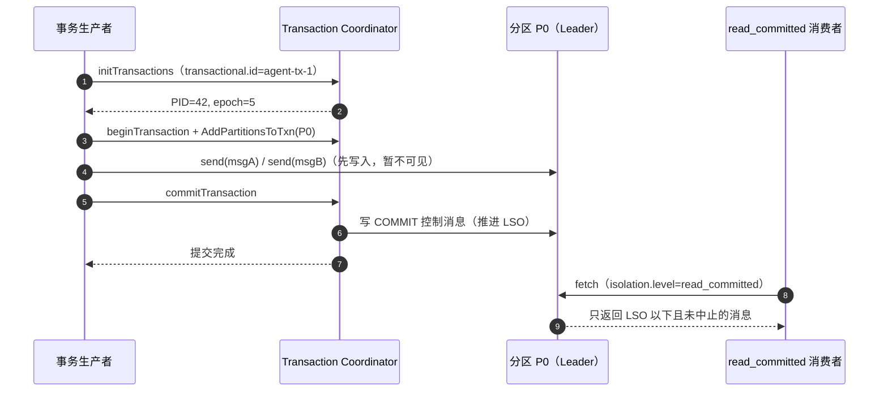
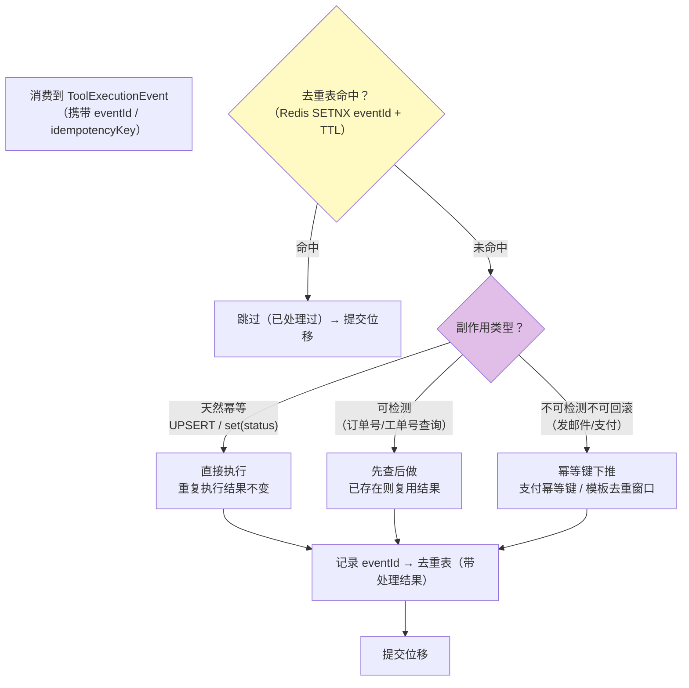
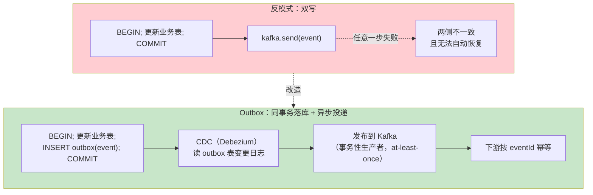

# 投递语义与事务

> **定位**：本文回答 Kafka 最核心的架构问题——消息到底会不会丢、会不会重复、能不能"精确一次"。逐个故障注入点拆解三种投递语义，完整讲解幂等生产者、事务机制（transactional.id/LSO/僵尸围栏）、consume-transform-produce 模式与 Outbox 模式，以及"精确一次副作用"在 Agent 工具执行中的落地。
>
> **读者画像**：读过 [教程 68-生产者机制与调优]、[教程 69-消费者与消费组] 的工程师；正在设计"工具执行结果必须不丢不重"的审计/事件溯源管道，或被"重复消费"问题困扰的架构师。
>
> **前置阅读**：[教程 68-生产者机制与调优 §5]（PID/序列号）；[教程 69-消费者与消费组 §3]（位移提交策略）；[教程 63-容错与弹性设计]（重试/幂等的通用视角）。
>
> **版本基准**：kafka-clients 4.1.x（事务与 EOS v2 为成熟能力）。

---

## 1. 三种语义：先看清故障注入点

与其背定义，不如看**在哪个时间点崩溃会产生什么后果**。设消费者已拉取消息 M（offset=100）：



三个结论：

1. **崩溃本身无法避免，语义取决于"提交"与"处理"的先后顺序**——[教程 69-消费者与消费组] §3] 的两种手动提交策略正是对这张图的选择。
2. **at-least-once 是 Kafka 世界的默认立场**：它不丢消息，代价是重复。所以工程重心永远在"**幂等消费**"上，而不是徒劳追求"不重复"。
3. **所谓 exactly-once 不是魔法**，它 = at-least-once 传输 + **幂等效果**（去重表 / 事务原子提交 / 天然幂等操作）。Kafka 事务能做的只是把"输出到 Kafka 的消息 + 消费位移"原子化；**一旦副作用出了 Kafka 的边界（DB、HTTP、LLM），就要靠你自己**（§5、§6）。

---

## 2. 生产端可靠性核对清单（故障注入矩阵）

延续 [教程 68-生产者机制与调优] §3] 的三件套，给出完整核对矩阵——每一行都是一次真实故障注入：

| 故障注入 | 无防护后果 | 防护配置 |
|---------|-----------|---------|
| send() 入队后、网络发出前进程退出 | 消息从未离开进程（缓冲丢失） | 善后：关闭时 `producer.close()` 排空；关键事件走 Outbox（§6） |
| Broker 响应丢失，Producer 重试 | 下游重复 | `enable.idempotence=true`（Broker 按序列号去重） |
| Leader 落盘后、Follower 复制前宕机 | 消息丢失（新 Leader 无此消息） | `acks=all` + `min.insync.replicas=2` |
| ISR 收缩到 1 仍接受写入 | 故障时刻静默降级为单副本 | `min.insync.replicas=2` 让写失败"显式报错" |
| 磁盘坏 / 文件系统损坏 | 消息丢失 | RF=3 + 跨机架/AZ 分布（[教程 75-运维监控与安全] §2]） |
| unclean 选举：落后副本当上 Leader | 已复制消息被截断丢失 | `unclean.leader.election.enable=false`（默认） |

**架构师读法**：这张表就是容量评审的检查项。"我们不丢消息"必须能逐行说出对应配置，否则就是玄学。

## 3. 事务机制：把"多条消息 + 位移"变成原子单元

### 3.1 API 与内部机制

```java
// 概念骨架：事务生产者（spring-kafka 封装见 [教程 76-Spring集成与Agent事件驱动落地] §4]）
producer.initTransactions();            // 注册 transactional.id，取 PID+epoch
try {
    producer.beginTransaction();
    producer.send(eventA);              // 写分区 P0
    producer.send(eventB);              // 写分区 P5（跨分区！）
    producer.sendOffsetsToTransaction(  // consume-transform-produce：把消费位移也纳入事务
        offsets, consumer.groupMetadata());
    producer.commitTransaction();       // 原子提交：A、B、位移，三者要么全可见要么全不可见
} catch (ProducerFencedException | OutOfOrderSequenceException e) {
    producer.close();                   // 僵尸/纪元落后，必须弃用实例
} catch (KafkaException e) {
    producer.abortTransaction();        // 回滚
}
```

四个内部机制（面试与排障的深水区）：

1. **transactional.id 跨重启稳定** → Broker 据此分配**递增的 epoch**。旧实例（网络分区后恢复的"僵尸"）携带旧 epoch 写入，被 `ProducerFencedException` 拒绝——**僵尸围栏（fencing）**是事务正确性的基石，也是它区别于普通幂等的根本能力。
2. **`__transaction_state`**：内部主题，事务协调者持久化事务状态。
3. **控制消息**：commit/abort 在**每个涉及的分区**写入标记。`isolation.level=read_committed` 的消费者只读到最后稳定位移（LSO），跳过已中止事务的消息——对消费者而言原子性是"过滤出来的"。
4. **transaction.timeout.ms（默认 60s）**：事务超时，协调者主动中止并放行 LSO——**事务卡死会阻塞下游消费进度**，这是事务吞吐与延迟代价的来源。

### 3.2 事务时序



### 3.3 边界与代价

- 事务保证的是 **Kafka 内部的原子性**："这些消息 + 这批位移，要么都对下游可见，要么都不可见"。
- 事务**不保证**外部副作用的原子性：事务中调了外部 HTTP 工具，事务 abort 后 HTTP 调用不会回滚——外部世界永远要靠幂等键或补偿（§5）。
- 吞吐代价客观存在：控制消息、协调者往返、LSO 推进延迟。**单消息也开事务**是经典反模式——单分区单条写入本身就是原子的，不需要事务。

---

## 4. consume-transform-produce：EOS 的完整拼图

Kafka 事务的黄金场景：**消费 A 主题 → 处理 → 产出 B 主题**，把"消费位移"与"输出消息"放进同一个事务：

| 方案 | 重复窗口 | 适用 |
|------|---------|------|
| 普通消费者 + 普通生产者（无事务） | 崩溃后：输入重放 → **输出重复**，下游需全局去重 | 输出天然幂等或允许重复 |
| 幂等生产者（无事务） | 只消灭**网络重试**重复，崩溃重放重复依旧 | 同上，且不需要跨分区原子 |
| **事务（EOS）** | 无：位移与输出原子提交，崩溃后从上次事务点继续 | 投影/管道类服务（审计投影、会话状态物化） |
| Kafka Streams `exactly_once_v2` | 无（框架托管上述事务） | 流处理拓扑（[教程 73-KafkaStreams流处理] §7]） |

Agent 落地的典型形态——**会话状态投影服务**：消费 `agent.session.events`，物化每个会话的最新状态到 `agent.session.snapshots`（压实主题）。用事务包裹"读事件→算新状态→写快照→提交位移"，崩溃恢复后不会出现"快照写了两次同一条事件"造成的状态回跳。这正是 [项目 13-事件溯源Agent运行时平台] 投影层的可靠性配方。

---

## 5. 业务幂等：Agent 副作用的精确一次

工具执行是典型的**不可回滚外部副作用**（发邮件、写工单、调支付）。at-least-once 传输 + 以下三选一，构成"事实上的精确一次"：



实现要点（呼应 [教程 83-长任务持久化与中断恢复 §4] 的幂等层）：

1. **eventId 必须在生产侧生成**（UUID v7：时间有序，利于索引），消费侧只认不造——"消费时才发现没有幂等键"等于没有幂等键。
2. **去重表写入与副作用执行的顺序**：先占位（SETNX，处理中状态）→ 执行 → 回写结果。占位与执行之间崩溃的记录要能被对账任务发现（超时占位重置）。
3. **TTL 要长于最大重放窗口**：重放可能来自消费组回溯（几天前的位移），去重窗口太短等于虚设；对审计级事件，去重表落库而非 Redis。

---

## 6. Outbox 模式：DB 与 Kafka 的一致性

**双写（dual-write）反模式**：业务代码先 `db.commit()` 再 `kafka.send()`——两步之间任何故障都造成"库里有、事件没发"（下游永远不知道）或反向不一致。这是事件驱动架构第一大坑。



要点：

1. **Outbox 行与业务变更在同一个本地事务**里提交——DB 的事务原子性免费借来用。
2. 投递通道两种实现：**CDC（Debezium，推荐）**——基于 WAL/binlog，不侵入业务、无轮询压力，且自带 at-least-once + 与源库的一致顺序（同表同主键有序）；**轮询发布器**——简单但要做"已发布"标记与批量扫描，高吞吐下有延迟与锁竞争。
3. 下游仍需幂等：Outbox 保证"不漏"，at-least-once 决定"可能重"。
4. Debezium 侧与 Schema 演进的完整展开见 [教程 74-Connect与数据生态 §5]。

Agent 场景对号入座：LLM 网关完成一次调用，要同时写"调用记录表"（成本归因，[教程 60-成本治理与Token计量]）与发 `agent.llm.telemetry` 事件（计量管道）——Outbox 是标准答案；会话事件同理（[项目 13] 迭代二的事件管线）。

## 7. 适用场景与不适用场景

### 适用场景

- 审计/事件溯源管道：at-least-once + eventId 幂等去重表（性价比最高，首选）
- 消费→变换→生产 的投影/物化服务：事务（EOS）把位移与输出原子化
- DB 变更必须可靠产生事件的场景：Outbox + CDC
- 流处理拓扑：Kafka Streams `exactly_once_v2` 一键获得（[教程 73-KafkaStreams流处理] §7]）

### 不适用场景

- 单条消息单分区写入：本来就原子，事务纯属开销
- 副作用在 Kafka 外且不配合幂等键：事务帮不了你，先设计幂等再谈语义
- 极低延迟命令通道：read_committed 的 LSO 推进 + 事务超时窗口会显著放大尾延迟——命令通道用 at-least-once + 去重

## 8. 常见误区与反模式

1. **"我们配了 exactly_once，所以系统精确一次"**——EOS 只覆盖 Kafka 内部；外部副作用没有幂等键，重复照旧。
2. **消费端用"处理前提交"追求 at-most-once 来消灭重复**——丢消息比重复贵得多（审计丢一条=违规；重复一条=多一次幂等跳过）。除非重复执行有安全后果（重复扣款）且业务可接受丢失。
3. **transactional.id 没有按实例区分**（如多实例共用一个 id）——互相 fencing，间歇性 `ProducerFencedException`，必现事故。规范：`tx-prefix + 实例序号`（spring-kafka 的 `transaction-id-prefix` 自动处理，见 [教程 76-Spring集成与Agent事件驱动落地] §4]）。
4. **去重表只存 Redis 不落库**，且 TTL 短于回放窗口——回放审计集时全部重放，幂等失效。
5. **把事务当批量性能优化**（攒大批再 commit）——`transaction.timeout.ms` 默认 60s，超时即中止且阻塞下游 LSO；事务大小由超时窗口与吞吐共同约束。

## 9. 总结

语义问题的正确打开方式：**接受 at-least-once，把工程力量投向幂等**；Kafka 事务是"消息+位移"原子化的专用工具（consume-transform-produce/EOS v2）；跨出 Kafka 边界的一致性，靠幂等键与 Outbox。至此读写两侧机制完备，下一篇下钻存储底座——日志分段、保留与压实、ISR 复制、KRaft 控制器：[教程 71-日志存储与高可用复制]。

**外部来源**：[Transactions 官方设计文档（KIP-98 起点）](https://kafka.apache.org/documentation/#transactional_messages) · [KIP-447: Scalable EOS](https://cwiki.apache.org/confluence/display/KAFKA/KIP-447%3A+Producer+scalability+for+exactly_once_semantics) · [Debezium Outbox Event Router](https://debezium.io/documentation/reference/stable/transformations/outbox-event-router.html) · [微服务模式：Transactional Outbox（Chris Richardson）](https://microservices.io/patterns/data/transactional-outbox.html)
