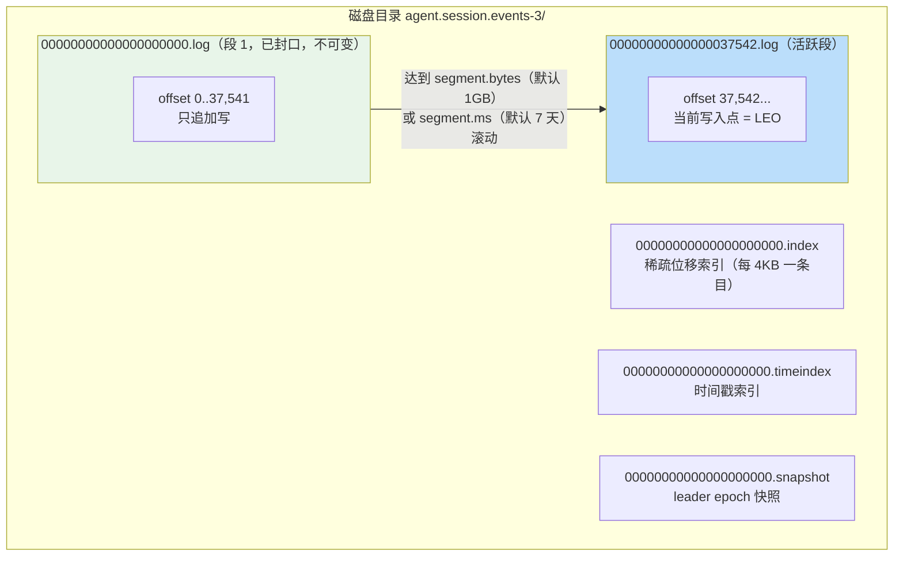
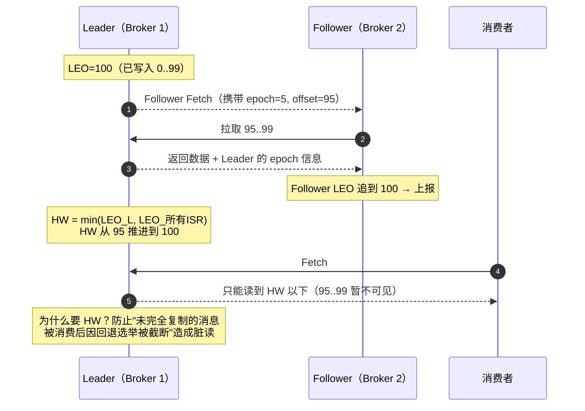
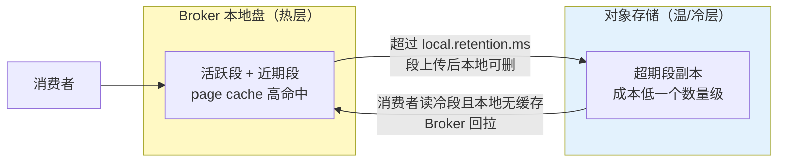

# 日志存储与高可用复制

> **定位**：本文下钻 Kafka 的存储底座与高可用机制——分区日志的物理布局（段/索引）、保留与压实策略、HW/LEO/leader epoch 的复制协议、ISR 收缩扩张，以及 KRaft 控制器与分层存储。理解这一层，"为什么 Kafka 快""压实主题为什么能给会话快照用""Broker 磁盘满/再分配怎么做"才有确定性答案。
>
> **读者画像**：读完 [教程 00-03] 的工程师；需要做容量规划、故障复盘（副本滞后/截断）、或想理解决策"压实 vs 保留"的架构师。
>
> **前置阅读**：[教程 67-Kafka全景与核心概念 §2]（分区/ISR 概念）；[教程 70-投递语义与事务 §2]（故障注入矩阵）。
>
> **版本基准**：Kafka 4.1（KRaft-only）；分层存储自 4.0 GA。

---

## 1. 分区日志的物理布局

每个分区在 Broker 磁盘上是一个目录（`topic-partition`），内部按**段**切分：

六个关键认知：

1. **文件名 = 段首 offset**。给定目标 offset，二分找段 → 段内二分索引 → 顺序扫描，定位成本 O(log n)。位移索引是**稀疏**的（`index.interval.bytes=4096` 间隔写入），不是每条消息都有索引项——内存效率换少量顺序扫描。
2. **不可变性是性能的来源**：封口段只读、活跃段只追加——顺序 I/O、内核 page cache 命中、`sendfile` 零拷贝（数据从 page cache 直达网卡，不进用户态），这三件事使单 Broker 轻松数百 MB/s。
3. **消费是"读文件"**：消费者与 Follower 的 Fetch 在 Broker 看来是同一件事——顺着日志读。热数据在 page cache 里，读不产生磁盘 I/O；这决定了 **Kafka Broker 的内存主要该留给 OS page cache 而不是 JVM 堆**（堆 4~6GB 即可，[教程 72-性能调优与容量规划] §5]）。
4. **写入默认未 fsync**：Broker 依赖**副本冗余**而非单机 fsync 抗故障（`log.flush.interval.messages` 默认 Long.MAX）。"acks=all 落盘"更准确说是"进入 ISR 各副本的 page cache"——掉电场景由多副本/多机架分布兜底。
5. **`__consumer_offsets` 与 `__transaction_state` 本身就是两个内部压实主题**——你学到的压实知识同样解释了它们的行为。
6. **大消息问题**：单条上限默认约 1MB（`max.message.size`/fetch 侧对应参数）。Agent 审计携带完整工具输出时用**索据分离**（payload 入 S3，事件带引用）——与 [项目 01-智能文档助手] 大文档处理同构。

## 2. 保留与压实：两种删除哲学

| 维度 | delete（默认） | compact |
|------|---------------|---------|
| 删除单位 | 时间/大小（老段整段删除） | **key 维度**：仅保留每个 key 的最新值 |
| 语义 | 固定窗口的"环形日志" | 无限期的"最新状态表" |
| key 要求 | 任意 | **必须有 key**（null-key 记录报错或被丢弃，取决于版本） |
| 删除方式 | 后台任务到期删段 | Log Cleaner 线程重写段，丢弃被覆盖的旧值 |
| 典型用途 | 事件流、遥测、审计 | changelog（Streams 状态存储）、`__consumer_offsets`、**会话快照** |

压实的三个工程细节：

- **墓碑**：value=null 的记录表示删除；它在 `delete.retention.ms`（默认 24h）窗口内保留，给离线消费者足够时间看到"删除"这一事实，之后连同旧值一起清掉。
- **脏率阈值**：`min.cleanable.dirty.ratio=0.5`——脏（可清理）部分占比过半才触发压实，避免高频小量重写；`min.compaction.lag.ms` 可强制新记录至少保留一段时间。
- **压实 ≠ 无限增长零成本**：活跃段与未压段的磁盘占用仍然存在，快照型大 value（会话全量状态 JSON）会显著放大写放大——快照频率要与会话活跃度联动（[项目 13] 迭代一的快照策略）。

**组合策略** `compact,delete`：先压实保持最新值，超过 `retention.ms` 后整体删除——适合"近期状态要最新值、超期整个清掉"的会话快照。

## 3. 复制协议：LEO / HW / leader epoch

- **LEO（Log End Offset）**：日志末端，每副本各自维护。
- **HW（High Watermark）**：所有 ISR 副本都追上的最小 LEO。**消费者可见边界**——保证消费到的消息不会因选举回滚。
- **leader epoch（KIP-101）**：每任 Leader 的任期号，Follower 用它校验"我跟随的日志是否就是现任 Leader 的日志前缀"，发现分歧则**先截断到一致的点再同步**——修复了旧协议"按 HW 截断"可能的数据不一致/镜像漂移问题。排障时 `kafka-dump-log.sh --files ...segment --print-data-log` 可查看每条的 epoch。

**ISR 收缩与扩张**：Follower 在 `replica.lag.time.max.ms`（4.x 默认 10s）内没有追上 Leader 就被移出 ISR——此时若 `min.insync.replicas=2` 且 ISR 跌破下限，写入立刻失败（这就是 [教程 68-生产者机制与调优] §3] 三件套的运行时表现）。恢复后追平 Leader 自动回归。**监控 `UnderReplicatedPartitions` 就是监控这条防线**（[教程 75-运维监控与安全] §6]）。

**选举**：ISR 非空时新 Leader 只从 ISR 选出（保证已提交消息不丢）；`unclean.leader.election.enable=false`（默认）禁止落后副本当选——数据不丢优先于可用性，这是 Kafka 的显式价值排序，架构师应理解并继承这个排序而不是绕过它。

## 4. KRaft 控制器：元数据的 Raft 化

ZooKeeper 时代与 KRaft 时代的本质区别（演进见 [教程 ] §4] timeline）：

| 维度 | ZooKeeper（≤3.x，4.0 已移除） | KRaft（4.x 唯一模式） |
|------|------------------------------|----------------------|
| 元数据存储 | ZK znode（外部系统，双写一致性问题） | `__cluster_metadata` Raft 日志（Broker 重放即得全量元数据） |
| 控制器故障切换 | 逐分区状态恢复，秒~分钟级 | Raft 选主 + 已加载元数据的仲裁成员接管，亚秒~秒级 |
| 元数据规模 | 受 ZK watch 风暴限制（分区数天花板约 20 万） | 数百万分区 |
| 运维面 | 两套系统（Kafka+ZK） | 一套系统（`process.roles=broker,controller` 可同进程或分离部署） |

部署要点：生产用**分离部署**的奇数控制器（3 或 5），`controller.quorum.voters` 显式列出；控制器节点磁盘只存元数据日志，规格小而可靠（SSD + 独立故障域）。元数据快照自动生成于 `metadata.log.segment.bytes` 滚动时，供新成员快速追赶。

## 5. 分层存储：热本地、温远端

KIP-405（4.0 GA）把"老段"搬到对象存储（S3/OSS 等）：

对 Agent 平台的直接价值——**审计留存**：[教程 58-历史记录持久化与合规] 要求审计保留 400 天甚至更长，全放 Broker 本地盘成本不可承受；分层存储让"热 7 天在本地、冷 393 天在 S3"成为原生能力，而消费端无感（Broker 透明回拉，代价是冷读延迟从毫秒到秒）。

## 6. 适用场景与不适用场景

### 适用场景（本章机制的正确用法）

- 压实主题做"每会话/每文档最新状态"的物化载体（快照、changelog、注册表）
- 按保留策略分层：命令短保留、事件中保留、审计长保留+分层存储
- 用 `kafka-dump-log` / `kafka-log-dirs` 做存储层排障与容量盘点

### 不适用场景

- 把压实主题当在线 KV 存储（点查/二级索引）：压实是**流消费**的优化，不是数据库接口
- 依赖单机 fsync 换"单副本可靠性"：Kafka 的持久化模型就是多副本，单副本 topic 在生产环境等于自欺
- 大 payload 直接进消息体（撑大段、拖慢复制与索引）：一律索据分离

## 7. 常见误区与反模式

1. **"acks=all 落盘了"**——是"进入 ISR 副本"（默认还只是 page cache）；跨机器故障域（机架/AZ）才是真正的持久化边界。
2. **RF=3 但 min.insync.replicas=1**——故障时静默降级单副本写入，三件套缺一不可。
3. **压实主题忘了 key**——`Compact分区无 key` 在新版本直接拒绝写入；生产前 `kafka-topics --describe` 核对。
4. **扩分区来扩吞吐时忘了 key 重分布**——分区数变化改变 `murmur2(key)%N` 的映射，同 key 新旧消息落在不同分区，**顺序性断裂**（[教程 68-生产者机制与调优] §2]）。扩分区要在规划期一次到位（[教程 72-性能调优与容量规划] §3]）。
5. **给 Broker 堆内存 32GB**——page cache 被挤占，吞吐反而下降；大内存给 OS，堆 4~6GB。

## 8. 总结

存储层三句话：**不可变分段日志 + 稀疏索引 + page cache/零拷贝**造就吞吐；**delete/compact 两套保留策略**分别服务"事件窗口"与"最新状态表"（会话快照的天然载体）；**LEO/HW/leader epoch + ISR + KRaft** 构成不丢已提交消息的高可用底座，而分层存储把"合规级留存"的成本拉低一个数量级。底层机制到此闭环，下一篇回到工程主线——把这些机制换算成容量与参数：[教程 72-性能调优与容量规划]。

**外部来源**：[Kafka Log Compaction](https://kafka.apache.org/documentation/#compaction) · [KIP-101: leader epoch 截断修复](https://cwiki.apache.org/confluence/display/KAFKA/KIP-101%3A+Alter+Replication+Protocol+to+use+Leader+Epoch+rather+than+High+Watermark+for+Truncation) · [KIP-405: Tiered Storage](https://cwiki.apache.org/confluence/display/KAFKA/KIP-405%3A+Kafka+Tiered+Storage) · [KRaft 文档](https://kafka.apache.org/documentation/#kraft)
