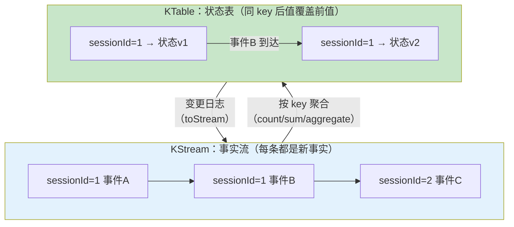
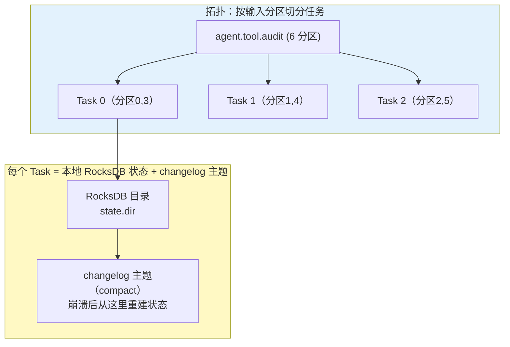

# Kafka Streams 流处理

> **定位**：本文讲解 Kafka Streams 的完整模型——KStream/KTable 语义、任务与状态存储、窗口与连接、交互式查询、EOS，以及与 Flink 的选型分界。对 Agent 架构师，它回答"会话分析、成本聚合、异常检测这类**持续计算**应该用什么承载"。
>
> **读者画像**：读完 [教程 00-05] 的工程师；要为平台建实时看板（活跃会话/分钟级成本）或对工具观测事件做实时异常检测的架构师。
>
> **前置阅读**：[教程 69-消费者与消费组 §2]（消费组即扩缩容器）；[教程 31-全链路可观测性]（Streams 产物是可观测管道的计算层）；[教程 84-数据飞轮与持续改进]（离线评估与在线计算的分工）。
>
> **版本基准**：kafka-streams 4.1.x。**需在 pom.xml 中添加依赖**（版本须与 spring-kafka 拉入的 kafka-clients 对齐，用 `mvn dependency:tree` 核对）：

```xml
<dependency>
    <groupId>org.apache.kafka</groupId>
    <artifactId>kafka-streams</artifactId>
    <version>4.1.0</version>
</dependency>
<!-- Spring 侧集成（KafkaStreamsBuilderFactoryBean 等） -->
<dependency>
    <groupId>org.springframework.kafka</groupId>
    <artifactId>spring-kafka</artifactId>
</dependency>
```

---

## 1. 定位：库，不是集群

Kafka Streams 是**嵌在你应用进程里的流处理库**——没有独立的 compute 集群、没有独立的资源面板。这与 Flink"独立集群 + 作业提交"是根本差异：

| 维度 | Kafka Streams | Flink |
|------|---------------|-------|
| 形态 | JVM 库（随你的 Spring Boot 服务部署） | 独立集群 + JobManager/TaskManager |
| 数据源 | Kafka（专属优化） | 多源多汇（Kafka/JDBC/CDC/Pulsar…） |
| 状态 | 本地 RocksDB + changelog 恢复 | RocksDB 后端 + checkpoint/savepoint |
| 时间语义 | 事件时间/处理时间，按流推进 | 完整 watermark 模型，乱序处理更强 |
| 运维面 | 就是微服务运维 | 多一套集群（master/HA/checkpoint 存储） |
| 适用 | Kafka 内的持续聚合/连接/会话化 | 跨源、超大状态、精确事件时间窗口 |

**选型结论**：Agent 平台的流计算几乎总是"Kafka 进、Kafka/DB 出"——用 Streams 省掉一整个 Flink 集群的运维（呼应 [教程 87-多模型协作与供应策略] 的自建成本账）；只有当存在多源异构、超大状态（TB 级）或复杂事件时间语义时才引入 Flink。

## 2. KStream / KTable：两种世界观



- **KStream**：每条记录都是**追加的事实**（"发生了 X"）。会话事件、工具调用记录天然是 KStream。
- **KTable**：记录是 **upsert**（"现在状态是 Y"）；key 相同即覆盖。压实主题读进来就是 KTable。
- **对偶性**：聚合 KStream 得 KTable；KTable 的变更日志 toStream 又回到 KStream——同一数据的两种视图。**会话快照主题（compact）读为 KTable，就是全平台实时会话状态表**（[教程 71-日志存储与高可用复制] §2] 的设计在此闭环）。
- **GlobalKTable**：不做 co-partitioning、每个实例持有全量副本——专用于**点查式连接**（如事件流 join 租户配置表：`sessionId → 租户限流规则`），代价是每实例全量存储与广播流量。

## 3. 任务、状态与弹性



三条结构性规则：

1. **任务数 = 输入主题分区数**（同组任务分给不同实例）——Streams 的并行度还是分区数，扩容上限依旧受分区数约束（[教程 69-消费者与消费组] §2] 同一逻辑）。
2. **状态是本地的**：聚合/连接中间状态存本地 RocksDB，**每次状态变更同时写 changelog 主题**（自动创建、压实）。实例崩溃 → 任务迁移 → 新实例**回放 changelog 重建 RocksDB**——恢复时间与状态量成正比。`num.standby.replicas=1` 让备用实例预热状态，故障切换从"分钟级重放"降到"秒级接管"。
3. **连接的 co-partitioning 铁律**：KStream-KTable join 要求两边**分区数相同且 key 同源**——不满足时 DSL 会自动产生**重分区主题**（intermediate topic，代价是一次额外写放大）。规划主题分区时就要为 join 做准备（[教程 72-性能调优与容量规划] §2]）。

## 4. 窗口：有状态计算的时间边界

| 窗口 | 语义 | Agent 用例 |
|------|------|-----------|
| Tumbling（滚动） | 固定长度、不重叠 | 每分钟每租户 Token 消耗 |
| Hopping（跳跃） | 固定长度、按步长重叠（一事件可属多窗口） | 5 分钟窗口每 1 分钟滑动——平滑的实时成本曲线 |
| Session（会话） | 活动间隔 gap 切分，窗口不定长 | 用户交互会话切分（事件间隔 >30min 开新窗） |
| Sliding（滑动，2.7+） | 事件时间定界、随事件滑动 | 每事件前后 10 分钟内的工具调用计数（局部异常检测） |

**迟到与宽限**：窗口在"流时间"（该任务见到的最大事件时间戳）推进 `grace.ms` 后关闭；迟到超过宽限的事件被丢弃并计数（`late-record-drop` 指标）。`suppress(Suppressed.untilWindowCloses(...))` 用于"窗口关闭时只发最终值"——实时看板上"每分钟成本"的最终精确值就靠它，避免中间值闪烁。多输入流乱序时 `max.task.idle.ms` 控制是否等待缓冲中的数据再推进时间——默认 0 会放大乱序副作用，调到几百 ms 是常见权衡。

## 5. DSL 速览（Spring 集成形态）

```java
@Configuration
@EnableKafkaStreams
class StreamsConfig {

    @Bean
    KStream<String, ToolAuditEvent> toolCostPipeline(StreamsBuilder builder) {
        KStream<String, ToolAuditEvent> audits =
                builder.stream("agent.tool.audit",
                    Consumed.with(Serdes.String(), jsonSerde(ToolAuditEvent.class)));

        // 实时看板：每租户每分钟 Token 成本 → 会话快照式 KTable → 查询服务
        audits.groupByKey()
              .windowedBy(TimeWindows.ofSizeAndGrace(Duration.ofMinutes(1), Duration.ofSeconds(5)))
              .aggregate(TenantMinuteCost::new,
                  (key, event, agg) -> agg.accumulate(event),
                  Materialized.as("tenant-minute-cost"))
              .toStream()
              .to("agent.cost.realtime",
                  Produced.with(windowedKeySerde(), jsonSerde(TenantMinuteCost.class)));

        // 异常检测：5 分钟内同租户错误率超阈值 → 告警主题
        audits.filter((k, e) -> !e.success())
              .groupByKey()
              .windowedBy(TimeWindows.ofSize(Duration.ofMinutes(5)).advanceBy(Duration.ofMinutes(1)))
              .count()
              .filter((wk, cnt) -> cnt > 20)
              .toStream()
              .map((wk, cnt) -> KeyValue.pair(wk.key(),
                  new AnomalyAlert(wk.key(), cnt, wk.window().start())))
              .to("agent.anomaly.alerts");

        return audits;
    }
}
```

要点：`Materialized.as(...)` 命名的状态存储可用于交互式查询；拓扑里每个有状态算子都要**显式想到恢复成本**（changelog 重放）。

## 6. 交互式查询（IQ）：把状态直接暴露成查询服务

Streams 的状态不只为聚合服务——它可以是**查询接口背后的存储**：`KafkaStreams.store(StoreQueryParameters.fromNameAndType("tenant-minute-cost", QueryableStoreTypes.keyValueStore()))` 直接点查任意 key 的当前值。多实例时，某 key 的权威状态可能落在别的实例——通过 `metadataForAllStreamsClients()` 定位持有者，RPC 转发到目标实例。**效果：免 DB 的轻量实时查询服务**（活跃会话状态、分钟级成本），落盘长表仍交给投影服务。

## 7. exactly_once_v2：流处理的 EOS

`processing.guarantee=exactly_once_v2`（2.5+，v2 基于 KIP-447）：框架自动把"消费位移 + 状态 changelog 写入 + 输出消息"包进事务——崩溃恢复后状态与进度一致，**下游看不到重复输出**（机制即 [教程 70-投递语义与事务] §4] 的 consume-transform-produce，框架化）。代价：吞吐约降 10~30%（commit 间隔内缓存 + 事务开销）、`commit.interval.ms` 在 EOS 语义下默认 100ms~（有状态任务）——对成本聚合/异常检测这类场景通常值得；对无状态纯转发拓扑不必开。

## 8. 适用场景与不适用场景

### 适用场景

- 实时可观测聚合：每租户/每模型分钟级 Token 与成本（[教程 60] 的在线侧）
- 会话实时状态表与活跃度看板（KTable + IQ）
- 流式异常检测：错误率/延迟突增告警（[项目 09-智能运维AIOps平台] 的实时层）
- 评估数据集的持续物化（在线样本流 → 离线评估集主题，[教程 84]）

### 不适用场景

- 单条事件的处理逻辑（就是普通消费者，不需要拓扑）
- 需要跨源 join（Kafka 之外）或 TB 级状态/复杂 watermark → Flink
- 强依赖外部系统事务性的处理（EOS 不覆盖外部副作用，[教程 70-投递语义与事务] §3.3]）
- 低延迟同步查询接口（IQ 是辅助；高频点查用专门的存储）

## 9. 常见误区与反模式

1. **有状态算子不限窗口**——状态无限增长直到 RocksDB/磁盘打爆；每个聚合都问"这个状态的生命周期是什么"。
2. **join 两边分区数不同且以为没有代价**——重分区主题的写放大与延迟默默发生；规划期对齐。
3. **GlobalKTable 当万能解**——全量广播随上游线性增长，大表 + 多实例 = 广播风暴。
4. **忘了 standby**——实例重启全量重放 changelog，恢复窗口内该任务分区消费停滞（表现为 lag 尖刺）。
5. **在拓扑里调外部服务做阻塞调用**——Streams 线程被外部 RTT 拖住，背压传导到 poll 间隔；外部调用走独立异步通道或改为查本地状态。

## 10. 总结

Kafka Streams 用"库"的形态给了你一套**与分区同构并行、本地状态 + changelog 自愈、可 EOS** 的持续计算能力——Agent 平台的实时成本、会话状态、异常检测这三类计算刚好落在它的甜区。数据如何进出 Kafka 生态（CDC、Schema 演化、跨集群）是下一篇的主题：[教程 74-Connect与数据生态]。

**外部来源**：[Kafka Streams Developer Guide](https://kafka.apache.org/documentation/streams/) · [KIP-447: EOS v2](https://cwiki.apache.org/confluence/display/KAFKA/KIP-447%3A+Producer+scalability+for+exactly_once_semantics) · [Flink 官网（对比基准）](https://nightlies.apache.org/flink/flink-docs-stable/)
