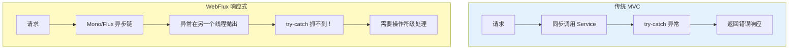
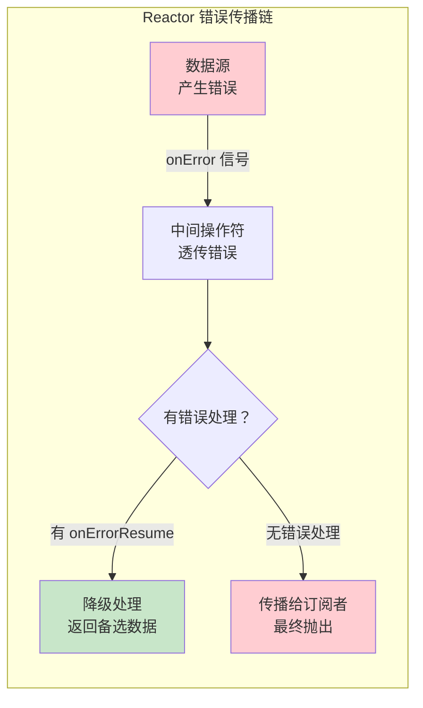
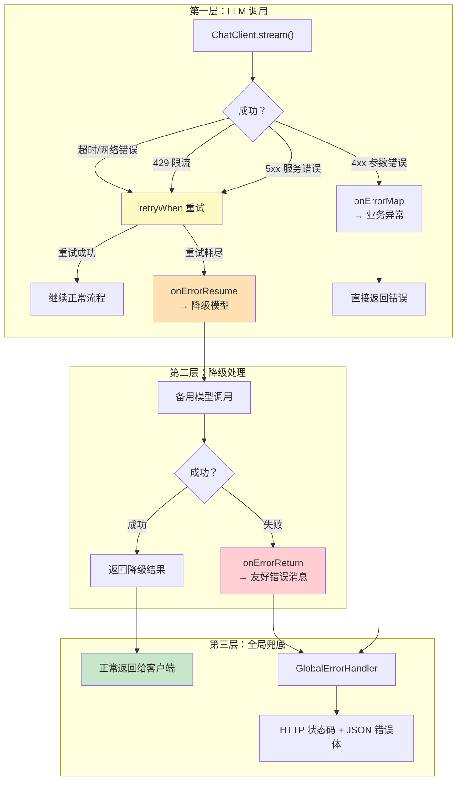
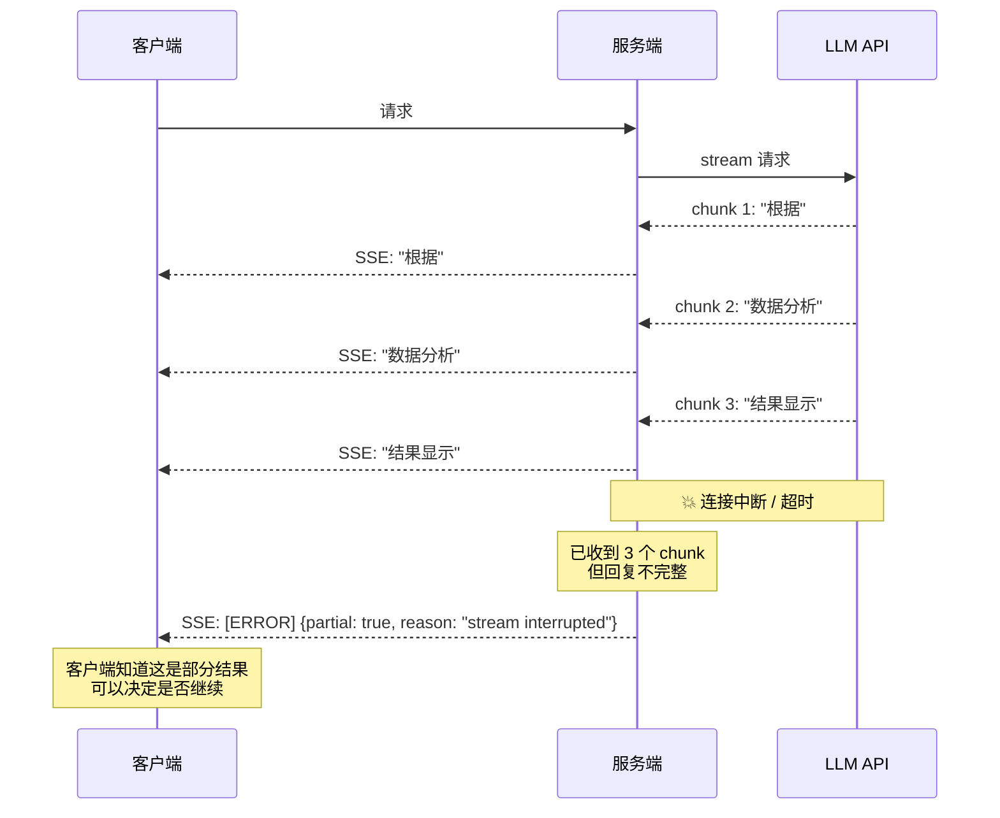
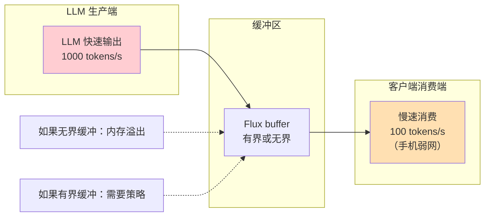
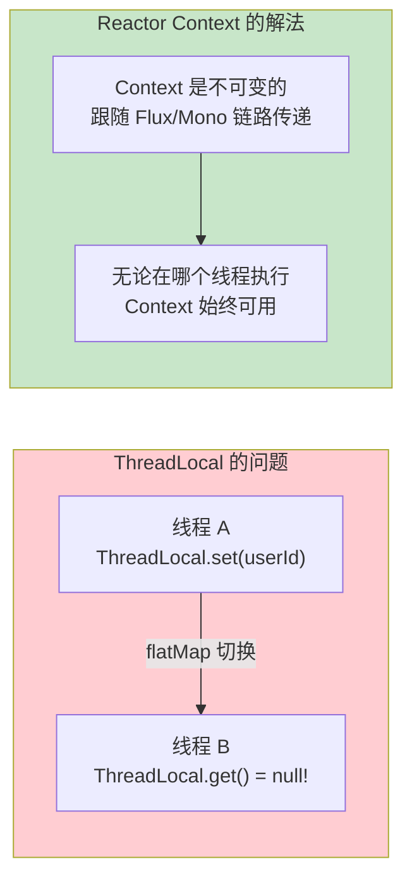

# 85-响应式错误处理

> **定位**：讲透 WebFlux + Spring AI 的错误处理体系——响应式异常传播链（onErrorResume / onErrorMap / retryWhen 的正确用法）、LLM 调用失败的降级策略（流式中断后的部分结果处理）、背压（Backpressure）实战、响应式上下文（Context）在 Agent 链路中的传递。读完这篇，你的 Agent 在响应式架构下能优雅地处理一切异常。
>
> **读者画像**：已经用 WebFlux + Spring AI 搭建了 Agent，但在错误处理和流式场景中遇到了困难。
>
> **前置阅读**：[02-ChatClient与对话模型](02-ChatClient与对话模型.md)、[01-Spring-AI框架入门](01-Spring-AI框架入门.md)。

---

## 1. 为什么响应式错误处理更复杂

### 1.1 传统 MVC vs 响应式的错误处理差异

在传统 Spring MVC 中，错误处理是同步的——try-catch 就够了。但在 WebFlux + Spring AI 的响应式架构中，错误处理面临三个新挑战：



| 维度 | 传统 MVC | WebFlux 响应式 |
|------|---------|---------------|
| **异常抛出位置** | 同线程，try-catch 直接捕获 | 可能跨线程，try-catch 无效 |
| **异常传播方式** | 异常栈向上传播 | 通过 Mono/Flux 的错误信号传播 |
| **处理方式** | `@ExceptionHandler` + try-catch | `onErrorResume` / `onErrorMap` / `retryWhen` |
| **流式场景** | 不涉及（同步返回完整结果） | 流式中途出错，已有部分结果如何处理 |
| **上下文传递** | ThreadLocal | Reactor Context（不可变，显式传递） |

### 1.2 Spring AI 中的典型错误场景

```java
// 一个典型的 Agent 调用链
chatClient.prompt()
    .user(userInput)
    .advisors(memoryAdvisor, ragAdvisor)
    .tools(searchTool, calculatorTool)
    .stream()  // 流式输出
    .content() // Flux<String>
```

这个调用链可能出错的地方：

| 环节 | 错误类型 | 后果 |
|------|---------|------|
| **LLM API 调用** | 网络超时、速率限制（429）、模型过载（529） | 整个调用失败 |
| **流式中途断开** | SSE 连接中断、服务器关闭 | 已输出的部分结果丢失 |
| **Advisor 处理** | RAG 检索失败、记忆读取失败 | 上下文不完整 |
| **工具调用** | 工具超时、工具返回错误 | Agent 无法继续推理 |
| **序列化/反序列化** | JSON 解析失败、结构化输出不合规 | 响应无法使用 |
| **背压** | 客户端消费慢，生产端积压 | 内存溢出 |

---

## 2. 响应式异常传播链

### 2.1 Reactor 的错误信号

在 Project Reactor 中，Mono 和 Flux 有两种完成方式：
- **onComplete**：正常结束
- **onError**：异常结束（错误信号）

错误信号是**终止信号**——一旦发出，后续操作符不会执行。这就是为什么错误处理必须在链上用操作符完成。



### 2.2 核心错误处理操作符

| 操作符 | 作用 | 适用场景 |
|--------|------|---------|
| **onErrorResume** | 错误时返回备选 Mono/Flux | 降级、返回默认值 |
| **onErrorReturn** | 错误时返回固定值 | 简单默认值 |
| **onErrorMap** | 将一种异常转换为另一种 | 异常类型转换 |
| **retryWhen** | 按策略重试 | 临时性故障（网络抖动） |
| **doOnError** | 错误时的副作用（不处理） | 日志记录、指标上报 |
| **onErrorStop** | 停止错误传播 | 多订阅者场景 |
| **timeout** | 超时转为错误信号 | 防止无限等待 |

### 2.3 错误处理实战

```java
import org.slf4j.Logger;
import org.slf4j.LoggerFactory;
import org.springframework.web.bind.annotation.*;
import org.springframework.ai.chat.client.ChatClient;
import org.springframework.web.reactive.function.client.WebClientResponseException;
import reactor.core.publisher.*;
import reactor.util.retry.Retry;
import java.time.Duration;

@RestController
@RequestMapping("/agent")
public class AgentController {

    private static final Logger log = LoggerFactory.getLogger(AgentController.class);

    private final ChatClient chatClient;
    private final ChatClient fallbackChatClient;  // 降级用的小模型

    public AgentController(ChatClient chatClient, ChatClient fallbackChatClient) {
        this.chatClient = chatClient;
        this.fallbackChatClient = fallbackChatClient;
    }

    @PostMapping("/chat")
    public Flux<String> chat(@RequestBody ChatRequest request) {
        return chatClient.prompt()
            .user(request.message())
            .stream()
            .content()
            // 1. 超时控制——30 秒无响应则超时
            .timeout(Duration.ofSeconds(30))
            // 2. 重试——对临时性错误重试 3 次，指数退避
            .retryWhen(retryStrategy())
            // 3. 降级——所有重试失败后，切换到备选模型
            .onErrorResume(error -> fallbackResponse(request, error))
            // 4. 副作用——记录错误日志（注意：放在 onErrorResume 之后只能看到降级链的错误，
            //    主链路错误日志应在 onErrorResume 之前用 doOnError 记录）
            .doOnError(error -> log.error("Agent chat failed", error))
            // 5. 最终兜底——如果降级也失败，返回友好错误消息
            .onErrorReturn("抱歉，服务暂时不可用，请稍后重试。");
    }

    /**
     * 重试策略——指数退避 + 有选择性重试
     */
    private Retry retryStrategy() {
        return Retry.backoff(3, Duration.ofSeconds(1))    // 最多 3 次，初始间隔 1s
            .maxBackoff(Duration.ofSeconds(10))             // 最大间隔 10s
            .jitter(0.3)                                    // 30% 抖动
            .filter(this::isRetryable);                     // 只重试可恢复的错误
    }

    /**
     * 判断错误是否可重试
     */
    private boolean isRetryable(Throwable error) {
        if (error instanceof java.net.SocketTimeoutException) return true;
        if (error instanceof java.util.concurrent.TimeoutException) return true;
        if (error instanceof WebClientResponseException) {
            int status = ((WebClientResponseException) error).getStatusCode().value();
            return status == 429 || status >= 500;  // 限流或服务器错误才重试
        }
        return false;  // 其他错误（如参数错误）不重试
    }

    /**
     * 降级响应——切换到更小更快的模型
     */
    private Flux<String> fallbackResponse(ChatRequest request, Throwable error) {
        log.warn("主模型调用失败，降级到备选模型。错误：{}", error.getMessage());
        return fallbackChatClient.prompt()
            .user(request.message())
            .stream()
            .content()
            // 降级也要有超时
            .timeout(Duration.ofSeconds(15))
            .onErrorResume(e -> {
                log.error("备选模型也失败了", e);
                return Flux.just("服务暂时不可用，已通知运维团队。");
            });
    }

    /** 聊天请求体 */
    public record ChatRequest(String message) {}
}
```

### 2.4 onErrorMap——异常类型转换

将底层技术异常转换为业务异常，让上层代码不用关心技术细节：

```java
import org.springframework.stereotype.Component;
import org.springframework.web.reactive.function.client.WebClientResponseException;
import java.util.concurrent.TimeoutException;

@Component
public class ErrorMapper {

    /**
     * 将各种技术异常统一映射为 Agent 业务异常
     */
    public static Throwable mapToBusinessError(Throwable error) {
        // 速率限制
        if (error instanceof WebClientResponseException.TooManyRequests) {
            return new AgentRateLimitedException(
                "LLM API 请求频率超限，请稍后重试", error);
        }

        // 模型过载
        if (error instanceof WebClientResponseException.ServiceUnavailable) {
            return new AgentOverloadedException(
                "LLM 服务暂时过载，正在降级处理", error);
        }

        // 超时
        if (error instanceof TimeoutException) {
            return new AgentTimeoutException(
                "LLM 响应超时，可能正在处理复杂请求", error);
        }

        // 上下文超限
        if (error.getMessage() != null && error.getMessage().contains("context length")) {
            return new ContextWindowExceededException(
                "对话历史过长，请开始新会话或清理历史", error);
        }

        // 其他未预期错误
        return new AgentException("Agent 内部错误: " + error.getMessage(), error);
    }
}

// 业务异常体系（自定义，非 Spring AI API）——ErrorMapper 把它们作为转换目标
public class AgentException extends RuntimeException {
    public AgentException(String message, Throwable cause) { super(message, cause); }
}

public class AgentRateLimitedException extends AgentException {
    public AgentRateLimitedException(String message, Throwable cause) { super(message, cause); }
}

public class AgentOverloadedException extends AgentException {
    public AgentOverloadedException(String message, Throwable cause) { super(message, cause); }
}

public class AgentTimeoutException extends AgentException {
    public AgentTimeoutException(String message, Throwable cause) { super(message, cause); }
}

public class ContextWindowExceededException extends AgentException {
    public ContextWindowExceededException(String message, Throwable cause) { super(message, cause); }
}

// 使用——在 ChatClient 调用链中映射（message 为外部入参，此处省略声明）
chatClient.prompt()
    .user(message)
    .stream()
    .content()
    .onErrorMap(ErrorMapper::mapToBusinessError);  // 统一转换
```

---

## 3. 错误传播链路图



---

## 4. LLM 调用失败的降级策略

### 4.1 流式中断后的部分结果处理

这是 WebFlux + Spring AI 最棘手的问题——LLM 已经开始流式输出，但中途失败了：



### 4.2 部分结果处理实现

```java
import org.springframework.ai.chat.client.ChatClient;
import org.springframework.stereotype.Component;
import org.springframework.stereotype.Service;
import reactor.core.publisher.Flux;
import java.time.Duration;
import java.util.Map;
import java.util.concurrent.ConcurrentHashMap;

@Component
public class PartialResultStore {
    private final Map<String, String> store = new ConcurrentHashMap<>();

    public void save(String sessionId, String partial) { store.put(sessionId, partial); }
    public String load(String sessionId) { return store.get(sessionId); }
    public void clear(String sessionId) { store.remove(sessionId); }
}

@Service
public class StreamingAgentService {

    private final ChatClient chatClient;
    private final PartialResultStore partialResultStore;

    public StreamingAgentService(ChatClient chatClient, PartialResultStore partialResultStore) {
        this.chatClient = chatClient;
        this.partialResultStore = partialResultStore;
    }

    /**
     * 流式调用——支持中断后恢复
     */
    public Flux<AgentStreamEvent> streamChat(String sessionId, String message) {
        StringBuilder partialResult = new StringBuilder();

        // 先把 content 的每个 chunk 映射成 CONTENT 事件，保证全链路元素类型统一为 AgentStreamEvent——
        // 否则 onErrorResume 的降级元素（AgentStreamEvent）与原元素（String）类型不一致会编译失败
        Flux<AgentStreamEvent> content = chatClient.prompt()
            .user(message)
            .stream()
            .content()
            .timeout(Duration.ofSeconds(30))
            // 逐 chunk 处理——累积部分结果
            .doOnNext(chunk -> partialResult.append(chunk))
            // 包装为事件
            .map(chunk -> new AgentStreamEvent(EventType.CONTENT, Map.of("text", chunk)));

        return content
            // 正常完成——清除部分结果缓存
            .doOnComplete(() -> partialResultStore.clear(sessionId))
            // 出错——保存部分结果，发送错误事件
            .onErrorResume(error -> {
                String partial = partialResult.toString();
                partialResultStore.save(sessionId, partial);

                return Flux.just(new AgentStreamEvent(
                    EventType.STREAM_INTERRUPTED,
                    Map.of(
                        "partialContent", partial,
                        "reason", error.getMessage(),
                        "canResume", true
                    )
                ));
            });
    }

    /**
     * 恢复中断的流——从断点继续
     */
    public Flux<AgentStreamEvent> resumeStream(String sessionId) {
        String partial = partialResultStore.load(sessionId);
        if (partial == null) {
            return Flux.error(new IllegalStateException("没有可恢复的部分结果"));
        }

        // 先发送已有部分
        Flux<AgentStreamEvent> partialFlux = Flux.just(
            new AgentStreamEvent(EventType.PARTIAL_REPLAY, Map.of("text", partial))
        );

        // 然后让 LLM "继续" 生成
        Flux<AgentStreamEvent> continueFlux = chatClient.prompt()
            .user("请继续之前未完成的回答，已生成内容：" + partial)
            .stream()
            .content()
            .map(chunk -> new AgentStreamEvent(EventType.CONTENT, Map.of("text", chunk)))
            .onErrorResume(e -> Flux.just(
                new AgentStreamEvent(EventType.STREAM_INTERRUPTED,
                    Map.of("reason", "恢复也失败了: " + e.getMessage()))
            ));

        return Flux.concat(partialFlux, continueFlux);
    }

    public record AgentStreamEvent(EventType type, Map<String, Object> data) {}
    public enum EventType { CONTENT, STREAM_INTERRUPTED, PARTIAL_REPLAY, COMPLETE }
}
```

### 4.3 降级决策矩阵

| 错误类型 | 是否重试 | 降级策略 | 用户体验 |
|---------|---------|---------|---------|
| 网络超时 | 重试 2-3 次 | 切换备选模型 | 稍微变慢 |
| 速率限制（429） | 等待后重试 | 降级到小模型 | 质量可能降低 |
| 上下文超限 | 不重试 | 截断历史后重试 | 遗忘早期对话 |
| 模型过载（529） | 指数退避重试 | 返回排队提示 | 需要等待 |
| 参数错误（400） | 不重试 | 直接报错 | 用户需修正 |
| 流式中断 | 不重试 | 返回部分结果 | 可手动继续 |
| 内容审核拦截 | 不重试 | 返回安全提示 | 需改措辞 |

---

## 5. 背压（Backpressure）实战

### 5.1 什么是背压问题

在流式场景中，LLM 输出速度和客户端消费速度可能不匹配：



| 场景 | 生产速度 | 消费速度 | 后果 |
|------|---------|---------|------|
| **LLM 快、客户端慢** | 1000 t/s | 100 t/s | 缓冲区积压 → OOM |
| **LLM 慢、客户端快** | 50 t/s | 1000 t/s | 客户端空转（正常） |
| **突发流量** | 瞬间大量 chunk | 正常消费 | 瞬时积压 |

### 5.2 背压策略

Reactor 提供了多种背压处理策略：

```java
import org.slf4j.Logger;
import org.slf4j.LoggerFactory;
import org.springframework.stereotype.Service;
import reactor.core.Exceptions;
import reactor.core.publisher.BufferOverflowStrategy;
import reactor.core.publisher.Flux;
import java.time.Duration;

@Service
public class BackpressureHandler {

    private static final Logger log = LoggerFactory.getLogger(BackpressureHandler.class);

    /**
     * 策略1：缓冲（Buffer）——有界缓冲区
     * 最常用——在内存允许范围内缓冲
     */
    public Flux<String> withBuffer(Flux<String> source) {
        return source
            .onBackpressureBuffer(
                1000,                          // 缓冲区大小
                BufferOverflowStrategy.ERROR   // 溢出时发出错误信号（枚举只有 ERROR/DROP_OLDEST/DROP_LATEST）
            )
            // 缓冲区溢出时的降级
            .onErrorResume(error -> {
                // OverflowException 是包私有类，不能按类型匹配；用 Exceptions.isOverflow 判断
                if (Exceptions.isOverflow(error)) {
                    log.warn("背压缓冲区溢出，降级处理");
                    return Flux.just("[输出过快，已自动精简]");
                }
                return Flux.error(error);
            });
    }

    /**
     * 策略2：丢弃最新（Drop）——缓冲区满时丢弃新数据
     * 适用于实时性要求高、丢一些数据无所谓的场景
     */
    public Flux<String> withDrop(Flux<String> source) {
        return source.onBackpressureDrop(dropped -> {
            log.debug("因背压丢弃 chunk: {}", dropped);
        });
    }

    /**
     * 策略3：保留最新（Latest）——只保留最新的
     * 适用于状态同步场景
     */
    public Flux<String> withLatest(Flux<String> source) {
        return source.onBackpressureLatest();
    }

    /**
     * 策略4：批量发送——攒一批再发，减少传输次数
     */
    public Flux<String> withBatch(Flux<String> source) {
        return source
            .buffer(Duration.ofMillis(100))  // 每 100ms 攒一批
            .map(list -> String.join("", list));  // 拼成一段
    }
}
```

### 5.3 SSE 场景的背压控制

在 SSE（Server-Sent Events）场景中，WebFlux 会自动处理 HTTP 层面的背压，但应用层还需要处理：

```java
import org.springframework.ai.chat.client.ChatClient;
import org.springframework.http.MediaType;
import org.springframework.http.codec.ServerSentEvent;
import org.springframework.web.bind.annotation.*;
import reactor.core.publisher.Flux;
import java.time.Duration;

@RestController
@RequestMapping("/agent")
public class SSEAgentController {

    private final ChatClient chatClient;

    public SSEAgentController(ChatClient chatClient) {
        this.chatClient = chatClient;
    }

    /**
     * SSE 流式输出——带背压控制
     */
    @GetMapping(value = "/stream", produces = MediaType.TEXT_EVENT_STREAM_VALUE)
    public Flux<ServerSentEvent<String>> streamChat(
            @RequestParam String message,
            @RequestParam(defaultValue = "1000") int bufferSize) {

        return chatClient.prompt()
            .user(message)
            .stream()
            .content()
            // 背压控制——有界缓冲
            .onBackpressureBuffer(bufferSize)
            // 批量处理——每 50ms 攒一次，减少 SSE 事件数量
            .buffer(Duration.ofMillis(50))
            .map(chunks -> {
                String combined = String.join("", chunks);
                return ServerSentEvent.<String>builder()
                    .data(combined)
                    .event("content")
                    .build();
            })
            // 发送完成事件
            .concatWith(Flux.just(
                ServerSentEvent.<String>builder()
                    .event("done")
                    .data("[DONE]")
                    .build()
            ))
            // 全局错误处理（data 只接受 String，错误信息拼成一行文本）
            .onErrorResume(error -> Flux.just(
                ServerSentEvent.<String>builder()
                    .event("error")
                    .data("error: " + error.getMessage()
                        + ", type: " + error.getClass().getSimpleName())
                    .build()
            ));
    }
}
```

---

## 6. 响应式上下文（Context）

### 6.1 为什么不能用 ThreadLocal

在传统 MVC 中，我们用 ThreadLocal 传递请求级别的上下文（用户 ID、Trace ID 等）。但在 WebFlux 中，**一个请求可能在多个线程之间切换**，ThreadLocal 会丢失。



### 6.2 Reactor Context 的使用

```java
import org.slf4j.Logger;
import org.slf4j.LoggerFactory;
import org.springframework.ai.chat.client.ChatClient;
import org.springframework.stereotype.Service;
import reactor.core.publisher.Mono;
import reactor.core.scheduler.Schedulers;
import reactor.util.context.Context;
import java.time.Instant;
import java.util.UUID;

@Service
public class ContextAwareAgentService {

    private static final Logger log = LoggerFactory.getLogger(ContextAwareAgentService.class);

    private final ChatClient chatClient;

    public ContextAwareAgentService(ChatClient chatClient) {
        this.chatClient = chatClient;
    }

    /**
     * 在调用链入口设置 Context
     * 注意：Reactor Context 只沿响应式链传播——同步的 .call().content() 返回 String，
     * 无法接 .contextWrite()；要走流式链（.stream()）让 Context 真正注入
     */
    public Mono<String> chatWith(String userId, String sessionId, String message) {
        return chatClient.prompt()
            .user(message)
            .advisors(advisor -> advisor.param("sessionId", sessionId))
            .stream()
            .content()
            // 在链的末端订阅时注入 Context（向上游传播）
            .contextWrite(Context.of(
                "userId", userId,
                "sessionId", sessionId,
                "traceId", UUID.randomUUID().toString(),
                "requestTime", Instant.now()
            ))
            .collectList()
            .map(list -> String.join("", list));
    }

    /**
     * 在链路中间读取 Context
     */
    public Mono<String> processWithLogging(String message) {
        return Mono.deferContextual(ctx -> {
            // 从 Context 中读取
            String userId = ctx.get("userId");
            String traceId = ctx.get("traceId");
            log.info("[{}] Processing request for user: {}", traceId, userId);

            // 同步阻塞调用包进 fromCallable + subscribeOn(boundedElastic)，订阅时读取 Context
            return Mono.fromCallable(() ->
                    chatClient.prompt().user(message).call().content())
                .subscribeOn(Schedulers.boundedElastic())
                .doOnNext(response ->
                    log.info("[{}] Response sent to user: {}", traceId, userId));
        });
    }
}
```

### 6.3 在 Advisor 中使用 Context

```java
import org.slf4j.Logger;
import org.slf4j.LoggerFactory;
import org.springframework.ai.chat.client.ChatClientRequest;
import org.springframework.ai.chat.client.ChatClientResponse;
import org.springframework.ai.chat.client.advisor.api.CallAdvisor;
import org.springframework.ai.chat.client.advisor.api.CallAdvisorChain;
import org.springframework.ai.chat.client.advisor.api.StreamAdvisor;
import org.springframework.ai.chat.client.advisor.api.StreamAdvisorChain;
import org.springframework.stereotype.Component;
import reactor.core.publisher.Flux;

@Component
public class TracingAdvisor implements CallAdvisor, StreamAdvisor {

    private static final Logger log = LoggerFactory.getLogger(TracingAdvisor.class);

    /**
     * 同步链路：CallAdvisor.adviseCall 返回 ChatClientResponse（record）
     * 注意：Reactor Context 只在响应式链上传播，同步方法读不到——改从 request.context() 读取
     * （Spring AI 2.0 中 ChatClientRequest 就是 record(prompt, context)，context 由
     *   advisors(a -> a.param(key, value)) 注入）
     */
    @Override
    public ChatClientResponse adviseCall(ChatClientRequest request, CallAdvisorChain chain) {
        String traceId = String.valueOf(request.context().getOrDefault("traceId", "unknown"));
        String userId = String.valueOf(request.context().getOrDefault("userId", "anonymous"));

        log.info("[{}] Agent call started for user {}", traceId, userId);
        long startTime = System.nanoTime();

        ChatClientResponse response = chain.nextCall(request);

        long duration = (System.nanoTime() - startTime) / 1_000_000;
        int tokens = response.chatResponse().getMetadata().getUsage().getTotalTokens();
        log.info("[{}] Agent call completed in {}ms, tokens={}", traceId, duration, tokens);
        return response;
    }

    /**
     * 流式链路：StreamAdvisor.adviseStream 返回 Flux<ChatClientResponse>
     * 流式链是响应式的，可以用 Flux.deferContextual 读取 Reactor Context
     */
    @Override
    public Flux<ChatClientResponse> adviseStream(ChatClientRequest request,
                                                  StreamAdvisorChain chain) {
        return Flux.deferContextual(ctx -> {
            String traceId = ctx.getOrDefault("traceId", "unknown");
            log.info("[{}] Stream started", traceId);

            return chain.nextStream(request)
                .doOnComplete(() -> log.info("[{}] Stream completed", traceId))
                .doOnError(e -> log.error("[{}] Stream failed: {}", traceId, e.getMessage()));
        });
    }

    @Override
    public String getName() {
        return this.getClass().getSimpleName();
    }
}
```

### 6.4 全局错误处理器

```java
import org.slf4j.Logger;
import org.slf4j.LoggerFactory;
import org.springframework.http.ResponseEntity;
import org.springframework.web.bind.annotation.*;
import org.springframework.web.server.ServerWebExchange;
import reactor.core.publisher.Mono;

@RestControllerAdvice
public class GlobalErrorHandler {

    private static final Logger log = LoggerFactory.getLogger(GlobalErrorHandler.class);

    /**
     * Agent 速率限制——返回 429
     */
    @ExceptionHandler(AgentRateLimitedException.class)
    public Mono<ResponseEntity<ErrorResponse>> handleRateLimited(
            AgentRateLimitedException ex, ServerWebExchange exchange) {
        return Mono.fromCallable(() -> {
            // 从请求属性中恢复 Trace ID（getAttribute 返回 Object，需转型）
            String traceId = (String) exchange.getAttribute("traceId");

            return ResponseEntity.status(429)
                .header("Retry-After", "60")
                .body(new ErrorResponse(
                    "RATE_LIMITED",
                    "请求过于频繁，请稍后重试",
                    traceId
                ));
        });
    }

    /**
     * Agent 超时——返回 504
     */
    @ExceptionHandler(AgentTimeoutException.class)
    public Mono<ResponseEntity<ErrorResponse>> handleTimeout(AgentTimeoutException ex) {
        return Mono.just(ResponseEntity.status(504)
            .body(new ErrorResponse("TIMEOUT", "请求超时", null)));
    }

    /**
     * 上下文窗口超限——返回 413
     */
    @ExceptionHandler(ContextWindowExceededException.class)
    public Mono<ResponseEntity<ErrorResponse>> handleContextOverflow(
            ContextWindowExceededException ex) {
        return Mono.just(ResponseEntity.status(413)
            .body(new ErrorResponse("CONTEXT_OVERFLOW",
                "对话历史过长，请开始新会话", null)));
    }

    /**
     * 兜底——所有未处理的异常
     */
    @ExceptionHandler(Exception.class)
    public Mono<ResponseEntity<ErrorResponse>> handleGeneric(Exception ex) {
        log.error("Unhandled exception in Agent", ex);
        return Mono.just(ResponseEntity.status(500)
            .body(new ErrorResponse("INTERNAL_ERROR",
                "内部错误，请稍后重试", null)));
    }

    public record ErrorResponse(String code, String message, String traceId) {}
}
```

---

## 7. 工具调用失败的错误处理

### 7.1 工具调用失败不应终止整个 Agent 循环

```java
import org.slf4j.Logger;
import org.slf4j.LoggerFactory;
import org.springframework.stereotype.Service;
import reactor.core.publisher.Mono;
import reactor.util.retry.Retry;
import java.time.Duration;
import java.util.Map;

@Service
public class ResilientToolExecutor {

    private static final Logger log = LoggerFactory.getLogger(ResilientToolExecutor.class);

    /**
     * 容错执行工具——失败返回错误信息而不是抛异常
     */
    public Mono<Object> executeWithErrorHandling(
            String toolName, Map<String, Object> args) {
        return doExecute(toolName, args)
            // 超时控制
            .timeout(Duration.ofSeconds(10))
            // 重试
            .retryWhen(Retry.backoff(2, Duration.ofMillis(500))
                .filter(this::isRetryable))
            // 失败后返回结构化的错误信息——让 LLM 知道工具失败了
            .onErrorResume(error -> {
                log.warn("Tool {} failed: {}", toolName, error.getMessage());
                return Mono.just(Map.of(
                    "error", true,
                    "toolName", toolName,
                    "message", "工具调用失败：" + error.getMessage(),
                    "suggestion", "请尝试其他方式或告知用户此功能暂时不可用"
                ));
            });
    }

    /** 真实工具执行逻辑（此处仅示意，具体按工具实现） */
    private Mono<Object> doExecute(String toolName, Map<String, Object> args) {
        return Mono.empty();
    }

    /** 只对临时性故障重试 */
    private boolean isRetryable(Throwable error) {
        return error instanceof java.net.SocketTimeoutException
            || error instanceof java.util.concurrent.TimeoutException;
    }
}
```

关键设计：工具失败时**不抛异常**，而是返回包含错误信息的 Map。这样 LLM 能看到工具失败了，可以决定换一种方式继续完成任务，而不是整个 Agent 崩溃。

---

## 8. 适用场景与不适用场景

### 适用场景

- 使用 WebFlux + Spring AI 的响应式 Agent
- SSE 流式输出场景
- 需要高并发处理的 Agent 服务
- 微服务架构中的 Agent 调用链
- 对延迟敏感的实时交互

### 不适用场景

- 简单的同步调用场景（MVC 更简单）
- 不需要流式输出的批处理任务
- 团队不熟悉响应式编程（学习成本高）

---

## 9. 本章总结

| 概念 | 一句话 |
|------|--------|
| **响应式错误传播** | 错误通过 onError 信号传播，try-catch 抓不到 |
| **onErrorResume** | 错误时返回备选数据——降级核心操作符 |
| **onErrorMap** | 异常类型转换——技术异常 → 业务异常 |
| **retryWhen** | 策略化重试——指数退避 + 有选择性重试 |
| **流式中断处理** | 保存部分结果，支持恢复或降级 |
| **背压** | 生产端快于消费端时的缓冲/丢弃策略 |
| **Reactor Context** | 跨线程的上下文传递，替代 ThreadLocal |
| **工具容错** | 工具失败返回错误信息而非抛异常，LLM 可以自适应 |

**下一篇**：[86-Agent治理与合规框架](86-Agent治理与合规框架.md) — 企业级 Agent 上线前的完整治理清单。

---

> **想深入？→ [教程 83-长任务持久化与中断恢复]**：流式中断后的检查点恢复。
> **想深入？→ [教程 87-多模型协作与供应策略]**：降级时切换到哪个备选模型。
> **想深入？→ [教程 88-Agent架构反模式与避坑指南]**：「单模型无降级」反模式的完整分析。
