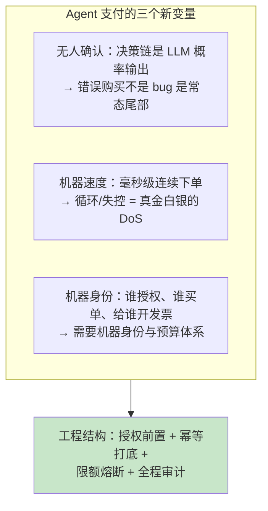
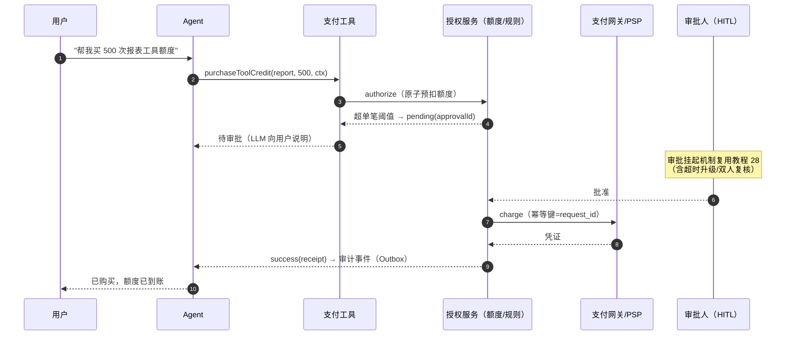

# 49-Agent 经济与支付集成

> **定位**：当 Agent 从"回答问题"走向"花钱办事"——替用户下单、按次购买工具服务、机器对机器结算。本文讲授权模型（预算内自动/超限人工）、支付轨道选型（传统 PSP vs 加密稳定币 vs x402 协议）、支付工具的工程实现（幂等/限额/审计/退款）、风险面（欺诈/误购/滥用）。本文是 [前沿 09-Agent经济与支付] 的教程锚点（前沿篇讲协议生态趋势，本文讲企业工程落地）。
>
> **读者画像**：要给 Agent 加交易能力（哪怕只是"按次付费调用第三方工具"）的 Java 工程师；评估"机器自主花钱"风险边界的架构师。
>
> **前置阅读**：[教程 03-工具调用]；[教程 61-Human-in-the-Loop与审批流]（超限审批的机制底座）；[教程 32-工具执行可观测与审计]（交易审计）。
>
> **版本基准**：Spring Boot 4.1 + Spring AI 2.0；x402 等新兴协议以 [前沿 09] 调研为准（本文只讲与协议无关的工程结构）。

---

## 1. 为什么 Agent 支付是不同的问题

传统支付有人在环（点击确认的是人）；Agent 支付的三个新变量：



## 2. 授权模型：预算的三道闸

| 闸 | 机制 | 触发 |
|----|------|------|
| ① 预算内自动 | 单笔 ≤ 阈值 且 日累计 ≤ 额度 → 直接执行 | 小额高频（按次工具付费） |
| ② 超限 HITL | 单笔超阈值 或 首次向新收款方付款 → 挂起审批（[教程 61] 的 ToolCallback 包装方案直接复用） | 中额/新商户 |
| ③ 硬熔断 | 日预算耗尽 / 异常频率（1 分钟 >N 笔）→ 拒绝并告警 | 兜底（[教程 60] 预算熔断的资金版） |

额度是**租户/用户级全局状态**：分布式存储 + 原子扣减（Redis Lua 预扣+冲正，[教程 60] 深化点同款），不是单机计数。

## 3. 支付轨道选型

| 轨道 | 形态 | 优势 | 劣势 | 适用 |
|------|------|------|------|------|
| **PSP 托管支付**（Stripe/支付宝等） | 平台账户体系，Agent 经 API 发起，用户在 PSP 侧已绑卡 | 合规成熟、拒付/退款/发票全包 | 每次需用户级授权 token；机器对机器摩擦大 | 面向人类用户的代付 |
| **订阅+按量后结** | 工具商与平台签企业协议，平台按量结算，Agent 侧只有配额没有现金 | **默认最稳**：无实时资金流，失败=扣配额 | 结算周期、仅限 B2B 供应商 | 企业内工具生态（MCP 付费工具的现实主流） |
| **加密稳定币 + x402** | HTTP 402 语义：请求携带支付凭证，服务端验证放行；钱包=私钥 | 真 M2M、微支付、全球清算 | 私钥托管责任、审计复杂、法务合规因地区而异 | 机器对机器微结算试验田（[前沿 09]） |

**企业决策框架**：先问"对手方是谁"——人类用户代付走 PSP；企业内工具生态走配额后结（今天就能上线）；跨组织的机器微支付再评估加密轨道（把它当"外币账户"管理：额度小、隔离、可丢）。三条轨道可并存（分层供应，[教程 87] 的多供应商思想平移到资金面）。

## 4. 支付工具的工程实现

```java
// Spring AI 2.0.0 —— 支付类工具（确定性代码，LLM 只表达意图）
import org.springframework.ai.chat.model.ToolContext;
import org.springframework.ai.tool.annotation.Tool;
import org.springframework.ai.tool.annotation.ToolParam;

@Tool(name = "purchaseToolCredit",
      description = "为当前会话购买工具服务额度。仅在用户明确要求购买时调用。")
public PurchaseResult purchaseToolCredit(
        @ToolParam(description = "工具标识") String toolId,
        @ToolParam(description = "数量") int quantity,
        ToolContext ctx) {                                   // 用户身份从 ctx 来，禁 LLM 传参
    String userId = ctx.getContext().get("user_id");
    String idempotencyKey = (String) ctx.getContext().get("request_id");  // 幂等键生产侧生成

    // ① 授权闸：预算预扣（原子）+ 超限挂起（返回"待审批"而非直接买）
    Authorization auth = paymentAuth.authorize(userId, toolId, quantity, idempotencyKey);
    if (auth.pendingApproval()) return PurchaseResult.pending(auth.approvalId());

    // ② 执行：幂等键下推到支付提供方（重复调用返回同一结果）
    PaymentReceipt receipt = paymentGateway.charge(auth, idempotencyKey);

    // ③ 审计事件（Outbox 同事务落库→Kafka，[教程 70-投递语义与事务] §6]）
    auditPublisher.publish(PaymentEvent.of(userId, toolId, receipt, auth));
    return PurchaseResult.success(receipt);
}
```

四条铁律：**幂等键贯穿**（LLM 会重试工具调用——同一 request_id 的重复购买必须返回原结果，[教程 70-投递语义与事务] §5] 的资金版，幂等表落库不是 Redis）；**身份走 ToolContext**（用户/额度上下文从请求注入，LLM 传参可被注入篡改，[附录 05 §1.1]）；**审计先于成功返回**（资金动作的审计是合规要件，[教程 32] 的哈希链/WORM 在此适用）；**失败语义显式**（pending/success/declined 三态返回给 LLM，让它能向用户解释而不是无限重试）。

## 5. 交易时序：一次带审批的购买



## 6. 风险面与对策

| 风险 | 形态 | 对策 |
|------|------|------|
| 误购（LLM 理解错） | 用户没让买、买错数量 | 单笔阈值+确认话术（"你确定要花费 ¥X 购买 Y？"）+ 可撤销窗口 |
| 失控循环 | 工具失败→重试→连环扣款 | 幂等键 + 频率熔断 + 单会话累计上限 |
| 注入盗刷 | 提示注入诱导购买（[附录 09]） | 支付类工具永远不进"全自动"白名单；收款方白名单（只买过审商户） |
| 供应商滥用 | 工具商虚报用量 | 用量对账（工具调用 Span 计数 vs 计费账单，[教程 32] 观测即对账依据） |
| 退款/拒付 | 用户投诉 | 轨道级退款流程 + 账本双录（业务账 vs 渠道账月度对账） |

## 7. 适用场景与不适用场景

### 适用场景

- 按次/按量付费的第三方工具集成（MCP 生态的商业化形态）
- Agent 代用户执行小额重复交易（充值、续费、库存补货）
- 平台内部的成本分摊计量（"工具消费记到租户账上"——配额轨道）

### 不适用场景

- 大额/不可逆交易全自动——人工终审不可替代（房产、大宗采购）
- 合规尚无判例的地区直接上加密轨道——先小额度沙箱
- 把支付逻辑交给 LLM "自己决定怎么付"——LLM 只表达意图，支付原语是确定性代码

## 8. 常见误区与反模式

1. **支付工具进自动白名单**——支付永远是 HITL 候选；"小额全自动"的阈值要明确写进策略引擎（[教程 20 §3.3]）。
2. **幂等只靠网关**——网关幂等键有 TTL；业务幂等表（request_id → receipt）自己落库。
3. **额度单机计数**——多实例必然超卖；原子预扣+冲正（§2）。
4. **审计日志可删改**——资金审计走 append-only + 哈希链（[教程 23 §4]），与账本双录。
5. **无对账**——工具用量观测（Span 计数）与账单月度对账，虚报只有对账能抓。

## 9. 总结

Agent 支付的工程结构一句话：**LLM 只表达意图，钱由确定性原语走**——三道闸（预算内自动/超限 HITL/硬熔断）、三轨道按对手方选（PSP/配额后结/加密微支付）、四铁律（幂等贯穿/身份走 ToolContext/审计先行/三态返回）。协议与生态的动态（x402、MCP 支付原语）见 [前沿 09-Agent经济与支付]；审批挂起机制回看 [教程 61]；成本计量体系回看 [教程 60]。

**外部来源**：[x402 协议](https://www.x402.org/) · [MCP 规范（含付费生态讨论）](https://modelcontextprotocol.io/) · [Stripe Idempotency Keys（幂等设计参照）](https://docs.stripe.com/api/idempotent_requests) · [OWASP LLM Top 10](https://genai.owasp.org/llm-top-10/)
