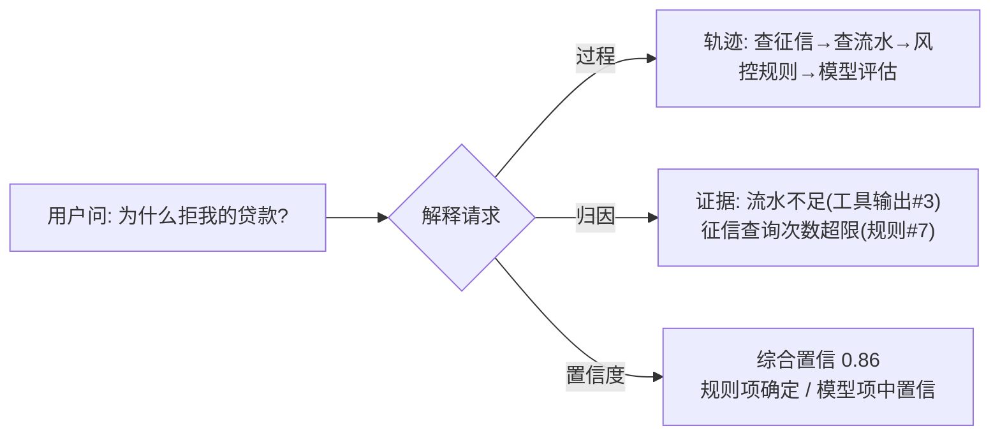

# 56-Agent 可解释与透明工程

> **定位**：讲透 Agent 的**可解释性（XAI）与透明工程**——让"Agent 为什么这么做"变得**可回答**。涵盖：**可解释三维度（过程透明/决策归因/置信度）、归因证据链（Trace→工具→检索→结论）、反事实解释、可解释与审计合规/信任分的关系**。读完这篇，你能把"黑盒 Agent"改造成"每个决策有据可查、每个结论有置信度"的系统。读者画像：要回答"监管/用户/排障问'Agent 为什么这样'时拿得出证据"的架构师。
>
> **前置阅读**：[31-全链路可观测性](31-全链路可观测性.md)、[32-工具执行可观测与审计](32-工具执行可观测与审计.md)、[86-Agent治理与合规框架](86-Agent治理与合规框架.md)。想深入评估 → [80-自我反思与Agent评估](80-自我反思与Agent评估.md)。

---

## 1. 可解释不是"让模型讲原理"，是"让决策有证据链"

对 LLM Agent 而言，可解释性**不是**解释 Transformer 内部权重（那是模型层 XAI），而是**系统层**：这次回答**依据了什么**（哪些检索片段/工具结果/记忆）、**经历了什么**（调了什么工具、走了哪条链路）、**有多大把握**（置信度/不确定性）。这三个问题构成可解释三维度。

## 2. 可解释三维度

| 维度 | 回答的问题 | 工程载体 |
|------|-----------|---------|
| **过程透明** | Agent 经历了什么？ | 事件流/轨迹（Trace：工具调用、检索、路由） |
| **决策归因** | 结论依据什么？ | 证据链：结论 ← 引用了哪些片段/工具输出 |
| **置信度** | 有多大把握？ | 校准的置信度 + 不确定性来源标记 |



## 3. 过程透明：轨迹即解释素材

过程透明的基座是**全链路事件流**（[教程 31-全链路可观测性](31-全链路可观测性.md) 的 Trace + [19-轨迹级评估](../项目/19-企业级Agent信任与评测平台/08-轨迹级评估与模拟沙箱.md) 的轨迹）——但可解释视角要求事件**面向"人类可读的解释"再组织**：

```java
// 概念代码：把执行轨迹投影成解释时间线
public ExplanationTimeline explain(String runId) {
    List<TraceEvent> events = traceStore.query(runId);       // gen_ai/工具/检索 Span(实证 Observation)
    return events.stream()
        .map(e -> switch (e) {
            case LlmCall s   -> Step.model(e.summary(), s.usage());
            case ToolCall t  -> Step.action(t.toolName(), t.inputDigest(), t.resultDigest());
            case Retrieval r -> Step.evidence(r.query(), r.topDocs());   // 检索=证据来源
            default          -> Step.other(e);
        }).collect(toTimeline());
}
```

**要点**：检索结果（Retrieval）是**证据**，工具输出是**事实来源**，模型调用只是**推理步骤**——解释时间线把三者按"人能懂的语言"重排。

## 4. 决策归因：结论 ← 证据链

最重要的维度：**每个关键结论能追溯到支撑它的证据**。工程做法是**归因记录**（哪个结论引用了哪个片段/工具输出）：

```java
// 概念代码：结论-证据归因表
record Attribution(String conclusionId, String conclusion,    // 结论
                   List<EvidenceRef> evidences) {}             // 支撑证据
record EvidenceRef(EvidenceType type,      // RETRIEVAL_CHUNK / TOOL_OUTPUT / MEMORY / RULE
                   String refId, String digest) {}
// 生成时：结构化输出要求模型标注"依据了哪些证据id"（实体抽取，实证 entity 思想）
// 校验时：引用的证据id必须真实存在于本次上下文（防编造归因）
```

**纪律**：归因要**可校验**——模型声称"依据了文档#3"，系统核对 #3 是否真在上下文中且内容相关。**编造的归因比没有归因更糟**（伪解释）。

## 5. 置信度与不确定性

置信度分**来源**标注，不是单一数字：

| 来源 | 置信度性质 | 表达 |
|------|-----------|------|
| 规则命中 | 确定 | "规则#7 明确命中" |
| 检索高相似 | 高 | "依据 3 篇高度相关文档" |
| 检索低相似/无结果 | 低 | "未找到直接依据，以下为推测" |
| 模型生成 | 校准分 | 多次采样一致性 / 判别器打分 |

**要点**：低置信结论要**显式降级表达**（"未找到直接依据"）或走 HITL（呼应 [28-Human-in-the-Loop](61-Human-in-the-Loop与审批流.md)）——置信度是**触发行为**的信号，不是装饰数字。

## 6. 反事实解释

对"为什么拒/为什么选 A 不选 B"类问题，**反事实**比归因更有说服力："若流水 ≥ X 则通过"。工程化：对关键决策记录**最近边界**（差多少会翻转）——规则项天然可算（阈值差）；模型项用扰动近似（概念代码，成本高只用于高风险决策）。

## 7. 可解释与治理的关系

- **审计合规**：归因链 + 置信度是 [43-治理](86-Agent治理与合规框架.md)/EU AI Act 式"决策解释义务"的直接交付物（呼应 [13-附录治理](../附录/12-AI治理与合规/00-NIST-AI-RMF框架.md)）。
- **信任分**：解释质量（归因可校验率/置信校准度）可作为 [19-信任平台](../项目/19-企业级Agent信任与评测平台/00-需求分析与架构设计.md) 的一维。
- **排障**：解释时间线就是排障入口（哪步证据缺失/哪个工具输出异常）。

## 8. 适用场景与不适用场景

### 适用场景 ✅
- 受监管业务（金融/医疗/政务）的决策解释义务。
- 高风险自动化决策需要 HITL 复核依据。
- 需要向用户/客服展示"依据什么回答"的信任建设。

### 不适用场景 ❌
- 低风险闲聊/创意生成（解释是过度工程，加成本）。
- 期望解释"模型内部为什么"（本文是系统层 XAI，模型层 XAI 是另一领域）。

---

## 总结

Agent 可解释工程的本质：**让每个决策有证据链、每个结论有置信度、每次执行有可读时间线**。五根支柱：

1. **三维度**：过程透明（轨迹投影）/ 决策归因（结论←证据）/ 置信度（分来源标注）。
2. **归因可校验**：证据引用必须核对真实存在——反伪解释。
3. **置信度触发行为**：低置信显式降级或转 HITL，不是装饰数字。
4. **反事实**：高风险决策记录"差多少会翻转"。
5. **与治理联动**：解释链是合规义务交付物 + 信任分维度 + 排障入口。

> **实操建议**：先把 [教程 31-全链路可观测性](31-全链路可观测性.md) 的 Trace 投影成解释时间线（成本最低），再给高风险结论加归因表，最后做置信校准。落地完整平台 → [项目30-企业级Agent可解释与透明平台](../项目/30-企业级Agent可解释与透明平台/00-需求分析与架构设计.md)。
