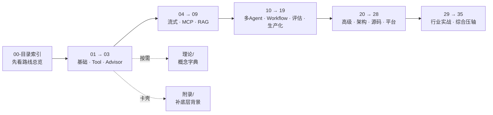

# 教程（主线学习）

> **这是主线代码教程**：先动手，再补理论。所有文件**扁平**存放，是一个**单一的 00-35 序列**（原 LangChain4j 入门系列、Agent 进阶系列已内容融合进对应章节，原始文档归档于 `../archive/absorbed-内容融合/`）。
> 学习主线：**00-目录索引 起，按 01→35 顺序推进**。
> 概念卡壳 → 去 `理论/`；底层背景卡壳 → 去 `附录/`。

---

## 学习顺序（单一序列 00-35）

## 章节分布（融合后）

| 段 | 编号 | 内容 | 融合说明 |
|----|------|------|---------|
| 基础 | 00-03 | 路线总览、基础重塑、Tool与AgentLoop、Advisor链 | 01 已融合 LC4j 快速起步+声明式；02 已融合 Tool 设计+多 Tool 编排 |
| 工程化 | 04-09 | 流式、MCP 三部曲、多模态、RAG | 04 已融合 LC4j 流式；09 已融合 LC4j RAG 入门 |
| 生产化 | 10-19 | 多Agent、Workflow、评估、测试、安全、可观测、路由、架构 | 12 已融合 Agent 评估；14 已融合 Agent 防失控；16 已融合 LC4j 本地/DeepSeek |
| 深化 | 20-28 | RAG高级、端到端、源码、Prompt、向量、记忆、SRE、CICD | 25 已融合 LC4j ChatMemory |
| 行业 | 29-35 | 金融/医疗/法律、综合压轴、可观测方案、研究Agent、管数分离 | 综合实战 |

> 原「入门-LangChain4j」9 篇与「进阶-Agent」7 篇的独有内容已**融合进**上表对应章节（每篇开头有「本小节吸收自…」溯源注记），原始全文归档于 `../archive/absorbed-内容融合/`。

---

## 快速入口

- **路线总览**：`00-目录索引.md`（八阶段学习地图）
- **第一个项目**：从 `01-2.0基础重塑.md` 开始，理解 LLM=RPC
- **报错排查**：融合后的各章节含错误排查小节（原 LC4j 排查手册已归档）

> 完成主线后，可到 `项目-WebClaude` / `项目-AIServing` 看真实系统拆解。

---

> 💡 **卡壳了？** 概念不懂查 `理论/`（01-16 字典）；响应式 / Redis / Kafka / SSE 等底层背景去 `附录/` 对应专题补基础。
