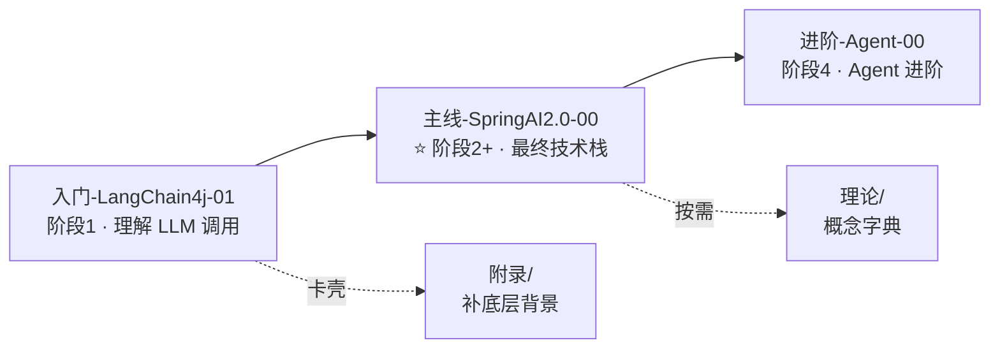

# 教程（主线学习）

> **这是主线代码教程**：先动手，再补理论。所有文件**扁平**存放，按「系列前缀 + 编号」分组。
> 学习主线：**LangChain4j 入门 → Spring AI 2.0 主线 → Agent 进阶**。
> 概念卡壳 → 去 `理论/`；底层背景卡壳 → 去 `附录/`。

---

## 三个系列（文件名前缀）

| 前缀 | 系列 | 篇数 | 定位 | 入口 |
|------|------|:---:|------|------|
| `入门-LangChain4j-` | LangChain4j | 9 | 阶段 1 入门，理解 LLM 调用本质 | `入门-LangChain4j-01-快速起步.md` |
| `主线-SpringAI2.0-` | Spring AI 2.0 | 39 | ⭐ 主线核心，最终交付栈 | `主线-SpringAI2.0-00-目录索引.md` |
| `进阶-Agent-` | Agent 进阶 | 7 | Agent 设计、防失控、实战项目 | `进阶-Agent-00-阶段总览.md` |

> **前缀规则**：每个系列的文件名 = `前缀 + 系列内编号 + 标题`。
> 例如 2.0 系列索引里写的「09-RAG工程化实战」对应文件 **`主线-SpringAI2.0-09-RAG工程化实战.md`**。

---

## 学习顺序（主线）

1. **阶段 1（入门）**：`入门-LangChain4j-01` 起，9 篇，理解 LLM 调用 / 记忆 / 工具 / RAG 基础。
2. **阶段 2+（主线核心）**：`主线-SpringAI2.0-00-目录索引` 起，39 篇，MCP 体系 / 工程化 / 生产化 / 架构 / 行业实战。
3. **阶段 4（Agent 进阶）**：`进阶-Agent-00-阶段总览` 起，7 篇，Tool 设计 / 防失控 / 多 Tool / 评估 / 实战项目。

> 完成 2.0 主线 + Agent 进阶后，可到 `项目-WebClaude` / `项目-AIServing` 看真实系统拆解。

---

## 系列内快速入口

- **LangChain4j 入门**：`入门-LangChain4j-09-常见错误与排查手册.md` 是报错排查速查
- **Spring AI 2.0 主线**：`主线-SpringAI2.0-00-目录索引.md` 是 8 阶段路线总览（MCP 主题集中在 05-07）
- **Agent 进阶**：`进阶-Agent-00-阶段总览.md` 是阶段 4 路线

---

> 💡 **卡壳了？** 概念不懂查 `理论/`（01-16 字典）；响应式 / Redis / Kafka / SSE 等底层背景去 `附录/` 对应专题补基础。
