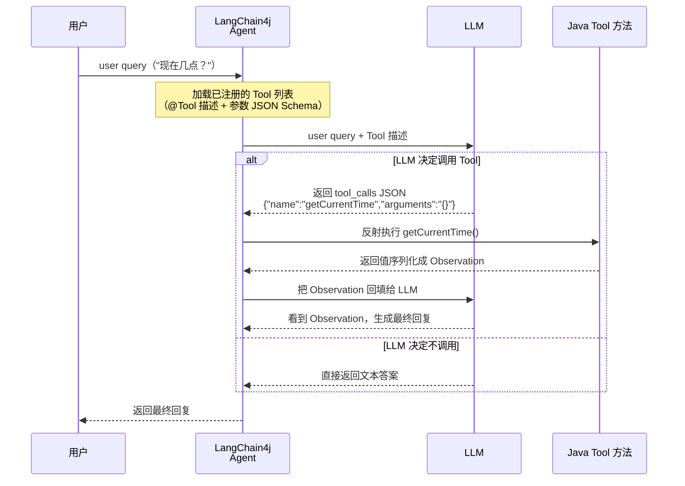
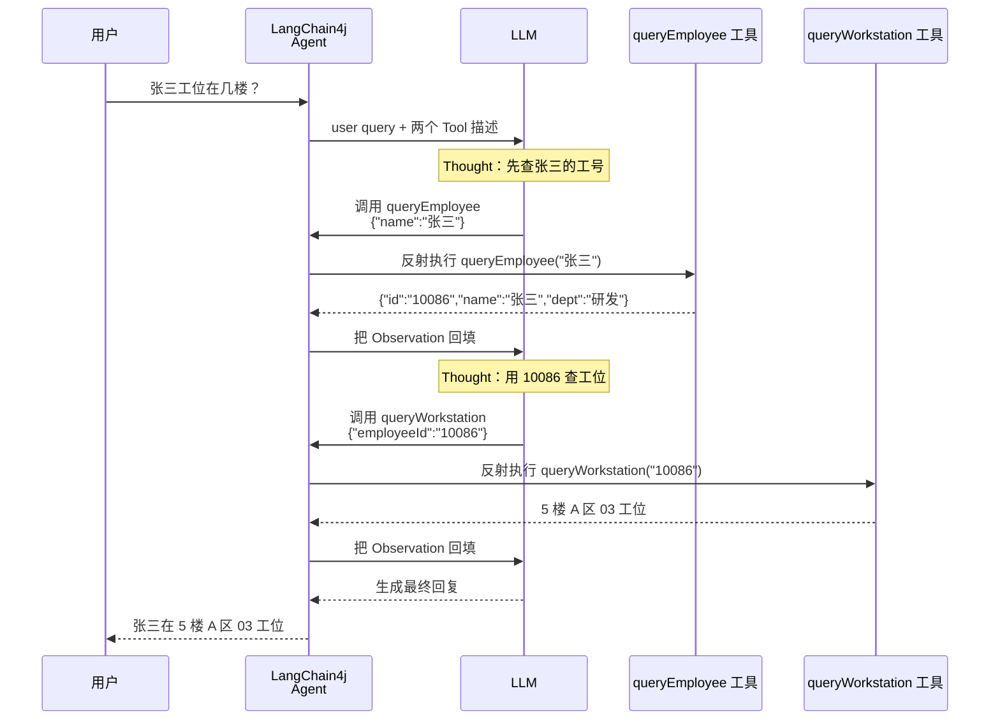
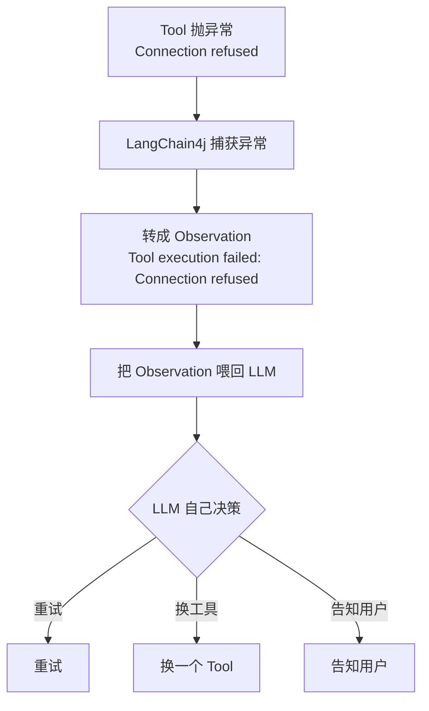

# LangChain4j 03 - Tool 调用（Function Calling）

> 目标：理解 Function Calling 协议，写一个自定义 Tool，让 LLM 自己决定何时调用。
> 前提：你会配置模型、会用 `ChatMemory` 实现多轮对话（即 01、02 的能力）。

---


> 📖 **Tool 学习路径 · 第 1 级 工具调用基础**：本文件是 Tool 四步路径的起点。
> 下一级 → `主线-SpringAI2.0-02-Tool与AgentLoop.md`（第 2 级 2.0 实现）→ `进阶-Agent-01-Tool设计原则.md`（第 3 级 设计）→ `进阶-Agent-03-多Tool编排.md`（第 4 级 多工具编排）。

## 1. 为什么需要 Tool

### 1.1 LLM 的三个硬伤

| 硬伤 | 表现 | Tool 怎么解决 |
|------|------|------------|
| **知识截止** | 不知道今天日期 | 写个 `getCurrentTime()` 工具 |
| **不会算术** | 算 1234 × 5678 大概率出错 | 写个 `calculator()` 工具 |
| **不能访问外部系统** | 不能查数据库 / 调 API | 写个 `queryDatabase()` 工具 |

### 1.2 一句话定义 Tool

> Tool 就是一个**带描述的 Java 方法**。LLM 看到描述，决定是否调用；调用时输出 JSON，Java 反射执行。

---

## 2. Function Calling 协议（必懂）

### 2.1 完整流程图

**核心时序**：用时序图展示同一协议的三方往返——"LLM 决策 → 框架反射执行 → 结果回填 → 再次推理"：



### 2.2 关键认知

**LLM 不直接执行你的 Java 代码**。它只是输出"我想调 X 工具，参数是 Y"的 JSON，由 Java 端反射执行后把结果回传。这就是为什么叫 **Function "Calling"** 而非 "Execution"。

---

## 3. 第一个 Tool：获取当前时间

### 3.1 定义 Tool

```java
package org.demo01;

import dev.langchain4j.agent.tool.Tool;
import dev.langchain4j.agent.tool.P;

import java.time.LocalDateTime;
import java.time.format.DateTimeFormatter;

public class TimeTools {

    @Tool("获取当前系统时间，格式 yyyy-MM-dd HH:mm:ss")
    public String getCurrentTime() {
        return LocalDateTime.now().format(DateTimeFormatter.ISO_LOCAL_DATE_TIME);
    }
}
```

### 3.2 关键点

- `@Tool("描述")` —— **描述是给 LLM 看的，决定它何时调用**。写得好不好直接影响调用准确率。
- 方法可以是任意返回值（String、自定义对象、int 等），LangChain4j 会序列化成 JSON 给 LLM。
- `@P("参数描述")` 给参数加描述，让 LLM 知道怎么填。

### 3.3 给 Agent 用

```java
package org.demo01;

import dev.langchain4j.memory.chat.MessageWindowChatMemory;
import dev.langchain4j.model.openai.OpenAiChatModel;
import dev.langchain4j.service.AiServices;

public class ToolDemo {

    interface Assistant {
        String chat(String userMessage);
    }

    public static void main(String[] args) {
        var model = OpenAiChatModel.builder()
                .baseUrl("https://api.deepseek.com")
                .apiKey(System.getenv("DEEPSEEK_API_KEY"))
                .modelName("deepseek-chat")
                .temperature(0.0)   // Tool 调用建议低温度
                .build();

        Assistant agent = AiServices.builder(Assistant.class)
                .chatModel(model)
                .chatMemory(MessageWindowChatMemory.withMaxMessages(10))
                .tools(new TimeTools())   // 注入 Tool
                .build();

        // 测试 1：直接问时间（应该会调 Tool）
        System.out.println(agent.chat("现在几点？"));

        // 测试 2：闲聊（不应该调 Tool）
        System.out.println(agent.chat("今天天气怎么样？"));
    }
}
```

> **注意**：这里先用 `AiServices`（声明式接口）。下一节会详细讲它。现在先理解 `tools(new TimeTools())` 这一行的作用。

---

## 4. 带参数的 Tool

### 4.1 计算器

```java
public class CalculatorTools {

    @Tool("两个整数相加")
    public int add(@P("第一个数") int a, @P("第二个数") int b) {
        return a + b;
    }

    @Tool("两个整数相乘")
    public int multiply(@P("第一个数") int a, @P("第二个数") int b) {
        return a * b;
    }
}
```

### 4.2 测试

```java
agent.chat("帮我算一下 1234 乘以 5678");
```

**LLM 内部发生了什么**：
1. 分析意图 → 需要 `multiply`
2. 提取参数 → `a=1234, b=5678`
3. 输出 `{"name":"multiply","arguments":{"a":1234,"b":5678}}`
4. LangChain4j 反射执行 `multiply(1234, 5678)` → 返回 `7006652`
5. LLM 看到 `7006652` → 生成 "1234 乘以 5678 等于 7006652"

---

## 5. 真实场景 Tool：查询数据库

```java
public class EmployeeTools {

    private final EmployeeRepository repo;

    public EmployeeTools(EmployeeRepository repo) {
        this.repo = repo;
    }

    @Tool("根据员工姓名查询工号和部门")
    public EmployeeInfo queryEmployee(@P("员工姓名，精确匹配") String name) {
        return repo.findByName(name);
    }

    @Tool("根据工号查询员工的工位位置")
    public String queryWorkstation(@P("工号") String employeeId) {
        return repo.findWorkstationById(employeeId);
    }
}
```

### 5.1 LLM 串联调用（惊艳时刻）

```
用户：张三工位在几楼？

LLM 推理：
  Thought: 我需要先查张三的工号
  Action: queryEmployee(name="张三")
  Observation: {"id":"10086","name":"张三","dept":"研发"}

  Thought: 现在用 10086 查工位
  Action: queryWorkstation(employeeId="10086")
  Observation: 5 楼 A 区 03 工位

  Final Answer: 张三在 5 楼 A 区 03 工位
```

**串联调用时序**：时序图视角展示 LLM 如何"想一步、调一步"，把两个工具串起来完成任务：



**这就是 Agent 的本质** —— LLM 自主决策、串联多个工具完成任务。

---

## 6. Tool 描述的"工程师级"原则

### 6.1 好描述 vs 坏描述

```java
// ❌ 烂描述：LLM 不知道何时用
@Tool("查员工")
public EmployeeInfo find(@P("name") String n) { ... }

// ✅ 好描述：何时用 + 输入语义 + 返回内容
@Tool("根据员工姓名查询其工号、部门、入职日期。当用户询问某员工的基础信息时使用。")
public EmployeeInfo queryEmployeeByName(
    @P("员工的真实姓名，必须是中文全名") String fullName
) { ... }
```

### 6.2 五条铁律

1. **何时使用**：描述里明确"什么场景下该调我"
2. **参数语义**：每个参数都要说明含义、格式、约束
3. **返回内容**：简短说明会返回什么
4. **避免歧义**：多个相似 Tool 时，描述要差异化
5. **不超过 10 个 Tool**：超过后选择准确率断崖下跌（必要时分组路由）

---

## 7. 调试技巧：观察 LLM 决策

### 7.1 开启请求日志

```java
var model = OpenAiChatModel.builder()
        .baseUrl("https://api.deepseek.com")
        .apiKey(System.getenv("DEEPSEEK_API_KEY"))
        .modelName("deepseek-chat")
        .logRequests(true)   // 看到发给 LLM 的 Tool 描述
        .logResponses(true)  // 看到 LLM 返回的 tool_calls
        .build();
```

### 7.2 看日志的关键点

**请求体里应该有 `tools` 数组**：
```json
"tools": [{
  "type": "function",
  "function": {
    "name": "getCurrentTime",
    "description": "获取当前系统时间...",
    "parameters": {"type":"object","properties":{}}
  }
}]
```

**响应里如果有 `tool_calls`**，说明 LLM 决定调用工具：
```json
"tool_calls": [{
  "id": "call_xxx",
  "function": {
    "name": "getCurrentTime",
    "arguments": "{}"
  }
}]
```

### 7.3 决策不对怎么办

| 现象 | 原因 | 解决 |
|------|------|------|
| 该调却没调 | 描述不清晰 | 重写描述，加"何时使用" |
| 不该调却调了 | 描述太宽泛 | 加约束条件 |
| 参数填错 | 参数描述不细 | 写清楚参数格式、约束 |
| 死循环调用 | 工具返回空 | 返回有意义的提示而非 null |

---

## 8. 异常处理

### 8.1 Tool 抛异常时

LangChain4j 会把异常信息转成 `Observation` 喂回 LLM：

```
Tool threw exception: Connection refused

LLM 收到 Observation: "Tool execution failed: Connection refused"
```

LLM 会自己决定：重试？换工具？告知用户？

**异常处理决策**：



### 8.2 生产实践

```java
@Tool("查询员工信息")
public EmployeeInfo queryEmployee(@P("姓名") String name) {
    try {
        return repo.findByName(name);
    } catch (Exception e) {
        // 返回友好提示，而不是抛异常
        return EmployeeInfo.notFound(name);
    }
}
```

**原则**：可预期的业务异常返回结构化结果；不可预期的系统异常抛出（让 LLM 决策）。

---

## 9. 防止 Agent 失控

```java
Assistant agent = AiServices.builder(Assistant.class)
        .chatModel(model)
        .tools(new TimeTools(), new CalcTools())
        .chatMemory(MessageWindowChatMemory.withMaxMessages(10))
        // .maxIterations(5)  // 限制最大循环次数（防死循环）
        .build();
```

> 注：`maxIterations` 在不同版本 API 路径略有差异，参考 `docs.langchain4j.dev/categories/tools` 当前文档。

---

## 10. 理解检查

1. Function Calling 的本质是什么？LLM 真的"执行"了你的代码吗？
2. 为什么 `@Tool` 的描述比方法名还重要？
3. `temperature` 设为多少更适合 Tool 调用？为什么？
4. Tool 抛异常时，LLM 能"知道"吗？通过什么机制？
5. 一个 Agent 注册 20 个 Tool 会有什么问题？

---

## 11. 练习任务

1. 跑通第 3 节的 `TimeTools`，用"现在几点"测试
2. 加一个 `CalculatorTools`，让 LLM 算 `23 * 17 + 100`
3. 写一个 `WeatherTools`（伪造数据即可）：根据城市名返回"晴/雨/雪"
4. **观察日志**：开启 `logRequests`，看 LangChain4j 发给 LLM 的 Tool 描述长什么样
5. 故意写一个描述模糊的 Tool，观察 LLM 是否会误调用

完成后进入下一节：**04-AiServices 声明式**——用"声明接口"的方式把记忆、工具、系统提示全自动装配起来。
