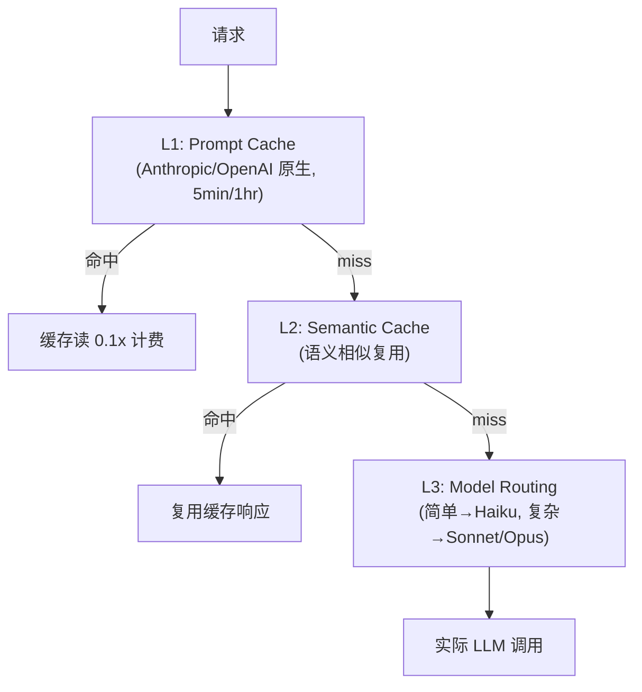
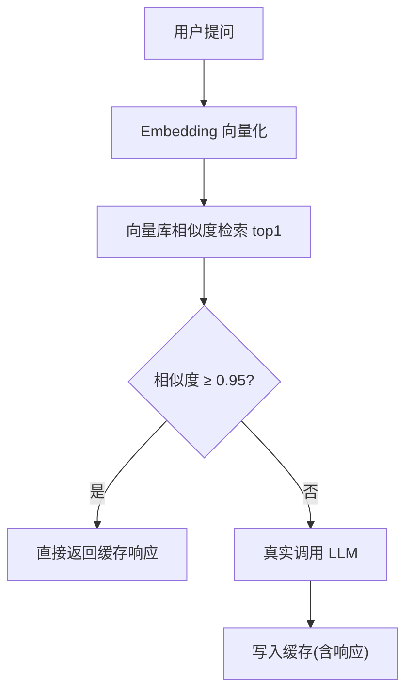
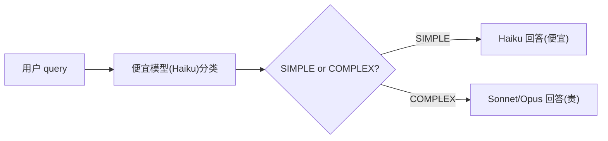
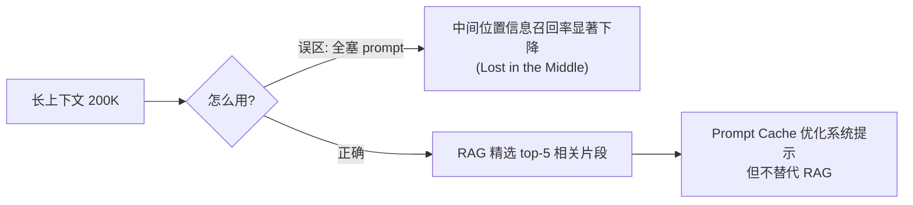
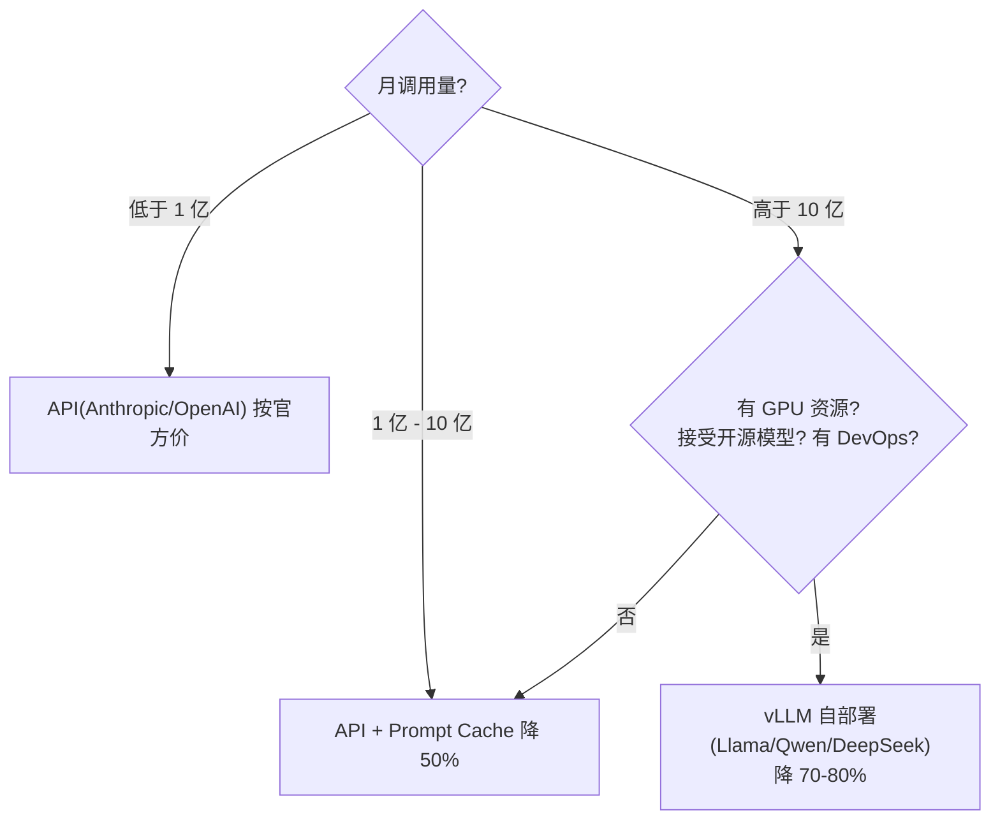

# 成本工程与 Prompt Cache

> 一句话定位：**LLM 调用按 token 计费，4 层缓存 + 路由能让生产成本下降 5-10 倍。这是 Java 工程师在生产化阶段的必修课。**
>
> 调研日期：2026-07-13。Stripe 用 vLLM 自部署省 73% 成本；Anthropic Prompt Caching 命中 10x 成本差异。

---

## 1. LLM 成本的本质

### 1.1 五维成本

| 维度 | 计费 | 备注 |
|------|------|------|
| **input tokens** | 1x | 用户 prompt + 历史 |
| **output tokens** | 3-5x input | LLM 生成的回答（贵） |
| **prompt cache write** | 1.25x input | 首次写入缓存 |
| **prompt cache read** | 0.1x input | **命中缓存便宜 10 倍** |
| **web search requests** | 按次 | Anthropic/Gemini 的 web search tool |

### 1.2 为什么 Java 工程师天然适合做成本工程

- 你**懂缓存**（Redis、Caffeine、HTTP Cache-Control）
- 你**懂分层**（L1/L2/L3 缓存是日常）
- 你**懂成本意识**（DB 索引、批处理、异步）
- LLM 成本工程 = 把这些概念搬到 AI 应用

---

## 2. 4 层缓存与路由

**四级路径**：命中即返回，miss 逐级下探，最终才触发真实 LLM 调用。



### 2.1 L1：Prompt Cache（Anthropic 原生）

**机制**：Anthropic 提供 5 分钟 / 1 小时两种 TTL 的 prompt cache。命中后 input tokens 按 0.1x 计费。

**Spring AI 2.0 配置**：

```java
@Configuration
class PromptCacheConfig {
    @Bean
    ChatClient chatClient(ChatClient.Builder builder) {
        return builder
            .defaultSystem(ps -> ps
                .text("""
                    你是企业助手。以下是公司政策（可能跨请求复用）。
                    {{policy}}
                    """)
                // 标 cache_control 让前缀稳定部分缓存
                .cacheControl(AnthropicCacheControl.builder()
                    .type("ephemeral")
                    .ttl("1h")
                    .build()))
            .build();
    }
}
```

**关键原则**：
- system prompt 拆**静态前缀**（基础指令 + 工具说明）+ **动态后缀**（用户身份 + 当前任务）
- 静态前缀打 cache 标记，跨请求稳定
- 动态后缀不打 cache 标记，每请求变化
- 工具列表按名字稳定排序，作为连续前缀

**收益**：N 个运行时变量产生 2^N 种缓存变体，所以**任何依赖运行时状态的部分必须放在边界后**。

### 2.2 L2：Semantic Cache（语义复用）

**机制**：用户问"中国首都是哪" 和 "中国的首都叫什么" 走同一个 LLM 调用。语义相似度 > 阈值即复用。

**实现方案**：
- **GPTCache**（开源）：嵌入式 / Redis 后端
- **Langfuse Cache**：观测平台自带
- **自建**：用 Embedding + 向量库（pgvector/Qdrant）

**Spring AI 集成**（伪代码）：

```java
@Component
@RequiredArgsConstructor
public class SemanticCacheAdvisor implements BaseAdvisor {
    private final VectorStore cacheStore;

    @Override
    public AdvisedResponse aroundCall(AdvisedRequest req, CallAdvisorChain chain) {
        // 1. 用当前 prompt 查相似缓存
        String embedding = embed(req.userText());
        List<Document> hits = cacheStore.similaritySearch(
            SearchRequest.query(embedding).withTopK(1).withThreshold(0.95));

        if (!hits.isEmpty()) {
            return cachedResponse(hits.get(0));
        }

        // 2. miss → 真实调用
        AdvisedResponse resp = chain.nextAroundCall(req);

        // 3. 写入缓存
        cacheStore.add(List.of(new Document(req.userText(),
            resp.content(), Map.of("response", resp.content()))));

        return resp;
    }
}
```

**语义复用流程**：相似度达阈值直接复用，否则真实调用并回写缓存。



**注意**：缓存不能跨用户（隐私）；高敏感场景禁用。

### 2.3 L3：Model Routing（按复杂度分流）

**机制**：简单问题走便宜模型（Haiku），复杂问题走贵模型（Sonnet/Opus）。

**实现**：

```java
@Service
@RequiredArgsConstructor
public class RoutingChatService {
    private final ChatClient haikuClient;  // 便宜
    private final ChatClient sonnetClient; // 贵

    public String chat(String query) {
        Complexity c = classifyComplexity(query);
        return switch (c) {
            case SIMPLE -> haikuClient.prompt().user(query).call().content();
            case COMPLEX -> sonnetClient.prompt().user(query).call().content();
        };
    }

    private Complexity classifyComplexity(String q) {
        // 用便宜模型做分类
        String tag = haikuClient.prompt()
            .system("把问题分类为 SIMPLE/COMPLEX，只返回标签")
            .user(q).call().content();
        return "COMPLEX".equals(tag) ? Complexity.COMPLEX : Complexity.SIMPLE;
    }
}
```

**路由分流**：先用便宜模型分类，再按复杂度分派模型。



**收益**：80% 简单请求 + 20% 复杂请求 → 综合成本可降 50-70%。

### 2.4 L4：Long Context Tradeoff

**机制**：很多团队以为"长上下文（200K）替代 RAG"。这是误区。

**论文证据**（Liu et al. 2023, "Lost in the Middle"）：
- 上下文中间位置的信息召回率显著下降
- 即使 200K 上下文，RAG 仍优于全塞 prompt

**结论**：
- ❌ 不要把所有文档塞进 long context
- ✅ 用 RAG 精选 top-5 相关片段
- ✅ Prompt Cache 优化系统提示，但不替代 RAG

**取舍**：长上下文不是 RAG 的替代品，反而要警惕"Lost in the Middle"。



---

## 3. 成本监控（五维追踪）

### 3.1 必须记录的字段

```java
record TokenUsage(
    String model,
    long inputTokens,
    long outputTokens,
    long cacheWriteTokens,   // Prompt Cache L1 写入
    long cacheReadTokens,    // Prompt Cache L1 读（0.1x）
    int webSearchRequests,
    BigDecimal costUsd,
    String userId,
    Instant timestamp
) {}
```

### 3.2 Micrometer 指标

```java
@Component
@RequiredArgsConstructor
public class CostTrackingAdvisor implements BaseAdvisor {
    private final MeterRegistry meterRegistry;

    @Override
    public AdvisedResponse aroundCall(AdvisedRequest req, CallAdvisorChain chain) {
        AdvisedResponse resp = chain.nextAroundCall(req);
        Usage usage = resp.response().getMetadata().getUsage();

        meterRegistry.counter("genai.tokens.input",
            "model", req.chatOptions().getModel()).increment(usage.getInputTokens());
        meterRegistry.counter("genai.tokens.output",
            "model", req.chatOptions().getModel()).increment(usage.getOutputTokens());
        meterRegistry.counter("genai.tokens.cache.read",
            "model", req.chatOptions().getModel())
            .increment(usage.getCacheReadTokens() != null ? usage.getCacheReadTokens() : 0);

        return resp;
    }
}
```

### 3.3 收益递减检测（防 Agent 烧钱空转）

常见做法（参考 Claude Code 的成本追踪设计）：
- 连续 3 次续跑每次 < 500 token → 自动停止
- 用 `EnumMap<Model, BigDecimal[]>` 建成本表
- 会话级成本持久化（`@PreDestroy` 写 Redis）

---

## 4. 自部署 vs API（成本对比）

### 4.1 决策矩阵

| 月调用量 | 推荐方案 | 单 token 成本 |
|---------|---------|-------------|
| < 100M | API（Anthropic/OpenAI） | 按官方价 |
| 100M - 1B | API + Prompt Cache | 降 50% |
| > 1B | vLLM 自部署（开源模型） | 降 70-80% |

**决策路径**：按月调用量选择方案，1B 以上才考虑自部署并先确认前提。



### 4.2 vLLM 自部署（参考 Stripe 案例）

Stripe 2025 公开数据：用 vLLM 自部署 Llama 3.1 替代 GPT-4o，**省 73% 成本**。

**前提条件**：
- 有 GPU 资源（A100/H100）
- 能接受开源模型质量（Llama/Qwen/DeepSeek）
- 有 DevOps 团队运维

如果上面三条都满足，自部署 vLLM 就是值得走的路：vLLM 是当前生产级推理引擎的事实标准，支持 PagedAttention、KV Cache、连续批处理，能在大模型上做到高并发低延迟，是自部署场景的首选。

---

## 5. 实战路线（按优先级）

### 5.1 P0：基础（1-2 天）
- [ ] 接入 Micrometer，记录五维 token 用量
- [ ] 接入 Prompt Cache（Anthropic 原生，5min/1hr）
- [ ] system prompt 拆静态/动态边界

### 5.2 P1：进阶（3-5 天）
- [ ] 接入 Semantic Cache（GPTCache 或自建）
- [ ] 实现 Model Routing（Haiku/Sonnet 分流）
- [ ] 建成本看板（Grafana + 五维指标）

### 5.3 P2：高级（1-2 周）
- [ ] 收益递减检测（防 Agent 烧钱）
- [ ] vLLM 试点（高频简单任务）
- [ ] 预算控制 Advisor（每用户/每会话限额）

---

## 6. 自检清单

- [ ] LLM 成本的 5 个维度分别是什么？cache read 比 input 便宜几倍？
- [ ] Prompt Cache 的"静态/动态边界"原则是什么？N 个变量产生多少缓存变体？
- [ ] 为什么"长上下文替代 RAG"是误区？
- [ ] Semantic Cache 的隐私风险是什么？怎么避免？
- [ ] Model Routing 在什么流量下值得做？
- [ ] 收益递减检测解决什么问题？

---

## 7. 阅读提示

本文讲透"AI 应用的钱花在哪、怎么省"：**L1 Prompt Cache**（静态前缀跨请求命中，省 50-90%）→ **L2 Semantic Cache**（语义复用）→ **成本追踪与预算告警**（不失控）。把本文的缓存边界原则和成本表方案落实，就是生产级成本治理的地基。

---

## 8. 参考资料

1. **Anthropic Prompt Caching**（2024-08）—— 5min/1hr cache 机制
2. **Liu et al. 2023, "Lost in the Middle"** —— 长上下文召回率下降
3. **Stripe 2025 Cost Saving Case** —— vLLM 自部署省 73%
4. **GPTCache** —— github.com/zilliztech/GPTCache
5. **Langfuse Cache** —— langfuse.com/docs/sessions-cache

---

> 💡 **卡壳了？** 底层背景（响应式 / Redis / Kafka / SSE / 事务）去 `../附录/` 对应专题补基础；回到 `../教程/` 继续主线。
