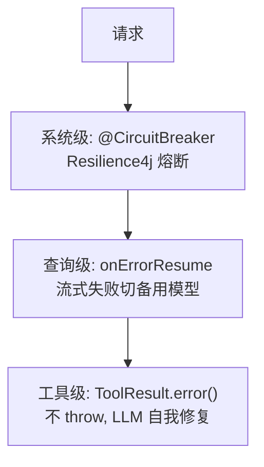
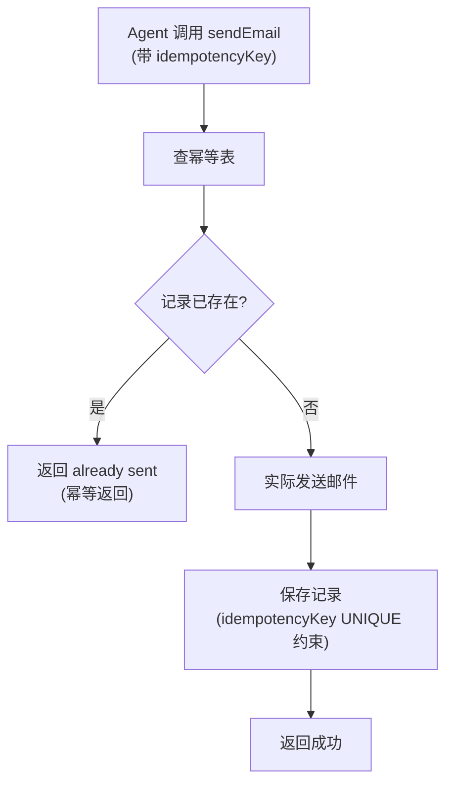
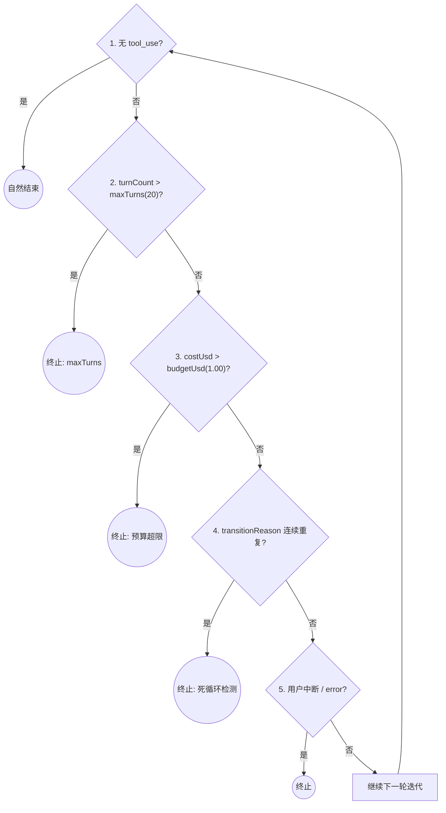
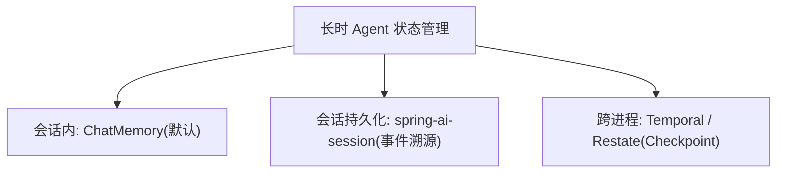
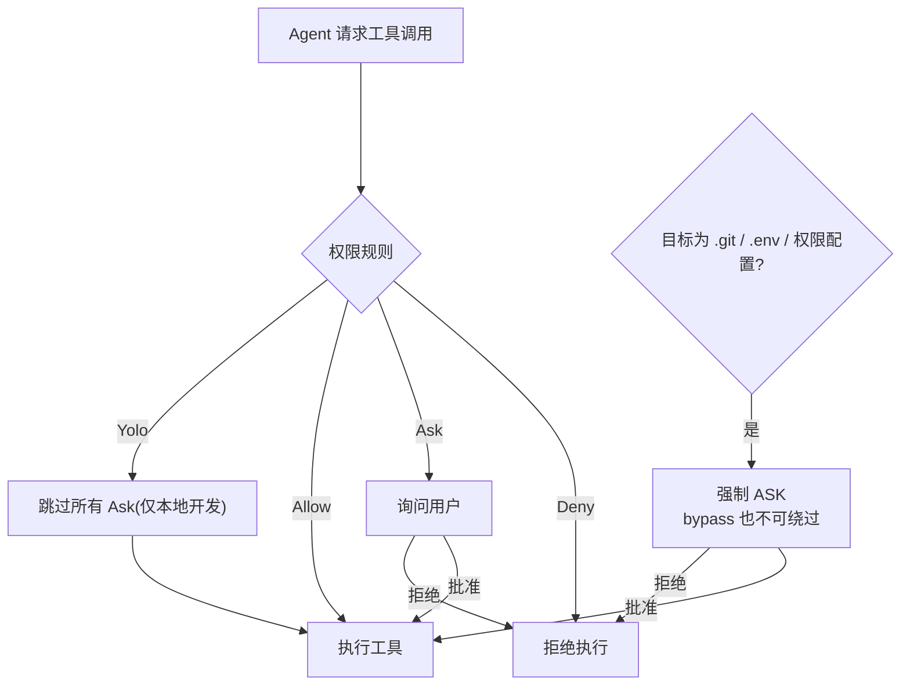
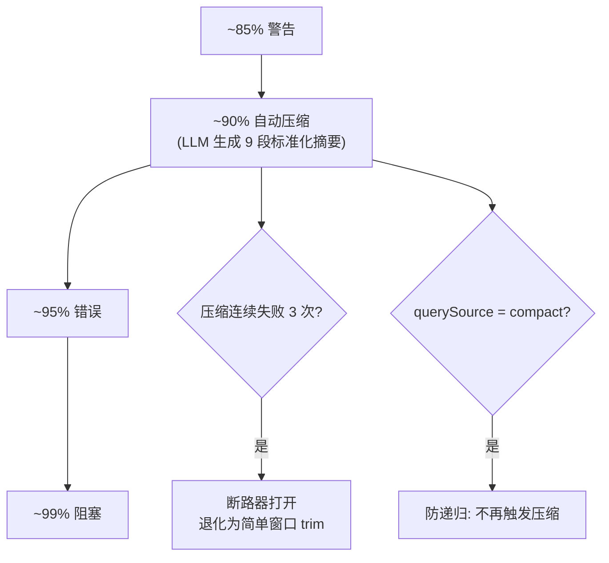

# Agent 可靠性工程（Java 视角）

> 一句话定位：**Agent 失败模式本质是分布式系统问题，Java 工程师在类型系统 + 工程纪律上有天然优势——这是你的护城河。**
>
> 来源：Red Hat 2026-06《Java Agents at Scale》核心论点 + Anthropic《Building Effective Agents》+ Claude Code 源码启示录 §2.1-2.3。
>
> 调研日期：2026-07-13。本文是阶段 8.2 长期方向的参考文档。

---

## 1. 为什么 Agent 可靠性是 Java 工程师的护城河

### 1.1 失败模式 = 分布式系统问题

| Agent 失败模式 | 分布式系统对应 |
|--------------|--------------|
| Tool 调用超时 | RPC 超时 |
| LLM 返回错误格式 | 序列化失败 |
| 多步推理中途失败 | 工作流中断 |
| 重试导致副作用重复 | 幂等性问题 |
| 模型限流 / 服务不可用 | 服务降级 |
| 长时 Agent 失去上下文 | 状态丢失 |
| Agent 死循环 | 活锁 |

### 1.2 Python/算法工程师的短板

- 不熟悉分布式系统经典问题（CAP/幂等/补偿/重试）
- 缺少类型系统保障（动态类型 → 运行时错误）
- 不熟悉 Java 生态的成熟方案（Resilience4j/Temporal/Spring Cloud）

### 1.3 Java 工程师的优势

- 类型系统 + 密封类型 + Pattern Matching → 结构化输出更可靠
- Spring AOP / Advisor → 横切关注点天然位置
- Resilience4j / Spring Retry / Spring Cloud Circuit Breaker → 成熟方案
- Temporal / Restate / ShedLock → 分布式编排
- Virtual Threads → IO 密集 Agent 工作负载

---

## 2. 三层错误模型

设计借鉴：Claude Code 的三层错误模型（源码 ch39）

**三层降级路径**：请求从上到下逐层兜底，每层用对应 Spring 组件。



### 2.1 工具级：返回 `ToolResult.error()` 不 throw

```java
@Tool(description = "查询数据库")
public ToolResult queryDb(String sql) {
    try {
        return ToolResult.success(jdbcTemplate.queryForList(sql));
    } catch (DataAccessException e) {
        // ❌ 错误：throw new RuntimeException(e)
        // ✅ 正确：返回结构化错误，让 LLM 自我修复
        return ToolResult.error("DB_ERROR: " + e.getMessage());
    }
}
```

**理由**：throw 会让 Agent 崩溃；返回错误让 LLM 看到 stderr，自己决定重试/换工具/放弃。

### 2.2 查询级：流式失败降级

```java
public Flux<String> chat(String q) {
    return primaryClient.prompt().user(q).stream().content()
        .onErrorResume(ex -> {
            log.warn("Primary model failed, falling back", ex);
            return fallbackClient.prompt().user(q).stream().content();
        });
}
```

**关键**：fallback 模型应该比 primary 更便宜/稳定（如 Sonnet 失败切 Haiku）。

### 2.3 系统级：Resilience4j 熔断

```java
@CircuitBreaker(name = "llmCall", fallbackMethod = "circuitOpenFallback")
@Retry(name = "llmCall")
@TimeLimiter(name = "llmCall")
public CompletableFuture<String> callLlm(String q) {
    return CompletableFuture.supplyAsync(() ->
        chatClient.prompt().user(q).call().content());
}

public CompletableFuture<String> circuitOpenFallback(String q, Throwable t) {
    return CompletableFuture.completedFuture("服务暂时不可用，请稍后重试");
}
```

```yaml
resilience4j:
  circuitbreaker:
    instances:
      llmCall:
        slidingWindowSize: 20
        failureRateThreshold: 50
        waitDurationInOpenState: 30s
        permittedNumberOfCallsInHalfOpenState: 5
  retry:
    instances:
      llmCall:
        maxAttempts: 3
        waitDuration: 1s
  timelimiter:
    instances:
      llmCall:
        timeoutDuration: 30s
```

---

## 3. 幂等性设计

### 3.1 为什么必须幂等

LLM Agent 会重试（连续调用同一个 Tool），如果 Tool 有副作用（写库/发邮件/扣款），重试会导致**重复写入**。

### 3.2 实现模式

```java
@Tool(description = "发送邮件")
public ToolResult sendEmail(
    @ToolParam("to") String to,
    @ToolParam("subject") String subject,
    @ToolParam("body") String body,
    @ToolParam("idempotencyKey") String key  // ← Agent 传入唯一 key
) {
    // 1. 查幂等表
    Optional<EmailRecord> existing = emailRepo.findByIdempotencyKey(key);
    if (existing.isPresent()) {
        return ToolResult.success("already sent", existing.get());  // 幂等返回
    }

    // 2. 实际发送
    EmailRecord rec = emailService.send(to, subject, body);
    rec.setIdempotencyKey(key);
    emailRepo.save(rec);  // ← 唯一约束保并发安全

    return ToolResult.success(rec);
}
```

**幂等写入流程**：先查幂等表，重复 key 直接返回已发送结果。



### 3.3 关键约束

- `idempotencyKey` 列必须有 **UNIQUE 约束**
- Tool 描述必须告诉 LLM 怎么生成 key（如 UUID / 业务 ID）
- 写入 + 返回必须原子（事务）

---

## 4. Agent Loop 终止条件

设计借鉴：Claude Code 的 Agent Loop 终止条件设计（源码 ch05）

### 4.1 5 个终止条件

```java
public class AgentState {
    int turnCount;
    int maxTurns = 20;
    BigDecimal costUsd = BigDecimal.ZERO;
    BigDecimal budgetUsd = new BigDecimal("1.00");
    String transitionReason;  // 上次重试的原因
    String lastRetryReason;
}

while (true) {
    // 1. 自然结束：无 tool_use
    if (!resp.hasToolCalls()) break;

    // 2. maxTurns
    if (state.turnCount++ > state.maxTurns) {
        log.warn("Max turns reached");
        break;
    }

    // 3. 预算超限
    if (state.costUsd.compareTo(state.budgetUsd) > 0) {
        sink.next(new BudgetExceededEvent(state.costUsd));
        break;
    }

    // 4. 死循环检测（transitionReason 连续重复）
    if (state.transitionReason != null
        && state.transitionReason.equals(state.lastRetryReason)) {
        log.error("Loop detected: {}", state.transitionReason);
        break;
    }
    state.lastRetryReason = state.transitionReason;

    // 5. 用户中断 / error
    if (interrupted || error) break;
}
```

**5 个终止条件**：除"无 tool_use 自然结束"外，每轮还检查四个硬条件。



### 4.2 关键设计：transitionReason 比 retryCount++ 安全

`retryCount++` 只知道"重试了几次"，不知道"为什么重试"。
`transitionReason` 记录"上次为什么重试"，能识别"重复犯同一个错"。

例如 `collapse_drain_retry` 这种状态连续出现 2 次 → 立即终止，避免烧钱空转。

---

## 5. 长时 Agent 的状态管理

### 5.1 三种状态方案

| 方案 | 适用 | 实现 |
|------|------|------|
| **会话内** | 单轮 / 短多轮 | `ChatMemory`（默认） |
| **会话持久化** | 跨重启 | Spring AI 2.0 `spring-ai-session`（event-sourced） |
| **跨进程持久化** | 长时 Agent / 工作流 | Temporal / Restate（带 Checkpoint） |

**三档持久化**：按会话生命周期选择，耐久度逐级递增。



### 5.2 Temporal 集成示例

```java
public class AgentWorkflow implements WorkflowInterface {
    @WorkflowMethod
    public String runAgent(String task) {
        AgentState state = new AgentState();

        while (true) {
            // 每个 step 都有 Checkpoint，Temporal 自动持久化
            String step = activities.callLlm(state);

            if (step.equals("DONE")) return state.result();

            // Activity 失败自动重试，幂等性由 Activity 实现保证
            state = activities.executeTool(state, step);
        }
    }
}
```

**收益**：
- Agent 跑到第 8 步崩了，Temporal 重启后从第 7 步继续
- 跨进程协调多 Agent（A2A 协议的实践基础）

### 5.3 Spring AI 2.0 spring-ai-session

```java
@Bean
ChatMemory chatMemory(JdbcTemplate jdbc) {
    return JdbcChatMemory.builder()
        .jdbcTemplate(jdbc)
        .eventSourced(true)  // ← event sourcing
        .build();
}
```

**收益**：会话事件按时间序落库，可重放、可回放、可分支。

---

## 6. 权限模型（Allow / Ask / Deny / Yolo）

设计借鉴：Claude Code 的四级权限模型（Allow/Ask/Deny/Yolo，源码 ch20-22）

### 6.1 四级模型

- **Allow**：自动执行
- **Ask**：弹窗询问用户
- **Deny**：拒绝
- **Yolo**：跳过所有 ask（仅本地开发）

### 6.2 Spring AI 实现

```java
@Component
public class PermissionAdvisor implements CallAdvisor {
    private final Map<String, PermissionRule> rules;

    @Override
    public AdvisedResponse aroundCall(AdvisedRequest req, CallAdvisorChain chain) {
        for (ToolCall call : req.toolCalls()) {
            PermissionRule rule = rules.get(call.name());
            if (rule == PermissionRule.DENY) {
                throw new PermissionDeniedException(call.name());
            }
            if (rule == PermissionRule.ASK) {
                if (!userApprovalService.ask(req.userId(), call)) {
                    throw new PermissionDeniedException(call.name());
                }
            }
        }
        return chain.nextAroundCall(req);
    }
}
```

**四级决策**：Deny 优先短路，Ask 需用户批准，Yolo 仅本地开发跳过询问。



### 6.3 Deny 优先 + 不可绕过

即使 bypassPermissions 模式，对 `.git/ / .env / 权限配置文件`的修改仍强制 ASK。
**保护权限配置文件 > 一切**：如果 Agent 能改权限文件，整个安全体系崩塌。

---

## 7. 上下文压缩（防 context window 溢出）

设计借鉴：Claude Code 的上下文压缩设计（源码 ch12）

### 7.1 触发链

### 7.2 Resilience4j 断路器包裹压缩

```java
@CircuitBreaker(name = "compress", fallbackMethod = "fallback")
public String compress(List<Message> messages) {
    // 调 LLM 生成标准化摘要
    // 9 段：Primary Request / Files / Errors / Pending Tasks / Current Work...
}

public String fallback(List<Message> messages, Throwable t) {
    log.error("Compression failed, using window trim", t);
    return trimToWindow(messages, 10);  // 退化为简单窗口
}
```

### 7.3 防递归

压缩本身调 LLM 不会再触发压缩：
```java
if (req.querySource() == "compact") {
    return false;  // 不递归压缩
}
```

**渐进式压力响应**：占用越高响应越激进，断路器与防递归双保险。



---

## 8. 自检清单

- [ ] Agent 的 7 种失败模式分别对应分布式系统的什么问题？
- [ ] 为什么 Tool 错误要返回 `ToolResult.error()` 而不是 throw？
- [ ] 三层错误模型分别是什么？用什么 Spring 组件实现？
- [ ] 幂等性设计的关键点是什么？为什么需要 UNIQUE 约束？
- [ ] `transitionReason` 比 `retryCount++` 安全在哪里？
- [ ] spring-ai-session 与 Temporal 在长时 Agent 状态管理上的差异？
- [ ] 为什么"保护权限配置文件 > 一切"？

---

## 9. 阅读提示

本文是"Agent 可靠性工程"的 Java 落地篇：三层错误 + 熔断重试（第 2 节）、Agent Loop 终止条件（第 4 节）、权限四级模型（第 6 节）、上下文压缩（第 7 节）、预算控制（第 8 节）。配合"边界管理"这个总纲（见本专题可靠性开篇的元认知），就是一套完整的防失控体系。

---

## 10. 参考资料

1. **Red Hat《Java Agents at Scale》**（2026-06）—— "类型系统 + 工程纪律"护城河论点
2. **Anthropic《Building Effective Agents》**（2024-12-19）—— Workflow > Agent
3. **Claude Code 源码分析**（本文第 2/4/6/7 节的设计来源）
4. **Resilience4j Documentation** —— 三层错误 + 熔断 + 重试
5. **Temporal Java SDK** —— 长时工作流编排
6. **Spring AI 2.0 spring-ai-session** —— event-sourced 会话

---

> 💡 **卡壳了？** 底层背景（响应式 / Redis / Kafka / SSE / 事务）去 `../附录/` 对应专题补基础；回到 `../教程/` 继续主线。
