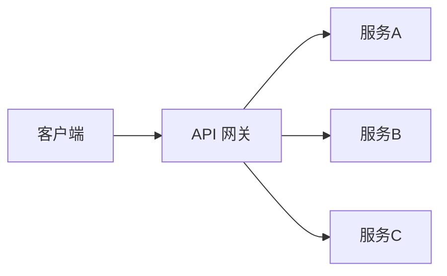

# 理论字典 · API 网关

> 速查概念，不展开实践细节。

---

## 核心概念

**API 网关**是所有客户端请求的统一入口，负责认证、限流、路由、计量等横切关注点。



## Agent 网关特有能力

| 能力 | 说明 |
|------|------|
| SSE 流式透传 | 不缓冲，逐 event 转发 |
| Token 实时计量 | 流式过程中统计 token 用量 |
| 多模型路由 | 按成本/质量/延迟选择模型 |
| 会话亲和 | 同一会话路由到同一实例 |
| 预算控制 | 单次对话成本上限 |

## 常见实现

| 网关 | 特点 |
|------|------|
| Spring Cloud Gateway | Java 生态原生，Reactor 异步 |
| Kong | Lua 插件生态丰富 |
| Nginx + Lua | 高性能，需手动配置 SSE |
| Envoy | gRPC 支持优秀，Istio 数据面 |

## 关键配置

```yaml
# Agent 网关关键超时配置
connect_timeout: 5s        # 连接超时
read_timeout: 300s         # 读超时（Agent 慢）
write_timeout: 300s        # 写超时
idle_timeout: 600s         # 空闲超时（SSE 长连接）
proxy_buffering: off       # 关闭缓冲（SSE 必须）
```
