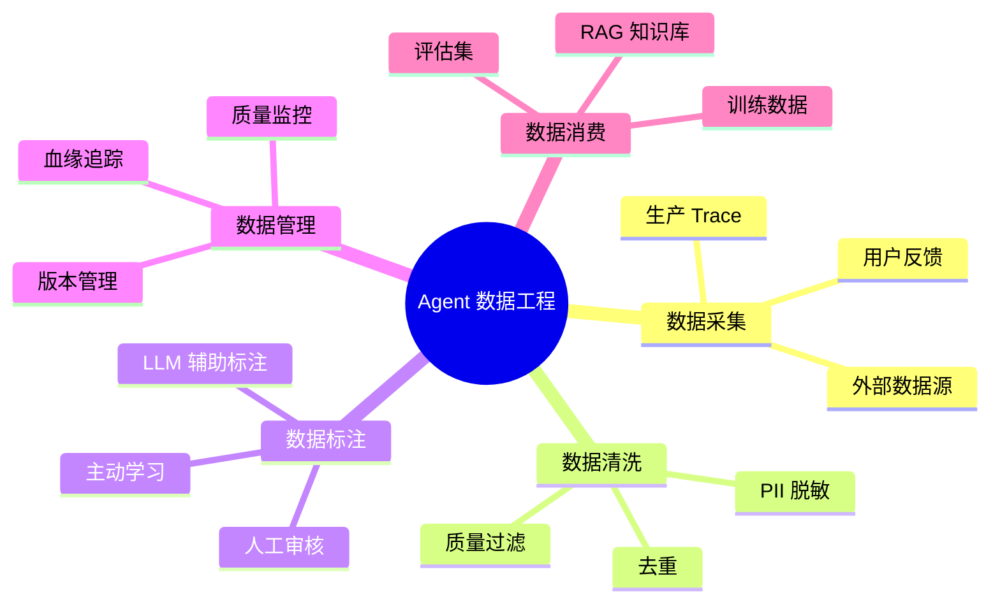
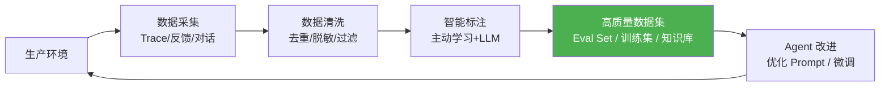

# 理论字典：Agent 数据工程

> **一句话**：数据决定 Agent 的上限——再强的模型也救不了垃圾数据。

---

## 数据工程全景

---

## Agent 数据飞轮

---

## 数据质量维度

| 维度 | 说明 | 检测方法 |
|------|------|---------|
| 准确性 | 数据是否正确 | 抽样人工校验 |
| 完整性 | 字段是否缺失 | 自动检查空值 |
| 一致性 | 多来源是否矛盾 | 跨源比对 |
| 时效性 | 数据是否最新 | 时间戳检查 |
| 唯一性 | 是否有重复 | 哈希去重 |
| 合规性 | 是否含敏感信息 | PII 扫描 |

---

## 关键概念

### Trace（执行轨迹）

Agent 每次执行产生的完整记录：用户输入 → LLM 思考 → 工具调用 → 最终输出 → 用户反馈。

### Golden Set（黄金评估集）

精心标注的高质量评估数据集，用于回归测试。每次 Agent 变更后都跑一次，确保质量不退化。

### 主动学习（Active Learning）

不是随机标注数据，而是让算法选择"最不确定"的样本交给人工标注——用最少的标注成本获得最大的质量提升。

### 数据血缘（Data Lineage）

记录数据的来源、变换过程和消费去向——改了数据源，知道下游谁会受影响。

→ 返回 [理论字典目录](../00-README.md)
