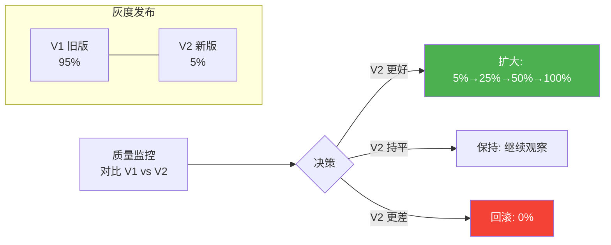

# 理论字典：Agent 灰度发布

> **一句话**：灰度发布 = "先给一小撮人用新版，没问题再逐步扩大"——降低发布风险的核心策略。

---

## 灰度发布核心概念

---

## 灰度 vs 影子 vs A/B

| 策略 | 新版影响用户 | 对比维度 | 适用场景 |
|------|------------|---------|---------|
| 影子模式 | ❌ 不影响 | 质量/成本 | 大版本变更 |
| 灰度发布 | ✅ 部分用户 | SLO/质量 | 常规发布 |
| A/B 测试 | ✅ 部分用户 | 统计显著性 | 优化验证 |

---

## 关键概念

### 一致性哈希分桶

用 sessionId/userId 做哈希，保证同一用户始终走同一版本——避免用户在 V1 和 V2 之间反复切换导致体验不一致。

### 灰度阶梯

5% → 25% → 50% → 100%，每步观察 1-2 天。不在一步直接跳到 100%——渐进式扩大风险。

### 自动回滚

灰度监控器持续对比 V1/V2 质量指标。V2 质量分显著低于 V1 → 自动回滚到 0%，不需要人工决策。

### 灰度维度

- 按比例（5%→25%→50%→100%）
- 按用户群（内部→VIP→全量）
- 按租户（租户A→租户B→全部）
- 按任务类型（简单→复杂）

→ 返回 [理论字典目录](../00-README.md)
