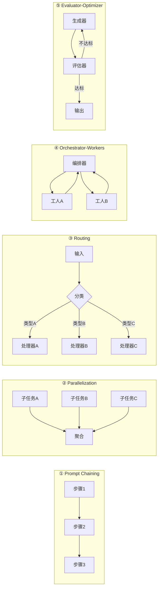
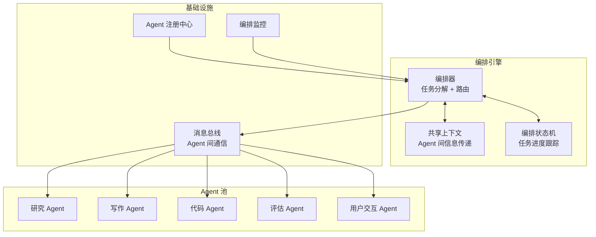

# 理论字典：Agent 编排（Agent Orchestration）

> 速查概念，不按顺序读，需要时查阅。

---

## 一句话定义

Agent 编排是**协调多个 Agent（或多个步骤）按特定模式协作完成复杂任务**的系统工程，核心决策是：用确定性 Workflow（DAG）还是用自主 Agent。

---

## 编排模式决策树

```mermaid
flowchart TD
    Start["任务需求"] --> Q1{"任务步骤<br/>是否固定？"}
    Q1 -->|"是，固定步骤"| Workflow["确定性 Workflow<br/>DAG 编排"]
    Q1 -->|"否，需要动态决策"| Q2{"是否需要<br/>多步推理？"}
    Q2 -->|"否"| Single["单次 LLM 调用"]
    Q2 -->|"是"| Q3{"单 Agent<br/>能完成？"}
    Q3 -->|"是"| Agent["自主 Agent<br/>ReAct 循环"}
    Q3 -->|"否"| Multi["多 Agent 编排"]

    Workflow --> Q4{"步骤间<br/>有数据依赖？"}
    Q4 -->|"串行"| Chain["Prompt Chaining"]
    Q4 -->|"可并行"| Parallel["Parallelization"]
    Q4 -->|"按条件分支"| Route["Routing"]

    Multi --> Q5{"Agent 间<br/>如何协作？"}
    Q5 -->|"有管理者"| Orch["Orchestrator-Workers"]
    Q5 -->|"需要迭代优化"| EvalOpt["Evaluator-Optimizer"]
    Q5 -->|"平等协作"| Peer["P2P 协作"]

    style Workflow fill:#e3f2fd
    style Agent fill:#fff3e0
    style Multi fill:#fce4ec
```

---

## Anthropic 五大 Workflow 模式



| 模式 | 适用场景 | 复杂度 | Agent自主性 |
|------|---------|--------|------------|
| Prompt Chaining | 固定步骤的管线 | ⭐ | 无 |
| Parallelization | 可分解的并行任务 | ⭐⭐ | 无 |
| Routing | 按类型分派处理 | ⭐⭐ | 无 |
| Orchestrator-Workers | 动态分解任务 | ⭐⭐⭐ | 部分 |
| Evaluator-Optimizer | 迭代优化质量 | ⭐⭐⭐ | 部分 |
| 自主 Agent | 需要动态决策 | ⭐⭐⭐⭐⭐ | 完全 |

---

## 多 Agent 编排架构



---

## 编排引擎选型

| 引擎类型 | 代表 | 适用场景 | 持久化 | 可视化 |
|---------|------|---------|--------|--------|
| **DAG 引擎** | Airflow / Temporal | 固定步骤 + 条件分支 | ✅ | ✅ |
| **状态机引擎** | AWS Step Functions | 状态驱动 + 人工审批 | ✅ | ✅ |
| **图编排引擎** | LangGraph / Spring StateMachine | 复杂依赖图 + 循环 | 部分 | 部分 |
| **自主编排** | 自研 ReAct Loop | 高度不确定任务 | 需自建 | 需自建 |
| **Workflow + Agent 混合** | Temporal + Spring AI | 推荐：确定性骨架 + Agent 填充 | ✅ | ✅ |

> **黄金法则**：能用 Workflow（DAG）解决的，绝不用自主 Agent。确定性优先。

---

## 核心概念

| 概念 | 定义 |
|------|------|
| **编排（Orchestration）** | 中央控制者协调多个组件的执行顺序和数据流转 |
| **编排（Choreography）** | 无中央控制者，各组件通过事件自行协调 |
| **共享上下文** | 多个Agent之间传递的中间结果和任务状态 |
| **任务委派** | 编排器将子任务分配给具体Agent执行 |
| **检查点（Checkpoint）** | 编排状态的持久化保存点，用于恢复 |
| **Saga** | 分布式事务的补偿模式，每个步骤都有对应补偿操作 |
| **HITL（Human-in-the-Loop）** | 关键决策点暂停等待人工审批 |

---

## 相关文档

- [阶段3-Agent工程化/02-五大Workflow模式](../阶段3-Agent工程化/02-五大Workflow模式.md)
- [阶段5-架构师/01-多Agent编排](../阶段5-架构师/01-多Agent编排.md)
- [阶段5-架构师/05-编排引擎选型](../阶段5-架构师/05-编排引擎选型.md)
- [阶段4-生产化/10-Saga补偿事务](../阶段4-生产化/10-Saga补偿事务.md)
- [理论字典/Agent范式](Agent范式.md)
