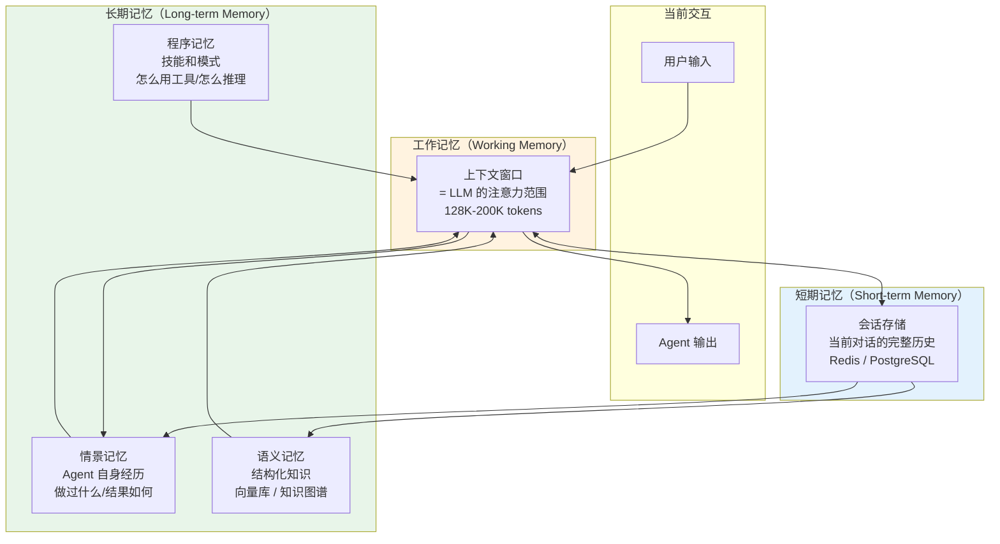
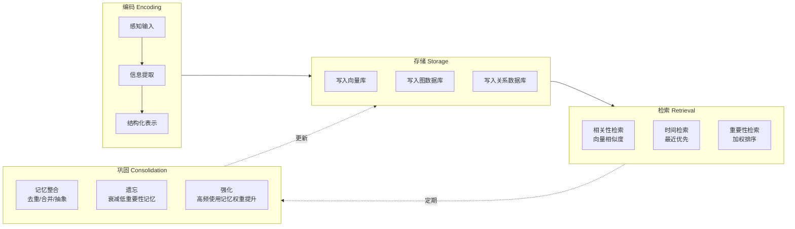

# 理论字典：Agent 记忆（Agent Memory）

> 速查概念，不按顺序读，需要时查阅。

---

## 一句话定义

Agent 记忆是让 AI Agent 在**时间维度上保持信息连续性**的机制——从短期的上下文窗口到长期的知识库，使 Agent 能积累经验、学习偏好、保持人格一致性。

---

## 记忆三层架构



---

## 人类记忆 vs Agent 记忆

| 记忆类型 | 人类 | Agent 对应 | 实现 |
|---------|------|-----------|------|
| 工作记忆 | 前额叶皮层，保持当前思考 | LLM 上下文窗口 | Context Window 管理 |
| 情景记忆 | 海马体，个人经历记忆 | 对话历史 + 执行记录 | 数据库存储 + 检索 |
| 语义记忆 | 大脑皮层，事实知识 | 知识库 / 向量库 | RAG |
| 程序记忆 | 基底神经节，技能记忆 | 工具使用模式 + 推理模板 | Few-shot + Fine-tuning |

---

## 记忆操作



---

## 核心概念

| 概念 | 定义 | 关键问题 |
|------|------|---------|
| **上下文窗口** | LLM 单次能"看到"的文本长度 | 超长怎么办？→ 压缩/裁剪/摘要 |
| **记忆检索** | 从大量记忆中找到相关的部分 | 怎么判断"相关"？→ 向量相似度 + 时间 + 重要性 |
| **记忆遗忘** | 主动丢弃不重要或过时的信息 | 什么时候遗忘？→ 时间衰减 + 低频使用 |
| **记忆整合** | 将碎片化记忆合并为结构化知识 | 怎么合并？→ 实体抽取 + 关系建模 + 去重 |
| **偏好记忆** | 记住用户的个性化偏好 | 怎么存储？→ 用户画像 + Key-Value 存储 |
| **跨会话记忆** | Agent 在不同会话间保持信息连续 | 怎么隔离？→ 租户/用户级别的记忆命名空间 |

---

## 记忆检索策略

```mermaid
flowchart TD
    Query["查询：用户当前问题"] -> Strategy{"检索策略"}
    
    Strategy --> Recency["时间最近<br/>最近N轮对话"]
    Strategy --> Relevance["语义相关<br/>Top-K向量检索"]
    Strategy --> Importance["重要性加权<br/>用户标记/Agent评分"]
    Strategy --> Hybrid["混合策略<br/>Recency × Relevance × Importance"]

    Recency --> Merge
    Relevance --> Merge["合并 + 去重"]
    Importance --> Merge
    Hybrid --> Merge

    Merge --> Budget{"上下文预算<br/>够不够?"}
    Budget -->|"够"| Inject["注入工作记忆"]
    Budget -->|"不够"| Compress["压缩/摘要后注入"]
```

---

## 常见问题

| 问题 | 答案 |
|------|------|
| "ChatMemory 和长期记忆有什么区别？" | ChatMemory 是会话级记忆（关了浏览器就没了），长期记忆是持久化的 |
| "需要向量库做记忆吗？" | 对话历史用数据库即可；跨会话/大规模知识检索才需要向量库 |
| "Agent 记忆应该存什么？" | 不存原始对话！存：用户偏好、关键决策、执行结果摘要、学习到的模式 |
| "GDPR 要求删除用户数据怎么办？" | 记忆系统需要支持用户级别的数据删除（被遗忘权） |

---

## 相关文档

- [阶段1-入门/02-多轮对话与记忆](../阶段1-入门/02-多轮对话与记忆.md)
- [阶段4-生产化/01-上下文工程](../阶段4-生产化/01-上下文工程.md)
- [阶段4-生产化/26-历史持久化与会话广播](../阶段4-生产化/26-历史持久化与会话广播.md)
- [阶段4-生产化/40-Agent记忆架构深度设计](../阶段4-生产化/40-Agent记忆架构深度设计.md)
- [附录/Redis速成](../附录/Redis速成.md)
- [理论字典/RAG原理](RAG原理.md)
