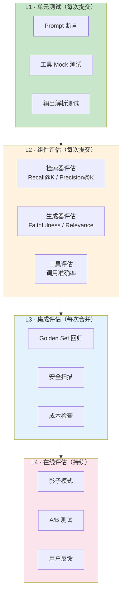
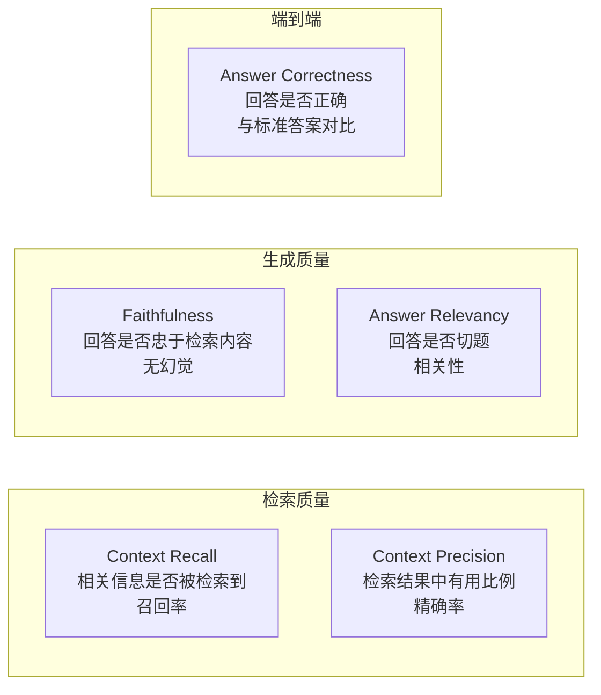
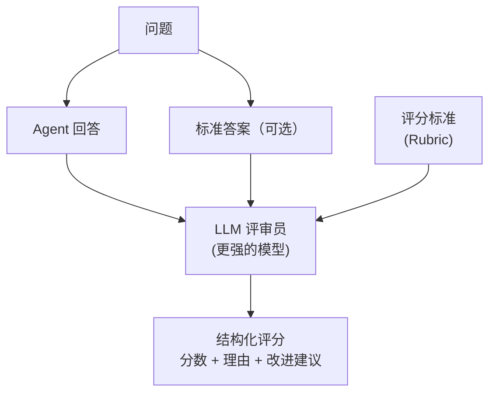
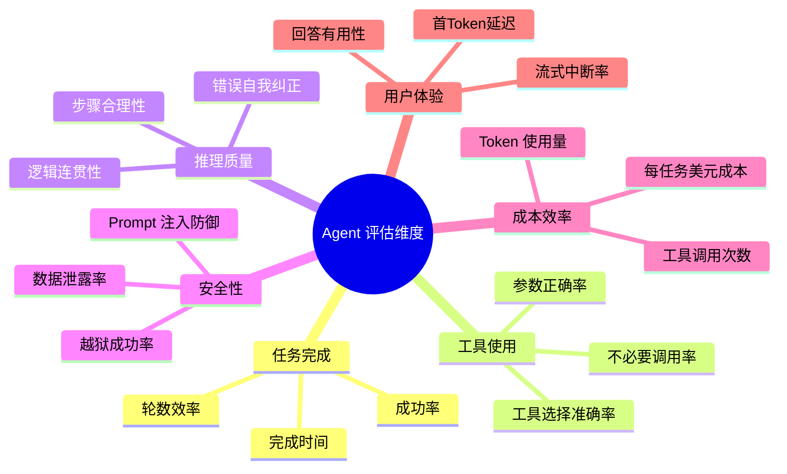

# 理论字典：Agent 评估（Agent Evaluation）

> 速查概念，不按顺序读，需要时查阅。

---

## 一句话定义

Agent 评估是**用量化指标系统性地衡量 AI Agent 质量**的工程实践——没有评估集，改 Prompt、换模型、调参数全凭感觉，等于在黑暗中摸索。

---

## 评估金字塔

---

## RAG 评估指标（RAGAS 框架）

| 指标 | 计算方式 | 理想值 | 评估什么 |
|------|---------|--------|---------|
| Context Recall | 相关上下文被检索到的比例 | > 0.9 | RAG 检索能力 |
| Context Precision | 检索上下文中有用信息的比例 | > 0.8 | RAG 精确度 |
| Faithfulness | 回答中可被检索内容支持的比例 | > 0.85 | 幻觉程度 |
| Answer Relevancy | 回答与问题的语义相关度 | > 0.8 | 切题程度 |
| Answer Correctness | 回答与标准答案的一致度 | > 0.75 | 整体准确性 |

---

## LLM-as-Judge

### LLM-as-Judge 的注意事项

| 问题 | 解决方案 |
|------|---------|
| **评审者偏见** | 用比被评估模型更强的模型做评审 |
| **位置偏见** | 随机打乱候选答案顺序 |
| **分数膨胀** | 给明确的评分标准（Rubric），不要让评审者自由打分 |
| **自评偏见** | 不要让同一模型自评（GPT-4 评 GPT-4 会偏高） |

---

## Agent 专属评估维度

---

## 评估集构建方法

| 方法 | 说明 | 成本 | 质量 |
|------|------|------|------|
| **专家手写** | 领域专家编写 QA 对 | 高 | 最高 |
| **生产 Trace 采样** | 从真实对话中选取 | 低 | 高 |
| **LLM 生成** | 用 LLM 批量生成 QA 对 | 低 | 中 |
| **对抗性生成** | 用红队工具生成边界 case | 中 | 高（边界覆盖） |
| **用户反馈驱动** | 从差评对话中提取 | 低 | 高 |

> **推荐**：混合方法。30 条专家手写做基线 + 生产 Trace 持续补充 + LLM 批量扩充覆盖面。

---

## 常见误区

| 误区 | 纠正 |
|------|------|
| "评估集一次建好就行" | ❌ 评估集是活的。生产 Trace → 标注 → 补入 → 持续维护 |
| "评估集越大越好" | ❌ 30 条高质量 > 1000 条低质量。宁缺毋滥 |
| "改了 Prompt 就看输出像不像" | ❌ 人眼评估有偏差。必须跑完整评估集拿量化指标 |
| "LLM-as-Judge 万能" | ❌ LLM 评审有偏见。重要场景需要人工抽查校准 |
| "评估只需要 Faithfulness" | ❌ 需要 5+ 个维度。单维度可能误导优化方向 |

---

## 相关文档

- [阶段2-核心能力/04-评估方法论](../阶段2-核心能力/04-评估方法论.md)
- [阶段4-生产化/05-测试工程化](../阶段4-生产化/05-测试工程化.md)
- [阶段4-生产化/17-Eval驱动开发](../阶段4-生产化/17-Eval驱动开发.md)
- [阶段4-生产化/20-流量回放与影子模式](../阶段4-生产化/20-流量回放与影子模式.md)
- [阶段4-生产化/39-Agent反馈闭环与用户体验](../阶段4-生产化/39-Agent反馈闭环与用户体验.md)
- [项目实践/01-Eval质量保障平台](../项目实践/01-企业项目-Eval质量保障平台/00-总览.md)
