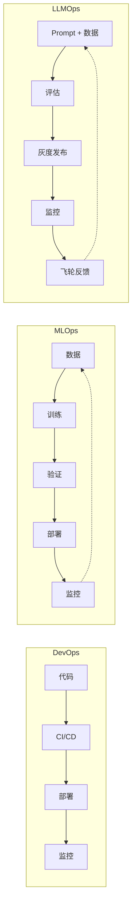
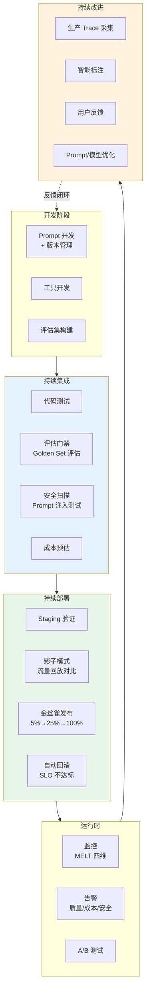
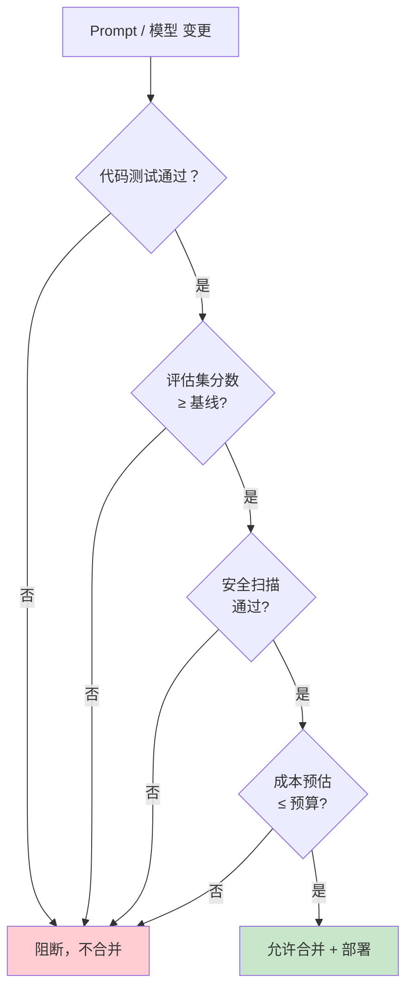
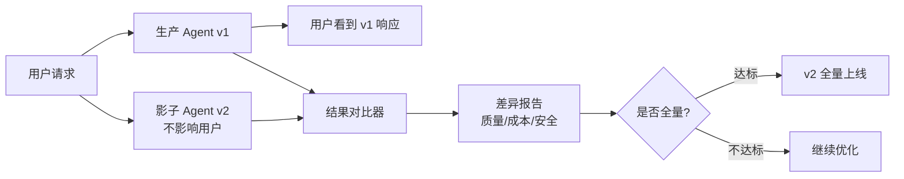
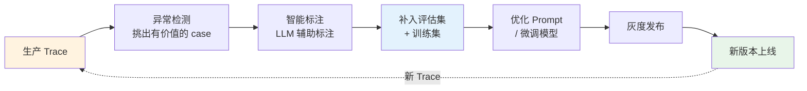

# 理论字典：LLMOps（大语言模型运维）

> 速查概念，不按顺序读，需要时查阅。

---

## 一句话定义

LLMOps 是将 **DevOps / MLOps** 实践适配到 LLM 应用全生命周期的工程方法论——覆盖数据管理、模型管理、Prompt 管理、评估、部署、监控、成本管理的持续闭环。

---

## LLMOps vs MLOps vs DevOps

| 维度 | DevOps | MLOps | LLMOps |
|------|--------|-------|--------|
| 核心制品 | 代码 | 模型 | Prompt + 模型 + 数据 |
| 质量标准 | 单元测试通过 | 准确率达标 | 评估集分数 + 安全 + 成本 |
| 变更频率 | 日级 | 周/月级 | 日级（Prompt） / 月级（模型） |
| 回滚单位 | 代码版本 | 模型版本 | Prompt/模型/配置 版本 |
| 特有挑战 | - | 数据漂移 | 幻觉 + 安全 + 非确定性 |

---

## LLMOps 全景

---

## 核心概念

### 1. 评估门禁（Eval Gate）

### 2. 影子模式（Shadow Mode）

### 3. 数据飞轮（Data Flywheel）

---

## Prompt 版本管理

| 维度 | 说明 |
|------|------|
| **版本化** | 每次 Prompt 变更记录版本号 + diff + 作者 + 原因 |
| **环境隔离** | Dev / Staging / Prod 独立 Prompt 版本 |
| **灰度发布** | 按百分比逐步切换到新 Prompt 版本 |
| **A/B 测试** | 同时运行两个版本，用评估集对比 |
| **回滚** | 一键回滚到任意历史版本 |
| **审批** | Prompt 变更需要 code review + 评估通过 |

---

## 监控指标体系（MELT）

| 类别 | 指标 | 说明 |
|------|------|------|
| **Metrics** | QPS / 延迟 / 成本 / Token消耗 | 系统健康度 |
| **Events** | 工具调用 / Agent决策 / 安全事件 | 关键事件流 |
| **Logs** | 完整请求/响应 / 错误日志 | 排障溯源 |
| **Traces** | 全链路trace / span 层级 | 性能瓶颈定位 |

> 额外维度：**Quality** — 用 LLM-as-Judge 持续评估输出质量

---

## 工具链参考

| 环节 | 工具 | 说明 |
|------|------|------|
| Prompt 管理 | Langfuse / Promptfoo | Prompt 版本化 + 评估 |
| 评估 | RAGAS / DeepEval / Promptfoo | 自动化质量评估 |
| 追踪 | Langfuse / LangSmith / OpenTelemetry | Trace 可视化 |
| 部署 | Kubernetes + Argo CD | 灰度发布 + 回滚 |
| 监控 | Grafana + Prometheus + Langfuse | 指标看板 |
| 标注 | Argilla / Label Studio | 人工标注平台 |
| 安全 | Garak / Promptfoo Red Team | 对抗性测试 |

---

## 常见误区

| 误区 | 纠正 |
|------|------|
| "LLMOps = MLOps" | ❌ LLMOps 不训练模型（大多数情况），核心是 Prompt + 评估 + 飞轮 |
| "评估只在上线前做" | ❌ 评估是持续过程。生产 Trace → 评估集 → 持续回归 |
| "Prompt 变更不是代码变更" | ❌ Prompt 变更应该走和代码变更一样的 CI/CD + review 流程 |
| "先上线再说" | ❌ 没有评估门禁的 Agent 上线 = 裸奔。至少要有 Golden Set 基线 |

---

## 相关文档

- [阶段4-生产化/06-LLMOps与CICD](../阶段4-生产化/06-LLMOps与CICD.md)
- [阶段4-生产化/13-数据飞轮与持续改进](../阶段4-生产化/13-数据飞轮与持续改进.md)
- [阶段4-生产化/17-Eval驱动开发](../阶段4-生产化/17-Eval驱动开发.md)
- [阶段4-生产化/36-Agent SLO管理](../阶段4-生产化/36-AgentSLO管理.md)
- [理论字典/可靠性工程](可靠性工程.md)
- [理论字典/成本工程](成本工程.md)
