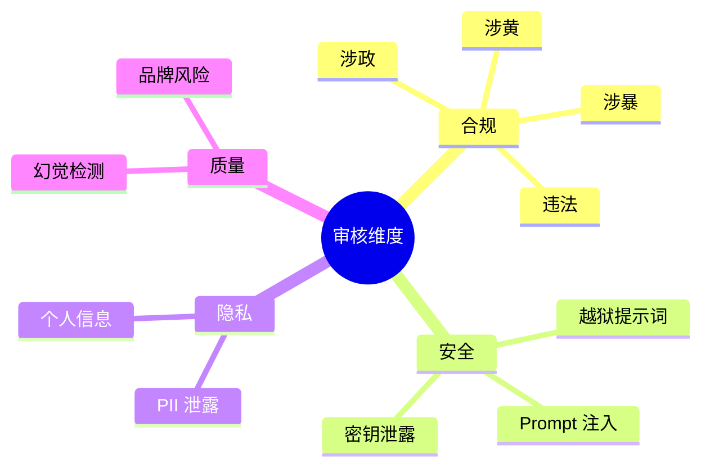

# 理论字典 · 内容安全审核

> 速查概念，不展开实践细节。

---

## 核心概念

**内容安全审核**（Content Moderation）是对用户输入和 AI 输出进行合规性检查的过程，确保不产生违规内容。

## 审核维度



## 审核方式

| 方式 | 速度 | 准确率 | 说明 |
|------|------|--------|------|
| 正则规则 | < 1ms | 低 | 格式固定的模式（手机号、API Key） |
| 关键词列表 | < 1ms | 低 | 敏感词匹配 |
| 分类模型 | ~50ms | 中 | 预训练分类器 |
| LLM 审核 | 2-3s | 高 | 复杂语义判断 |

## 处理策略

- **BLOCK**：直接拦截（严重违规）
- **MASK**：脱敏后放行（PII）
- **FLAG**：标记放行（可疑内容，转人工）
- **RETRY**：重新生成（输出违规）
- **HUMAN**：转人工审核

## 混合策略

```
正则规则（快，拦截格式化敏感信息）
    ↓ 通过
关键词过滤（快，拦截显式违规）
    ↓ 通过
LLM 审核（慢，拦截隐含违规）
    ↓ 通过
放行
```

## 常见 PII 类型

| 类型 | 正则模式 |
|------|---------|
| 手机号（中国） | `1[3-9]\d{9}` |
| 身份证号 | `\d{17}[\dXx]` |
| 邮箱 | `[a-zA-Z0-9._%+-]+@[a-zA-Z0-9.-]+\.[a-zA-Z]{2,}` |
| API Key | `sk-[A-Za-z0-9]{48}` |
| AWS Key | `AKIA[0-9A-Z]{16}` |
| 私钥 | `-----BEGIN .*PRIVATE KEY-----` |
