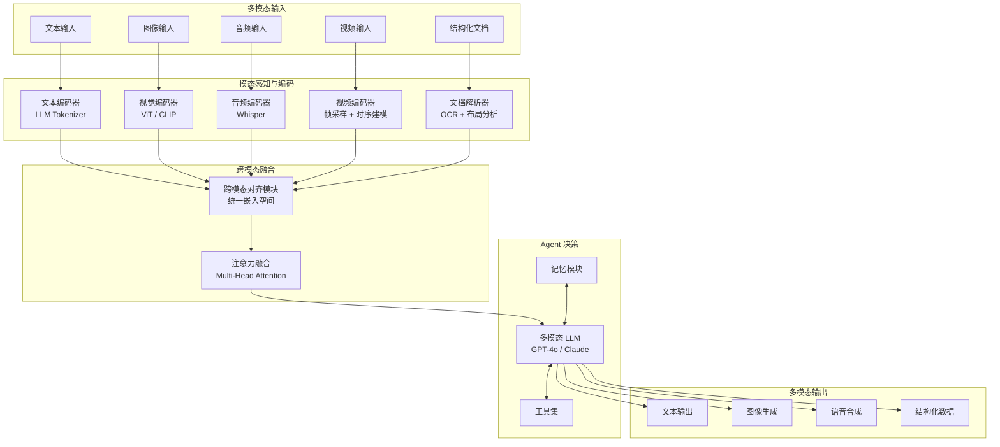
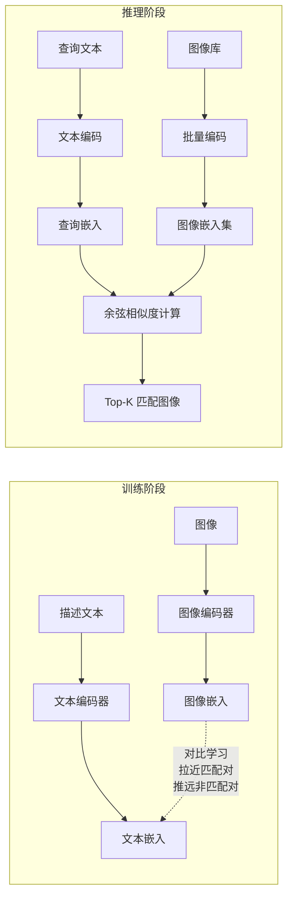
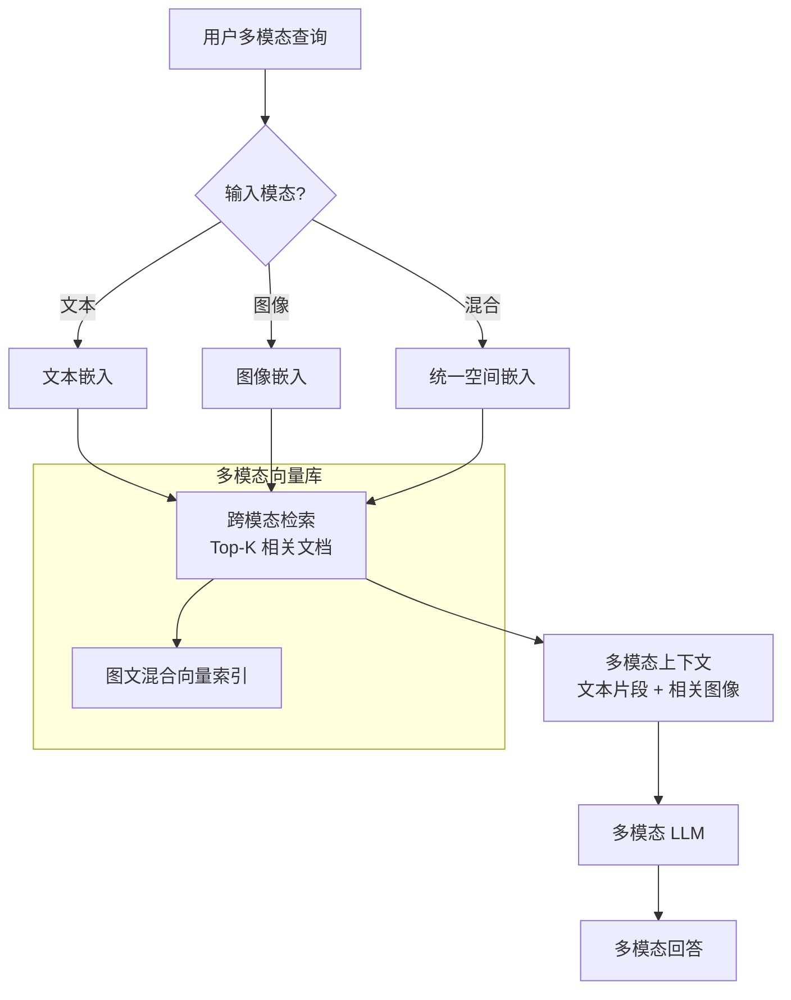

# 理论字典：多模态 Agent（Multimodal Agent）

> 速查概念，不按顺序读，需要时查阅。

---

## 一句话定义

多模态 Agent 是能**同时理解和生成文字、图像、音频、视频、代码、结构化数据**等多种模态信息的自主 AI 系统。

---

## 核心概念

| 概念 | 定义 | 关键点 |
|------|------|--------|
| **模态（Modality）** | 信息的表现形式（文本/图像/音频/视频/3D…） | 每种模态有独特的编码方式和语义空间 |
| **跨模态对齐** | 将不同模态映射到统一的语义空间 | CLIP 是经典方案：图文共用嵌入空间 |
| **模态融合** | 将多种模态的信息组合成统一表征 | 早期融合 vs 晚期融合 vs 注意力融合 |
| **多模态推理** | 跨模态的逻辑推理能力 | 如：看图→理解内容→文字描述→生成答案 |
| **模态路由** | 根据输入模态选择处理管线 | 不是所有模态都需要多模态大模型处理 |

---

## 多模态 Agent 架构

---

## 多模态模型对比（2026）

| 模型 | 模态支持 | 上下文窗口 | 强项 | 弱项 |
|------|---------|-----------|------|------|
| **GPT-4o** | 文本/图像/音频 | 128K | 全模态实时交互 | 成本较高 |
| **Claude 3.5** | 文本/图像 | 200K | 超长上下文 + 文档理解 | 不支持原生音频 |
| **Gemini 1.5** | 文本/图像/音频/视频 | 1M+ | 超长视频理解 | 输出质量波动 |
| **Qwen-VL** | 文本/图像 | 32K | 中文场景 + 开源 | 推理能力有限 |
| **LLaVA** | 文本/图像 | 8K | 开源可私有部署 | 上下文短 |

---

## 关键技术

### 1. 视觉语言对齐（CLIP）

### 2. 多模态 RAG

---

## 应用场景矩阵

| 场景 | 核心模态 | 业务价值 | 成熟度 |
|------|---------|---------|--------|
| **文档智能问答** | 文本 + 图像 | 合同/报表/发票自动解析 | ✅ 生产可用 |
| **质检 Agent** | 图像 + 传感器 | 工业缺陷检测 + 自动报告 | ✅ 生产可用 |
| **医疗影像 Agent** | 图像 + 文本 | CT/MRI 辅助诊断 | 🔬 需要专业验证 |
| **语音助手** | 音频 + 文本 | 全语音交互的智能客服 | ✅ 生产可用 |
| **视频审核 Agent** | 视频 + 音频 + 文本 | 内容安全自动审核 | ✅ 生产可用 |
| **设计协作 Agent** | 图像 + 文本 | UI 设计稿→代码 | 🔬 快速演进 |
| **具身智能** | 视频 + 传感器 + 文本 | 机器人自主导航和操作 | 🧪 研究阶段 |

---

## 多模态 vs 纯文本的成本差异

| 维度 | 纯文本 | 多模态 | 倍数 |
|------|--------|--------|------|
| Token 消耗 | 1K tokens/请求 | 5-50K tokens/请求（图像=85tokens/张缩略图） | 5-50x |
| 延迟 | 500ms-2s | 2-10s | 4-5x |
| 存储 | KB 级 | MB-TB 级 | 1000x |
| 模型选择 | 丰富 | 少数模型支持 | - |

> **实践建议**：不是所有场景都需要多模态。优先用纯文本 + 工具调用（如 OCR 工具）解决，当效果不足时再升级到原生多模态。

---

## 常见误区

| 误区 | 纠正 |
|------|------|
| "多模态一定比纯文本好" | ❌ 多模态成本高10-50倍。简单场景用工具链（OCR→文本LLM）更经济 |
| "图像=文本的附属" | ❌ 图像包含的信息密度远超文字。一个图表的1000个字描述不如直接看图 |
| "多模态RAG=文本RAG+图像" | ❌ 需要跨模态对齐的嵌入模型，不能用纯文本嵌入模型 |
| "语音Agent就是ASR+TTS" | ❌ 全双工语音对话需要处理打断、情感、韵律、实时响应等复杂问题 |

---

## 相关文档

- [阶段6-前沿/07-多模态Agent前沿](../阶段6-前沿/07-多模态Agent前沿.md)
- [项目实践/12-多模态Agent平台](../项目实践/12-企业项目-多模态Agent平台/00-总览.md)
- [理论字典/RAG原理](RAG原理.md)
- [理论字典/Agent范式](Agent范式.md)
