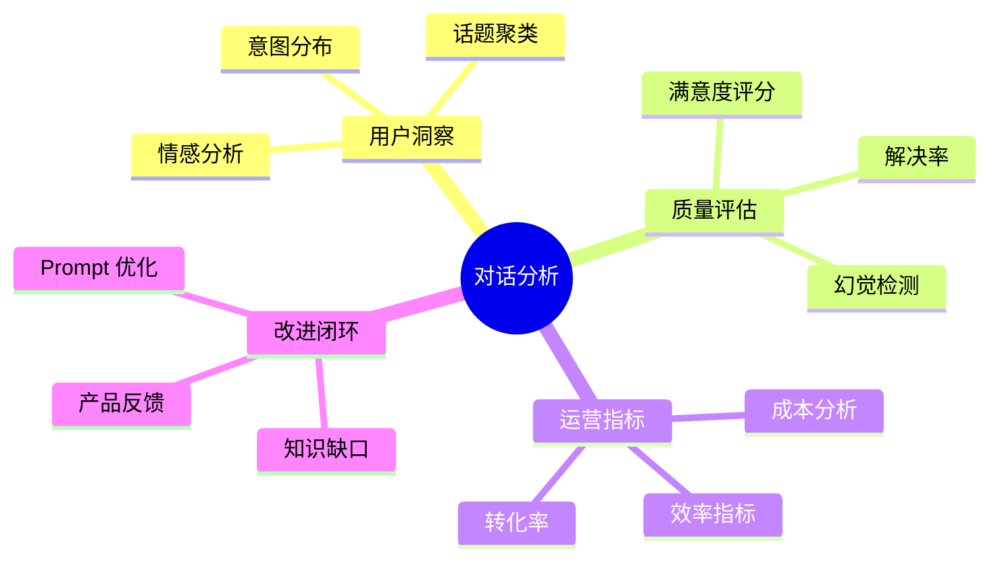

# 理论字典 · 对话分析

> 速查概念，不展开实践细节。

---

## 核心概念

**对话分析**（Conversation Analytics）从 Agent 对话日志中挖掘用户意图、满意度、趋势等商业洞察。

## 分析维度

## 关键指标

| 指标 | 计算方式 | 目标 |
|------|---------|------|
| 自动解决率 | resolved / total | > 60% |
| 满意度 | 好评 / 总评 | > 85% |
| 转人工率 | escalated / total | < 20% |
| 平均轮数 | sum(turns) / total | < 8 |
| 单次成本 | sum(cost) / total | < $0.05 |
| Faithfulness | 评估集均值 | > 0.85 |

## 意图分类方法

- **规则匹配**：关键词 → 意图（快但不灵活）
- **嵌入分类**：向量相似度 → 意图
- **LLM 分类**：LLM 直接判断（准但慢）
- **混合**：规则快筛 → LLM 兜底

## 满意度评估三信号

1. **显式反馈**：用户评分/点赞（最准但覆盖率低 < 5%）
2. **LLM 隐式评估**：分析对话内容推断满意度
3. **行为信号**：转人工/放弃/重复提问/轮数过多
