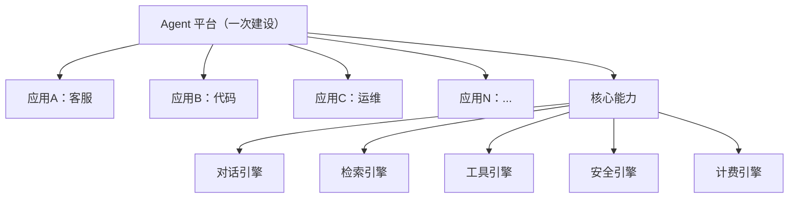

# 理论字典 · 平台工程

> 速查概念，不展开实践细节。

---

## 核心概念

**平台工程**是为交付团队提供自服务的内部开发者平台（IDP），让团队专注于业务逻辑而非基础设施。

## 平台 vs 应用

## 核心原则

1. **自服务**：应用团队不需要平台团队介入就能上线
2. **声明式**：用 DSL/YAML 定义 Agent，平台负责部署运维
3. **多租户**：不同团队共享平台但资源隔离
4. **能力沉淀**：通用能力一次开发多处复用

## 成熟度模型

| 级别 | 特征 | 示例 |
|------|------|------|
| L1 | 手工部署 | 手动写配置、手动部署 |
| L2 | 脚本化 | CI/CD 自动化 |
| L3 | 平台化 | 自服务门户 + DSL |
| L4 | 生态化 | 插件市场 + 开放 API |
| L5 | 智能化 | 自动优化 + 自愈 |

## BFF（Backend for Frontend）

BFF 是平台工程的前端适配层，为不同客户端（Web/App/小程序）提供定制化 API。

- **请求聚合**：1 个 BFF 请求 = N 个后端请求合并
- **多端适配**：同一后端数据，不同端不同格式
- **协议转换**：SSE ↔ WebSocket ↔ HTTP
