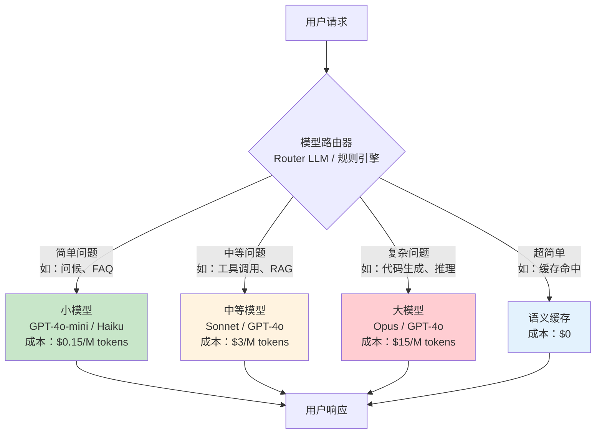
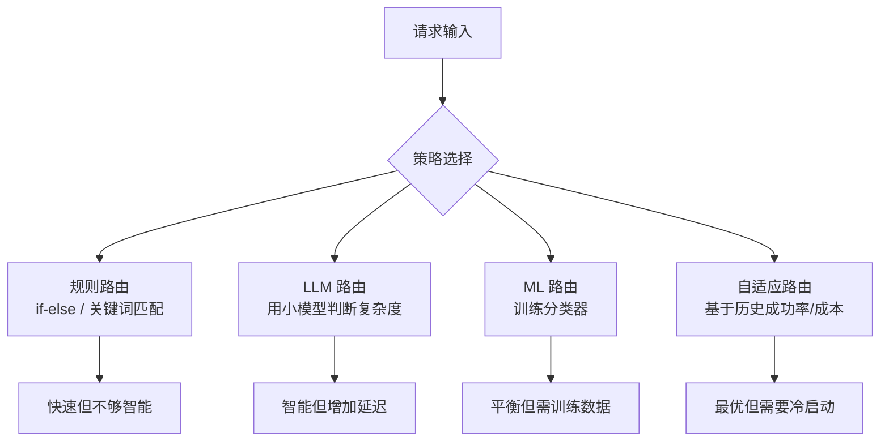
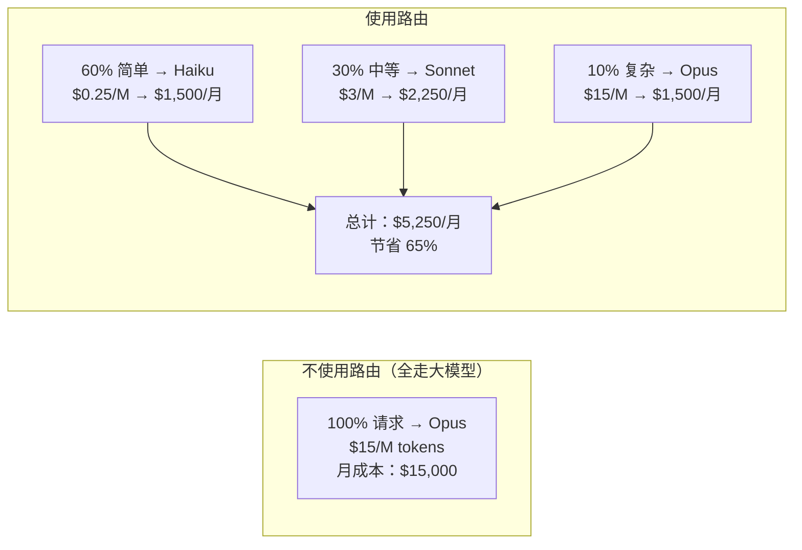
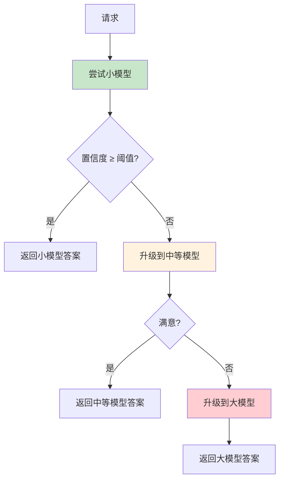

# 理论字典：模型路由（Model Routing）

> 速查概念，不按顺序读，需要时查阅。

---

## 一句话定义

模型路由是**根据请求的复杂度/重要性/成本，动态选择最合适的 LLM 处理**的技术——简单问题走小模型（便宜快），复杂问题走大模型（贵但强），在质量和成本之间找到最优平衡。

---

## 模型路由架构



---

## 路由策略



| 策略 | 延迟开销 | 准确度 | 成本 | 适用场景 |
|------|---------|--------|------|---------|
| 规则路由 | ~0ms | 中 | $0 | 简单分类（FAQ vs 复杂） |
| LLM 路由 | 100-300ms | 高 | ~$0.001/次 | 大多数场景（推荐） |
| ML 分类器 | <10ms | 中高 | $0（推理） | 高流量场景 |
| 自适应 | <10ms | 最高 | $0 | 有足够历史数据后 |

---

## Java 实现（Spring AI）

```java
@Component
public class ModelRouter {

    private final ChatClient fastClient;   // 小模型
    private final ChatClient strongClient; // 大模型

    // 用小模型做路由判断
    public String route(String userInput) {
        String routingPrompt = """
            判断以下问题的复杂度，只回答 SIMPLE 或 COMPLEX：
            问题：%s
            """.formatted(userInput);

        String complexity = fastClient.prompt(routingPrompt).call().content();

        if ("SIMPLE".equals(complexity.trim())) {
            return fastClient.prompt(userInput).call().content();   // 走小模型
        } else {
            return strongClient.prompt(userInput).call().content(); // 走大模型
        }
    }
}
```

---

## 路由决策的关键因素

| 因素 | 说明 | 示例 |
|------|------|------|
| **任务复杂度** | 推理深度需求 | "你好"→简单；"写排序算法"→复杂 |
| **上下文长度** | 需要处理多少 token | 短问题→小模型；长文档→大模型 |
| **延迟要求** | 用户容忍度 | 实时聊天→小模型；批量处理→大模型 |
| **成本预算** | 剩余预算 | 预算不足时降级到小模型 |
| **工具调用** | 是否需要工具 | 简单问答→小模型；工具编排→大模型 |
| **安全等级** | 高风险操作 | 低风险→小模型；高风险→大模型+审批 |

---

## 成本节省效果



---

## 级联路由（Cascade Routing）

当路由器不确定时，先尝试小模型，不满意再升级：



> **优势**：大部分简单问题在最便宜的模型就解决了，只有少数问题才需要升级。
> **劣势**：升级路径增加了延迟（两次调用）。适合非实时场景。

---

## 常见问题

| 问题 | 答案 |
|------|------|
| "路由器本身用什么模型？" | 用最小最便宜的模型做分类（Haiku/Mini 级别） |
| "路由准确率怎么提升？" | 收集路由错误案例→标注→用 Few-shot 示例提升 |
| "路由会不会增加延迟？" | 规则路由 ~0ms；LLM 路由 +100-300ms。但对简单问题总延迟更低 |
| "怎么做 A/B 测试？" | 同时跑路由和全大模型，对比评估集分数和成本 |

---

## 相关文档

- [阶段4-生产化/04-成本工程](../阶段4-生产化/04-成本工程.md)
- [阶段4-生产化/11-多模型故障切换](../阶段4-生产化/11-多模型故障切换.md)
- [阶段4-生产化/28-LLM成本工程深入](../阶段4-生产化/28-LLM成本工程深入.md)
- [阶段4-生产化/35-Agent推理加速与模型服务](../阶段4-生产化/35-Agent推理加速与模型服务.md)
- [理论字典/成本工程](成本工程.md)
- [理论字典/框架选型](框架选型.md)
