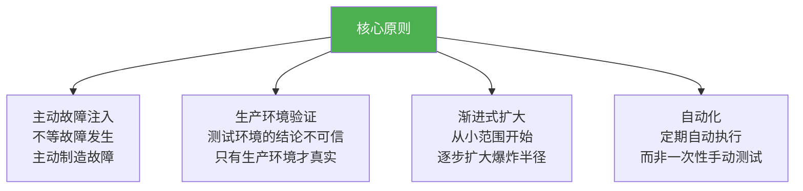
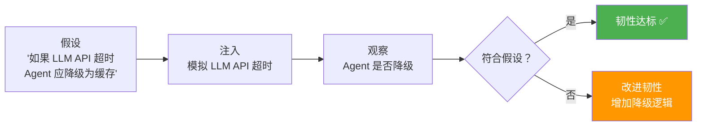

# 理论字典：混沌工程

> **一句话**：混沌工程 = "主动搞破坏，看系统死不死"——与其等用户发现故障，不如自己先制造故障。

---

## 混沌工程核心思想

---

## 混沌实验设计

---

## 传统混沌 vs Agent 混沌

| 维度 | 传统混沌工程 | Agent 混沌工程 |
|------|-----------|--------------|
| 故障类型 | 网络/磁盘/容器 | + LLM/工具/记忆 |
| 检测方式 | 5xx 率/延迟 | + 质量分/Token 消耗 |
| 故障表现 | 崩溃/超时 | + 隐性退化/幻觉 |
| 修复方式 | 重启/切换 | + 降级/回滚 |
| 独特挑战 | - | 非确定性导致难以复现 |

---

## 关键概念

### 稳态假设（Steady State Hypothesis）

实验前定义"系统正常状态"的指标（如 P95 < 2s，质量分 > 0.8），注入故障后验证是否维持稳态。

### 爆炸半径（Blast Radius）

故障影响的范围。从小爆炸半径开始（单个 Pod），逐步扩大（整个集群）。

### Game Day

团队集中进行的大规模混沌演练日——模拟最严重的故障组合，考验团队的应急响应能力。

### 韧性评分

根据可用性、降级质量、恢复速度、检测速度综合评估系统的韧性等级（A-F）。

→ 返回 [理论字典目录](../00-README.md)
