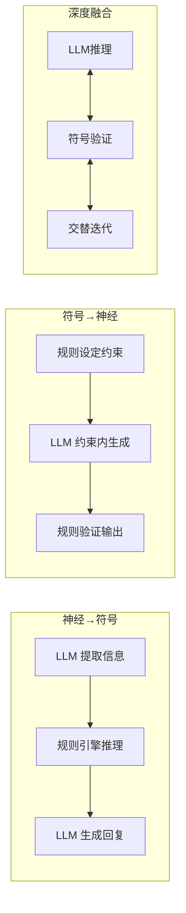

# 理论字典 · 神经符号 AI

> 速查概念，不展开实践细节。

---

## 核心概念

**神经符号 AI**（Neuro-Symbolic AI）将神经网络（深度学习）的模糊感知能力与符号系统（逻辑/规则）的精确推理能力结合。

## 神经 vs 符号

| 特征 | 神经网络 | 符号系统 |
|------|---------|---------|
| 推理方式 | 概率/模糊 | 确定性/逻辑 |
| 学习方式 | 从数据学习 | 人工编码规则 |
| 可解释性 | 黑盒 | 白盒 |
| 泛化能力 | 强 | 弱 |
| 精确计算 | 差 | 完美 |
| 自然语言 | 强 | 弱 |

## 三种融合范式

## 典型场景

- **金融合规**：LLM 理解法规 + 规则引擎做精确校验
- **医疗辅助**：LLM 解析病历 + 知识图谱做禁忌检查
- **工程计算**：LLM 理解需求 + 规则引擎做精确运算
- **法律推理**：LLM 理解案情 + 逻辑引擎适用法条
