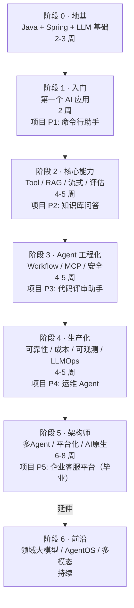

# 从零到 Agent 架构师 · 总蓝图

> **设计原则**：推倒重来。不受任何现有文档束缚，从"一个不懂 Java 的普通人"出发，设计一条完整的、可执行的、知识×实践×项目三位一体的进阶路线。
>
> **设计日期**：2026-08-09
> **设计依据**：[Agent 架构师行业调研报告 2026-Q3](../调研/00-Agent架构师行业调研-2026.md)

---

## 0. 这套文档解决什么问题

市面上 AI 教程的三大顽疾：

| 顽疾 | 表现 | 本方案怎么破 |
|------|------|------------|
| **碎片化** | 今天学 Prompt，明天学 RAG，知识点不串联 | 6 大阶段 + 6 个递进项目，每个项目复用前面所有能力 |
| **只讲不做** | 满屏概念和架构图，没有可运行的代码 | 每个知识点配一段你能跑起来的代码，每个项目有完整骨架 |
| **脱离工业** | 停留在 Demo，不讲可靠性/成本/安全/合规 | 从阶段 4 起每个项目都要过"生产化检查清单" |

**一句话定位**：读完这套文档，你能独立设计并交付一个企业级 AI Agent 系统——从需求建模到上线运维，经得起真实流量和合规审计。

---

## 1. 读者画像与终点目标

### 起点假设

```
你会：基本的编程逻辑（if/else/循环/函数）
你不会：Java 语法 / Spring / AI 任何概念 / 分布式系统
```

> 如果你已有 Java 后端经验，可以跳过阶段 0，直接从阶段 1 开始。

### 终点画像

```
你能做到：
✅ 独立完成一个企业级 Agent 系统的架构设计
✅ 在 Workflow / Agent / 多Agent 之间做出正确的选型决策
✅ 实现完整的 RAG 管道，并用评估集量化质量
✅ 设计可靠性方案（幂等/重试/补偿/熔断/持久化执行）
✅ 做成本工程（Prompt Cache / 语义缓存 / 模型路由 / 上下文预算）
✅ 接入 MCP 协议生态，设计企业内部 MCP Hub
✅ 搭建 LLMOps 全流程（评估闭环 / 可观测 / CI-CD / 数据飞轮）
✅ 应对合规审计（审计日志 / 数据隔离 / 人在回路）
```

---

## 2. 六大阶段 + 六个递进项目

### 全景路线图



### 项目阶梯

| 阶段 | 项目 | 难度 | 你会建成什么 | 复用前面 |
|------|------|------|-----------|---------|
| 1 | **P1 命令行助手** | ⭐ | 一个能多轮对话、能调工具的 CLI | - |
| 2 | **P2 知识库问答** | ⭐⭐ | 上传 PDF → 自动问答 + 质量评估 | P1 的对话能力 |
| 3 | **P3 代码评审助手** | ⭐⭐⭐ | 提交代码 → 多维度自动评审（5大 Workflow 模式） | P2 的 RAG + 评估 |
| 4 | **P4 智能运维 Agent** | ⭐⭐⭐⭐ | 自然语言查 K8s + 流式 + 熔断 + 可观测 | P3 的 Workflow + 工具体系 |
| 5 | **P5 企业客服平台** | ⭐⭐⭐⭐⭐ | 多租户 + 全链路审计 + 多Agent + 生产级 | P3+P4 的全部能力 |
| - | **P6（延伸）多Agent研究助手** | ⭐⭐⭐⭐⭐ | 开放式研究 + 编排引擎 + 断点续跑 | P5 的平台 |

**演进逻辑**：P1 → P2 → P3 → P4 → P5 是一条**能力累积链**。P5 的客服平台里，P3 的代码评审变成一个 Tool，P4 的运维监控变成一个模块，P2 的知识库变成 RAG 后端。每个项目都不是孤立的练习，而是最终毕业项目的一块拼图。

---

## 3. 每个阶段的知识×实践×产出

### 阶段 0：地基（2-3 周）

**给完全不懂 Java 的人**。如果你已有 Java + Spring 经验，直接跳到阶段 1。

| 知识块 | 实践 | 产出 |
|--------|------|------|
| Java 核心语法（类/接口/泛型/Lambda/Stream） | 写 10 个小练习 | 能读懂 Java 代码 |
| Maven + Spring Boot 基础 | 搭一个 Hello World REST API | 一个能跑的 Spring Boot 项目 |
| LLM 是什么（token/context window/temperature） | 用 curl 调通一次 LLM API | 第一次拿到 LLM 回复 |

**验收**：能独立写一个 `/hello?name=xxx` 的 Spring Boot 接口；能用 curl 调通 LLM 并拿到回复。

---

### 阶段 1：第一个 AI 应用（2 周）

**心智模型建立期**：把 LLM 当成一个"有概率出错的远程 RPC"，用 Java 调用它。

| 知识块 | 实践 | 产出 |
|--------|------|------|
| ChatClient：第一次用 Java 调 LLM | 写一个单轮问答程序 | 能用 Java 代码拿到 LLM 回复 |
| 多轮对话与记忆（ChatMemory） | 给程序加上对话历史 | 多轮对话不丢失上下文 |
| Function Calling / @Tool | 写一个"查天气"工具让 LLM 调 | LLM 自己决定何时调你的代码 |
| 声明式 Agent | 用 builder 模式组装完整助手 | **P1 命令行助手** |

**验收（P1）**：命令行能多轮对话 + 能调至少 1 个自定义工具 + 能讲清"LLM 是怎么决定调用工具的"。

---

### 阶段 2：核心能力（4-5 周）

**从玩具到工具**：学会 AI 应用的四大核心能力——工具体系、RAG、流式输出、评估方法论。

| 知识块 | 实践 | 产出 |
|--------|------|------|
| 工具体系设计（多工具编排/错误处理/安全） | 给 P1 加 5 个工具 | 一个多工具的助手 |
| 向量嵌入与相似度检索 | 手写一个简易向量检索 | 理解"为什么能按语义搜索" |
| RAG 全链路（加载→分块→向量化→检索→生成） | 搭一个 PDF 问答 | RAG 管道原型 |
| 评估方法论（测试集/RAGAS/LLM-as-Judge） | 给 RAG 建一个 30 条 QA 测试集 | 质量可量化 |
| 流式输出（SSE/Reactor Flux） | 让问答变成流式 | 边生成边显示 |
| Advisor 链（类似 AOP 的横切） | 加日志/鉴权/限流 Advisor | 可插拔的中间件 |

**验收（P2）**：上传 PDF → 自动问答 → 流式输出 → 有 3 个量化质量指标。

---

### 阶段 3：Agent 工程化（4-5 周）

**从单步到多步**：让 AI 能自主完成多步骤任务，同时学会 MCP 协议和安全防线。

| 知识块 | 实践 | 产出 |
|--------|------|------|
| Anthropic 五大 Workflow 模式 | 每个模式写一个 Advisor | 5 个可复用编排组件 |
| Agent Loop（ToolCallingAdvisor 原生循环） | 让 Agent 自主完成多步任务 | 一个真正的 Agent |
| Agent 防失控（maxTurns/预算/死循环检测） | 给 Agent 加三重保护 | 不会无限烧钱 |
| Prompt Injection 防御 | 实现 4 层防御 | 安全审查通过 |
| MCP 协议（Client 消费 + Server 暴露） | 把工具暴露为 MCP Server | 跨框架复用工具 |
| 工具错误规范（失败要被 LLM 看到） | 所有工具返回 ToolResult.error | Agent 能自我修复 |

**验收（P3）**：提交代码 → 按语言路由 → 并行三类分析 → 评估改进 → 结构化报告。用满五大 Workflow 模式。

---

### 阶段 4：生产化（4-5 周）

**从能跑到敢上线**：可靠性、成本、可观测性、LLMOps——这是 Agent 架构师和业余选手的分水岭。

| 知识块 | 实践 | 产出 |
|--------|------|------|
| Context Engineering（上下文预算/缓存边界/裁剪） | 优化长会话成本 | 成本降低 50%+ |
| 可靠性工程（幂等/重试/补偿/持久化执行） | 接入 Temporal 做持久化 Agent | Agent 崩溃可恢复 |
| 可观测性（Micrometer/OTel/Langfuse 全链路 trace） | 接入可观测栈 | 每次调用可追踪 |
| 成本工程（Prompt Cache/语义缓存/模型路由） | 实现 4 层成本优化 | 成本看板 |
| 测试工程化（单元/集成/eval/契约 四层） | 写四层测试 | 改动不怕回归 |
| LLMOps（CI-CD 集成评估/数据飞轮/A-B 测试） | CI 里集成 Promptfoo | 改 prompt 自动跑评估 |

**验收（P4）**：自然语言查 K8s + 流式 + 熔断 + 可观测 + MCP 接入 + 成本看板 + 持久化恢复。

---

### 阶段 5：架构师（6-8 周）

**从工程师到架构师**：多 Agent 编排、平台化、AI 原生架构设计、全栈交付。毕业项目。

| 知识块 | 实践 | 产出 |
|--------|------|------|
| 多 Agent 编排（路由Agent/工人Agent/评审Agent） | 设计多 Agent 协作架构 | 编排引擎选型决策 |
| 多租户与权限体系 | 设计租户隔离方案 | 每个企业独立知识库 |
| 全链路审计与合规 | 实现 append-only 审计日志 | 合规审查通过 |
| AI 原生架构（Event Sourcing / CQRS） | 用事件溯源设计会话系统 | 可重放的系统 |
| 编排引擎选型（Graph vs 状态机 vs 自主） | 做选型 ADR 决策 | 架构决策文档 |
| 全栈交付（Docker/K8s/监控/文档/演示） | 端到端交付毕业项目 | **P5 企业客服平台** |

**验收（P5 毕业标准）**：
- ✅ 多租户 + RAG + 多Agent + 全链路审计
- ✅ 评估集 faithfulness > 0.85
- ✅ Docker Compose 一键部署
- ✅ 成本/可靠性/安全检查清单全部通过
- ✅ 能写出 3 个简历级量化指标

---

### 阶段 6：前沿（持续）

> 这不是按周排的阶段，而是**持续投入的差异化方向**。

| 方向 | ROI | 投入 | 为什么 |
|------|-----|------|--------|
| **Durable Agent Execution** | ⭐⭐⭐⭐⭐ | 1-2 月 | Temporal/Restate 是 2026 最热可靠性方案 |
| **Context Engineering 深水区** | ⭐⭐⭐⭐⭐ | 持续 | Agent 自主管理 context budget |
| **AI SRE 自治** | ⭐⭐⭐⭐ | 3-6 月 | Fortune 500 已在用，高稀缺交叉领域 |
| **MCP Hub / 工具市场** | ⭐⭐⭐⭐ | 持续 | 企业内部工具标准化 |
| **领域大模型融合** | ⭐⭐⭐ | 3-6 月 | CPT/SFT + Agent 深度融合 |
| **A2A 协议** | ⭐⭐ | 跟进 | 2-3 年内跟进不押注 |
| **AgentOS / 多模态实时** | ⭐⭐ | 关注 | 12-24 月方向 |

---

## 4. 文档目录结构（全新设计）

```
docs/
│
├── 00-README.md                          # 🏠 入口：你是谁、该怎么读、从哪开始
├── 01-能力地图.md                         # 🗺️ L1-L5 能力分级，你站在哪一级
├── 02-学习路线.md                         # 🛤️ 六大阶段总览 + 时间估算 + 进度表
│
├── 阶段0-地基/                            # Java + Spring + LLM 零基础入门
│   ├── 01-Java核心速成.md
│   ├── 02-SpringBoot入门.md
│   └── 03-LLM基础认知.md
│
├── 阶段1-入门/                            # 第一个 AI 应用
│   ├── 01-第一次调用LLM.md
│   ├── 02-多轮对话与记忆.md
│   ├── 03-工具调用.md
│   └── 04-项目P1-命令行助手.md
│
├── 阶段2-核心能力/                        # Tool / RAG / 流式 / 评估
│   ├── 01-工具体系设计.md
│   ├── 02-向量检索原理.md
│   ├── 03-RAG全链路.md
│   ├── 04-评估方法论.md
│   ├── 05-流式输出.md
│   ├── 06-Advisor链.md
│   └── 07-项目P2-知识库问答.md
│
├── 阶段3-Agent工程化/                     # Workflow / MCP / 安全
│   ├── 01-Agent循环.md
│   ├── 02-五大Workflow模式.md
│   ├── 03-Agent防失控.md
│   ├── 04-Prompt Injection防御.md
│   ├── 05-MCP协议入门.md
│   ├── 06-MCP Server开发.md
│   ├── 07-工具错误处理规范.md
│   └── 08-项目P3-代码评审助手.md
│
├── 阶段4-生产化/                          # 可靠性 / 成本 / 可观测 / LLMOps
│   ├── 01-上下文工程.md
│   ├── 02-Agent可靠性工程.md
│   ├── 03-可观测性建设.md
│   ├── 04-成本工程.md
│   ├── 05-测试工程化.md
│   ├── 06-LLMOps与CICD.md
│   └── 07-项目P4-运维Agent.md
│
├── 阶段5-架构师/                          # 多Agent / 平台化 / 毕业项目
│   ├── 01-多Agent编排.md
│   ├── 02-多租户与权限.md
│   ├── 03-审计与合规.md
│   ├── 04-AI原生架构设计.md
│   ├── 05-编排引擎选型.md
│   └── 06-项目P5-企业客服平台.md
│
├── 阶段6-前沿/                            # 持续进阶方向
│   ├── 01-Durable Agent Execution.md
│   ├── 02-Context Engineering深水区.md
│   ├── 03-AI SRE自治.md
│   ├── 04-MCP Hub与工具市场.md
│   ├── 05-领域大模型融合.md
│   └── 06-A2A协议与AgentOS.md
│
├── 理论字典/                              # 概念速查（按需查阅，不按顺序读）
│   ├── LLM基础.md
│   ├── RAG原理.md
│   ├── Agent范式.md
│   ├── 向量模型.md
│   ├── MCP协议.md
│   ├── 框架选型.md
│   ├── 成本工程.md
│   ├── 可靠性工程.md
│   └── 安全工程.md
│
├── 调研/                                  # 行业调研报告
│   └── 00-Agent架构师行业调研-2026.md
│
├── 附录/                                  # 底层背景补充
│   ├── Reactor速成.md
│   ├── Redis速成.md
│   ├── Kafka速成.md
│   └── SSE与WebSocket.md
│
└── archive/                               # 旧文档归档（历史参考，不在学习路线中）
```

---

## 5. 每篇文档的统一模板

为了保证质量和一致性，每篇教程都遵循以下结构：

```markdown
# [编号] [标题]

> 阶段：X · 难度：⭐~⭐⭐⭐⭐⭐ · 预计：X 小时
> 前置：你需要已经会 ___（指向前面的文档/阶段）
> 产出：读完这篇你能做到 ___

## 你将学会
- 3-5 个具体的学习目标

## 为什么需要这个
一段话讲清这个知识点的真实痛点场景

## 知识讲解
### 概念
### 原理（配图）

## 动手实践
### Step 1：___
（完整可运行的代码 + 每行关键注释）
### Step 2：___
### Step 3：___

## 常见坑
- ❌ 坑 1：___ → ✅ 正确做法：___

## 验收检查
- [ ] 检查项 1
- [ ] 检查项 2

## 下一步
→ 下一篇：___
→ 对应项目：___
→ 概念不懂？查 `理论字典/___`
```

---

## 6. 能力分级（L1-L5）

> 详见 `01-能力地图.md`。这里给出概览。

| 等级 | 名称 | 标志能力 | 对应阶段 |
|------|------|---------|---------|
| **L1** | AI 初学者 | 能用 Java 调通 LLM，理解 token/tool/memory | 阶段 0-1 |
| **L2** | AI 应用开发者 | 能独立搭建 RAG 系统，有评估意识 | 阶段 2 |
| **L3** | Agent 工程师 | 能设计多步骤 Agent，掌握 Workflow/MCP/安全 | 阶段 3 |
| **L4** | 生产化工程师 | 能让 Agent 上线：可靠性/成本/可观测/LLMOps | 阶段 4 |
| **L5** | Agent 架构师 | 能设计企业级多Agent平台，做选型决策，全栈交付 | 阶段 5 |

---

## 7. 执行计划（我怎么推进这件事）

| 步骤 | 内容 | 状态 |
|------|------|------|
| 1 | 行业调研报告 | ✅ 已完成 |
| 2 | 总蓝图（本文档） | ✅ 已完成 |
| 3 | 能力地图（L1-L5） | 🔄 进行中 |
| 4 | 主 README + 学习路线 | ⬜ 待办 |
| 5 | 阶段 0 文档（3 篇） | ⬜ 待办 |
| 6 | 阶段 1 文档（4 篇） | ⬜ 待办 |
| 7 | 阶段 2 文档（7 篇） | ⬜ 待办 |
| 8 | 阶段 3 文档（8 篇） | ⬜ 待办 |
| 9 | 阶段 4 文档（7 篇） | ⬜ 待办 |
| 10 | 阶段 5 文档（6 篇） | ⬜ 待办 |
| 11 | 阶段 6 文档（6 篇） | ⬜ 待办 |
| 12 | 理论字典（9 篇） | ⬜ 待办 |
| 13 | 附录（4 篇） | ⬜ 待办 |
| 14 | 旧文档归档整理 | ⬜ 待办 |

> 每完成一个步骤提交到代码仓。这不是一次性写完的，而是一篇一篇打磨、持续推进的长程任务。
