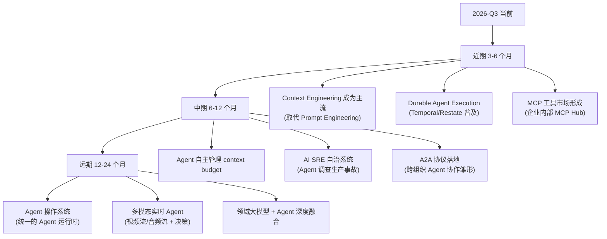

# Agent 架构师行业调研报告（2026-Q3）

> **调研日期**：2026-08-09
> **调研目的**：摸清 2026 年 AI Agent 架构师的行业全貌——角色定位、核心技能、技术演进方向、未来趋势——作为本仓库文档体系进阶的外部依据。
> **调研方法**：Web 检索行业报告 / 招聘趋势 / 技术博客 / 学术预印本，结合本仓库 `理论/` 已有调研交叉验证。

---

## 0. 一句话结论

> **2026 年，"Agent 架构师"正在从一个模糊头衔变成一个有明确技能边界的工程角色。其核心竞争力不是"会调 prompt"，而是"会做分布式系统级可靠性 + 成本工程 + 多 Agent 编排 + 协议生态（MCP/A2A）"。Java 工程师在类型系统、工程纪律、分布式中间件上的积累，恰好是这条赛道最稀缺的能力。**

---

## 1. 角色定位：Agent 架构师是谁

### 1.1 行业怎么说

| 来源 | 核心观点 |
|------|---------|
| [Avolution 2026 企业架构趋势](https://www.avolutionsoftware.com/our-resources/enterprise-architecture-trends-skills-strategies-2026/) | **72% 的组织把"数据与 AI 架构能力"列为第一优先级**，73% 强调 AI 相关架构能力 |
| [LinkedIn: 2026 架构师 10 大技能](https://www.linkedin.com/posts/bspazziani_skills-required-for-an-architect-in-2026-activity-7416501506528522240-kij6) | 前 5 名：Agentic AI & 多 Agent 编排、高级 RAG & 知识架构、LLMOps & 平台工程、AI 安全 & 护栏、（+ 6 项新兴能力） |
| [DEV: 构建 AI Agent 的 5 项核心能力](https://dev.to/imaginex/skills-required-for-building-ai-agents-in-2026-2ed) | Problem Shaping、Context Design、Aesthetic Judgment、Agent Orchestration、Knowing When（何时介入/升级） |

### 1.2 画像（综合提炼）

Agent 架构师 ≠ 算法工程师 ≠ Prompt 工程师。TA 是一个**系统工程师**，负责：

```
用户需求 → 问题建模（Problem Shaping）
         → 架构设计（Workflow vs Agent vs 多 Agent 的边界决策）
         → 工程实现（框架选型 / Advisor 链 / Tool 体系 / MCP 接入）
         → 生产化（评估闭环 / 可观测 / 成本 / 可靠性 / 安全）
         → 持续演进（数据飞轮 / 模型升级 / 平台化）
```

**关键区别**：

| 角色 | 核心能力 | Agent 架构师是否需要 |
|------|---------|-------------------|
| 算法/模型工程师 | 训练 / 微调 / 推理优化 | 了解边界，不做主力 |
| Prompt 工程师 | 提示词设计 / 评估 | 必备，但只是工具之一 |
| **Agent 架构师** | **系统设计 / 可靠性 / 成本 / 编排 / 协议** | **核心** |
| AI 平台工程师 | LLMOps / 基础设施 / 多租户 | 进阶方向 |

---

## 2. 十大核心技能矩阵（2026 行业共识）

> 综合 LinkedIn / DEV / Atlan / Agensi 等多来源，去重合并后按"对 Java 工程师的稀缺度 × 价值"排序。

| # | 技能 | 为什么重要 | Java 工程师的优势 | 本仓库对应 |
|---|------|---------|---------------|----------|
| **1** | **多 Agent 编排** | 企业级复杂任务必须拆分多 Agent 协作 | 状态机 / DAG 思维成熟 | 教程 10/11、项目-客服 |
| **2** | **高级 RAG & 知识架构** | 企业知识落地标配，"检索质量决定 Agent 上限" | 数据工程能力强 | 教程 09/20、理论 02 |
| **3** | **LLMOps & 平台工程** | 评估 / 观测 / CI/CD 是生产化的分水岭 | DevOps 经验丰富 | 教程 12/13/15/26/27 |
| **4** | **AI 安全 & 护栏** | Prompt Injection / Agent 失控是上线最大风险 | 安全工程意识强 | 教程 14、理论 16 |
| **5** | **Context Engineering（上下文工程）** | 2026 年的"新 Prompt 工程"，决定成本与质量 | 系统性思维 | **新增重点** ↓ §3 |
| **6** | **Agent 可靠性工程** | Agent 失败模式 = 分布式系统经典问题 | **最大护城河** | 理论 16、教程 26 |
| **7** | **成本工程** | LLM 按 token 计费，不优化烧钱 | 工程优化经验 | 理论 15、教程 15 |
| **8** | **MCP 协议生态** | 工具/资源统一暴露的事实标准 | 跨不跨进程都通 | 教程 05/06/07 |
| **9** | **Problem Shaping（问题建模）** | 不是所有问题都该用 Agent，选对模式最重要 | 架构决策经验 | 教程 19、理论 09/10 |
| **10** | **AI 原生架构设计** | Event Sourcing / CQRS / 领域 Agent | 分布式架构功底 | 教程 17/18 |

---

## 3. 三大技术演进方向（重点展开）

### 3.1 Context Engineering（上下文工程）—— 2026 年的"新 Prompt 工程"

> 多个来源一致结论：**Context Engineering 正在取代 Prompt Engineering，成为 2026 年 AI 产品的核心成本与质量学科。**

**核心洞察**：

| 发现 | 来源 |
|------|------|
| Prompt caching 减少 API 成本 **41-80%**，TTFT 改善 13-31% | [arXiv 2026 论文](https://arxiv.org/html/2601.06007v2) |
| 完整上下文工程可降低成本 **10x**（KV cache 优化 + tool masking + 5+ 生产模式） | [FP8.co](https://fp8.co/articles/Context-Engineering-for-AI-Agents) |
| 长会话场景（复用 system prompt + tool 定义）节省 **50-80%** | [ExplainX](https://explainx.ai/blog/context-engineering-clean-prompts-generator-2026) |
| 有效 token 优化可降本 **60%**（把 context 当预算管理） | [LinkedIn](https://www.linkedin.com/posts/bijit-ghosh-48281a78_optimizing-any-ai-agent-framework-with-context-activity-7357760656386760705-KI8a) |
| **2026 新趋势：Agent 自主管理自己的 context budget**（而非工程师手动配置） | [Crux Digits](https://cruxdigits.nl/blog/context-engineering-ai-agents-2026/) |

**对文档体系的启示**：
- 现有"理论/15-成本工程与PromptCache"需要**升级为"上下文工程"专题**，不只是 Prompt Cache
- 新增：KV cache hit rate 优化、prefix caching、tool masking、context budgeting、自主 context 管理
- Sourcegraph 的 [Context Engineering 实践指南](https://sourcegraph.com/blog/context-engineering) 提出的"四大支柱"值得纳入

### 3.2 Agent 可靠性工程 —— Java 工程师的最大护城河

> Temporal 官方博客标题直白：[《From AI Hype to Durable Reality — Why Agentic Flows Need Distributed Systems》](https://temporal.io/blog/from-ai-hype-to-durable-reality-why-agentic-flows-need-distributed-systems)

**核心论点**：**Agent 的失败模式（重试 / 幂等 / 补偿 / 超时 / 熔断）本质是分布式系统的经典问题。Python/算法工程师擅长调 prompt，但不擅长分布式系统——这正是 Java 工程师的主场。**

**2026 行业实践**：

| 实践 | 说明 | 来源 |
|------|------|------|
| **Durable Execution**（持久化执行） | 用 Temporal/Restate 把 Agent 执行包成工作流，获得 Checkpoint/重试/补偿 | Temporal 官方 |
| **五层可靠性方案** | runtime guardrails / CI eval gates / span-attached scoring / clustering / 更多 | [FutureAGI](https://futureagi.com/blog/best-ai-agent-reliability-solutions-2026/) |
| **Java 26 + K8s 1.34 韧性工程** | Virtual Threads + K8s 弹性，AI 工作负载的韧性手册 | [dev.to](https://dev.to/aytronn/resilience-engineering-for-java-26-ai-services-on-kubernetes-a-2026-production-handbook-8d0) |
| **AI SRE 自治** | Fortune 500 用 AI Agent 自主调查生产事故，SRE 从操作者变成自治系统架构师 | [Traversal](https://www.traversal.com/blog/ai-for-sre-site-reliability-engineering-aisre)、[Rootly](https://rootly.com/sre/sre-5-years-ai-first-reliability-autonomous-ops) |

**对文档体系的启示**：
- 现有"理论/16-Agent可靠性工程Java视角"需要**深化为独立的可靠性工程主线**
- 新增：Temporal/Restate 持久化执行模式、五层可靠性方案、AI SRE 实践
- 这是"让普通 Java 工程师变成稀缺 Agent 架构师"的最关键杠杆

### 3.3 多 Agent 编排与协议生态（MCP + A2A）

> **2026 行业共识**：MCP 是工具/资源/Prompt 跨框架统一暴露的事实标准；A2A 是 Agent 间通信的新兴协议（2-3 年内跟进不押注，但必须了解）。

**编排模式与生态**：

| 主题 | 要点 | 来源 |
|------|------|------|
| **三大编排模式** | 集中式 / 去中心化 / 混合；无共享上下文的编排在规模化时必崩 | [Atlan](https://atlan.com/know/multi-agent-system-orchestration/) |
| **Build vs Buy** | 开源框架（全控制）vs 托管平台（快上线）vs 混合 | [AugmentCode](https://www.augmentcode.com/tools/multi-agent-orchestration-platforms-build-vs-buy) |
| **Context Engineering 是编排核心** | 每个 Agent 必须有正确的 context window/scope | [LinkedIn](https://www.linkedin.com/posts/krishna-reddy-780a7286_the-4-agent-frameworks-that-will-define-ai-activity-7399658658479050752-klhL) |
| **MCP（工具层）+ A2A（Agent 间）** | MCP 标准化工具/数据连接，A2A 标准化 Agent 间通信 | [Medium](https://medium.com/@yusufbaykaloglu/multi-agent-systems-orchestrating-ai-agents-with-a2a-protocol-19a27077aed8) |
| **学术综述** | A2A 设计为 peer-to-peer Agent 协调 | [preprints.org 2026 综述](https://www.preprints.org/manuscript/202604.2147) |

**对文档体系的启示**：
- MCP 三部曲（教程 05/06/07）已覆盖良好，需补充 **A2A 协议认知**（不做深度实现，但要了解）
- 多 Agent 编排（教程 10）需补充"共享上下文"和"规模化崩塌"的真实案例
- 综合压轴（教程 32）已把 MCP 当核心接入层，方向正确

---

## 4. 未来方向（6-12 个月趋势）



| 时间 | 方向 | 投入建议 | Java 工程师机会 |
|------|------|---------|--------------|
| **3-6 月** | Context Engineering | ⭐⭐⭐⭐⭐ 必做 | 系统性优化，Java 强项 |
| **3-6 月** | Durable Agent Execution | ⭐⭐⭐⭐⭐ 必做 | Temporal Java SDK 强大 |
| **3-6 月** | MCP 工具市场 | ⭐⭐⭐⭐ 必做 | 已覆盖，持续跟进 |
| **6-12 月** | Agent 自主 context 管理 | ⭐⭐⭐ 跟进 | 研究方向，早期投入 |
| **6-12 月** | AI SRE 自治 | ⭐⭐⭐⭐ 高价值 | SRE + AI 交叉，稀缺 |
| **6-12 月** | A2A 协议 | ⭐⭐ 跟进不押注 | 了解规范即可 |
| **12-24 月** | Agent 操作系统 | ⭐⭐ 关注 | 基础设施级机会 |
| **12-24 月** | 多模态实时 Agent | ⭐⭐⭐ 行业相关 | 边缘部署 / 低延迟 |

---

## 5. 对本仓库文档体系的改进建议

基于以上调研，对现有 208 篇文档提出以下改进方向：

### 5.1 必须强化（高优先级）

| 改进项 | 现状 | 改进方向 |
|--------|------|---------|
| **Context Engineering** | 散落在成本工程里 | 升级为独立专题：KV cache / prefix caching / tool masking / context budgeting / 自主管理 |
| **Agent 可靠性工程** | 理论 16 一篇 | 深化为主线：Temporal 持久化执行 / 五层可靠性 / 幂等设计 / 补偿事务 |
| **能力地图** | 理论 13 提及但不够系统 | 新建完整的 L1-L5 能力分级，每级有明确的知识/项目/验收 |
| **实践代码穿插** | 教程有代码但部分偏理论 | 确保每篇都有"动手做"环节，读者能跟着跑 |

### 5.2 应该新增（中优先级）

| 新增项 | 理由 |
|--------|------|
| **A2A 协议认知** | 行业趋势，不做深度实现但要了解（现有完全缺失） |
| **Durable Agent Execution 实战** | Temporal + Agent 是 2026 最热的可靠性方案 |
| **AI SRE 实践专题** | Fortune 500 已在用，Java 工程师高价值交叉领域 |
| **企业级落地检查清单** | 把所有知识点串成"从 0 到上线"的 checklist |

### 5.3 需要重组（结构优化）

| 重组项 | 理由 |
|--------|------|
| **零基础入口** | 现有路线假设"有 Java 后端经验"，需要补一个真正的零基础起点 |
| **知识→实践映射** | 每个知识点必须对应一个可运行的代码实践，不能只讲概念 |
| **项目阶梯串联** | P1-P6 项目要把所有知识点串起来，每个项目明确复用前面哪些能力 |

---

## 6. 调研来源索引

### 行业报告与趋势
- [Enterprise Architecture in 2026: Trends, Skills, and Strategies](https://www.avolutionsoftware.com/our-resources/enterprise-architecture-trends-skills-strategies-2026/)
- [AI Skills for Architects in 2026: Top 10 In-Demand Skills](https://www.linkedin.com/posts/bspazziani_skills-required-for-an-architect-in-2026-activity-7416501506528522240-kij6)
- [Enterprise Skills 2026: A Governance Guide for AI Teams](https://atlan.com/know/what-are-enterprise-skills/)

### Context Engineering
- [Context Engineering for Production AI Agents (Spheron)](https://www.spheron.network/blog/context-engineering-production-ai-agents-kv-cache-long-context/)
- [Prompt Caching Evaluation (arXiv 2026)](https://arxiv.org/html/2601.06007v2)
- [Context Engineering: Cut LLM Costs 10x (FP8.co)](https://fp8.co/articles/Context-Engineering-for-AI-Agents)
- [Context Engineering 2026 Complete Guide (ExplainX)](https://explainx.ai/blog/context-engineering-clean-prompts-generator-2026)
- [Context Engineering: The 2026 Playbook (Crux Digits)](https://cruxdigits.nl/blog/context-engineering-ai-agents-2026/)
- [Context Engineering: A Practical Guide (Sourcegraph)](https://sourcegraph.com/blog/context-engineering)
- [Context Engineering for Product Builders (Substack)](https://karozieminski.substack.com/p/context-engineering-product-builders-guide-2026)

### Agent 可靠性工程
- [From AI Hype to Durable Reality (Temporal 官方)](https://temporal.io/blog/from-ai-hype-to-durable-reality-why-agentic-flows-need-distributed-systems)
- [Best AI Agent Reliability Solutions 2026 (FutureAGI)](https://futureagi.com/blog/best-ai-agent-reliability-solutions-2026/)
- [Resilience Engineering for Java 26 AI Services (dev.to)](https://dev.to/aytronn/resilience-engineering-for-java-26-ai-services-on-kubernetes-a-2026-production-handbook-8d0)
- [AI for SRE (Traversal)](https://www.traversal.com/blog/ai-for-sre-site-reliability-engineering-aisre)
- [SRE in 5 Years: AI-First Reliability (Rootly)](https://rootly.com/sre/sre-5-years-ai-first-reliability-autonomous-ops)

### 多 Agent 编排与协议
- [7 Multi-Agent Orchestration Platforms: Build vs Buy (AugmentCode)](https://www.augmentcode.com/tools/multi-agent-orchestration-platforms-build-vs-buy)
- [Multi-Agent Systems: Orchestrating with A2A Protocol (Medium)](https://medium.com/@yusufbaykaloglu/multi-agent-systems-orchestrating-ai-agents-with-a2a-protocol-19a27077aed8)
- [How to Orchestrate Multi-Agent Systems at Scale (Atlan)](https://atlan.com/know/multi-agent-system-orchestration/)
- [LLM-Based Multi-Agent Orchestration Survey (preprints.org)](https://www.preprints.org/manuscript/202604.2147)

### 生产化
- [Building Production-Ready AI Agents in 2026 (MLflow)](https://mlflow.org/articles/building-production-ready-ai-agents-in-2026/)
- [AI Agent Engineering 2026: Architectures and Patterns (WhoIsJSONAPI)](https://blog.whoisjsonapi.com/ai-agent-engineering-in-2026-architectures-patterns-and-real-world-systems/)
- [Best AI Agent Skills for Enterprise (Agensi)](https://www.agensi.io/learn/best-skills-enterprise-development-2026)
- [Skills Required for Building AI Agents (DEV)](https://dev.to/imaginex/skills-required-for-building-ai-agents-in-2026-2ed)
