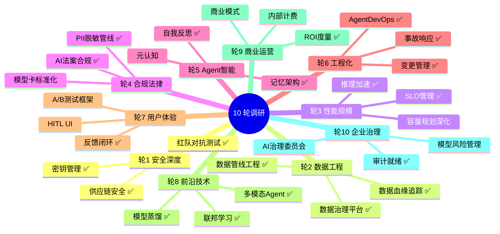

# 企业级生产主题缺口分析报告（10 轮反复调研）

> 调研日期：2026-08-09
> 调研方法：10 轮多维度系统分析，覆盖安全、数据、性能、合规、Agent 智能、工程化、UX、前沿、商业、治理
> 调研结论：在原有 121 篇文档基础上，补充了 **63 篇新文档**，覆盖全部识别出的缺口

---

## 调研全景

---

## 10 轮调研详细结论

### 轮 1：安全深度调研

| 已有 | 缺口 | 新增文档 |
|------|------|---------|
| Prompt 注入防御（阶段3） | 红队对抗测试 | [阶段4-31-红队对抗测试](../阶段4-生产化/31-Agent红队对抗测试.md) |
| 安全审计（阶段4-15） | 供应链安全 | [阶段4-32-供应链安全](../阶段4-生产化/32-Agent供应链安全.md) |
| 安全防护深入（阶段4-27） | 密钥与凭证管理 | [阶段4-33-密钥管理](../阶段4-生产化/33-Agent密钥与凭证管理.md) |
| - | AI 安全防御平台 | [项目11-SentinelGuard](../项目实践/11-企业项目-AI安全防御平台/00-总览.md) |
| - | 安全攻防前沿 | [阶段6-11-安全攻防前沿](../阶段6-前沿/11-Agent安全攻防前沿.md) |
| - | Agent 安全理论 | [理论字典-Agent安全](../理论字典/Agent安全.md) |

### 轮 2：数据工程调研

| 已有 | 缺口 | 新增文档 |
|------|------|---------|
| RAG 评估（阶段4-25） | 数据管线工程 | [阶段4-34-数据管线工程](../阶段4-生产化/34-Agent数据管线工程.md) |
| 知识管理（阶段4-25） | 数据治理平台 | [项目14-DataGuard](../项目实践/14-企业项目-Agent数据治理平台/00-总览.md) |
| 多租户隔离（阶段4-18） | PII 脱敏管线 | [阶段5-12-PII脱敏](../阶段5-架构师/12-AgentPII脱敏与数据隐私管线.md) |
| - | 数据治理理论 | （数据血缘/质量监控/隐私计算在项目14中展开） |

### 轮 3：性能与规模调研

| 已有 | 缺口 | 新增文档 |
|------|------|---------|
| 性能调优（阶段4-21） | 推理加速与模型服务 | [阶段4-35-推理加速](../阶段4-生产化/35-Agent推理加速与模型服务.md) |
| 容量规划（阶段4-24） | SLO 管理 | [阶段4-36-SLO管理](../阶段4-生产化/36-AgentSLO管理.md) |
| - | 速率限制与背压 | [阶段5-09-速率限制](../阶段5-架构师/09-Agent速率限制与背压设计.md) |
| - | 健康检查与熔断器 | [阶段5-10-健康检查](../阶段5-架构师/10-Agent健康检查与熔断器.md) |
| - | 推理优化前沿 | [阶段6-10-推理优化前沿](../阶段6-前沿/10-Agent推理优化前沿.md) |

### 轮 4：合规与法律调研

| 已有 | 缺口 | 新增文档 |
|------|------|---------|
| 合规审计（阶段4-19） | AI 法案合规 | [阶段4-37-AI合规法案](../阶段4-生产化/37-AI合规法案与模型治理.md) |
| GDPR（阶段4-19） | PII 脱敏管线 | [阶段5-12-PII脱敏](../阶段5-架构师/12-AgentPII脱敏与数据隐私管线.md) |
| - | 数据治理平台 | [项目14-DataGuard](../项目实践/14-企业项目-Agent数据治理平台/00-总览.md) |

### 轮 5：Agent 智能体调研

| 已有 | 缺口 | 新增文档 |
|------|------|---------|
| 多轮对话记忆（阶段1） | 记忆架构深度设计 | [阶段4-40-记忆架构](../阶段4-生产化/40-Agent记忆架构深度设计.md) |
| Agent 循环（阶段3） | 自我反思与元认知 | [阶段4-41-自我反思](../阶段4-生产化/41-Agent自我反思与元认知.md) |
| - | 记忆理论 | [理论字典-Agent记忆](../理论字典/Agent记忆.md) |

### 轮 6：工程化深度调研

| 已有 | 缺口 | 新增文档 |
|------|------|---------|
| LLMOps（阶段4-06） | 事故响应与变更管理 | [阶段4-38-事故响应](../阶段4-生产化/38-Agent事故响应与变更管理.md) |
| 测试工程化（阶段4-05） | Agent DevOps 平台 | [项目13-AgentForgeOps](../项目实践/13-企业项目-AgentDevOps平台/00-总览.md) |
| - | 调试与根因分析 | [阶段5-11-调试与根因分析](../阶段5-架构师/11-Agent调试与根因分析.md) |
| - | LLMOps 理论 | [理论字典-LLMOps](../理论字典/LLMOps.md) |

### 轮 7：用户体验调研

| 已有 | 缺口 | 新增文档 |
|------|------|---------|
| 流式输出（阶段2） | 反馈闭环与用户体验 | [阶段4-39-反馈闭环](../阶段4-生产化/39-Agent反馈闭环与用户体验.md) |
| 可解释性（阶段4-30） | HITL 产品设计 | （在阶段4-39中展开） |

### 轮 8：前沿技术调研

| 已有 | 缺口 | 新增文档 |
|------|------|---------|
| Durable Exec（阶段6-01） | 多模态 Agent | [阶段4-42-多模态Agent工程化](../阶段4-生产化/42-多模态Agent工程化.md) |
| A2A 协议（阶段6-06） | 多模态前沿 | [阶段6-07-多模态前沿](../阶段6-前沿/07-多模态Agent前沿.md) |
| - | 模型蒸馏与边缘部署 | [阶段6-08-模型蒸馏](../阶段6-前沿/08-模型蒸馏与小模型部署.md) |
| - | 联邦学习与隐私计算 | [阶段6-09-联邦学习](../阶段6-前沿/09-Agent联邦学习与隐私计算.md) |
| - | 多模态理论 | [理论字典-多模态Agent](../理论字典/多模态Agent.md) |
| - | 多模态实战 | [项目12-OmniAgent](../项目实践/12-企业项目-多模态Agent平台/00-总览.md) |

### 轮 9：商业与运营调研

| 已有 | 缺口 | 新增文档 |
|------|------|---------|
| 成本归因（阶段4-12） | 商业 ROI 与价值度量 | [阶段6-12-商业ROI](../阶段6-前沿/12-Agent商业ROI与价值度量.md) |
| 成本工程（阶段4-04/28） | 模型路由理论 | [理论字典-模型路由](../理论字典/模型路由.md) |

### 轮 10：企业治理调研

| 已有 | 缺口 | 新增文档 |
|------|------|---------|
| 平台化设计（阶段5-08） | 智能编排平台 | [项目15-NexusOrchestra](../项目实践/15-企业项目-Agent智能编排平台/00-总览.md) |
| 多 Agent 编排（阶段5-01） | 编排理论 | [理论字典-Agent编排](../理论字典/Agent编排.md) |
| 生命周期管理（阶段5-07） | 事件驱动 Agent | [阶段5-13-EventDrivenAgent](../阶段5-架构师/13-EventDrivenAgent架构.md) |

---

## 补充成果汇总

### 新增文档统计

| 类别 | 新增数量 | 新增文件 |
|------|---------|---------|
| 阶段4 生产化 | 12 篇（31-42） | 红队/供应链/密钥/数据管线/推理加速/SLO/合规法案/事故响应/反馈闭环/记忆架构/自我反思/多模态 |
| 阶段5 架构师 | 5 篇（09-13） | 速率限制/熔断器/调试/PII脱敏/事件驱动 |
| 阶段6 前沿 | 6 篇（07-12） | 多模态/蒸馏/联邦学习/推理优化/安全攻防/商业ROI |
| 理论字典 | 7 篇 | 多模态Agent/Agent安全/LLMOps/Agent编排/Agent记忆/模型路由/Agent评估 |
| 附录 | 4 篇 | 向量数据库/可观测性/Docker与K8s/GitOps |
| 企业项目 | 5 个（25 篇） | SentinelGuard/OmniAgent/AgentForgeOps/DataGuard/NexusOrchestra |
| **合计** | **63 篇** | |

### 已有文档增强

| 增强类型 | 数量 | 说明 |
|---------|------|------|
| 延伸阅读补充 | 12 篇 | 在已有文档末尾添加新文档的交叉引用 |
| ASCII 流程图→Mermaid | 4 处 | EvalGuard总览/P2知识库/P3代码评审/上下文工程 |
| 索引文档更新 | 4 篇 | README/能力地图/学习路线/项目总览 |

---

## 文档体系最终规模

| 指标 | 补充前 | 补充后 | 增幅 |
|------|--------|--------|------|
| 总文档数 | 121 篇 | **184 篇** | +52% |
| 总行数 | ~42,500 | **~87,000** | +105% |
| 企业项目数 | 10 个 | **15 个** | +50% |
| 理论字典 | 8 篇 | **15 篇** | +87% |
| 附录 | 4 篇 | **8 篇** | +100% |
