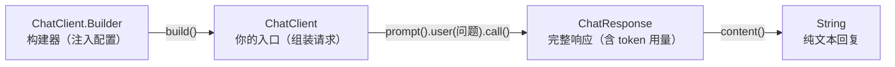

# 01 · 第一次用 Java 调用 LLM

> 阶段：1 入门 · 难度：⭐ · 预计：半天
> 前置：[阶段 0 完成](../阶段0-地基/03-LLM基础认知.md)（能搭 Spring Boot、能用 curl 调通 LLM）
> 产出：用 Java 代码调通 LLM，拿到回复——你的第一行 AI 代码

---

## 你将学会

- 引入 Spring AI 依赖
- 配置模型连接（application.yml）
- 用 `ChatClient` 发起第一次调用
- 理解 `ChatClient.Builder` / `ChatClient` / `ChatResponse` 的关系

---

## 为什么需要这个

你在阶段 0 用 curl 调通了 LLM。但 curl 只是验证"模型能通"。真正的应用必须用代码调——你要在 Java 里实现同样的调用，还能加上类型安全、错误处理、流式输出等工程能力。

---

## 知识讲解

### 1. Spring AI 的核心抽象

Spring AI 把"调 LLM"这件事抽象成了几个核心类：



| 类 | 作用 | Java 类比 |
|---|------|---------|
| `ChatModel` | 模型连接（自动配置） | JDBC DataSource |
| `ChatClient.Builder` | 构建器（创建 ChatClient） | RestClient.Builder |
| `ChatClient` | 你的 API 入口 | RestClient |
| `ChatResponse` | 完整响应（含 metadata） | ResponseEntity |

### 2. 请求-响应流程

```
你的代码: chatClient.prompt().user("你好").call().content()
    ↓
Spring AI 把它组装成 HTTP 请求:
    POST https://api.deepseek.com/v1/chat/completions
    body: {"messages": [{"role":"user","content":"你好"}]}
    ↓
DeepSeek 返回 JSON:
    {"choices": [{"message": {"content": "你好！有什么可以帮你的？"}}]}
    ↓
Spring AI 解析 JSON → 返回 String
```

---

## 动手实践

### Step 1：引入 Spring AI 依赖

在 `pom.xml` 中加入 Spring AI BOM 和 OpenAI starter（DeepSeek 兼容 OpenAI 协议）：

```xml
<!-- 在 <properties> 中加 Spring AI 版本 -->
<spring-ai.version>1.0.0</spring-ai.version>

<!-- 在 <dependencyManagement> 中加 BOM -->
<dependencyManagement>
    <dependencies>
        <dependency>
            <groupId>org.springframework.ai</groupId>
            <artifactId>spring-ai-bom</artifactId>
            <version>${spring-ai.version}</version>
            <type>pom</type>
            <scope>import</scope>
        </dependency>
    </dependencies>
</dependencyManagement>

<!-- 在 <dependencies> 中加 starter -->
<dependency>
    <groupId>org.springframework.ai</groupId>
    <artifactId>spring-ai-starter-model-openai</artifactId>
</dependency>
```

> 本仓库的 `pom.xml` 已经配好了，你不用改。

### Step 2：配置模型连接

```yaml
# application.yml
spring:
  ai:
    openai:
      base-url: https://api.deepseek.com       # DeepSeek 兼容 OpenAI 协议
      api-key: ${DEEPSEEK_API_KEY}              # 从环境变量读（不硬编码！）
      chat:
        model: deepseek-chat
        temperature: 0.7
```

> 如果你用 LM Studio 本地模型：`base-url: http://localhost:1234`

### Step 3：写第一个 AI 接口

```java
package demo.demo01.controller;

import org.springframework.ai.chat.client.ChatClient;
import org.springframework.web.bind.annotation.*;

@RestController
@RequestMapping("/api")
public class ChatController {

    // ChatClient 是 Spring AI 自动注入的（因为你在 yml 里配了 API Key）
    private final ChatClient chatClient;

    public ChatController(ChatClient.Builder builder) {
        this.chatClient = builder.build();
    }

    // GET /api/ask?q=什么是RAG
    @GetMapping("/ask")
    public String ask(@RequestParam String q) {
        return chatClient.prompt()
                .user(q)           // 用户消息
                .call()            // 发起调用
                .content();        // 提取纯文本回复
    }
}
```

### Step 4：运行并测试

```bash
mvn spring-boot:run

curl "http://localhost:8080/api/ask?q=用一句话解释什么是RAG"
# 输出：RAG（检索增强生成）是一种结合检索和生成的技术，先从知识库中检索相关文档，再让大模型基于检索到的内容生成回答。
```

**你刚刚用 Java 代码调通了 LLM！** 🎉

### Step 5：加上 System Prompt

```java
@GetMapping("/ask")
public String ask(@RequestParam String q) {
    return chatClient.prompt()
            .system("你是一个简洁的技术助手，所有回答不超过两句话")  // 设定 AI 人格
            .user(q)
            .call()
            .content();
}
```

再测试，你会发现回复变简洁了：

```bash
curl "http://localhost:8080/api/ask?q=什么是RAG"
# 输出：RAG 是先从知识库检索相关文档，再让大模型基于检索内容生成回答的技术。
```

### Step 6：获取完整的响应（含 token 用量）

```java
@GetMapping("/ask-detail")
public Map<String, Object> askDetail(@RequestParam String q) {
    var response = chatClient.prompt()
            .user(q)
            .call()
            .chatResponse();

    return Map.of(
        "reply", response.getResult().getOutput().getText(),
        "metadata", response.getMetadata()  // 包含 token 用量
    );
}
```

```bash
curl "http://localhost:8080/api/ask-detail?q=你好" | jq .
# {
#   "reply": "你好！有什么可以帮你的？",
#   "metadata": {
#     "usage": { "promptTokens": 5, "completionTokens": 10, "totalTokens": 15 }
#   }
# }
```

---

## 常见坑

- ❌ **API Key 硬编码** → 永远用 `${DEEPSEEK_API_KEY}` 环境变量
- ❌ **base-url 写错** → DeepSeek 是 `https://api.deepseek.com`（不要加 `/v1`，Spring AI 自动加）
- ❌ **ChatClient 还是 ChatClient.Builder 搞混** → Builder 是构建器（配置用），ChatClient 是实际调用用
- ❌ **超时报错** → 在 `application.yml` 里配 `spring.ai.openai.chat.timeout: 60s`

---

## 验收检查

- [ ] Spring Boot 应用能正常启动
- [ ] `/api/ask?q=xxx` 接口能返回 LLM 回复
- [ ] 能设置 system prompt 并看到效果
- [ ] 能获取 token 用量信息
- [ ] API Key 没有硬编码在代码里

---

## 下一步

→ 下一篇：[02 多轮对话与记忆](02-多轮对话与记忆.md) —— 让 AI 记住你说过的话
→ 概念卡壳？查 `理论字典/LLM基础.md`
