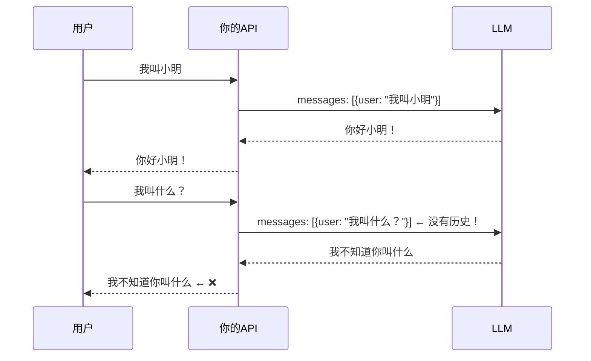
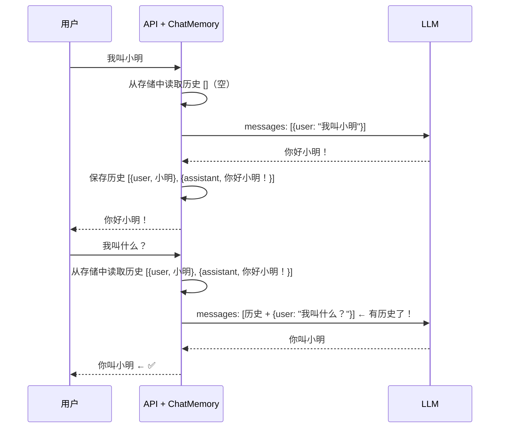

# 02 · 多轮对话与记忆

> 阶段：1 入门 · 难度：⭐ · 预计：1 天
> 前置：[01 第一次调用 LLM](01-第一次调用LLM.md)
> 产出：让 AI 记住对话历史，实现真正的多轮对话

---

## 你将学会

- 为什么 LLM 不记得上一句话（无状态性）
- 用 `MessageChatMemoryAdvisor` 实现多轮对话
- 会话隔离：不同用户/不同对话互不干扰
- 记忆窗口策略：防止 token 爆炸

---

## 为什么需要这个

上一篇你实现了"一问一答"。但你试试这个：

```bash
curl "http://localhost:8080/api/ask?q=我叫小明"
# 你好小明！

curl "http://localhost:8080/api/ask?q=我叫什么"
# ❌ AI 不知道你叫什么——因为两次请求是独立的，它没有"记忆"
```

**LLM 是无状态的**——每次调用都是独立的 HTTP 请求。要让它"记住"对话，你必须每次把历史一起发过去。

---

## 知识讲解

### 1. 无状态问题



### 2. 解决方案：ChatMemory

`MessageChatMemoryAdvisor` 是一个 Advisor（拦截器），它会在你发请求前**自动把对话历史塞进 messages**：



### 3. 会话隔离

多个用户同时用你的应用时，每个人的对话历史必须隔离。用 `conversationId` 区分：

```
用户 A 的对话 → conversationId: "session-A"
用户 B 的对话 → conversationId: "session-B"
```

### 4. 记忆窗口

对话越长，历史 token 越多，最终会超过上下文窗口。需要"窗口策略"——只保留最近 N 条消息：

```java
// 只保留最近 20 条消息（超出自动丢弃最早的）
MessageWindowChatMemory window = MessageWindowChatMemory.builder()
    .maxMessages(20)
    .build();
```

---

## 动手实践

### Step 1：配置 ChatMemory

```java
package demo.demo01.config;

import org.springframework.ai.chat.memory.*;
import org.springframework.context.annotation.*;
import org.springframework.ai.chat.client.ChatClient;

@Configuration
public class ChatConfig {

    @Bean
    public ChatMemory chatMemory() {
        // 内存版记忆（够学习用，生产环境用 Redis——阶段4讲）
        return MessageWindowChatMemory.builder()
                .maxMessages(20)  // 保留最近 20 条
                .build();
    }

    @Bean
    public ChatClient chatClient(ChatClient.Builder builder, ChatMemory memory) {
        return builder
                .defaultAdvisors(
                    // 加上记忆 Advisor——它会自动管理历史
                    MessageChatMemoryAdvisor.builder(memory).build()
                )
                .build();
    }
}
```

### Step 2：改造 Controller——加会话 ID

```java
package demo.demo01.controller;

import org.springframework.ai.chat.client.ChatClient;
import org.springframework.web.bind.annotation.*;

@RestController
@RequestMapping("/api")
public class ChatController {

    private final ChatClient chatClient;

    public ChatController(ChatClient chatClient) {
        this.chatClient = chatClient;
    }

    // GET /api/chat?q=你好&sessionId=room1
    @GetMapping("/chat")
    public String chat(
            @RequestParam String q,
            @RequestParam(defaultValue = "default") String sessionId) {

        return chatClient.prompt()
                .user(q)
                .advisors(spec -> spec.param(ChatMemory.CONVERSATION_ID, sessionId))
                .call()
                .content();
    }
}
```

### Step 3：测试多轮对话

```bash
# 同一个 session，AI 应该记住上下文
curl "http://localhost:8080/api/chat?q=我叫小明&sessionId=test1"
# 你好小明！

curl "http://localhost:8080/api/chat?q=我叫什么&sessionId=test1"
# ✅ 你叫小明

# 不同 session，AI 不应该知道
curl "http://localhost:8080/api/chat?q=我叫什么&sessionId=test2"
# ✅ 我不知道你叫什么（不同会话，没有历史）
```

### Step 4：观察 token 消耗增长

```java
@GetMapping("/chat-detail")
public Map<String, Object> chatDetail(
        @RequestParam String q,
        @RequestParam(defaultValue = "default") String sessionId) {

    var response = chatClient.prompt()
            .user(q)
            .advisors(spec -> spec.param(ChatMemory.CONVERSATION_ID, sessionId))
            .call()
            .chatResponse();

    var usage = response.getMetadata().getUsage();

    return Map.of(
        "reply", response.getResult().getOutput().getText(),
        "promptTokens", usage.getPromptTokens(),    // 注意：这个值会随对话变长而增长
        "totalTokens", usage.getTotalTokens()
    );
}
```

```bash
# 第一轮：promptTokens = 10
curl "http://localhost:8080/api/chat-detail?q=你好&sessionId=grow"

# 第二轮：promptTokens = 25（包含了第一轮的历史）
curl "http://localhost:8080/api/chat-detail?q=你刚才说了什么&sessionId=grow"

# 第三轮：promptTokens = 45（历史越来越长）
curl "http://localhost:8080/api/chat-detail?q=再确认一次&sessionId=grow"
```

> 你会看到 `promptTokens` 逐轮增长。这就是为什么需要窗口策略——超过 `maxMessages` 后自动丢弃最早的。

---

## 常见坑

- ❌ **忘记传 sessionId** → 所有用户共享一个对话，互相串话
- ❌ **内存版记忆重启丢失** → 重启后历史没了。阶段 4 讲用 Redis 持久化
- ❌ **窗口设太小** → 太短（如 4 条）会导致 AI 忘记重要上下文
- ❌ **窗口设太大** → token 消耗暴增。一般 10-20 条比较合理
- ❌ **sessionId 前端没传** → 前端调用时必须带上 `sessionId` 参数。一般用 UUID 生成，存在 localStorage

---

## 记忆策略选择决策树

```
需要持久化吗？（重启后要保留历史）
├── 否 → MessageWindowChatMemory（内存，学习/原型用）
└── 是 → 需要自定义 ChatMemoryRepository（阶段 4 用 Redis 实现）

历史需要保留多少条？
├── ≤ 10 条 → maxMessages(10)（简单问答）
├── 10-20 条 → maxMessages(20)（推荐默认值）
└── > 20 条 → 考虑用摘要压缩（阶段 4 上下文工程讲）

需要跨设备同步吗？
├── 否 → 内存即可
└── 是 → 必须用 Redis/DB 持久化（阶段 4 讲）
```

---

## 验收检查

- [ ] 同一个 sessionId 能多轮对话（AI 记住上下文）
- [ ] 不同 sessionId 互不干扰
- [ ] 能看到 token 消耗随对话轮数增长
- [ ] 理解"为什么 LLM 需要记忆"（一句话：HTTP 无状态）
- [ ] 能解释窗口策略的作用（防止 token 爆炸）

---

## 下一步

→ 下一篇：[03 工具调用](03-工具调用.md) —— 让 LLM 调用你的 Java 代码（Function Calling）
→ 概念卡壳？查 `理论字典/LLM基础.md`

---

## 随堂练习：AI 猜谜游戏（45 分钟）

让 AI 主持猜谜游戏，练习多轮对话 + 记忆。

```
你：开始游戏
AI：好的，我想好了一个日常用品，你来猜！
你：是电子产品吗？
AI：是的！
你：是手机吗？
AI：恭喜你猜对了！
```

**提示**：
```java
@GetMapping("/game")
public String game(@RequestParam String q, @RequestParam String sessionId) {
    return chatClient.prompt()
            .system("""
                你是猜谜游戏主持人。用户说"开始游戏"时想一个日常用品。
                根据猜测回答"大了/小了/方向对了/猜对了"。每次不超过两句话。
                """)
            .user(q)
            .advisors(spec -> spec.param(ChatMemory.CONVERSATION_ID, "game-" + sessionId))
            .call().content();
}
```

**测试**：同一 session 能多轮猜谜；不同 session 互不干扰。**扩展**：加难度选择。

---

## 延伸阅读：记忆深化路线

| 方向 | 文档 | 内容 |
|------|------|------|
| 上下文工程 | [阶段4-01-上下文工程](../阶段4-生产化/01-上下文工程.md) | 上下文预算与缓存优化 |
| 记忆架构 | [阶段4-40-记忆架构深度设计](../阶段4-生产化/40-Agent记忆架构深度设计.md) | 工作记忆/短期/长期记忆 |
| 历史持久化 | [阶段4-26-历史持久化与会话广播](../阶段4-生产化/26-历史持久化与会话广播.md) | 多端同步 |
| 记忆理论 | [理论字典-Agent记忆](../理论字典/Agent记忆.md) | 记忆三层模型速查 |
| Redis 速成 | [附录-Redis速成](../附录/Redis速成.md) | 会话存储底层技术 |
