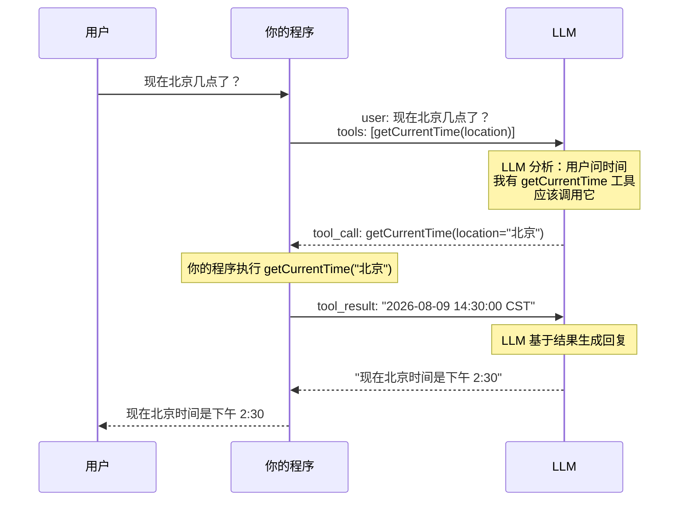

# 03 · 工具调用（Function Calling）

> 阶段：1 入门 · 难度：⭐⭐ · 预计：1-2 天
> 前置：[02 多轮对话与记忆](02-多轮对话与记忆.md)
> 产出：让 LLM 自己决定调用你的 Java 方法——这是 Agent 的起点

---

## 你将学会

- Function Calling 是什么：LLM 输出 JSON 让你执行代码
- 用 `@Tool` 注解声明工具
- LLM 如何决定"调哪个工具"
- 工具调用的完整流程（请求 → LLM 决策 → 执行 → 回传结果 → 最终回复）

---

## 为什么需要这个

到目前为止，LLM 只能"说话"——它的知识停留在训练数据里，不能查实时天气、不能读你的数据库、不能执行代码。

**Function Calling 打破了这条线**：LLM 可以告诉你的程序"请帮我执行这个函数"，你的程序执行后把结果告诉 LLM，LLM 再基于结果给出最终回复。

**这是 Agent 的起点**——Agent 的本质就是"LLM 决策 + 代码执行"的循环。

---

## 知识讲解

### 1. 工具调用流程



**关键洞察**：LLM 自己不能执行代码——它只是输出一段 JSON 告诉你"请执行这个函数"。真正的执行者是**你的 Java 程序**。

### 2. LLM 怎么知道有哪些工具

你通过 `@Tool` 注解告诉 LLM 工具的名字、描述、参数。Spring AI 会把这些信息自动转成 JSON Schema 发给 LLM：

```java
@Tool(description = "获取指定城市的当前时间")
public String getCurrentTime(String location) { ... }
```

LLM 看到的（JSON Schema）：
```json
{
  "name": "getCurrentTime",
  "description": "获取指定城市的当前时间",
  "parameters": {
    "type": "object",
    "properties": {
      "location": { "type": "string", "description": "城市名" }
    }
  }
}
```

> 💡 **`description` 是最重要的部分**——LLM 靠它判断"什么时候该调用这个工具"。描述写得越清晰，LLM 选对工具的概率越高。

### 3. LLM 的决策逻辑

LLM 决策工具调用靠的是**语义理解**，不是规则匹配：

| 用户说 | LLM 判断 |
|--------|---------|
| "现在几点" | ✅ 调 `getCurrentTime` |
| "北京的时间" | ✅ 调 `getCurrentTime(location=北京)` |
| "你好" | ❌ 不调工具，直接回复 |

---

## 动手实践

### Step 1：写第一个工具

```java
package demo.demo01.tools;

import org.springframework.ai.tool.annotation.Tool;
import org.springframework.stereotype.Component;

import java.time.LocalDateTime;
import java.time.ZoneId;

@Component
public class TimeTools {

    @Tool(description = "获取指定城市的当前时间。location 是城市名，如 '北京'、'东京'、'纽约'")
    public String getCurrentTime(String location) {
        // 简化版：根据城市名匹配时区
        ZoneId zoneId = switch (location) {
            case "北京", "上海", "深圳" -> ZoneId.of("Asia/Shanghai");
            case "东京" -> ZoneId.of("Asia/Tokyo");
            case "纽约" -> ZoneId.of("America/New_York");
            case "伦敦" -> ZoneId.of("Europe/London");
            default -> ZoneId.of("UTC");
        };

        LocalDateTime now = LocalDateTime.now(zoneId);
        return location + " 当前时间：" + now + " (" + zoneId + ")";
    }

    @Tool(description = "生成指定范围的随机数。min 是最小值，max 是最大值")
    public int randomInt(int min, int max) {
        return (int) (Math.random() * (max - min + 1)) + min;
    }
}
```

### Step 2：注册工具到 ChatClient

```java
// 修改 ChatConfig，注入工具
@Bean
public ChatClient chatClient(ChatClient.Builder builder, ChatMemory memory, TimeTools timeTools) {
    return builder
            .defaultAdvisors(
                MessageChatMemoryAdvisor.builder(memory).build()
            )
            .defaultTools(timeTools)   // ← 注册工具
            .build();
}
```

### Step 3：测试工具调用

```java
@GetMapping("/chat")
public String chat(
        @RequestParam String q,
        @RequestParam(defaultValue = "default") String sessionId) {

    return chatClient.prompt()
            .user(q)
            .advisors(spec -> spec.param(ChatMemory.CONVERSATION_ID, sessionId))
            .call()
            .content();
}
```

```bash
# 测试 1：LLM 应该调用 getCurrentTime 工具
curl "http://localhost:8080/api/chat?q=现在东京几点了&sessionId=t1"
# 输出：东京 当前时间：2026-08-09T15:30:00 (Asia/Tokyo)

# 测试 2：LLM 应该调用 randomInt 工具
curl "http://localhost:8080/api/chat?q=帮我掷一个骰子（1-6的随机数）&sessionId=t2"
# 输出：骰子结果是 4

# 测试 3：不需要工具时，LLM 直接回复
curl "http://localhost:8080/api/chat?q=你好&sessionId=t3"
# 输出：你好！有什么可以帮你的？（不调工具）
```

### Step 4：观察工具调用日志

在 `application.yml` 中开启调试日志：

```yaml
logging:
  level:
    org.springframework.ai: DEBUG
```

重新请求，你会在日志中看到：
1. Spring AI 把工具定义发给 LLM
2. LLM 返回 `tool_call` JSON
3. Spring AI 执行你的 Java 方法
4. 把结果发回给 LLM
5. LLM 生成最终回复

### Step 5：写一个查数据库的工具

```java
@Tool(description = "查询用户信息。userId 是用户ID，返回用户的姓名和邮箱")
public String getUserInfo(Long userId) {
    // 模拟数据库查询
    if (userId == 1L) return "用户：张三，邮箱：zhangsan@example.com";
    if (userId == 2L) return "用户：李四，邮箱：lisi@example.com";
    return "用户不存在";
}
```

```bash
curl "http://localhost:8080/api/chat?q=帮我查一下ID为1的用户信息&sessionId=t4"
# 输出：ID 为 1 的用户是张三，邮箱是 zhangsan@example.com
```

> LLM 自己从自然语言中提取了 `userId=1` 参数！

---

## 常见坑

- ❌ **工具描述写得太模糊** → LLM 不知道什么时候该用。描述要写清"做什么"和"什么时候用"
- ❌ **参数没有描述** → LLM 不知道该传什么值。每个参数也加描述
- ❌ **工具执行失败抛异常** → 目前直接中断。阶段 3 会讲"返回错误给 LLM 让它自我修复"
- ❌ **工具返回值太大** → 大段文本会浪费 token。返回精简信息，让 LLM 组织语言
- ❌ **参数类型不对** → 用 `String` 接收日期/数字再手动解析比用复杂类型更可靠。LLM 有时传 `"2026-08-09"` 有时传 `"August 9, 2026"`
- ❌ **工具名和已有概念冲突** → 别把工具起名叫 `search`、`query` 这种 LLM 训练数据里已经有强含义的词，容易导致误调用

---

## 工具设计原则速查

| 原则 | ✅ 好 | ❌ 坏 |
|------|-------|-------|
| description 写清"做什么" | "获取指定城市的当前时间" | "时间工具" |
| description 写清"什么时候用" | "当用户询问某个城市的时间时调用" | "时间相关" |
| 参数有描述 | `String location // 城市名，如'北京'` | `String location` |
| 返回精简 | `"北京 14:30 CST"` | 大段 JSON |
| 一个工具做一件事 | `getCurrentTime` 只查时间 | `getTimeAndWeather` 又查时间又查天气 |
| 参数类型简单 | `String`、`int`、`boolean` | 自定义嵌套对象 |

> 这六条原则在阶段 2 的「工具体系设计」中会深化为 `SafeTool` 基类。

---

## 验收检查

- [ ] LLM 能根据用户意图自动选择正确的工具
- [ ] 能从自然语言中提取参数（如"ID 为 1" → userId=1）
- [ ] 不需要工具时直接回复（不强行调用）
- [ ] 能写出至少 2 个可用的 `@Tool` 方法
- [ ] 能解释"LLM 怎么决定调哪个工具"（语义理解 description）

---

## 下一步

→ 下一篇：[04 项目 P1 命令行助手](04-项目P1-命令行助手.md) —— 把对话+记忆+工具整合成第一个完整项目
→ 概念卡壳？查 `理论字典/Agent范式.md`

---

## 随堂练习：天气查询助手（45 分钟）

用 @Tool 做一个自然语言天气助手，练习工具调用。

```
用户：北京天气怎么样   → AI 调用 getWeather("北京") → 回答
用户：对比北京和上海    → AI 自主两次调用工具 → 对比回答
```

**提示**：
```java
@Component
public class WeatherTools {
    @Tool(description = "查询城市天气。city 支持北京/上海/广州/东京/纽约")
    public String getWeather(String city) {
        return switch (city) {
            case "北京" -> "晴天 25°C 微风";
            case "上海" -> "多云 28°C";
            default -> "暂不支持" + city;
        };
    }
}
```

注册到 ChatClient 后测试。**扩展**：加 UV 指数工具；加真实天气 API。
