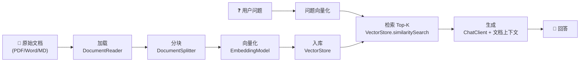
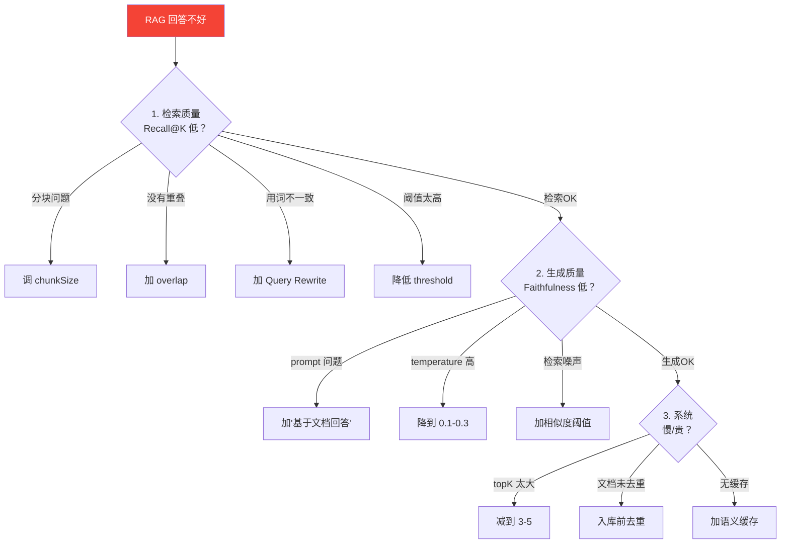

# 03 · RAG 全链路

> 阶段：2 核心能力 · 难度：⭐⭐⭐ · 预计：3 天
> 前置：[02 向量检索原理](02-向量检索原理.md)
> 产出：搭建一个完整的 RAG 管道——上传 PDF → 自动问答

---

## 你将学会

- RAG 的完整五步链路（加载 → 分块 → 向量化 → 检索 → 生成）
- 用 Spring AI 的 ETL 管道处理文档
- 分块策略对检索质量的影响
- 把检索结果注入 prompt 的两种方式

---

## 为什么需要这个

LLM 不知道你的企业内部文档、你的个人笔记、你的产品手册。RAG 解决的就是这个问题：

**给 LLM 一个"临时知识库"——先检索相关文档，再把文档内容塞进 prompt，让 LLM 基于文档回答。**

```
用户：公司的报销流程是什么？
  ↓ RAG 从公司文档中检索到 "报销制度.pdf" 的相关段落
  ↓ 把段落塞进 prompt
LLM 看到：基于以下文档回答问题：
  [文档片段] 员工报销需填写报销单，附发票原件，经部门经理审批...
  用户问题：公司的报销流程是什么？
  ↓
LLM 回答：根据公司制度，报销流程是：填写报销单 → 附发票 → 部门经理审批 → 财务审核 → 打款。
```

---

## 知识讲解

### 1. RAG 五步链路



| 步骤 | 做什么 | 为什么 |
|------|--------|--------|
| 加载 | 读取 PDF/Word/MD 文件 | 源数据 → 程序可处理的文本 |
| 分块 | 把长文档切成小段 | LLM 上下文有限；小段检索更精确 |
| 向量化 | 每个块算 embedding | 用向量做相似度检索 |
| 入库 | 向量存入 VectorStore | 持久化，后续可复检索 |
| 检索 | 用户问题算 embedding → 找最相似的 K 块 | 找到最相关的知识 |
| 生成 | 把检索到的块塞进 prompt → LLM 生成回答 | 基于文档内容回答 |

### 2. 分块策略（最影响 RAG 质量）

分块太大或太小都不好：

| 块大小 | 优点 | 缺点 |
|--------|------|------|
| 太小（100 字） | 检索精确 | 上下文不完整，回答片面 |
| 合适（500-1000 字） | 平衡 | ✅ 推荐 |
| 太大（5000 字） | 上下文完整 | 检索不精确，浪费 token |

还有一个关键参数：**重叠（overlap）**——相邻块之间重叠一部分，避免在边界处截断语义：

```
块1: [AAAABBBBCCCC]
块2:           [CCCCDDDDEEEE]   ← CCCC 是重叠部分
```

### 3. 检索 → 生成 的两种方式

**方式 A：手动注入**（你控制 prompt 拼接）：

```java
// 1. 检索
List<Document> docs = vectorStore.similaritySearch(SearchRequest.query(q).withTopK(3));

// 2. 拼接文档内容
String context = docs.stream().map(Document::getText).collect(joining("\n---\n"));

// 3. 塞进 prompt
String reply = chatClient.prompt()
        .system("基于以下文档回答问题。如果文档中没有相关信息，说'我不知道'。\n\n文档：\n" + context)
        .user(q)
        .call().content();
```

**方式 B：QuestionAnswerAdvisor**（Spring AI 自动处理）：

```java
String reply = chatClient.prompt()
        .user(q)
        .advisors(QuestionAnswerAdvisor.builder(vectorStore).build())
        .call().content();  // 自动检索 + 自动注入文档
```

> 方式 B 更简洁，但方式 A 更灵活（你可以自定义检索策略和 prompt 模板）。学习阶段建议先用方式 A 理解原理。

---

## 动手实践

### Step 1：引入依赖

```xml
<!-- RAG 需要：向量存储 + PDF 读取 -->
<dependency>
    <groupId>org.springframework.ai</groupId>
    <artifactId>spring-ai-pdf-document-reader</artifactId>
</dependency>
<!-- 用内存向量库（学习用，生产换 pgvector / Qdrant / Milvus） -->
<!-- 如果 Spring AI 没有内存版，可以用 SimpleVectorStore -->
```

### Step 2：文档加载 + 分块 + 入库

```java
package demo.demo02.rag;

import org.springframework.ai.document.*;
import org.springframework.ai.reader.pdf.*;
import org.springframework.ai.transformer.splitter.*;
import org.springframework.ai.vectorstore.*;
import org.springframework.stereotype.Service;
import org.springframework.core.io.Resource;

import java.util.List;

@Service
public class RagService {

    private final VectorStore vectorStore;

    public RagService(VectorStore vectorStore) {
        this.vectorStore = vectorStore;
    }

    /**
     * 把 PDF 文档加载、分块、向量化、入库
     */
    public int ingestPdf(Resource pdfResource) {
        // Step 1: 加载 PDF
        var reader = new PagePdfDocumentReader(pdfResource);
        List<Document> rawDocs = reader.get();

        // Step 2: 分块（每块 500 字，重叠 100 字）
        var splitter = TokenTextSplitter.builder()
                .chunkSize(500)
                .minChunkSizeChars(350)
                .minChunkLengthToEmbed(5)
                .maxNumChunks(10000)
                .keepSeparator(true)
                .build();
        List<Document> chunks = splitter.apply(rawDocs);

        // Step 3: 向量化 + 入库（VectorStore 自动处理 embedding）
        vectorStore.add(chunks);

        return chunks.size();  // 返回分块数
    }

    /**
     * 检索相关文档
     */
    public List<Document> search(String query, int topK) {
        return vectorStore.similaritySearch(
                SearchRequest.builder()
                        .query(query)
                        .topK(topK)
                        .build()
        );
    }
}
```

### Step 3：问答接口

```java
package demo.demo02.controller;

import demo.demo02.rag.RagService;
import org.springframework.ai.chat.client.ChatClient;
import org.springframework.web.bind.annotation.*;
import org.springframework.web.multipart.MultipartFile;

import java.io.*;
import java.util.*;
import java.util.stream.Collectors;

@RestController
@RequestMapping("/api/rag")
public class RagController {

    private final RagService ragService;
    private final ChatClient chatClient;

    public RagController(RagService ragService, ChatClient chatClient) {
        this.ragService = ragService;
        this.chatClient = chatClient;
    }

    // POST /api/rag/upload —— 上传 PDF
    @PostMapping("/upload")
    public Map<String, Object> upload(@RequestParam("file") MultipartFile file) throws IOException {
        File temp = File.createTempFile("upload", ".pdf");
        file.transferTo(temp);
        int chunkCount = ragService.ingestPdf(new FileSystemResource(temp));
        return Map.of("status", "ok", "chunks", chunkCount);
    }

    // GET /api/rag/ask?q=xxx —— 基于 RAG 问答
    @GetMapping("/ask")
    public Map<String, Object> ask(@RequestParam String q) {
        // 1. 检索 Top-3 相关文档
        var docs = ragService.search(q, 3);

        // 2. 拼接文档上下文
        String context = docs.stream()
                .map(d -> "---\n" + d.getText())
                .collect(Collectors.joining("\n"));

        // 3. 让 LLM 基于文档回答
        String prompt = """
            基于以下文档片段回答用户问题。
            如果文档中没有相关信息，明确告知"根据已有文档无法回答"。
            不要编造信息。

            文档片段：
            %s

            用户问题：%s
            """.formatted(context, q);

        String reply = chatClient.prompt()
                .user(prompt)
                .call()
                .content();

        return Map.of(
            "question", q,
            "reply", reply,
            "sourcesCount", docs.size(),
            "sources", docs.stream().map(d -> d.getText().substring(0, Math.min(80, d.getText().length())) + "...").toList()
        );
    }
}
```

### Step 4：测试

```bash
# 上传 PDF
curl -F "file=@公司制度.pdf" http://localhost:8080/api/rag/upload
# {"status":"ok","chunks":45}

# 问答
curl "http://localhost:8080/api/rag/ask?q=公司的报销流程是什么"
# {
#   "question": "公司的报销流程是什么",
#   "reply": "根据公司制度，报销流程是：填写报销单 → 附发票 → 部门经理审批...",
#   "sourcesCount": 3,
#   "sources": ["员工报销需填写报销单，附发票原件...", ...]
# }
```

### Step 5：实验分块参数

```bash
# 上传后问一个具体问题，看检索到什么

# 用 chunkSize=200 重试，观察检索质量变化
# 用 chunkSize=1000 重试，观察检索质量变化
```

### Step 6：相似度阈值过滤（进阶）

默认检索返回 Top-K，但有些结果其实不相关。加一个相似度阈值，过滤掉太远的：

```java
public List<Document> search(String query, int topK, double threshold) {
    return vectorStore.similaritySearch(
        SearchRequest.builder()
            .query(query)
            .topK(topK)
            .similarityThreshold(threshold)  // 只返回相似度 > threshold 的
            .build()
    );
}
// 调用：search("报销流程", 5, 0.7)
// 相似度 < 0.7 的结果会被过滤掉——避免 LLM 被无关文档误导
```

### Step 7：带元数据的检索（多租户/分类）

给每个文档打上元数据标签，检索时可以过滤：

```java
// 入库时打标签
Document doc = new Document(text);
doc.getMetadata().put("source", "报销制度.pdf");
doc.getMetadata().put("category", "财务");
doc.getMetadata().put("tenant_id", "company-A");
vectorStore.add(List.of(doc));

// 检索时过滤（只搜财务类文档）
vectorStore.similaritySearch(
    SearchRequest.builder()
        .query("报销流程")
        .topK(3)
        .filterExpression("category == '财务' && tenant_id == 'company-A'")
        .build()
);
```

> 这就是阶段 5 多租户的基础——每个租户的文档隔离。

---

## 常见坑

- ❌ **分块太大** → 检索到大量无关内容，稀释了关键信息
- ❌ **分块太小** → 缺少上下文，LLM 无法理解完整语义
- ❌ **没有重叠** → 在分块边界处截断语义，导致检索遗漏
- ❌ **prompt 没有限制** → LLM 可能不用文档内容，编造答案。加"如果文档中没有相关信息，说不知道"
- ❌ **topK 太大** → 塞太多文档浪费 token，且引入噪声。一般 3-5 即可
- ❌ **没有相似度阈值** → 检索返回完全不相关的文档，LLM 被误导
- ❌ **PDF 是扫描件（图片）** → `PagePdfDocumentReader` 只能读文本 PDF。扫描件需要 OCR

---

## RAG 质量排查清单

当 RAG 回答不好时，按这个顺序排查：



---

## 验收检查

- [ ] 能上传 PDF → 自动分块入库
- [ ] 能基于文档内容回答问题
- [ ] 文档中没有的信息，LLM 会说"不知道"（而不是编造）
- [ ] 能调整分块参数并观察检索质量变化
- [ ] 能用相似度阈值过滤不相关结果
- [ ] 理解 RAG 的五步链路（加载→分块→向量化→入库→检索生成）
- [ ] 能用元数据过滤检索结果

---

## 下一步

→ 下一篇：[04 评估方法论](04-评估方法论.md) —— 给你的 RAG 建测试集，量化质量
→ 概念卡壳？查 `理论字典/RAG原理.md`

---

## 延伸阅读：RAG 深化路线图

本篇是 RAG 基础。以下文档从不同维度深化 RAG 能力：

| 方向 | 文档 | 深化内容 |
|------|------|---------|
| 知识管理 | [阶段4-25-知识管理与RAG评估](../阶段4-生产化/25-知识管理与RAG评估.md) | 自进化知识闭环 |
| 多模态 RAG | [阶段4-42-多模态Agent工程化](../阶段4-生产化/42-多模态Agent工程化.md) | 图文混合检索 |
| 多模态实战 | [项目12-OmniAgent Sprint3](../项目实践/12-企业项目-多模态Agent平台/Sprint3-多模态RAG.md) | CLIP 跨模态对齐 |
| 知识图谱 RAG | [项目06-KnowledgeHub Sprint2](../项目实践/06-企业项目-知识中枢平台/Sprint2-知识图谱.md) | 图谱增强检索 |
| 混合检索 | [项目06-KnowledgeHub Sprint3](../项目实践/06-企业项目-知识中枢平台/Sprint3-混合检索.md) | 向量+BM25+图谱 |
| 评估方法论 | [理论字典-Agent评估](../理论字典/Agent评估.md) | RAGAS 指标体系速查 |
| 向量库选型 | [附录-向量数据库速成](../附录/向量数据库速成.md) | Milvus/Qdrant/pgvector 对比 |

---

## 随堂练习：个人笔记问答（60 分钟）

把你的 Markdown 笔记入库，做一个小型 RAG 问答系统。

**需求**：
```
POST /api/notes/import  body: "# Spring AI\nChatClient 是核心..."
→ {"chunks":3}
GET  /api/notes/ask?q=ChatClient是什么
→ {"answer":"...","sources":["Spring AI"]}
```

**提示**：按空行分块（`content.split("\n\n+")`），每块打上 metadata，入库后用相似度检索 + ChatClient 生成回答。

**验收**：笔记中有的能回答；笔记中没有的会说"不知道"。**扩展**：加相似度阈值过滤。
